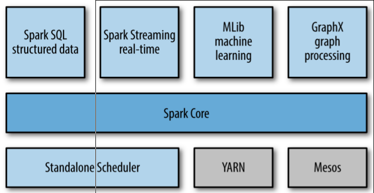

# Introduction to Data Analysis with Spark

## What Is Apach Spark?

Apache Spark is a cluster computing platform designed to be *fast* and *general purpose*.

One of the main features Spark offers for speed is **the ability to run computations in memory**.

Spark is designed to cover a wide range of workloads that previously required separate distributed systems,
including **batch applications**, **interactive algorithms**, **interactive quries**, and **streaming**.

## A Unified Stack

As its core, Spark is a **computational engine** that is **responsible for**
*scheduling*, *distributing*, and *monitoring applications* consisting of many compuational tasks **across many worker machines**.

The following figure shows the spark stack.

### Spark Core

Spark core contains the basic functionality of Spark,
including components for **task scheduling**, **memory management**, **fault recovery**, **interacting with storage systems**, and more.

**Resilient Distributed Datasets** (RDDs) represent **a collection of items** **distributed across many compute nodes** that can be **manipulated in parallel**.

### Spark SQL

Spark SQL lets you query [structured data](http://spark.apache.org/docs/latest/sql-programming-guide.html#data-types) inside Spark programs,
using either SQL or a familiar [DataFrame API](http://spark.apache.org/docs/latest/sql-programming-guide.html).

### Spark Streaming

Spark Streaming enables processing of live streams of data.

### MLlib

MLlib provides multiple types of machine learning algorithms, including *classification*, *regression*, *clustering*, and *collaborative filtering*,
as well as supporting functionality such as model evaluation and data import.

MLlib also provides some lower-level ML primitives, including a generic gradient descent optimization algorithm.

### GraphX

GraphX is a library for manipulating graphs.

## Cluster Managers

Spark can run over a variety of cluster managers, including **YARN**, **Mesos**, and **Standalone** Scheduler.

## Who Uses Spark, and for What?

Data scientists and engineers. (*data science* and *data applications*)

### Data Science Tasks

 - Spark shell makes it easy to do **interactive data analysis**.
 - Spark SQL has a separate SQL shell that can be used to **do data exploration** using SQL, or be used as part of a regular Spark program or in the Spark shell.
 - MLlib libraries supports **machine learning** and **data analysis**.
 - **Matlab or R** are supported.
 - Spark is easy for the data scientists to "productize" or extend, harden and tune the exploration phase to become **a production data processing application**.

### Data Processing Applications

 - Spark provides a simple way to **parallelize** the applications across clusters, and **hides the complexity** of distributed systems programming, network communication, and fault tolerance.

## Storage Layers for Spark

Systems supported by the Hadoop APIs (HDFS, local filesystem, Amazon S3, Cassandra, Hive, HBase, etc.)

Spark also supports **text files**, **SequenceFiles**, **Avro**, **Parquet**, and **any other Hadoop InputFormat**.

