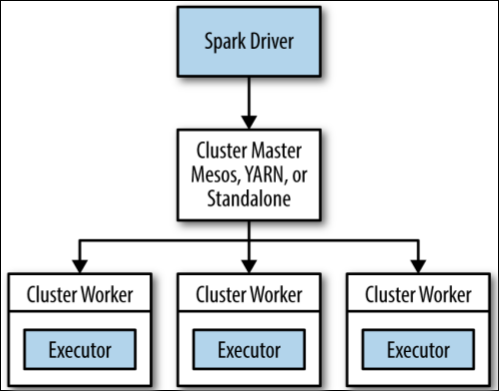

# Running on a Cluster

## Introduction

 > Users can rapidly prototype applications on smaller datasets locally, then run unmodified code on even very large clusters.

 - Runtime architecture of a distributed Spark application
 - Options for running Spark in distributed clusters
 - Trade-offs and configurations required for running in different options
 - "nuts and bolts" of scheduling, deploying, and configuring a Spark application


## Spark Runtime Architecture

 In distributed mode, Spark uses a **master/slave architecture** with one central coordinator (*driver*) and many distributed workers (*executor*).
 The Spark application is launched on a set of machines using a service called a **cluster manager**.

 

### The Driver

 - creates a SparkContext, creates RDDs, performs transformations and actions
 - Converting a user program into tasks (converts the logical graph, **DAG**, into physical execution plan)
 - Scheduling tasks on executors

 > Spark performs several optimizations, such as “pipelining” map transformations together to **merge them**, and **converts the execution graph into a set of stages**.
 Each stage, in turn, consists of multiple tasks. The **tasks are bundled up and prepared** to be **sent to the cluster**. **Tasks are the smallest unit** of work in Spark;

 The driver has a **complete view of the application’s executors** at all times.

 The Spark driver will look at the current set of executors and try to **schedule each task basing on data placement**.

 The driver also tracks the **location of cached data** and **uses it to schedule future tasks** that access that data.

### Executors

 Responsible for running the individual tasks

 - **run the tasks and return results** to *the driver*
 - provide **in-memory storage** for RDDs (RDDs are cached directly inside of executors)

### Cluster Manager

 Spark depends on a cluster manager to **launch executors** and, in certain cases, to **launch the driver**.

 - **driver / executors**: describe the processes that execute each Spark application.
 - **master / worker**: used to describe the centralized and distributed portions of the cluster manager.

### Launching a Program

 **`spark-submit`** **connect to different cluster managers** and **control how many resources** the application gets.

### Summary

 1. submits application with **`spark-submit`**
 2. `spark-submit` **launches the driver** and **invokes the `main()`** method
 3. driver contacts the cluster manager for **resources** to launch executors
 4. **cluster manager launches executors** on behalf of the driver program
 5. **driver sends work to executors** in the form of **tasks**
 6. **executor processes** run the tasks to **compute and save results**
 7. driver's `main()` method exits or it calls `SparkContext.stop()`


## Deploying Applications with spark-submit

 Refer to [Launching Applications with spark-submit](http://spark.apache.org/docs/latest/submitting-applications.html) for detail.


## Packaging Your Code and Dependencies

 Ensure that all the dependencies are present at the runtime of the Spark application.
 Ship with its entire transitive dependency graph
 - with **`--jars`** (simple dependencies)
 - by **assembly JAR** (normally, with `sbt assembly` or `mvn package`)


### A Java Spark Application Built with Maven

 `pom.xml` and `src/main/java`

### A Scala Spark Application Built with sbt

 - `src/main/scala`
 - **`build.sbt`**: name, libraryDependencies, ...
   1. create the `build.sbt`
   2. add **`addSbtPlugin("com.eed3si9n" % "sbt-assembly" % "VERSION")`** in **`project/assembly.sbt`**
   3. run **`sbt assembly`**
   4. `ls target/scala-SCALA_VERSION/`

### Dependency Conflicts

 When both the user application and Spark itself both depend on the same library.

 Common errors:
 - `NoSuchMethodError`
 - `ClassNotFoundException`
 - some other **JVM exception related to class loading** is thrown

 Two solutions:
 1. **modify the application** to depend on the **same version of the third-party library** that Spark does
 2. **modify the packaging** of the application using a procedure that is often called **shading**

 Useful sbt script:

 ``` scala
  mergeStrategy in assembly <<= (mergeStrategy in assembly) { (old) =>
    {
      case m if m.toLowerCase.endsWith("manifest.mf") => MergeStrategy.discard
      case m if m.startsWith("META-INF") => MergeStrategy.discard
      case PathList("javax", "servlet", xs @ _*) => MergeStrategy.first
      case PathList("org", "apache", xs @ _*) => MergeStrategy.first
      case PathList("org", "jboss", xs @ _*) => MergeStrategy.first
      case "about.html"  => MergeStrategy.rename
      case "reference.conf" => MergeStrategy.concat
      case _ => MergeStrategy.first
    }
  }
 ```


## Scheduling Within and Between Spark Applications

 Spark primarily relies on the cluster manager to share resources between Spark applications.

 Long lived application: **JDBC server bundled with Spark SQL**
 - **Fair Scheduler** lets long-lived applications define queues for prioritizing scheduling of tasks.

 Refer to [Job Scheduling](http://spark.apache.org/docs/latest/job-scheduling.html) for detail


## Cluster Managers

### Standalone Cluster Manager
 **`--deploy-mode`**, Two **deploy methods** for where the driver program of the application runs
 - client mode: the driver runs on the machine where you executed `spark-submit`
 - cluster mode: the driver is launched within the Standalone cluster on one of the worker nodes.

 **`--executor-memory`**, **`--total-executor-cores`** (`spark.cores.max`)

 - Standalone mode will gracefully support the failure of worker nodes.
 - Support usings Apache ZoopKeeper to keep multiple standby masters

### Hadoop YARN

 **FIXME**: Not carefully read yet

### Apache Mesos

 **FIXME**: Not carefully read yet

### Amazon EC2

 **FIXME**: Not carefully read yet


## Which Cluster Manager to Use?
 - **Standalone mode**: new deployment, run only Spark
 - **YARN and Mesos**: Spark alongside other applications, or to use richer resource scheduling capabilities(e.g., queues)
 - **Mesos**: Support fine grained sharing option
 - run Spark on the same nodes as HDFS for fast access to storage

