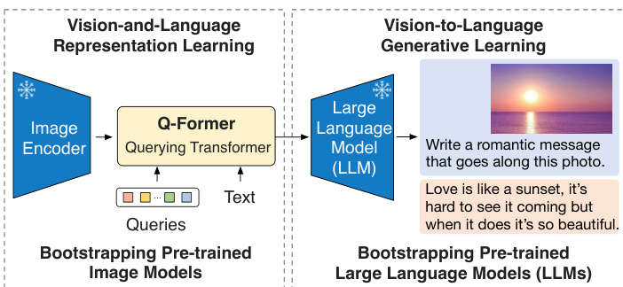
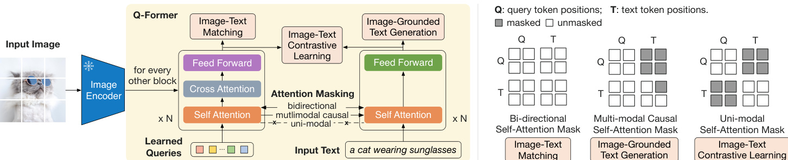
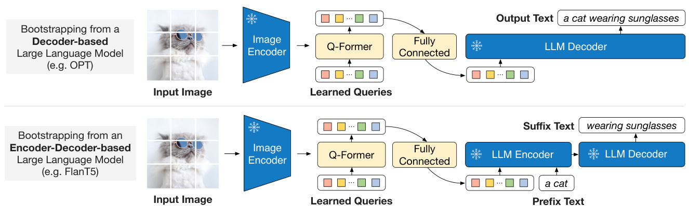
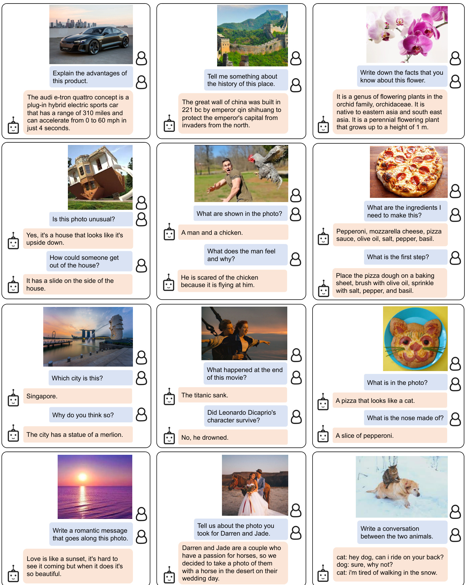
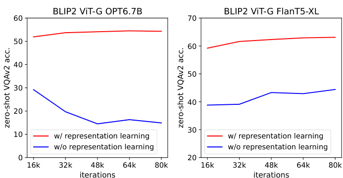
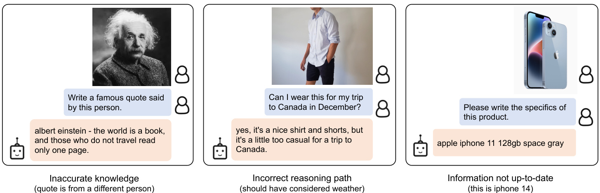
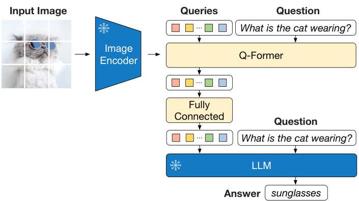

# BLIP-2: Bootstrapping Language-Image Pre-training with Frozen Image Encoders and Large Language Models  

Junnan Li Dongxu Li Silvio Savarese Steven Hoi Salesforce Research  

://github.com/salesforce/LAVIS/tree/main/project  

# Abstract  

The cost of vision-and-language pre-training has become increasingly prohibitive due to end-toend training of large-scale models. This paper proposes BLIP-2, a generic and effcient pretraining strategy that bootstraps vision-language pre-training from off-the-shelf frozen pre-trained image encoders and frozen large language models. BLIP-2 bridges the modality gap with a lightweight Querying Transformer, which is pretrained in two stages. The frst stage bootstraps vision-language representation learning from a frozen image encoder. The second stage bootstraps vision-to-language generative learning from a frozen language model. BLIP-2 achieves state-of-the-art performance on various visionlanguage tasks, despite having signifcantly fewer trainable parameters than existing methods. For example, our model outperforms Flamingo80B by $8.7\%$ on zero-shot VQAv2 with $54\mathrm{x}$ fewer trainable parameters. We also demonstrate the model’s emerging capabilities of zero-shot image-to-text generation that can follow natural language instructions.  

# 1. Introduction  

Vision-language pre-training (VLP) research has witnessed a rapid advancement in the past few years, where pre-trained models with increasingly larger scale have been developed to continuously push the state-of-the-art on various downstream tasks (Radford et al., 2021; Li et al., 2021; 2022; Wang et al., 2022a; Alayrac et al., 2022; Wang et al., 2022b). However, most state-of-the-art vision-language models incur a high computation cost during pre-training, due to end-to-end training using large-scale models and datasets.  

Vision-language research sits at the intersection between vision and language, therefore it is naturally expected that vision-language models can harvest from the readilyavailable unimodal models from the vision and natural language communities. In this paper, we propose a generic and compute-effcient VLP method by bootstrapping from offthe-shelf pre-trained vision models and language models. Pre-trained vision models offer high-quality visual representation. Pre-trained language models, in particular large language models (LLMs), offer strong language generation and zero-shot transfer abilities. To reduce computation cost and counteract the issue of catastrophic forgetting, the unimodal pre-trained models remain frozen during the pre-training.  

  
Figure 1. Overview of BLIP-2’s framework. We pre-train a lightweight Querying Transformer following a two-stage strategy to bridge the modality gap. The frst stage bootstraps visionlanguage representation learning from a frozen image encoder. The second stage bootstraps vision-to-language generative learning from a frozen LLM, which enables zero-shot instructed image-totext generation (see Figure 4 for more examples).  

In order to leverage pre-trained unimodal models for VLP, it is key to facilitate cross-modal alignment. However, since LLMs have not seen images during their unimodal pretraining, freezing them makes vision-language alignment in particular challenging. In this regard, existing methods (e.g. Frozen (Tsimpoukelli et al., 2021), Flamingo (Alayrac et al., 2022)) resort to an image-to-text generation loss, which we show is insuffcient to bridge the modality gap.  

To achieve effective vision-language alignment with frozen unimodal models, we propose a Querying Transformer (QFormer) pre-trained with a new two-stage pre-training strategy. As shown in Figure 1, Q-Former is a lightweight transformer which employs a set of learnable query vectors to extract visual features from the frozen image encoder. It acts as an information bottleneck between the frozen image encoder and the frozen LLM, where it feeds the most useful visual feature for the LLM to output the desired text. In the frst pre-training stage, we perform vision-language representation learning which enforces the Q-Former to learn visual representation most relevant to the text. In the second pre-training stage, we perform vision-to-language generative learning by connecting the output of the Q-Former to a frozen LLM, and trains the Q-Former such that its output visual representation can be interpreted by the LLM.  

We name our VLP framework as BLIP-2: Bootstrapping Language-Image Pre-training with frozen unimodal models. The key advantages of BLIP-2 include:  

• BLIP-2 effectively leverages both frozen pre-trained image models and language models. We bridge the modality gap using a Q-Former pre-trained in two-stages: representation learning stage and generative learning stage. BLIP-2 achieves state-of-the-art performance on various vision-language tasks including visual question answering, image captioning, and image-text retrieval.  

• Powered by LLMs (e.g. OPT (Zhang et al., 2022), FlanT5 (Chung et al., 2022)), BLIP-2 can be prompted to perform zero-shot image-to-text generation that follows natural language instructions, which enables emerging capabilities such as visual knowledge reasoning, visual conversation, etc. (see Figure 4 for examples).  

• Due to the use of frozen unimodal models and a lightweight Q-Former, BLIP-2 is more compute-effcient than exisiting state-of-the-arts. For example, BLIP-2 outperforms Flamingo (Alayrac et al., 2022) by $8.7\%$ on zero-shot VQAv2, while using $54\times$ fewer trainable parameters. Furthermore, our results show that BLIP-2 is a generic method that can harvest more advanced unimodal models for better VLP performance.  

# 2. Related Work  

# 2.1. End-to-end Vision-Language Pre-training  

Vision-language pre-training aims to learn multimodal foundation models with improved performance on various visionand-language tasks. Depending on the downstream task, different model architectures have been proposed, including the dual-encoder architecture (Radford et al., 2021; Jia et al., 2021), the fusion-encoder architecture (Tan & Bansal, 2019; Li et al., 2021), the encoder-decoder architecture (Cho et al., 2021; Wang et al., 2021b; Chen et al., 2022b), and more recently, the unifed transformer architecture (Li et al., 2022; Wang et al., 2022b). Various pre-training objectives have also been proposed over the years, and have progressively converged to a few time-tested ones: image-text contrastive learning (Radford et al., 2021; Yao et al., 2022; Li et al., 2021; 2022), image-text matching (Li et al., 2021; 2022; Wang et al., 2021a), and (masked) language modeling (Li et al., 2021; 2022; Yu et al., 2022; Wang et al., 2022b).  

Most VLP methods perform end-to-end pre-training using large-scale image-text pair datasets. As the model size keeps increasing, the pre-training can incur an extremely high computation cost. Moreover, it is infexible for end-to-end pre-trained models to leverage readily-available unimodal pre-trained models, such as LLMs (Brown et al., 2020; Zhang et al., 2022; Chung et al., 2022).  

# 2.2. Modular Vision-Language Pre-training  

More similar to us are methods that leverage off-the-shelf pre-trained models and keep them frozen during VLP. Some methods freeze the image encoder, including the early work which adopts a frozen object detector to extract visual features (Chen et al., 2020; Li et al., 2020; Zhang et al., 2021), and the recent LiT (Zhai et al., 2022) which uses a frozen pre-trained image encoder for CLIP (Radford et al., 2021) pre-training. Some methods freeze the language model to use the knowledge from LLMs for vision-to-language generation tasks (Tsimpoukelli et al., 2021; Alayrac et al., 2022; Chen et al., 2022a; Ma˜nas et al., 2023; Tiong et al., 2022; Guo et al., 2022). The key challenge in using a frozen LLM is to align visual features to the text space. To achieve this, Frozen (Tsimpoukelli et al., 2021) fnetunes an image encoder whose outputs are directly used as soft prompts for the LLM. Flamingo (Alayrac et al., 2022) inserts new cross-attention layers into the LLM to inject visual features, and pre-trains the new layers on billions of image-text pairs. Both methods adopt the language modeling loss, where the language model generates texts conditioned on the image.  

Different from existing methods, BLIP-2 can effectively and effciently leverage both frozen image encoders and frozen LLMs for various vision-language tasks, achieving stronger performance at a lower computation cost.  

# 3. Method  

We propose BLIP-2, a new vision-language pre-training method that bootstraps from frozen pre-trained unimodal models. In order to bridge the modality gap, we propose a Querying Transformer (Q-Former) pre-trained in two stages: (1) vision-language representation learning stage with a frozen image encoder and (2) vision-to-language generative learning stage with a frozen LLM. This section frst introduces the model architecture of Q-Former, and then delineates the two-stage pre-training procedures.  

# 3.1. Model Architecture  

We propose Q-Former as the trainable module to bridge the gap between a frozen image encoder and a frozen LLM. It extracts a fxed number of output features from the image encoder, independent of input image resolution. As shown in Figure 2, Q-Former consists of two transformer submodules that share the same self-attention layers: (1) an image transformer that interacts with the frozen image encoder for visual feature extraction, (2) a text transformer that can function as both a text encoder and a text decoder. We create a set number of learnable query embeddings as input to the image transformer. The queries interact with each other through self-attention layers, and interact with frozen image features through cross-attention layers (inserted every other transformer block). The queries can additionally interact with the text through the same self-attention layers. Depending on the pre-training task, we apply different self-attention masks to control query-text interaction. We initialize QFormer with the pre-trained weights of $\mathrm{BERT}_{\mathrm{base}}$ (Devlin et al., 2019), whereas the cross-attention layers are randomly initialized. In total, Q-Former contains 188M parameters. Note that the queries are considered as model parameters.  

  
Figure 2. (Left) Model architecture of Q-Former and BLIP-2’s frst-stage vision-language representation learning objectives. We jointly optimize three objectives which enforce the queries (a set of learnable embeddings) to extract visual representation most relevant to the text. (Right) The self-attention masking strategy for each objective to control query-text interaction.  

In our experiments, we use 32 queries where each query has a dimension of 768 (same as the hidden dimension of the Q-Former). We use $Z$ to denote the output query representation. The size of $Z$ $32\times768)$ is much smaller than the size of frozen image features (e.g. $257\times1024$ for ViT-L/14). This bottleneck architecture works together with our pre-training objectives into forcing the queries to extract visual information that is most relevant to the text.  

# 3.2. Bootstrap Vision-Language Representation Learning from a Frozen Image Encoder  

In the representation learning stage, we connect Q-Former to a frozen image encoder and perform pre-training using image-text pairs. We aim to train the Q-Former such that the queries can learn to extract visual representation that is most informative of the text. Inspired by BLIP (Li et al., 2022), we jointly optimize three pre-training objectives that share the same input format and model parameters. Each objective employs a different attention masking strategy between queries and text to control their interaction (see Figure 2).  

Image-Text Contrastive Learning (ITC) learns to align image representation and text representation such that their mutual information is maximized. It achieves so by contrasting the image-text similarity of a positive pair against those of negative pairs. We align the output query representation $Z$ from the image transformer with the text representation $t$ from the text transformer, where $t$ is the output embedding of the [CLS] token. Since $Z$ contains multiple output embeddings (one from each query), we frst compute the pairwise similarity between each query output and $t$ , and then select the highest one as the image-text similarity. To avoid information leak, we employ a unimodal self-attention mask, where the queries and text are not allowed to see each other. Due to the use of a frozen image encoder, we can ft more samples per GPU compared to end-to-end methods. Therefore, we use in-batch negatives instead of the momentum queue in BLIP.  

Image-grounded Text Generation (ITG) loss trains the Q-Former to generate texts, given input images as the condition. Since the architecture of Q-Former does not allow direct interactions between the frozen image encoder and the text tokens, the information required for generating the text must be frst extracted by the queries, and then passed to the text tokens via self-attention layers. Therefore, the queries are forced to extract visual features that capture all the information about the text. We employ a multimodal causal self-attention mask to control query-text interaction, similar to the one used in UniLM (Dong et al., 2019). The queries can attend to each other but not the text tokens. Each text token can attend to all queries and its previous text tokens. We also replace the [CLS] token with a new [DEC] token as the frst text token to signal the decoding task.  

Image-Text Matching (ITM) aims to learn fne-grained alignment between image and text representation. It is a binary classifcation task where the model is asked to predict whether an image-text pair is positive (matched) or negative (unmatched). We use a bi-directional self-attention mask where all queries and texts can attend to each other. The output query embeddings $Z$ thus capture multimodal information. We feed each output query embedding into a two-class linear classifer to obtain a logit, and average the logits across all queries as the output matching score. We adopt the hard negative mining strategy from Li et al. (2021; 2022) to create informative negative pairs.  

  
Figure 3. BLIP-2’s second-stage vision-to-language generative pre-training, which bootstraps from frozen large language models (LLMs). (Top) Bootstrapping a decoder-based LLM (e.g. OPT). (Bottom) Bootstrapping an encoder-decoder-based LLM (e.g. FlanT5). The fully-connected layer adapts from the output dimension of the Q-Former to the input dimension of the chosen LLM.  

# 3.3. Bootstrap Vision-to-Language Generative Learning from a Frozen LLM  

In the generative pre-training stage, we connect $\mathrm{Q}-$ Former (with the frozen image encoder attached) to a frozen LLM to harvest the LLM’s generative language capability. As shown in Figure 3, we use a fully-connected (FC) layer to linearly project the output query embeddings $Z$ into the same dimension as the text embedding of the LLM. The projected query embeddings are then prepended to the input text embeddings. They function as soft visual prompts that condition the LLM on visual representation extracted by the Q-Former. Since the Q-Former has been pre-trained to extract language-informative visual representation, it effectively functions as an information bottleneck that feeds the most useful information to the LLM while removing irrelevant visual information. This reduces the burden of the LLM to learn vision-language alignment, thus mitigating the catastrophic forgetting problem.  

We experiment with two types of LLMs: decoder-based LLMs and encoder-decoder-based LLMs. For decoderbased LLMs, we pre-train with the language modeling loss, where the frozen LLM is tasked to generate the text conditioned on the visual representation from Q-Former. For encoder-decoder-based LLMs, we pre-train with the prefx language modeling loss, where we split a text into two parts. The prefx text is concatenated with the visual representation as input to the LLM’s encoder. The suffx text is used as the generation target for the LLM’s decoder.  

# 3.4. Model Pre-training  

Pre-training data. We use the same pre-training dataset as BLIP with 129M images in total, including COCO (Lin et al., 2014), Visual Genome (Krishna et al., 2017), CC3M (Sharma et al., 2018), CC12M (Changpinyo et al., 2021), SBU (Ordonez et al., 2011), and 115M images from the LAION400M dataset (Schuhmann et al., 2021). We adopt the CapFilt method (Li et al., 2022) to create synthetic captions for the web images. Specifcally, we generate 10 captions using the $\mathrm{BLIP}_{\mathrm{large}}$ captioning model, and rank the synthetic captions along with the original web caption based on the image-text similarity produced by a CLIP ViT-L/14 model. We keep top-two captions per image as training data and randomly sample one at each pre-training step.  

Pre-training settings. We pre-train for $250\mathbf{k}$ steps in the frst stage and 80k steps in the second stage. We use a batch size of 2320/1680 for ViT-L/ViT- $\mathrm{g}$ in the frst stage and a batch size of 1920/1520 for OPT/FlanT5 in the second stage. During pre-training, we convert the frozen ViTs’ and LLMs’ parameters into FP16, except for FlanT5 where we use BFloat16. We found no performance degradation compared to using 32-bit models. Due to the use of frozen models, our pre-training is more computational friendly than existing large-scale VLP methods. For example, using a single 16-A100(40G) machine, our largest model with ViT- $\mathrm{g}$ and FlanT5-XXL requires less than 6 days for the frst stage and less than 3 days for the second stage.  

The same set of pre-training hyper-parameters are used for all models. We use the AdamW (Loshchilov & Hutter, 2017) optimizer with $\beta_{1}=0.9$ , $\beta_{1}=0.98$ , and a weight decay of 0.05. We use a cosine learning rate decay with a peak learning rate of 1e-4 and a linear warmup of $2\mathbf{k}$ steps. The minimum learning rate at the second stage is 5e-5. We use images of size $224\!\times\!224$ , augmented with random resized cropping and horizontal fipping.  

  
Figure 4. Selected examples of instructed zero-shot image-to-text generation using a BLIP-2 model w/ ViT- ${\bf g}$ and $\mathrm{FlanT}5_{\mathrm{XXL}}$ , where it shows a wide range of capabilities including visual conversation, visual knowledge reasoning, visual commensense reasoning, storytelling, personalized image-to-text generation, etc.  

BLIP-2: Bootstrapping Language-Image Pre-training with Frozen Image Encoders and Large Language Models   

<html><body><table><tr><td>Models</td><td>#Trainable Params</td><td>Open- sourced?</td><td>Visual QuestionAnswering VQAv2 (test-dev) VQA acc.</td><td colspan="2">Image Captioning NoCaps (val)</td><td colspan="2">Image-Text Retrieval Flickr (test)</td></tr><tr><td>BLIP (Li et al., 2022)</td><td></td><td></td><td></td><td>CIDEr</td><td>SPICE</td><td>TR@1</td><td>IR@1</td></tr><tr><td></td><td>583M 1.4B</td><td></td><td></td><td>113.2</td><td>14.8</td><td>96.7</td><td>86.7</td></tr><tr><td>SimVLM (Wang et al., 2021b) BEIT-3 (Wang et al., 2022b)</td><td>1.9B</td><td></td><td></td><td>112.2</td><td></td><td>94.9</td><td>81.5</td></tr><tr><td>Flamingo (Alayrac et al., 2022)</td><td>10.2B</td><td></td><td>56.3</td><td></td><td></td><td></td><td></td></tr><tr><td>BLIP-2</td><td>188M</td><td></td><td>65.0</td><td>121.6</td><td>15.8</td><td>97.6</td><td>89.7</td></tr></table></body></html>  

Table 1. Overview of BLIP-2 results on various zero-shot vision-language tasks. Compared with previous state-of-the-art models. BLIP-2 achieves the highest zero-shot performance while requiring the least number of trainable parameters during vision-language pre-training.   

<html><body><table><tr><td>Models</td><td>#Trainable Params</td><td>#Total Params</td><td>VQAv2 val</td><td>test-dev</td><td>OK-VQA test</td><td>GQA test-dev</td></tr><tr><td>VL-T5no-vqa</td><td>224M</td><td>269M</td><td>13.5</td><td></td><td>5.8</td><td>6.3</td></tr><tr><td>FewVLM (Jin et al., 2022)</td><td>740M</td><td>785M</td><td>47.7</td><td></td><td>16.5</td><td>29.3</td></tr><tr><td>Frozen (Tsimpoukelli et al., 2021)</td><td>40M</td><td>7.1B</td><td>29.6</td><td></td><td>5.9</td><td></td></tr><tr><td>VLKD (Dai et al., 2022)</td><td>406M</td><td>832M</td><td>42.6</td><td>44.5</td><td>13.3</td><td></td></tr><tr><td>Flamingo3B (Alayrac et al., 2022)</td><td>1.4B</td><td>3.2B</td><td></td><td>49.2</td><td>41.2</td><td></td></tr><tr><td>Flamingo9B(Alayrac et al.,2022)</td><td>1.8B</td><td>9.3B</td><td></td><td>51.8</td><td>44.7</td><td></td></tr><tr><td>Flamingo80B (Alayrac et al., 2022)</td><td>10.2B</td><td>80B</td><td></td><td>56.3</td><td>50.6</td><td></td></tr><tr><td>BLIP-2 ViT-L OPT2.7B</td><td>104M</td><td>3.1B</td><td>50.1</td><td>49.7</td><td>30.2</td><td>33.9</td></tr><tr><td>BLIP-2 ViT-g OPT2.7B</td><td>107M</td><td>3.8B</td><td>53.5</td><td>52.3</td><td>31.7</td><td>34.6</td></tr><tr><td>BLIP-2 ViT-g OPT6.7B</td><td>108M</td><td>7.8B</td><td>54.3</td><td>52.6</td><td>36.4</td><td>36.4</td></tr><tr><td>BLIP-2ViT-LFlanT5xL</td><td>103M</td><td>3.4B</td><td>62.6</td><td>62.3</td><td>39.4</td><td>44.4</td></tr><tr><td>BLIP-2 ViT-g FlanT5xL</td><td>107M</td><td>4.1B</td><td>63.1</td><td>63.0</td><td>40.7</td><td>44.2</td></tr><tr><td>BLIP-2 ViT-g FlanT5xxL</td><td>108M</td><td>12.1B</td><td>65.2</td><td>65.0</td><td>45.9</td><td>44.7</td></tr></table></body></html>

Table 2. Comparison with state-of-the-art methods on zero-shot visual question answering.  

# 4. Experiment  

Table 1 provides an overview of the performance of BLIP-2 on various zero-shot vision-language tasks. Compared to previous state-of-the-art models, BLIP-2 achieves improved performance while requiring substantially fewer number of trainable parameters during vision-language pre-training.  

# 4.1. Instructed Zero-shot Image-to-Text Generation  

BLIP-2 effectively enables a LLM to understand images while preserving its capability in following text prompts, which allows us to control image-to-text generation with instructions. We simply append the text prompt after the visual prompt as input to the LLM. Figure 4 shows examples to demonstrate a wide range of zero-shot image-to-text capabilities including visual knowledge reasoning, visual commensense reasoning, visual conversation, personalized image-to-text generation, etc.  

Zero-shot VQA. We perform quantitative evaluation on the zero-shot visual question answering task. For OPT models, we use the prompt “Question: $\{\}$ Answer:”. For FlanT5 models, we use the prompt “Question: $\{\}$ Short answer:”. During generation, we use beam search with a beam width of 5. We also set the length-penalty to $^-1$ which encourages shorter answers that align better with human annotation.  

As shown in Table 2. BLIP-2 achieves state-of-the-art result on the VQAv2 (Goyal et al., 2017) and GQA (Hudson & Manning, 2019) datasets. It outperforms Flamingo80B by $8.7\%$ on VQAv2, despite having 54x fewer trainable parameters. On the OK-VQA (Marino et al., 2019) dataset, BLIP-2 comes secondary to Flamingo80B. We hypothesis that this is because OK-VQA focuses more on open-world knowledge than visual understanding, and the 70B Chinchilla (Hoffmann et al., 2022) language model from Flamingo80B possesses more knowledge than the 11B FlanT5XXL.  

We make a promising observation from Table 2: a stronger image encoder or a stronger LLM both lead to better performance. This observation is supported by several facts: (1) ViT- $\mathrm{\Deltag}$ outperforms ViT-L for both OPT and FlanT5. (2) Within the same LLM family, larger models outperform smaller ones. (3) FlanT5, an instruction-tuned LLM, outperforms the unsupervised-trained OPT on VQA. This observation validates BLIP-2 as a generic vision-language pre-training method that can effciently harvest the rapid advances in vision and natural language communities.  

# Effect of Vision-Language Representation Learning.  

The frst-stage representation learning pre-trains the QFormer to learn visual features relevant to the text, which reduces the burden of the LLM to learn vision-language alignment. Without the representation learning stage, Q  

BLIP-2: Bootstrapping Language-Image Pre-training with Frozen Image Encoders and Large Language Models   

<html><body><table><tr><td rowspan="3">Models</td><td rowspan="3">#Trainable Params</td><td colspan="8">NoCaps Zero-shot (validation set)</td><td colspan="2">COCOFine-tuned</td></tr><tr><td colspan="2">in-domain</td><td colspan="2">near-domain</td><td colspan="2">out-domain</td><td colspan="2">overall</td><td colspan="2">Karpathy test</td></tr><tr><td>C</td><td>S</td><td>C</td><td>S</td><td>C</td><td>S</td><td>C</td><td>S</td><td>B@4</td><td>C</td></tr><tr><td>OSCAR (Li et al.,2020)</td><td>345M</td><td></td><td></td><td></td><td></td><td></td><td></td><td>80.9</td><td>11.3</td><td>37.4</td><td>127.8</td></tr><tr><td>VinVL (Zhang et al., 2021)</td><td>345M</td><td>103.1</td><td>14.2</td><td>96.1</td><td>13.8</td><td>88.3</td><td>12.1</td><td>95.5</td><td>13.5</td><td>38.2</td><td>129.3</td></tr><tr><td>BLIP (Li et al.,2022)</td><td>446M</td><td>114.9</td><td>15.2</td><td>112.1</td><td>14.9</td><td>115.3</td><td>14.4</td><td>113.2</td><td>14.8</td><td>40.4</td><td>136.7</td></tr><tr><td>OFA (Wanget al.,2022a)</td><td>930M</td><td></td><td></td><td></td><td></td><td></td><td></td><td></td><td></td><td>43.9</td><td>145.3</td></tr><tr><td>Flamingo (Alayrac et al., 2022)</td><td>10.6B</td><td></td><td></td><td></td><td></td><td></td><td></td><td></td><td></td><td></td><td>138.1</td></tr><tr><td>SimVLM (Wang et al., 2021b)</td><td>~1.4B</td><td>113.7</td><td></td><td>110.9</td><td></td><td>115.2</td><td></td><td>112.2</td><td></td><td>40.6</td><td>143.3</td></tr><tr><td>BLIP-2 ViT-g OPT2.7B</td><td>1.1B</td><td>123.0</td><td>15.8</td><td>117.8</td><td>15.4</td><td>123.4</td><td>15.1</td><td>119.7</td><td>15.4</td><td>43.7</td><td>145.8</td></tr><tr><td>BLIP-2 ViT-g OPT6.7B</td><td>1.1B</td><td>123.7</td><td>15.8</td><td>119.2</td><td>15.3</td><td>124.4</td><td>14.8</td><td>121.0</td><td>15.3</td><td>43.5</td><td>145.2</td></tr><tr><td>BLIP-2 ViT-g FlanT5xL</td><td>1.1B</td><td>123.7</td><td>16.3</td><td>120.2</td><td>15.9</td><td>124.8</td><td>15.1</td><td>121.6</td><td>15.8</td><td>42.4</td><td>144.5</td></tr></table></body></html>

Table 3. Comparison with state-of-the-art image captioning methods on NoCaps and COCO Caption. All methods optimize the crossentropy loss during fnetuning. C: CIDEr, S: SPICE, $\textstyle\mathrm{B}\circledcirc4$ : BLEU $@4$ .  

  
Figure 5. Effect of vision-language representation learning on vision-to-language generative learning. Without representation learning, the Q-Former fails the bridge the modality gap, leading to signifcantly lower performance on zero-shot VQA.  

Former relies solely on the vision-to-language generative learning to bridge the modality gap, which is similar to the Perceiver Resampler in Flamingo. Figure 5 shows the effect of representation learning on generative learning. Without representation learning, both types of LLMs give substantially lower performance on zero-shot VQA. In particular, OPT suffers from catastrophic forgetting where performance drastically degrades as training proceeds.  

# 4.2. Image Captioning  

We fnetune BLIP-2 models for the image captioning task, which asks the model to generate a text description for the image’s visual content. We use the prompt “a photo of” as an initial input to the LLM and trains the model to generate the caption with the language modeling loss. We keep the LLM frozen during fnetuning, and updates the parameters of the Q-Former together with the image encoder. We experiment with ViT- $^{\mathrm{g}}$ and various LLMs. Detailed hyperparameters can be found in the appendix. We perform fnetuning on COCO, and evaluate on both COCO test set and zero-shot transfer to NoCaps (Agrawal et al., 2019) validation set.  

The results are shown in Table 3. BLIP-2 achieves stateof-the-art performance with signifcant improvement on NoCaps over existing methods, demonstrating strong generalization ability to out-domain images.  

<html><body><table><tr><td>Models</td><td>#Trainable Params</td><td colspan="2">VQAv2 test-devtest-std</td></tr><tr><td>Open-endedgenerationmodels</td><td></td><td></td><td></td></tr><tr><td></td><td></td><td>75.84</td><td></td></tr><tr><td>ALBEF(Lietal.,2021) BLIP (Li et al.,2022)</td><td>314M 385M</td><td>78.25</td><td>76.04 78.32</td></tr><tr><td>OFA (Wang et al.,2022a)</td><td>930M</td><td>82.00</td><td>82.00</td></tr><tr><td>Flamingo80B (Alayrac et al.,2022)</td><td>10.6B</td><td>82.00</td><td>82.10</td></tr><tr><td>BLIP-2ViT-gFlanT5xL</td><td>1.2B</td><td>81.55</td><td>81.66</td></tr><tr><td>BLIP-2 ViT-g OPT2.7B</td><td>1.2B</td><td>81.59</td><td>81.74</td></tr><tr><td>BLIP-2 ViT-g OPT6.7B</td><td>1.2B</td><td>82.19</td><td>82.30</td></tr><tr><td colspan="4">Closed-endedclassificationmodels</td></tr><tr><td>VinVL</td><td>345M</td><td>76.52</td><td>76.60</td></tr><tr><td>SimVLM (Wang et al., 2021b)</td><td>~1.4B</td><td>80.03</td><td>80.34</td></tr><tr><td>CoCa (Yu et al.,2022)</td><td>2.1B</td><td>82.30</td><td>82.30</td></tr><tr><td>BEIT-3(Wanget al.,2022b)</td><td>1.9B</td><td>84.19</td><td>84.03</td></tr></table></body></html>

Table 4. Comparison with state-of-the-art models fne-tuned for visual question answering.  

# 4.3. Visual Question Answering  

Given annotated VQA data, we fnetune the parameters of the Q-Former and the image encoder while keeping the LLM frozen. We fnetune with the open-ended answer generation loss, where the LLM receives Q-Former’s output and the question as input, and is asked to generate the answer. In order to extract image features that are more relevant to the question, we additionally condition Q-Former on the question. Specifcally, the question tokens are given as input to the Q-Former and interact with the queries via the self-attention layers, which can guide the Q-Former’s crossattention layers to focus on more informative image regions.  

Following BLIP, our VQA data includes the training and validation splits from VQAv2, as well as training samples from Visual Genome. Table 4 demonstrates the state-of-theart results of BLIP-2 among open-ended generation models.  

BLIP-2: Bootstrapping Language-Image Pre-training with Frozen Image Encoders and Large Language Models   

<html><body><table><tr><td rowspan="3">Model</td><td rowspan="3">#Trainable Params</td><td colspan="6">Flickr30K Zero-shot(1K test set)</td><td colspan="6">COCOFine-tuned (5K testset)</td></tr><tr><td colspan="3">Image →→ Text</td><td colspan="3">Text → Image</td><td colspan="3">Image →→ Text</td><td colspan="3">Text→ Image</td></tr><tr><td>R@1</td><td>R@5</td><td>R@10</td><td>R@1</td><td></td><td></td><td>R@5R@10|R@1R@51</td><td></td><td>R@10</td><td></td><td></td><td>R@1 R@5 R@10</td></tr><tr><td>Dual-encodermodels</td><td></td><td></td><td></td><td></td><td></td><td></td><td></td><td></td><td></td><td></td><td></td><td></td><td></td></tr><tr><td>CLIP (Radford et al.,2021)</td><td>428M</td><td>88.0</td><td>98.7</td><td>99.4</td><td>68.7</td><td>90.6</td><td>95.2</td><td></td><td></td><td></td><td></td><td></td><td></td></tr><tr><td>ALIGN (Jia et al., 2021)</td><td>820M</td><td>88.6</td><td>98.7</td><td>99.7</td><td>75.7</td><td>93.8</td><td>96.8</td><td>77.0</td><td>93.5</td><td>96.9</td><td>59.9</td><td>83.3</td><td>89.8</td></tr><tr><td>FILIP (Yao et al.,2022)</td><td>417M</td><td>89.8</td><td>99.2</td><td>99.8</td><td>75.0</td><td>93.4</td><td>96.3</td><td>78.9</td><td>94.4</td><td>97.4</td><td>61.2</td><td>84.3</td><td>90.6</td></tr><tr><td>Florence (Yuan et al.,2021)</td><td>893M</td><td>90.9</td><td>99.1</td><td></td><td>76.7</td><td>93.6</td><td></td><td>81.8</td><td>95.2</td><td></td><td>63.2</td><td>85.7</td><td>一</td></tr><tr><td>BEIT-3(Wang et al.,2022b)</td><td>1.9B</td><td>94.9</td><td>99.9</td><td>100.0</td><td>81.5</td><td>95.6</td><td>97.8</td><td>84.8</td><td>96.5</td><td>98.3</td><td>67.2</td><td>87.7</td><td>92.8</td></tr><tr><td>Fusion-encodermodels</td><td></td><td></td><td></td><td></td><td></td><td></td><td></td><td></td><td></td><td></td><td></td><td></td><td></td></tr><tr><td>UNITER (Chen et al.,2020)</td><td>303M</td><td>83.6</td><td>95.7</td><td>97.7</td><td>68.7</td><td>89.2</td><td>93.9</td><td>65.7</td><td>88.6</td><td>93.8</td><td>52.9</td><td>79.9</td><td>88.0</td></tr><tr><td>OSCAR (Li et al.,2020)</td><td>345M</td><td></td><td></td><td></td><td></td><td></td><td></td><td>70.0</td><td>91.1</td><td>95.5</td><td>54.0</td><td>80.8</td><td>88.5</td></tr><tr><td>VinVL (Zhang et al.,2021)</td><td>345M</td><td></td><td></td><td></td><td></td><td></td><td></td><td>75.4</td><td>92.9</td><td>96.2</td><td>58.8</td><td>83.5</td><td>90.3</td></tr><tr><td colspan="2">Dualencoder+Fusionencoderreranking</td><td></td><td></td><td></td><td></td><td></td><td></td><td></td><td></td><td></td><td></td><td></td><td></td></tr><tr><td>ALBEF (Liet al.,2021)</td><td>233M</td><td>94.1</td><td>99.5</td><td>99.7</td><td>82.8</td><td>96.3</td><td>98.1</td><td>77.6</td><td>94.3</td><td>97.2</td><td>60.7</td><td>84.3</td><td>90.5</td></tr><tr><td>BLIP (Li et al.,2022)</td><td>446M</td><td>96.7</td><td>100.0</td><td>100.0</td><td>86.7</td><td>97.3</td><td>98.7</td><td>82.4</td><td>95.4</td><td>97.9</td><td>65.1</td><td>86.3</td><td>91.8</td></tr><tr><td>BLIP-2ViT-L</td><td>474M</td><td>96.9</td><td>100.0</td><td>100.0</td><td>88.6</td><td>97.6</td><td>98.9</td><td>83.5</td><td>96.0</td><td>98.0</td><td>66.3</td><td>86.5</td><td>91.8</td></tr><tr><td>BLIP-2 ViT-g</td><td>1.2B</td><td>97.6</td><td>100.0</td><td>100.0</td><td>89.7</td><td>98.1</td><td>98.9</td><td>85.4</td><td>97.0</td><td>98.5</td><td>68.3</td><td>87.7</td><td>92.6</td></tr></table></body></html>

Table 5. Comparison with state-of-the-art image-text retrieval methods, fnetuned on COCO and zero-shot transferred to Flickr30K.  

<html><body><table><tr><td>COCOfinetuning objectives</td><td>Image →→ Text R@1</td><td>R@5</td><td>Text→Image R@1</td><td>R@5</td></tr><tr><td>ITC+ITM ITC + ITM + ITG</td><td>84.5 85.4</td><td>96.2 97.0</td><td>67.2 68.3</td><td>87.1 87.7</td></tr></table></body></html>  

Table 6. The image-grounded text generation (ITG) loss improves image-text retrieval performance by enforcing the queries to extract language-relevant visual features.  

# 4.4. Image-Text Retrieval  

Since image-text retrieval does not involve language generation, we directly fnetune the frst-stage-pretrained model w/o LLM. Specifcally, we fnetune the image encoder together with Q-Former on COCO using the same objectives (i.e. ITC, ITM, and ITG) as pre-training. We then evaluate the model for both image-to-text retrieval and text-to-image retrieval on COCO and Flickr30K (Plummer et al., 2015) datasets. During inference, we follow Li et al. (2021; 2022) which frst select $k=128$ candidates based on the imagetext feature similarity, followed by a re-ranking based on pairwise ITM scores. We experiment with both ViT-L and ViT- $\mathrm{\Delta}^{\mathrm{g}}$ as the image encoder. Detailed hyperparameters can be found in the appendix.  

The results are shown in Table 5. BLIP-2 achieves stateof-the-art performance with signifcant improvement over existing methods on zero-shot image-text retrieval.  

The ITC and ITM losses are essential for image-text retrieval as they directly learn image-text similarity. In Table 6, we show that the ITG (image-grounded text generation) loss is also benefcial for image-text retrieval. This result supports our intuition in designing the representation learning objectives: the ITG loss enforces the queries to extract visual features most relevant to the text, thus improving visionlanguage alignment.  

# 5. Limitation  

Recent LLMs can perform in-context learning given fewshot examples. However, our experiments with BLIP-2 do not observe an improved VQA performance when providing the LLM with in-context VQA examples. We attribute the lack of in-context learning capability to our pretraining dataset, which only contains a single image-text pair per sample. The LLMs cannot learn from it the correlation among multiple image-text pairs in a single sequence. The same observation is also reported in the Flamingo paper, which uses a close-sourced interleaved image and text dataset (M3W) with multiple image-text pairs per sequence. We aim to create a similar dataset in future work.  

BLIP-2’s image-to-text generation could have unsatisfactory results due to various reasons including inaccurate knowledge from the LLM, activating the incorrect reasoning path, or not having up-to-date information about new image content (see Figure 7). Furthermore, due to the use of frozen models, BLIP-2 inherits the risks of LLMs, such as outputting offensive language, propagating social bias, or leaking private information. Remediation approaches include using instructions to guide model’s generation or training on a fltered dataset with harmful content removed.  

# 6. Conclusion  

We propose BLIP-2, a generic and compute-effcient method for vision-language pre-training that leverages frozen pretrained image encoders and LLMs. BLIP-2 achieves stateof-the-art performance on various vision-language tasks while having a small amount of trainable parameters during pre-training. BLIP-2 also demonstrates emerging capabilities in zero-shot instructed image-to-text generation. We consider BLIP-2 as an important step towards building a multimodal conversational AI agent.  

# References  

Agrawal, H., Anderson, P., Desai, K., Wang, Y., Chen, X., Jain, R., Johnson, M., Batra, D., Parikh, D., and Lee, S. nocaps: novel object captioning at scale. In ICCV, pp. 8947–8956, 2019.   
Alayrac, J., Donahue, J., Luc, P., Miech, A., Barr, I., Hasson, Y., Lenc, K., Mensch, A., Millican, K., Reynolds, M., Ring, R., Rutherford, E., Cabi, S., Han, T., Gong, Z., Samangooei, S., Monteiro, M., Menick, J., Borgeaud, S., Brock, A., Nematzadeh, A., Sharifzadeh, S., Binkowski, M., Barreira, R., Vinyals, O., Zisserman, A., and Simonyan, K. Flamingo: a visual language model for fewshot learning. arXiv preprint arXiv:2204.14198, 2022.   
Brown, T. B., Mann, B., Ryder, N., Subbiah, M., Kaplan, J., Dhariwal, P., Neelakantan, A., Shyam, P., Sastry, G., Askell, A., Agarwal, S., Herbert-Voss, A., Krueger, G., Henighan, T., Child, R., Ramesh, A., Ziegler, D. M., Wu, J., Winter, C., Hesse, C., Chen, M., Sigler, E., Litwin, M., Gray, S., Chess, B., Clark, J., Berner, C., McCandlish, S., Radford, A., Sutskever, I., and Amodei, D. Language models are few-shot learners. In Larochelle, H., Ranzato, M., Hadsell, R., Balcan, M., and Lin, H. (eds.), NeurIPS, 2020.   
Changpinyo, S., Sharma, P., Ding, N., and Soricut, R. Conceptual 12M: Pushing web-scale image-text pre-training to recognize long-tail visual concepts. In CVPR, 2021.   
Chen, J., Guo, H., Yi, K., Li, B., and Elhoseiny, M. Visualgpt: Data-effcient adaptation of pretrained language models for image captioning. In CVPR, pp. 18009–18019, 2022a.   
Chen, X., Wang, X., Changpinyo, S., Piergiovanni, A. J., Padlewski, P., Salz, D., Goodman, S., Grycner, A., Mustafa, B., Beyer, L., Kolesnikov, A., Puigcerver, J., Ding, N., Rong, K., Akbari, H., Mishra, G., Xue, L., Thapliyal, A., Bradbury, J., Kuo, W., Seyedhosseini, M., Jia, C., Ayan, B. K., Riquelme, C., Steiner, A., Angelova, A., Zhai, X., Houlsby, N., and Soricut, R. Pali: A jointly-scaled multilingual language-image model. arXiv preprint arXiv:2209.06794, 2022b.   
Chen, Y., Li, L., Yu, L., Kholy, A. E., Ahmed, F., Gan, Z., Cheng, Y., and Liu, J. UNITER: universal image-text representation learning. In ECCV, volume 12375, pp. 104–120, 2020.   
Cho, J., Lei, J., Tan, H., and Bansal, M. Unifying visionand-language tasks via text generation. arXiv preprint arXiv:2102.02779, 2021.   
Chung, H. W., Hou, L., Longpre, S., Zoph, B., Tay, Y., Fedus, W., Li, E., Wang, X., Dehghani, M., Brahma, S., Webson, A., Gu, S. S., Dai, Z., Suzgun, M., Chen, X., Chowdhery, A., Narang, S., Mishra, G., Yu, A., Zhao, V. Y., Huang, Y., Dai, A. M., Yu, H., Petrov, S., Chi, E. H., Dean, J., Devlin, J., Roberts, A., Zhou, D., Le, Q. V., and Wei, J. Scaling instruction-fnetuned language models. arXiv preprint arXiv:2210.11416, 2022.   
Dai, W., Hou, L., Shang, L., Jiang, X., Liu, Q., and Fung, P. Enabling multimodal generation on CLIP via visionlanguage knowledge distillation. In Muresan, S., Nakov, P., and Villavicencio, A. (eds.), ACL Findings, pp. 2383– 2395, 2022.   
Devlin, J., Chang, M., Lee, K., and Toutanova, K. BERT: pre-training of deep bidirectional transformers for language understanding. In Burstein, J., Doran, C., and Solorio, T. (eds.), NAACL, pp. 4171–4186, 2019.   
Dong, L., Yang, N., Wang, W., Wei, F., Liu, X., Wang, Y., Gao, J., Zhou, M., and Hon, H. Unifed language model pre-training for natural language understanding and generation. In Wallach, H. M., Larochelle, H., Beygelzimer, A., d’Alch´e-Buc, F., Fox, E. B., and Garnett, R. (eds.), NeurIPS, pp. 13042–13054, 2019.   
Fang, Y., Wang, W., Xie, B., Sun, Q., Wu, L., Wang, X., Huang, T., Wang, X., and Cao, Y. Eva: Exploring the limits of masked visual representation learning at scale. arXiv preprint arXiv:2211.07636, 2022.   
Goyal, Y., Khot, T., Summers-Stay, D., Batra, D., and Parikh, D. Making the V in VQA matter: Elevating the role of image understanding in visual question answering. In CVPR, pp. 6325–6334, 2017.   
Guo, J., Li, J., Li, D., Tiong, A. M. H., Li, B., Tao, D., and Hoi, S. C. H. From images to textual prompts: Zero-shot VQA with frozen large language models. In CVPR, 2022.   
Hoffmann, J., Borgeaud, S., Mensch, A., Buchatskaya, E., Cai, T., Rutherford, E., Casas, D. d. L., Hendricks, L. A., Welbl, J., Clark, A., Hennigan, T., Noland, E., Millican, K., Driessche, G. v. d., Damoc, B., Guy, A., Osindero, S., Simonyan, K., Elsen, E., Rae, J. W., Vinyals, O., and Sifre, L. Training compute-optimal large language models. arXiv preprint arXiv:2203.15556, 2022.   
Hudson, D. A. and Manning, C. D. GQA: A new dataset for real-world visual reasoning and compositional question answering. In CVPR, pp. 6700–6709, 2019.   
Jia, C., Yang, Y., Xia, Y., Chen, Y.-T., Parekh, Z., Pham, H., Le, Q. V., Sung, Y., Li, Z., and Duerig, T. Scaling up visual and vision-language representation learning with noisy text supervision. arXiv preprint arXiv:2102.05918, 2021.   
Jin, W., Cheng, Y., Shen, Y., Chen, W., and Ren, X. A good prompt is worth millions of parameters: Low-resource prompt-based learning for vision-language models. In Muresan, S., Nakov, P., and Villavicencio, A. (eds.), ACL, pp. 2763–2775, 2022.   
Krishna, R., Zhu, Y., Groth, O., Johnson, J., Hata, K., Kravitz, J., Chen, S., Kalantidis, Y., Li, L., Shamma, D. A., Bernstein, M. S., and Fei-Fei, L. Visual genome: Connecting language and vision using crowdsourced dense image annotations. IJCV, 123(1):32–73, 2017.   
Li, J., Selvaraju, R. R., Gotmare, A. D., Joty, S., Xiong, C., and Hoi, S. Align before fuse: Vision and language representation learning with momentum distillation. In NeurIPS, 2021.   
Li, J., Li, D., Xiong, C., and Hoi, S. C. H. BLIP: bootstrapping language-image pre-training for unifed visionlanguage understanding and generation. In ICML, pp. 12888–12900, 2022.   
Li, X., Yin, X., Li, C., Zhang, P., Hu, X., Zhang, L., Wang, L., Hu, H., Dong, L., Wei, F., Choi, Y., and Gao, J. Oscar: Object-semantics aligned pre-training for vision-language tasks. In ECCV, pp. 121–137, 2020.   
Lin, T., Maire, M., Belongie, S. J., Hays, J., Perona, P., Ramanan, D., Doll´ar, P., and Zitnick, C. L. Microsoft COCO: common objects in context. In Fleet, D. J., Pajdla, T., Schiele, B., and Tuytelaars, T. (eds.), ECCV, volume 8693, pp. 740–755, 2014.   
Loshchilov, I. and Hutter, F. Decoupled weight decay regularization. arXiv preprint arXiv:1711.05101, 2017.   
Ma˜nas, O., Rodr´ıguez, P., Ahmadi, S., Nematzadeh, A., Goyal, Y., and Agrawal, A. MAPL: parameter-effcient adaptation of unimodal pre-trained models for visionlanguage few-shot prompting. In EACL, 2023.   
Marino, K., Rastegari, M., Farhadi, A., and Mottaghi, R. Okvqa: A visual question answering benchmark requiring external knowledge. In CVPR, 2019.   
Ordonez, V., Kulkarni, G., and Berg, T. L. Im2text: Describing images using 1 million captioned photographs. In Shawe-Taylor, J., Zemel, R. S., Bartlett, P. L., Pereira, F. C. N., and Weinberger, K. Q. (eds.), NIPS, pp. 1143–1151, 2011.   
Plummer, B. A., Wang, L., Cervantes, C. M., Caicedo, J. C., Hockenmaier, J., and Lazebnik, S. Flickr30k entities: Collecting region-to-phrase correspondences for richer image-to-sentence models. In ICCV, pp. 2641–2649, 2015.   
Radford, A., Kim, J. W., Hallacy, C., Ramesh, A., Goh, G., Agarwal, S., Sastry, G., Askell, A., Mishkin, P., Clark, J., et al. Learning transferable visual models from natural language supervision. arXiv preprint arXiv:2103.00020, 2021.   
Schuhmann, C., Vencu, R., Beaumont, R., Kaczmarczyk, R., Mullis, C., Katta, A., Coombes, T., Jitsev, J., and Komatsuzaki, A. Laion-400m: Open dataset of clipfltered 400 million image-text pairs. arXiv preprint arXiv:2111.02114, 2021.   
Sharma, P., Ding, N., Goodman, S., and Soricut, R. Conceptual captions: A cleaned, hypernymed, image alt-text dataset for automatic image captioning. In Gurevych, I. and Miyao, Y. (eds.), ACL, pp. 2556–2565, 2018.   
Tan, H. and Bansal, M. LXMERT: learning cross-modality encoder representations from transformers. In Inui, K., Jiang, J., Ng, V., and Wan, X. (eds.), EMNLP, pp. 5099– 5110, 2019.   
Tiong, A. M. H., Li, J., Li, B., Savarese, S., and Hoi, S. C. H. Plug-and-play VQA: zero-shot VQA by conjoining large pretrained models with zero training. In EMNLP Findings, 2022.   
Tsimpoukelli, M., Menick, J., Cabi, S., Eslami, S. M. A., Vinyals, O., and Hill, F. Multimodal few-shot learning with frozen language models. In Ranzato, M., Beygelzimer, A., Dauphin, Y. N., Liang, P., and Vaughan, J. W. (eds.), NeurIPS, pp. 200–212, 2021.   
Wang, P., Yang, A., Men, R., Lin, J., Bai, S., Li, Z., Ma, J., Zhou, C., Zhou, J., and Yang, H. OFA: unifying architectures, tasks, and modalities through a simple sequence-tosequence learning framework. In Chaudhuri, K., Jegelka, S., Song, L., Szepesva´ri, C., Niu, G., and Sabato, S. (eds.), ICML, pp. 23318–23340, 2022a.   
Wang, W., Bao, H., Dong, L., and Wei, F. Vlmo: Unifed vision-language pre-training with mixture-of-modalityexperts. arXiv preprint arXiv:2111.02358, 2021a.   
Wang, W., Bao, H., Dong, L., Bjorck, J., Peng, Z., Liu, Q., Aggarwal, K., Mohammed, O. K., Singhal, S., Som, S., and Wei, F. Image as a foreign language: Beit pretraining for all vision and vision-language tasks. arXiv preprint arXiv:2208.10442, 2022b.   
Wang, Z., Yu, J., Yu, A. W., Dai, Z., Tsvetkov, Y., and Cao, Y. Simvlm: Simple visual language model pretraining with weak supervision. arXiv preprint arXiv:2108.10904, 2021b.   
Yao, L., Huang, R., Hou, L., Lu, G., Niu, M., Xu, H., Liang, X., Li, Z., Jiang, X., and Xu, C. FILIP: fne-grained interactive language-image pre-training. In ICLR, 2022.   
Yu, J., Wang, Z., Vasudevan, V., Yeung, L., Seyedhosseini, M., and Wu, Y. Coca: Contrastive captioners are imagetext foundation models. arXiv preprint arXiv:2205.01917, 2022.   
Yuan, L., Chen, D., Chen, Y., Codella, N., Dai, X., Gao, J., Hu, H., Huang, X., Li, B., Li, C., Liu, C., Liu, M., Liu, Z., Lu, Y., Shi, Y., Wang, L., Wang, J., Xiao, B., Xiao, Z., Yang, J., Zeng, M., Zhou, L., and Zhang, P. Florence: A new foundation model for computer vision. arXiv preprint arXiv:2111.11432, 2021.   
Zhai, X., Wang, X., Mustafa, B., Steiner, A., Keysers, D., Kolesnikov, A., and Beyer, L. Lit: Zero-shot transfer with locked-image text tuning. In CVPR, pp. 18102–18112, 2022.   
Zhang, P., Li, X., Hu, X., Yang, J., Zhang, L., Wang, L., Choi, Y., and Gao, J. Vinvl: Making visual representations matter in vision-language models. arXiv preprint arXiv:2101.00529, 2021.   
Zhang, S., Roller, S., Goyal, N., Artetxe, M., Chen, M., Chen, S., Dewan, C., Diab, M. T., Li, X., Lin, X. V., Mihaylov, T., Ott, M., Shleifer, S., Shuster, K., Simig, D., Koura, P. S., Sridhar, A., Wang, T., and Zettlemoyer, L. OPT: open pre-trained transformer language models. arXiv preprint arXiv:2205.01068, 2022.  

<html><body><table><tr><td>LLM</td><td>FlanT5xL</td><td>OPT2.7B</td><td>OPT6.7B</td></tr><tr><td>Fine-tuningepochs</td><td></td><td>5</td><td></td></tr><tr><td>Warmup steps</td><td></td><td>1000</td><td></td></tr><tr><td>Learning rate</td><td></td><td>1e-5</td><td></td></tr><tr><td>Batch size</td><td></td><td>256</td><td></td></tr><tr><td>AdamWβ</td><td></td><td>(0.9,0.999)</td><td></td></tr><tr><td>Weight decay</td><td></td><td>0.05</td><td></td></tr><tr><td>Drop path</td><td></td><td>0</td><td></td></tr><tr><td>Imageresolution</td><td></td><td>364</td><td></td></tr><tr><td>Prompt</td><td></td><td>"a photo of"</td><td></td></tr><tr><td>Inferencebeamsize</td><td></td><td>5</td><td></td></tr><tr><td>Layer-wiselearning rate decayforViT</td><td>1</td><td>1</td><td>0.95</td></tr></table></body></html>  

Table 7. Hyperparameters for fne-tuning BLIP-2 with ViT- ${\bf g}$ on COCO captioning.   

<html><body><table><tr><td>LLM</td><td>FlanT5xL OPT2.7B</td><td>OPT6.7B</td></tr><tr><td>Fine-tuning epochs</td><td>5</td><td></td></tr><tr><td>Warmupsteps</td><td>1000</td><td></td></tr><tr><td>Learning rate</td><td>1e-5</td><td></td></tr><tr><td>Batch size</td><td>128</td><td></td></tr><tr><td>AdamWβ</td><td>(0.9,0.999)</td><td></td></tr><tr><td>Weightdecay</td><td>0.05</td><td></td></tr><tr><td>Drop path</td><td>0</td><td></td></tr><tr><td>Imageresolution</td><td>490</td><td></td></tr><tr><td>Prompt</td><td>"Question:{}</td><td>Answer:</td></tr><tr><td>Inferencebeamsize</td><td>5</td><td></td></tr><tr><td>Layer-wise learning rate decay for ViT</td><td>0.95 0.95</td><td>0.9</td></tr></table></body></html>  

Table 8. Hyperparameters for fne-tuning BLIP-2 with ViT- ${\bf g}$ on VQA.   

<html><body><table><tr><td>ImageEncoder</td><td>ViT-L/14</td><td>ViT-g/14</td></tr><tr><td>Fine-tuning epochs</td><td rowspan="3">5</td><td></td></tr><tr><td>Warmupsteps</td><td>1000</td></tr><tr><td>Learningrate</td><td>5e-6 1e-5</td></tr><tr><td>Batch size</td><td>224</td><td></td></tr><tr><td>AdamWβ</td><td>(0.9,0.98)</td><td>(0.9,0.999)</td></tr><tr><td>Weight decay</td><td>0.05</td><td></td></tr><tr><td>Drop path</td><td>0</td><td></td></tr><tr><td>Imageresolution</td><td>364</td><td></td></tr><tr><td>Layer-wise learning rate decay for ViT</td><td>1</td><td>0.95</td></tr></table></body></html>  

Table 9. Hyperparameters for fne-tuning BLIP-2 on COCO image-text retrieval.  

  
Figure 6. Incorrect output examples for instructed zero-shot image-to-text generation using a BLIP-2 model w/ ViT- ${\bf g}$ and FlanT5XXL.  

  
Figure 7. Model architecture for VQA fnetuning, where the LLM receives Q-Former’s output and the question as input, then predicts answers. We also provide the question as a condition to Q-Former, such that the extracted image features are more relevant to the question.  