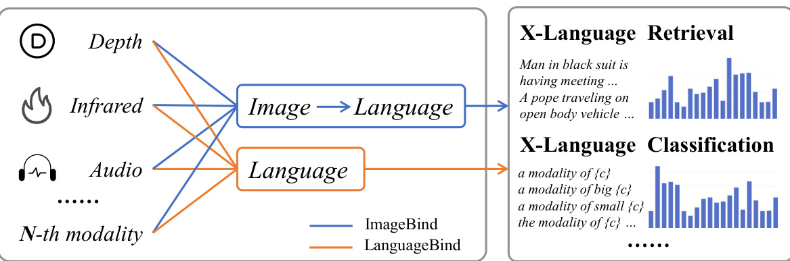

# LANGUAGEBIND: EXTENDING VIDEO-LANGUAGE PRETRAINING TO N-MODALITY BY LANGUAGEBASED SEMANTIC ALIGNMENT  

Bin $\mathbf{Z}\mathbf{h}\mathbf{u}^{1,2,*}$ , Bin $\mathbf{Lin^{1}},$ ,∗ Munan $\mathbf{Ning^{1,4}}$ , Yang $\mathbf{Yan^{1}}$ , JiaXi $\mathbf{Cui^{1}}$ , Hongfa $\mathbf{Wang}^{2}$ , Yatian $\mathbf{Pang}^{3}$ , Wenhao Jiang6, Junwu Zhang1, Zongwei $\mathbf{L}\mathbf{i}^{2}$ , Wancai Zhang5, Zhifeng $\mathbf{L}\mathbf{i}^{2}$ , Wei $\mathrm{Liu}^{2}$ , Li Yuan1,4,† 1Peking University, 2Tencent Data Platform, 3National University of Singapore, 4Pengcheng Lab, 5Nari Technology Development Limited Company, 6Guangdong Laboratory of Artifcial Intelligence and Digital Economy (SZ)  

# ABSTRACT  

The video-language (VL) pretraining has achieved remarkable improvement in multiple downstream tasks. However, the current VL pretraining framework is hard to extend to multiple modalities (N modalities, $N~\geq~3)$ beyond vision and language. We thus propose LanguageBind, taking the language as the bind across different modalities because the language modality is well-explored and contains rich semantics. Specifcally, we freeze the language encoder acquired by VL pretraining and then train encoders for other modalities with contrastive learning. As a result, all modalities are mapped to a shared feature space, implementing multi-modal semantic alignment. While LanguageBind ensures that we can extend VL modalities to N modalities, we also need a high-quality dataset with alignment data pairs centered on language. We thus propose VIDAL-10M with 10 Million data with Video, Infrared, Depth, Audio and their corresponding Language. In our VIDAL-10M, all videos are from short video platforms with complete semantics rather than truncated segments from long videos, and all the video, depth, infrared, and audio modalities are aligned to their textual descriptions. LanguageBind has achieved superior performance on a wide range of 15 benchmarks covering video, audio, depth, and infrared. Moreover, multiple experiments have provided evidence for the effectiveness of LanguageBind in achieving indirect alignment and complementarity among diverse modalities. Code address: https://github.com/PKU-YuanGroup/LanguageBind  

# 1 INTRODUCTION  

With the development of the Internet and smartphones, there has been a proliferation of video websites and apps (e.g., Youtube and TikTok), leading to a substantial increase number of videos (Xue et al., 2022). Consequently, a set of video tasks have emerged, such as video search (Smith & Chang, 1997), video recommendation (Deldjoo et al., 2016), and video editing (Casares et al., 2002; Bonneel et al., 2014). To solve video understanding tasks, video-language pretraining has been employed by training foundation models by combining computer vision (He et al., 2016; Dosovitskiy et al., 2020) and natural language processing (Vaswani et al., 2017). These models can capture video semantics and solve downstream tasks (Karpathy et al., 2014; Mithun et al., 2018).  

However, current VL pretraining frameworks are often limited to vision and language modalities. The ImageBind (Girdhar et al., 2023) introduces an indirect alignment method for multi-modal pretraining. It aligns other modalities to images, facilitating a comprehensive understanding of various modalities such as infrared (Jia et al., 2021), depth (Kim et al., 2022), audio (Piczak, 2015), and IMU (Grauman et al., 2022). In practical tasks such as zero-shot retrieval and classifcation as shown in Figure 1, the alignment with language modality is predominantly required for various modalities. While the indirect alignment of ImageBind may result in performance degradation,  

∗Equal contribution.   
†Corresponding author.  

  
Figure 1: ImageBind vs. LanguageBind. The ImageBind method relies on images as intermediaries, while the LanguageBind method dispenses with this requirement. LanguageBind directly aligns all modalities to the language space, thereby enhancing its applicability to downstream tasks. “X” represents all modalities except language, and “c” represents category.  

the LanguageBind method does not need images as intermediaries and facilitates straightforward expansion to additional modalities in downstream tasks.  

In this paper, we propose the LanguageBind, a language-based multi-modal pretraining framework that can extend video-language pretraining to multiple (N) modalities. As the language modality contains rich semantic information and is well-explored (Kenton & Toutanova, 2019; Dai et al., 2019), we take it as the bind across different modalities. This process maps all modalities to a unifed embedding space, enabling effective semantic alignment. To improve training effciency, we employ Low-Rank Adaptation (LoRA) (Hu et al., 2021) for fne-tuning, achieving impressive training results with minimal training iterations.  

To further improve the modal integrity in pretraining and validate our LanguageBind, we introduce a dataset with fve modalities, the VIDAL-10M, which includes VL, IL (infrared-language), DL (depth-language), and AL (audio-language) data pairs. The videos of previous datasets are always truncated segments from long videos (Miech et al., 2019; Xue et al., 2022), resulting in fragmented semantics. To avoid this problem, we construct our video-text pairs from short videos with complete stories. To ensure the quality of the central language modality, we perform multi-view text generation and enhancement on VIDAL-10M.  

The proposed LanguageBind ensures that we can extend vision-language to multiple (N) modalities, and our dataset VIDAL-10M benefts more downstream tasks beyond VL tasks, including video retrieval (Luo et al., 2022), depth classifcation (Cao et al., 2017), infrared classifcation (Baffa & Lattari, 2018) and audio classifcation (Palanisamy et al., 2020). As shown in Figure 2, LanguageBind achieves superior performances on a broad range of 15 tasks. In zero-shot text to video retrieval, LanguageBind achieves superior performance on four datasets, surpassing InterVideo (Wang et al., 2022c) by $1.9\%$ on MSR-VTT (Xu et al., 2016), $8.8\%$ on MSVD (Chen & Dolan, 2011), $6.3\%$ on DiDeMo (Anne Hendricks et al., 2017), and $4.4\%$ on ActivityNet (Caba Heilbron et al., 2015). For zero-shot classifcation on depth and infrared data, LanguageBind  

  
Figure 2: LanguageBind achieves superior performances on a broad range of 15 benchmarks across video, audio, depth and infrared.  

achieves a substantial performance advantage over ImageBind. LanguageBind attains top-1 accuracy of $87.2\%$ and $65.1\%$ on LLVIP and NYU-D, respectively, outperforming ImageBind by $23.8\%$ and $11.1\%$ . For zero-shot audio classifcation tasks, LanguageBind outperforms ImageBind with a $23.8\%$ higher top-1 accuracy on the ESC50 dataset.  

We summarize our primary contributions as follows:  

• We propose LanguageBind, the langauge-based multi-modal pretraining approach. During the pretraining process, all modalities gradually align with the language modality through contrastive learning, and these modalities are unifed within a shared embedding space. • We introduce VIDAL-10M, a large-scale fve-modal video dataset, containing 10 million data pairs with aligned VL, IL, DL, and AL. To the best of our knowledge, VIDAL-10M is the frst large-scale video dataset with depth and infrared modalities. • Extensive experiments validate the effectiveness of our dataset and approach, achieving remarkable performance in video and other modality understanding tasks.  

# 2 RELATED WORK  

Multi-modal Pretraining Multi-modal pretraining begins with pretraining in vision and language. CLIP (Radford et al., 2021) pioneered the alignment of images and texts on a large-scale dataset comprising 400 million samples, effectively establishing a bridge between the image and text domains. This alignment benefts a variety of downstream tasks, including zero-shot classifcation and image-text retrieval. CLIP can also be used as a foundation for alignment in other modalities. For instance, CLIP4Clip (Luo et al., 2022) aligns video with text, CLAP ( $\mathrm{\mathbf{W}\vec{u}^{*}}$ et al., 2023) aligns audio with text, and PointCLIP (Zhang et al., 2022) aligns point clouds with text. Recent efforts have undertaken a comprehensive exploration of multi-modal alignment through pretraining. Augmenting the alignment process with additional modalities can enhance the model’s robustness while maintaining its performance, as observed in VALOR (Chen et al., 2023a) and VAST (Chen et al., 2023b). However, as the number of modalities increases, the training paradigm required to align them effectively undergoes signifcant changes. Meta-transformer (Zhang et al., 2023) accommodates 12 modalities and utilizes distinct tokenizers to harmonize the embedding space across modalities. ImageBind (Girdhar et al., 2023) expands multi-modal alignment pretraining to encompass six modalities but may not perform as well in language-related tasks due to indirect alignment. In our work, we propose LanguageBind, a direct alignment mechanism designed to align alternative modalities directly with the language modality, which has the highest information density. This direct alignment mechanism yields discernible improvements in downstream task performance.  

Multi-modal Datasets Multi-modal datasets serve as the foundation for multi-modal pretraining. Initially, these datasets only consisted of videos and their corresponding categories, as shown in Table 1. HMDB-51 (Kuehne et al., 2011) and UCF-101 (Soomro et al., 2012) are examples of such datasets, which contain truncated segments from long videos with manual annotation. However, creating these datasets required signifcant human effort, which limited their scalability and diversity. To address this issue, researchers turned their attention to the abundance of video-text resources available on the internet. Inspired by the success of image-text datasets (Sharma et al., 2018; Changpinyo et al., 2021), they used script-based programming (Schuldt et al., 2004; Kong et al., 2019; Sigurdsson et al., 2018) to extract millions of video-text data pairs. However, acquiring data from modalities like infrared (Teledyne FLIR, 2015a;b) and depth (Silberman et al., 2012), which require specialized equipment and manual annotation, has been challenging. This has severely limited the scale of the data and its alignment with other modalities. Although existing work like ImageBind (Girdhar et al., 2023) has attempted to bind various image-paired datasets and achieve indirect semantic alignment between different modalities, this approach still faces issues of incomplete and indirect data alignment. Thus, there is an urgent need for multi-modal datasets with direct semantic aligned data pairs, especially for modalities with fve or more types.  

Table 1: Comparision of existing multimodal datasets. VIDAL-10M is the currently frst accessible multi-modal dataset including aligned VL, IL, DL, and AL data pairs.   

<html><body><table><tr><td>Datasets</td><td>Samples</td><td>Modality</td><td>Year</td></tr><tr><td>HMDB-51 UCF-101</td><td>7K 13K</td><td>V V</td><td>2011 2012</td></tr><tr><td>ActivityNet-200 WebVid-10M HD-VILA-100M HowTo-100M</td><td>20K 10.7M 100M 136M</td><td>VT VT VT VT</td><td>2015 2021 2022 2019</td></tr><tr><td>LLVIP FLIRV1 FLIR V2 NYU-D YouTube-8M AVA</td><td>15k 10k 12k 1.4k 6.1M 58K</td><td>VI VI VI VD VAT VAT</td><td>2021 2015 2015 2012 2016 2017</td></tr><tr><td>VIDAL-10M (Ours)</td><td>10M</td><td>VIDAL</td><td>2023</td></tr></table></body></html>  

  
Figure 3: LanguageBind overview. The language encoder parameters are frozen, while the multimodal encoder parameters can be adjusted using the LoRA technique. By employing contrastive learning between language and other modalities, LanguageBind successfully achieved multimodal joint learning, thereby fostering semantic alignment across different modalities.  

# 3 METHOD  

In this section, we present LanguageBind, a multi-modal pretraining approach designed to align the semantics of different modalities and enhance cross-modal retrieval and zero-shot classifcation. As shown in Figure 3, LanguageBind consists of three parts: (a) multi-modal encoders, (b) language encoder, and (c) multi-modal joint learning.  

# 3.1 MULTI-MODAL ENCODERS  

For other modalities besides language, we employ the 24-layer, 1024-dimensional vision transformer with a patch size of 14. The encoders are initialized from OpenCLIP-large (Ilharco et al., 2021). Depth and infrared are treated as RGB images, which are replicated 3 times in the channel dimension to align with RGB images. Following ImageBind, audio data is transformed into spectrograms with a duration of 10 seconds (128 mel-bins) and we repeat and pad the spectrograms. For example, a 4-second spectrogram would be repeated twice and then padded with zero for an additional 2 seconds. Similarly, we also replicate it 3 times in the channel dimension. If the duration exceeds 10 seconds, we randomly sample three 10-second audio segments, each from the front 1/3, middle $1/3$ , and back $1/3$ of the original audio, and fnally stack them together.  

Patch masking To address the ineffciency in processing all tokens within the encoder, we divide the image into patches and take a small portion of patches by encoder mask $\mathbb{M}_{e}$ , following MAE (He et al., 2022). Given a modality $\overrightharpoon{m}\overset{\triangledown}{\in}\mathbb{R}^{H\times W\times C}$ , where $(H,W)$ represents the resolution of the original data, with $C$ denoting the number of channels. We frst transform it into patches using a patch embedding layer with non-overlapping flters. This operation produces patches denoted as $\dot{m^{\prime}}\,\in\,\mathbb{R}^{N\times C}$ and $\begin{array}{r}{N=\frac{H\times W}{S^{2}}}\end{array}$ represents the resulting sequence length, where $S$ represents the size of each patch. Subsequently, positional embedding is applied to the visible tokens, which are divided by encoder mask. The combined sequence $\textbf{\em x}$ is defned as:  

$$
\pmb{x}=\{\pmb{m}_{i}^{\prime}+\pmb{P}_{i}\}_{i\in\mathbb{M}_{e}}
$$  

where $_{P}$ is a sequence of learnable position tokens, and $i$ represents the position index at patches.  

LoRA fne-tuning We employ the LoRA technique (Hu et al., 2021) to accelerate fne-tuning. For a modality-agnostic encoder with a weight matrix $W_{0}\in\mathbb{R}^{d\times k}$ , we maintain the weight matrix $W_{0}$  

frozen while learning a new weight matrix $B A$ . For instance, in the case of the modality-agnostic encoder $h(\cdot)$ and $\textbf{\em x}$ , the forward process can be represented as follows:  

$$
h(\pmb{x})=W_{0}\pmb{x}+B A\pmb{x}
$$  

where $B\,\in\,\mathbb{R}^{d\times r},A\,\in\,\mathbb{R}^{r\times k}$ , with $r$ being the minimum of $d$ and $k$ . It is important to highlight that both $W_{0}$ and $B A$ possess the same input and output dimensions, facilitating their summation to produce the fnal output.  

Modality extending To extend the LanguageBind method to multiple (N) modalities, the frst step involves processing the data into a sequence of tokens. Subsequently, the parameters are initialized from OpenCLIP. The encoder for different modalities is then trained through token masking and LoRA fne-tuning while keeping the language encoder frozen. Finally, this modality is aligned with the language feature space.  

# 3.2 LANGUAGE ENCODER AND MULTI-MODAL JOINT LEARNING  

For the language encoder, we utilize a 12-layer transformer model with 768-dimensional and initialize it from OpenCLIP. For a given text, we initially employ a BPE tokenizer to segment words into relatively common subwords. Each subword corresponds to a unique token, and these tokens are embedded within a word embedding layer. Ultimately, the tokens are encoded by the language encoder to obtain a text logit $\pmb{y}\in\mathbb{R}^{L\times\widetilde{C}}$ , where $L$ represents the length of the sequence. To ensure alignment across different modalities, we implement contrastive learning principles (Radford et al., 2021). The objective of this approach is to increase the similarity of paired data, bringing them closer to the same semantic space, while minimizing the similarity of unpaired data. We utilize contrastive learning to bind individual modalities to language.  

$$
L_{M2T}=-\frac{1}{K}\sum_{i=1}^{K}\log\frac{\exp(x_{i}^{\top}y_{i}/\tau)}{\sum_{j=1}^{K}\exp(x_{i}^{\top}y_{j}/\tau)},L_{T2M}=-\frac{1}{K}\sum_{i=1}^{K}\log\frac{\exp(y_{i}^{\top}x_{i}/\tau)}{\sum_{j=1}^{K}\exp(y_{i}^{\top}x_{j}/\tau)}
$$  

where $x_{i}$ is the $i$ -th modality data and $y_{j}$ is the $j$ -th text and their features are normalized. $K$ and $\tau$ are batch size and the temperature. The direct alignment of each modality $\mathbf{M}$ with language $\mathbf{T}$ enables us to signifcantly enhance zero-shot classifcation and retrieval tasks.  

# 4 THE VIDAL-10M DATASET  

In this section, we will describe how to construct our VIDAL-10M dataset, including 3 million pairs of video-language data, 3 million pairs of infrared-language data, 3 million pairs of depth-language data, and 1 million pairs of audio-language data. As shown in Figure 4, the collection process consists of three main steps: visual search term database construction (Section 4.1), video and audio collection and fltering (Section 4.2), and modality generation and enhancement (Section 4.3).  

# 4.1 VISUAL SEARCH TERM DATABASE CONSTRUCTION  

To build a video dataset with rich visual concepts and diversity, we design a unique search term acquisition strategy. We leverage text data including labels and captions from various visual task datasets (YouTube-8M (Abu-El-Haija et al., 2016), MSR-VTT (Xu et al., 2016), COCO (Lin et al., 2014), AVA (Gu et al., 2018), HMDB-51 (Kuehne et al., 2011), ImageNet (Deng et al., 2009)) to create a large-scale search term database with diversity and broad applicability. Then we flter these search terms based on their frequency and employ the NLTK toolkit for part-of-speech tagging, followed by tallying the occurrences of keywords (nouns and verbs). A balanced subset of 100,000 search items corresponding to these keywords is then extracted as the fnal search team database.  

# 4.2 VIDEO AND AUDIO COLLECTION AND FILTERING  

During the data collection process, we utilize the aforementioned search terms to retrieve video-text pairs and audio-text pairs from relevant platforms, e.g. YouTube Shorts, and Freesound. Regarding video collection, in order to obtain short videos with high-quality textual descriptions, we implemented a fltering mechanism for the title and hashtags. Video samples with titles containing less than 2 words and without video hashtag labels are excluded from our dataset. Moreover, we removed irrelevant words and hashtags, such as ”youtube”, ”fyp”, ”shorts”, etc. Furthermore, to ensure a complete, consistent, and precise depiction of the event within a single full video, we decide to impose a duration limit of 20 seconds. Shorter videos tend to exhibit better scene coherence and event integrity and are more closely aligned with corresponding hashtags and title descriptions. Ultimately, we obtain a short video dataset that encompasses more specifc rather than abstract content. Concerning audio collection, we rank the audio list on different audio platforms based on its similarity to the search terms. Additionally, we conduct fltering operations similar to videos, taking into account factors such as audio ratings, download counts, user comments, tags, and duration. This comprehensive approach allows us to curate and refne the audio and video content more effectively.  

  
Figure 4: VIDAL-10M construction. (a) Firstly, a search term database is generated by leveraging visually related datasets. (b) Subsequently, relevant videos and audios are collected from the internet and undergo a series of fltering processes. (c) Lastly, we perform infrared and depth modality generation, as well as multi-view text generation and enhancement.  

  
4.3 MODALITY GENERATION AND ENHANCEMENT   
Figure 5: Multi-view text generation and enhancement pipline. We employ the OFA model to generate keyframe captions and input video, title and hashtags into the mPLUG-owl model to obtain video captions. The video captions are further refned using ChatGPT, resulting in the ChatGPTmPLUG caption. The fnal multi-view textual description comprises these components.  

Multi-view text generation and enhancement The language modality of VIDAL-10M consists of multi-view texts, including title, hashtags, keyframe captions, video captions, and enhanced captions. The detailed text generation and enhancement pipeline is illustrated in Figure 7. Hashtags in VIDAL-10M are specifcally designed to highlight the main subjects and actions depicted in the video. These hashtags serve as key indicators, emphasizing the focal points and dynamic elements of the video. However, hashtags alone may not fully capture the spatial information conveyed by the video frames. To address this limitation, we leverage the image captioning model OFA (Wang et al., 2022b) to generate supplementary keyframe captions that enrich the spatial information at the keyframe level. These captions also contain local temporal information related to the video content, which is benefcial for visual-text pretraining. Besides spatial information, temporal information concealed within the video is equally signifcant, providing crucial insights into the progression and sequencing of events within the video. To further supplement the overall thematic and temporal information of the video, we employ the mPLUG-owl model (Ye et al., 2023) to generate video captions based on the combination of video, title, and hashtags. By leveraging the title and hashtags as accurate video labels, we guide the mPLUG-owl model to generate captions that align with the video theme, reducing potential model bias to a certain extent. Furthermore, to extract valuable information from the generated video captions, we utilize the ChatGPT model to refne and enhance the textual description, thereby greatly improving the quality of the text. By incorporating the above text components, multi-view textual descriptions provide a comprehensive and detailed representation of the video content.  

Infrared and depth modality generation In the feld of depth and infrared, creating modal datasets typically requires specialized equipment and human effort, resulting in limited data. Despite the success of large-scale pretraining models (Radford et al., 2021; $\mathrm{{Wu^{*}}}$ et al., 2023; Luo et al., 2022; Chen et al., 2023b) in NLP and CV, there remains a lack of large-scale data in this feld. To address this challenge, we propose using advanced generative models specifcally to construct a large-scale dataset of depth and infrared. The sRGB-TIR model (Lee et al., 2023) is used for infrared modality generation and the GLPN model (Kim et al., 2022) for depth modality generation, generating depth and infrared from keyframes in our videos. While some limitations may exist, our collection of millions of video frames and corresponding texts with highly diverse semantics can signifcantly reduce the presence of model biases.  

# 5 EXPERIMENTS AND RESULTS  

In this section, we evaluate the effectiveness of LanguageBind in various downstream tasks through different experiments. Firstly, LanguageBind’s capability to align video and text is assessed using zero-shot video-text retrieval. Additionally, we use LanguageBind to enhance the performance of downstream tasks that involve depth, infrared images, and audios. Finally, we conduct ablation experiments to analyze the impact of different parameter confgurations and text descriptions on LanguageBind’s performance.  

# 5.1 ZERO-SHOT RETRIEVAL IN VIDEO-LANGUAGE  

Comparison to prior methods In the zero-shot video-text retrieval benchmark, we utilize ViTL/14 as the video encoder and add temporal attention layers for fair comparison, which can be found in Appendix B. According to the results presented in Table 2, the performance of LanguageBind exceeds that of VideoCoca (Yan et al., 2022) and OmniVL (Wang et al., 2022a) by $8.3\%$ and $8.0\%$ respectively on MSR-VTT. In comparison to the ImageBind model utilizing the Vit-Huge architecture, the LanguageBind model, employing the Vit-Large model, showcases superior experimental outcomes. Furthermore, compared to models based on CLIP-Large but using more training data, LanguageBind achieves state-of-the-art (SOTA) performance on four datasets, outperforming InterVideo (Wang et al., 2022c) by $1.9\%$ on MSR-VTT, $8.8\%$ on MSVD, $6.3\%$ on DiDeMo, and $4.4\%$ on ActivityNet. We also exceed TVTSv2 (Zeng et al., 2023) by $4.4\%$ and $3.2\%$ on MSR-VTT and DiDeMo, respectively. Moreover, we outperforms UMT-L Li et al. (2023a) on all datasets. For a fair comparison of dataset validity, we use the Vit-B/32 model of CLIP4CLIP to conduct validation experiments using the 100K subset of VIDAL-10M and the $380\mathbf{k}$ subset of HowTo100M. As shown in Table 3, the VIDAL-100k outperforms the HT100M-380k on both MSRVTT and MSVD datasets, validating the effectiveness of our dataset.  

Zero-shot X-Language classifcation We compare our model with the recent state-of-the-art multi-modal pretraining models, OpenCLIP (Ilharco et al., 2021) and ImageBind (Girdhar et al., 2023) on multi-modal understanding ability tasks in Table 4. For video zero-shot classifcation, we outperform ImageBind by $14.0\%$ with a smaller model on Kinetics-400 (Kay et al., 2017), and we also report the results of multi-view/crop (Simonyan & Zisserman, 2014) on OpenCLIP for further comparison. For infrared, LanguageBind exhibits a noteworthy $23.8\%$ performance advantage over ImageBind on the LLVIP and outperforms OpenCLIP on all three datasets (LLVIP, FLIR V1, and  

V2). For depth images, our zero-shot results on NYU-D surpass ImageBind by a substantial margin of $11.1\%$ and outperform OpenCLIP by $19.7\%$ . For audio, we outperform ImageBind by $10.1\%$ on Audioset dataset and $1.1\%$ on VGGSound dataset. We outperform ImageBind by a large margin of $23.9\%$ on the ESC-50 dataset.  

Table 2: Zero-shot Video-Text retrieval performance of LanguageBind across four datasets. ∗ donates the result of full tuning. † donates the results are training on Huge model. 10M donates training with 10M video-text pairs.   

<html><body><table><tr><td rowspan="2">Method</td><td rowspan="2">Dataset</td><td colspan="2">MSR-VTT</td><td colspan="2"></td><td colspan="2">MSVD</td><td colspan="2">DiDeMo</td><td colspan="2"></td><td colspan="2">ActivityNet</td></tr><tr><td>R@1 R@5 R@10|R@1 R@5 R@10|R@1 R@5 R@10|R@1 R@5 R@10</td><td></td><td></td><td></td><td></td><td></td><td></td><td></td><td></td><td></td><td></td><td></td></tr><tr><td>Non-CLIPmodels</td><td></td><td></td><td></td><td></td><td></td><td></td><td></td><td></td><td></td><td></td><td></td><td></td><td></td></tr><tr><td>OmniVL</td><td>14M</td><td>34.6</td><td>58.4</td><td>66.6</td><td></td><td></td><td></td><td>33.3</td><td>58.7</td><td>68.5</td><td></td><td></td><td></td></tr><tr><td>VideoCoCa</td><td>100M</td><td>34.3</td><td>57.8</td><td>67.0</td><td></td><td></td><td></td><td></td><td></td><td></td><td>34.5</td><td>63.2</td><td>76.6</td></tr><tr><td>CLIP-H/14 ImageBind</td><td></td><td></td><td>61.8</td><td></td><td></td><td></td><td></td><td></td><td></td><td></td><td></td><td></td><td></td></tr><tr><td>CLIP-L/14</td><td></td><td>36.8</td><td></td><td>70.0</td><td></td><td></td><td></td><td></td><td></td><td></td><td></td><td></td><td></td></tr><tr><td>UMT</td><td></td><td>33.3</td><td></td><td></td><td>44.4</td><td></td><td></td><td></td><td></td><td></td><td></td><td>69.2</td><td>72.0</td></tr><tr><td>TVTSv2</td><td>5M 8.5M</td><td>38.2</td><td>58.1 62.4</td><td>66.7</td><td></td><td>73.3</td><td>82.4</td><td>34.0</td><td>60.4 61.9</td><td>68.7 71.5</td><td>31.9</td><td></td><td></td></tr><tr><td>InternVideo</td><td>12.8M</td><td>40.7</td><td></td><td>73.2</td><td>43.4</td><td>-</td><td></td><td>34.6 31.5</td><td></td><td></td><td>30.7</td><td></td><td></td></tr><tr><td>LanguageBind</td><td>3M</td><td>42.6</td><td>一 65.4</td><td>75.5</td><td>52.2</td><td>79.4</td><td>87.3</td><td>37.8</td><td>63.2</td><td>73.4</td><td>35.1</td><td>63.4</td><td>76.6</td></tr><tr><td>LanguageBind*</td><td>3M</td><td>42.7</td><td>67.1</td><td>77.0</td><td>53.5</td><td>80.5</td><td>87.5</td><td>38.1</td><td>65.0</td><td>73.6</td><td>36.9</td><td>65.1</td><td>77.2</td></tr><tr><td>LanguageBind*</td><td>10M</td><td>42.8</td><td>67.5</td><td>76.0</td><td>54.1</td><td>81.1</td><td>88.1</td><td>39.7</td><td>65.5</td><td>73.8</td><td>38.4</td><td>66.6</td><td>77.9</td></tr><tr><td>CLIP-H/14</td><td></td><td></td><td></td><td></td><td></td><td></td><td></td><td></td><td></td><td></td><td></td><td></td><td></td></tr><tr><td>LanguageBind*t</td><td>10M</td><td>44.8</td><td>70.0</td><td>78.7</td><td>53.9</td><td>80.4</td><td>87.8</td><td>39.9</td><td>66.1</td><td>74.6</td><td>41.0</td><td>68.4</td><td>80.0</td></tr></table></body></html>  

<html><body><table><tr><td>Dataset</td><td>Method</td><td>Parameter</td><td>Source</td><td>R@1↑</td><td>R@5个</td><td>R@10↑</td><td>MR↓</td></tr><tr><td rowspan="2">MSR-VTT</td><td>CLIP4Clip</td><td>86M</td><td>WIT400M,HT100M-380k</td><td>32.0</td><td>57.0</td><td>66.9</td><td>4.0</td></tr><tr><td>CLIP4Clip</td><td>86M</td><td>WIT400M,VIDAL-100k</td><td>35.7</td><td>60.8</td><td>71.5</td><td>3.0</td></tr><tr><td rowspan="2">MSVD</td><td>CLIP4Clip</td><td>86M</td><td>WIT400M,HT100M-380k</td><td>38.5</td><td>66.9</td><td>76.8</td><td></td></tr><tr><td>CLIP4Clip</td><td>86M</td><td>WIT400M,VIDAL-100k</td><td>42.0</td><td>70.0</td><td>79.2</td><td>2.0 2.0</td></tr></table></body></html>  

Table 4: Zero-shot X-Language classifcation. We report the mAP for Audioset Audio-only (ASA) (Gemmeke et al., 2017) and top-1 accuracy results for others. ∗ donates the results of full tuning.  

<html><body><table><tr><td rowspan="2">Method</td><td rowspan="2">Size</td><td colspan="2">Video</td><td colspan="3">Infrared</td><td rowspan="2">Depth</td><td colspan="3">Audio</td></tr><tr><td>K400</td><td>K600</td><td>LLVIP</td><td>FLIR V1</td><td>FLIR V2 NYU-D</td><td>AS-A</td><td>ESC-50</td><td>VGGS</td></tr><tr><td>ImageBind</td><td>Huge</td><td>50.0</td><td>一</td><td>63.4</td><td></td><td>一</td><td>54.0</td><td>17.6</td><td>66.9</td><td>27.8</td></tr><tr><td>OpenCLIP</td><td>Large</td><td>60.7</td><td>59.0</td><td>82.2</td><td>81.2</td><td>42.6</td><td>45.4</td><td></td><td></td><td></td></tr><tr><td>LanguageBind</td><td>Large</td><td>64.0</td><td>61.9</td><td>87.2</td><td>82.9</td><td>48.0</td><td>65.1</td><td>27.7</td><td>91.8</td><td>28.9</td></tr><tr><td>LanguageBind</td><td>Large</td><td></td><td>1</td><td></td><td></td><td></td><td></td><td>30.0</td><td>94.0</td><td>38.6</td></tr></table></body></html>  

# 5.2 ZERO-SHOT IN MULTIPLE MODALITIES  

Zero-shot Audio-Language retrieval We compare zero-shot text-to-audio retrieval performance on Clotho (Font et al., 2013) datasets and Audiocaps (Kim et al., 2019) dataset in Table 5. For the Clotho dataset, LanguageBind exhibits a significantly higher margin surpassing AVFIC (Nagrani et al., 2022) and ImageBind by $9.1\%$ and $6.1\%$ respectively. Moreover, our LanguageBind model also surpasses the powerful baseline of VALOR (Chen et al., 2023a) by $3.7\%$ . The same trend is also observed in the Audiocaps dataset. LanguageBind outperformed AVFIC and ImageBind by $2.9\%$ and $5.5\%$ , respectively. Overall, LanguageBind significantly outperforms prior works on two benchmarks validating that it is an effcient way to align audio and language modalities.  

Table 5: Zero-shot Audio-Language retrieval. ∗ donates the results of full tuning.   

<html><body><table><tr><td>Method</td><td>Clotho R@1 R@10</td><td>Audiocaps R@1 R@10</td></tr><tr><td>AVFIC</td><td>3.0 17.5</td><td>8.7 37.7</td></tr><tr><td>ImageBind</td><td>6.0 28.4</td><td>9.3 42.3</td></tr><tr><td>VALOR</td><td>8.4</td><td></td></tr><tr><td>LanguageBind</td><td>12.1 44.0</td><td>12.2 53.2</td></tr><tr><td>LanguageBind</td><td>16.7 52.0</td><td>19.7 67.6</td></tr></table></body></html>  

Zeor-shot langauge-based multi-modal joint retrieval In Table 6, we conduct multi-modal joint retrieval to explore the complementarity of joint space. We report the $\mathbf{R}\mathcal{@}1$ scores on MSR-VTT and Place datasets, while reporting accuracy on other datasets. For MSR-VTT, we only evaluate using videos that include audio. Integrating audio embeddings for video-language retrieval further improves performance, increasing it from 41.4 to 42.0. Similar trends have been observed in other modalities, where each modality has the potential to enhance the performance when combined with other modalities. These results demonstrate that LanguageBind is capable of learning a more consistent feature space.  

Emergent zero-shot retrieval As shown in Table 7, we explore the zero-shot performance of emergency coverage in four datasets, including RGB images, audio, infrared, and depth. Due to the novelty of our approach, there are no ”fair” baseline models for comparison. Nonetheless, we compare our results with ImageBind, which aligns with images directly. For example, we achieved $\mathbf{R}\mathcal{@}1$ scores of 10.6 and 10.0 on AVE (Tian et al., 2018) and VGGS, respectively. On each benchmark, the performance of emergency zero-shot retrieval achieves signifcant gains, even approaching results obtained by incorporating textual features. These results suggest that LanguageBind aligns various modalities and implicitly transfers text supervision associated with specifc modalities and tasks.  

Table 6: Comparison of multi-modal language based retrieval. ∗ donates that it is not clear whether only videos with audio are included. † donates that dark nighttime images.   

<html><body><table><tr><td>Dataset</td><td>Method</td><td>Task</td><td>Top-1</td></tr><tr><td rowspan="2">MSR</td><td>ImageBind</td><td>V→→T A+V→T</td><td>36.1* 36.8 (+0.7)</td></tr><tr><td>Ours</td><td>V→→T A+V→T</td><td>41.4 42.0 (+0.6)</td></tr><tr><td rowspan="2">NYU</td><td>ImageBind</td><td>D→→T</td><td>54.0</td></tr><tr><td>Ours</td><td>D→T RGB-→T D+RGB-T</td><td>65.1 76.0 77.4 (+1.4)</td></tr><tr><td>LLVIP</td><td>Ours</td><td>RGB+→T I+RGB→T</td><td>62.4 79.3 (+16.9)</td></tr></table></body></html>  

Table 7: Comparison of emergent zero-shot retrieval. † donates that we randomly select $10\%$ data to test.   

<html><body><table><tr><td>Dataset</td><td>Method</td><td>Task</td><td>Emergent</td><td>R@1</td></tr><tr><td rowspan="2">AVEt</td><td>Ours</td><td>RGB-→A</td><td></td><td>10.6</td></tr><tr><td>ImageBind Ours</td><td></td><td>←</td><td>36.9</td></tr><tr><td>VGGSt</td><td>ImageBind</td><td>RGB-→A</td><td>×</td><td>10.0 28.7</td></tr><tr><td rowspan="4">LLVIPt</td><td rowspan="4">Ours</td><td>RGB→→I</td><td>←</td><td>7.5</td></tr><tr><td>RGB+T-→I</td><td></td><td>9.1</td></tr><tr><td>I→RGB</td><td>←</td><td>9.3</td></tr><tr><td>D+I-RGB</td><td></td><td>10.6</td></tr><tr><td rowspan="4">NYU</td><td rowspan="4">Ours</td><td>RGB-D</td><td>←</td><td>17.9</td></tr><tr><td>RGB+T-D</td><td></td><td>18.3</td></tr><tr><td>D→RGB</td><td>←</td><td>24.5</td></tr><tr><td>D+T→RGB</td><td></td><td>25.7</td></tr></table></body></html>  

# 5.3 TRAINING LOSS AND ARCHITECTURE  

Following ImageBind, we mainly focus on depth and infrared, which are visual and spatial modality. We report $\mathbf{R}\mathcal{@}1$ score for Clotho and Audiocaps datasets and top-1 accuracy for others. We provide more ablation in Appendix E  

Training epochs. We conduct an experiment in Table 8a to study the effect of training epochs which shows that the LoRA fne-tuning is highly effective. Although 3 epochs of training regimen yield superior accuracy, we chose to optimize for a single epoch, achieving a balance between performance and training cost.  

Training batch size. In Table 8b, we evaluate the effect of batch size on representation learning. The experiments have shown that a larger batch size is not necessarily better. In fact, a batch size of 1,024 is the most optimal.  

Training strategy. As indicated by Table 8c, we compare three different strategies. Training from scratch exhibits the poorest performance, likely due to the lack of prior knowledge from CLIP pretraining. On the other hand, full tuning shows signifcant improvement compared to training from scratch. This highlights the positive impact of leveraging prior knowledge in the form of pre-trained weights. Meanwhile, the LoRA method stands out for its advantages in terms of time and memory cost. It requires less time and memory resources compared to full tuning. Furthermore, LoRA outperforms full tuning on multiple datasets such as LLVIP, FLIRv1, and Clotho. This indicates that LoRA is not only effcient but also effective in learning new knowledge specifc to different domains while better retaining the previously acquired knowledge from the pre-trained OpenCLIP models.  

Table 8: Training loss and architecture design decisions and their impact on zero-shot classifcation. Settings for results in Section 5.2 highlighted in gray .   

<html><body><table><tr><td colspan="4">(a) Training epochs</td><td colspan="4">Training batch size</td><td colspan="4">()Training strategy</td></tr><tr><td>Dataset</td><td>1</td><td>5</td><td>(b) Dataset</td><td>512</td><td>1k</td><td>2k</td><td></td><td>Scratch</td><td></td><td>Full tuning</td><td>LoRA</td></tr><tr><td>NYU-D</td><td>65.1</td><td>64.5</td><td>NYU-D</td><td>63.9</td><td>65.1</td><td>64.5</td><td>Time</td><td>1.4h</td><td></td><td>1.4h</td><td>0.8h</td></tr><tr><td>LLVIP</td><td>83.9</td><td>81.1</td><td>LLVIP</td><td>80.0</td><td>83.9</td><td>78.6</td><td>Mems</td><td>278M</td><td></td><td>278M</td><td>132M</td></tr><tr><td>FLIR V1</td><td>82.9</td><td>85.0</td><td>FLIR V1</td><td>81.6</td><td>82.9</td><td>85.2</td><td>LLVIP</td><td>57.1</td><td></td><td>85.1</td><td>84.8</td></tr><tr><td>FLIR V2</td><td>48.0</td><td>44.7</td><td>FLIR V2</td><td>45.1</td><td>48.0</td><td>47.9</td><td>FLIR V1 FLIR V2</td><td>74.7</td><td></td><td>81.3</td><td>81.6</td></tr><tr><td colspan="4"></td><td></td><td></td><td></td><td>ESC-50</td><td>54.4 86.8</td><td colspan="2">41.9 88.9</td><td>46.6 87.4</td></tr><tr><td colspan="4"></td><td></td><td></td><td></td><td>Clotho</td><td>8.8</td><td colspan="2">9.8</td><td>10.1</td></tr><tr><td colspan="4">(d) Rank of LoRA</td><td>(e) Temperature for loss</td><td></td><td></td><td colspan="4">(f) Masked ratio</td><td></td></tr><tr><td colspan="4">Dataset 2</td><td>Dataset Learn</td><td>0.05</td><td>0.1</td><td>Dataset</td><td>0.0</td><td>0.3</td><td>0.5</td><td>0.7</td></tr><tr><td>NYU-D</td><td>65.1</td><td>4 8 64.4 64.7</td><td></td><td>65.1</td><td>63.0</td><td></td><td>NYU-D</td><td></td><td></td><td>65.1</td><td>62.7</td></tr><tr><td>LLVIP</td><td>83.9</td><td>78.0</td><td>NYU-D LLVIP</td><td>83.9</td><td>81.8</td><td>62.7 83.1</td><td>LLVIP</td><td></td><td>64.8</td><td></td><td>81.5</td></tr><tr><td></td><td>82.9</td><td></td><td>FLIR V1</td><td>82.9</td><td>83.3</td><td>80.3</td><td>FLIR V1</td><td>80.3</td><td>79.9</td><td>83.9</td><td></td></tr><tr><td>FLIR V1</td><td></td><td>74.4</td><td></td><td></td><td></td><td></td><td></td><td>83.5</td><td>84.2</td><td>82.9</td><td>81.9</td></tr><tr><td>FLIR V2</td><td>48.0</td><td>45.8</td><td>FLIR V2</td><td>48.0</td><td>45.0</td><td>43.2</td><td>FLIR V2</td><td>43.2</td><td>44.0</td><td>48.0</td><td>42.5</td></tr></table></body></html>  

Rank of LoRA. In our investigation, we examined prevalent rank confgurations for LoRA, as detailed in Table 8d. We observe that smaller rank values lead to more signifcant performance improvements, whereas larger rank tends to decrease performance. This trend may be attributed to the potential overftting of the model.  

Temperature for loss. We scrutinize the impact of diverse temperature in Table 8e. We fnd that the learnable temperature initiated from 0.07 performs best, outperforming the fxed temperature strategy proposed by ImageBind.  

Masked ratio. We explore the impact of different mask ratios in Table 8f. The results show that a mask ratio of 0.5 demonstrates the highest performance, requiring only a quarter of the computational resources, aligning with fndings in FLIP (Li et al., 2023b).  

# 6 CONCLUSION  

In this work, we propose the LanguageBind, a language-based semantic alignment method for multimodal pretraining. We employ contrastive learning to establish modality semantic alignment between the language modality and all other modalities. To improve modal integrity, we also construct the frst large-scale multi-modal dataset directly aligned to language modality, VIDAL-10M, comprising 10 million aligned VL, IL, DL, and AL pairs. Extensive experimental results, including zero-shot X-language comprehension and indirect alignment between different modalities, demonstrate the effectiveness of LanguageBind’s multimodal alignment and complementary capabilities, as well as the effectiveness of VIDAL-10M.  

# REPRODUCIBILITY STATEMENT  

1. For LanguageBind approach details.  

(a) We provide a comprehensive overview of the multi-modal encoder, detailing its architecture and functionality in Section 3.1.   
(b) We outline the language encoder in Section 3.2.  

(c) We expound on the methodologies employed for multi-modal joint learning in Section 3.2  

2. For VIDAL-10M dataset construction details.  

(a) We describe the procedures employed to construct the search term database in Section 4.1.   
(b) We provide insights into the strategies used for collecting and fltering video and audio data within VIDAL-10M in Section 4.2.   
(c) We elaborate on the generation of infrared and depth data, as well as the processes involved in multi-view text generation and enhancement in Section 4.3   
(d) We promise to release the VIDAL-10M dataset upon publication.  

3. For setting details.  

(a) We describe in detail the training hyperparameters in Appendix B.   
(b) We describe the setup of the downstream task dataset Appendix C.  

# REFERENCES  

Sami Abu-El-Haija, Nisarg Kothari, Joonseok Lee, Paul Natsev, George Toderici, Balakrishnan Varadarajan, and Sudheendra Vijayanarasimhan. Youtube- $\cdot8\mathrm{m}$ : A large-scale video classifcation benchmark. arXiv preprint arXiv:1609.08675, 2016.   
Lisa Anne Hendricks, Oliver Wang, Eli Shechtman, Josef Sivic, Trevor Darrell, and Bryan Russell. Localizing moments in video with natural language. In Proceedings of the IEEE international conference on computer vision, pp. 5803–5812, 2017.   
Matheus de Freitas Oliveira Baffa and Lucas Grassano Lattari. Convolutional neural networks for static and dynamic breast infrared imaging classifcation. In 2018 31st SIBGRAPI Conference on Graphics, Patterns and Images (SIBGRAPI), pp. 174–181. IEEE, 2018.   
Nicolas Bonneel, Kalyan Sunkavalli, James Tompkin, Deqing Sun, Sylvain Paris, and Hanspeter Pfster. Interactive intrinsic video editing. ACM Transactions on Graphics (TOG), 33(6):1–10, 2014.   
Fabian Caba Heilbron, Victor Escorcia, Bernard Ghanem, and Juan Carlos Niebles. Activitynet: A large-scale video benchmark for human activity understanding. In Proceedings of the ieee conference on computer vision and pattern recognition, pp. 961–970, 2015.   
Yuanzhouhan Cao, Zifeng Wu, and Chunhua Shen. Estimating depth from monocular images as classifcation using deep fully convolutional residual networks. IEEE Transactions on Circuits and Systems for Video Technology, 28(11):3174–3182, 2017.   
Juan Casares, A Chris Long, Brad A Myers, Rishi Bhatnagar, Scott M Stevens, Laura Dabbish, Dan Yocum, and Albert Corbett. Simplifying video editing using metadata. In Proceedings of the 4th conference on Designing interactive systems: processes, practices, methods, and techniques, pp. 157–166, 2002.   
Soravit Changpinyo, Piyush Sharma, Nan Ding, and Radu Soricut. Conceptual $12\mathrm{m}$ : Pushing web-scale image-text pre-training to recognize long-tail visual concepts. In Proceedings of the IEEE/CVF Conference on Computer Vision and Pattern Recognition, pp. 3558–3568, 2021.   
David Chen and William B Dolan. Collecting highly parallel data for paraphrase evaluation. In Proceedings of the 49th annual meeting of the association for computational linguistics: human language technologies, pp. 190–200, 2011.   
Sihan Chen, Xingjian He, Longteng Guo, Xinxin Zhu, Weining Wang, Jinhui Tang, and Jing Liu. Valor: Vision-audio-language omni-perception pretraining model and dataset. arXiv preprint arXiv:2304.08345, 2023a.   
Sihan Chen, Handong Li, Qunbo Wang, Zijia Zhao, Mingzhen Sun, Xinxin Zhu, and Jing Liu. Vast: A vision-audio-subtitle-text omni-modality foundation model and dataset. arXiv preprint arXiv:2305.18500, 2023b.   
Zihang Dai, Zhilin Yang, Yiming Yang, Jaime Carbonell, Quoc V Le, and Ruslan Salakhutdinov. Transformer-xl: Attentive language models beyond a fxed-length context. arXiv preprint arXiv:1901.02860, 2019.   
Yashar Deldjoo, Mehdi Elahi, Paolo Cremonesi, Franca Garzotto, Pietro Piazzolla, and Massimo Quadrana. Content-based video recommendation system based on stylistic visual features. Journal on Data Semantics, 5:99–113, 2016.   
Jia Deng, Wei Dong, Richard Socher, Li-Jia Li, Kai Li, and Li Fei-Fei. Imagenet: A large-scale hierarchical image database. In 2009 IEEE conference on computer vision and pattern recognition, pp. 248–255. Ieee, 2009.   
Alexey Dosovitskiy, Lucas Beyer, Alexander Kolesnikov, Dirk Weissenborn, Xiaohua Zhai, Thomas Unterthiner, Mostafa Dehghani, Matthias Minderer, Georg Heigold, Sylvain Gelly, et al. An image is worth 16x16 words: Transformers for image recognition at scale. arXiv preprint arXiv:2010.11929, 2020.   
Frederic Font, Gerard Roma, and Xavier Serra. Freesound technical demo. In Proceedings of the 21st ACM international conference on Multimedia, pp. 411–412, 2013.   
Jort F Gemmeke, Daniel PW Ellis, Dylan Freedman, Aren Jansen, Wade Lawrence, R Channing Moore, Manoj Plakal, and Marvin Ritter. Audio set: An ontology and human-labeled dataset for audio events. In 2017 IEEE international conference on acoustics, speech and signal processing (ICASSP), pp. 776–780. IEEE, 2017.   
Rohit Girdhar, Alaaeldin El-Nouby, Zhuang Liu, Mannat Singh, Kalyan Vasudev Alwala, Armand Joulin, and Ishan Misra. Imagebind: One embedding space to bind them all. In Proceedings of the IEEE/CVF Conference on Computer Vision and Pattern Recognition, pp. 15180–15190, 2023.   
Kristen Grauman, Andrew Westbury, Eugene Byrne, Zachary Chavis, Antonino Furnari, Rohit Girdhar, Jackson Hamburger, Hao Jiang, Miao Liu, Xingyu Liu, et al. Ego4d: Around the world in 3,000 hours of egocentric video. In Proceedings of the IEEE/CVF Conference on Computer Vision and Pattern Recognition, pp. 18995–19012, 2022.   
Chunhui Gu, Chen Sun, David A Ross, Carl Vondrick, Caroline Pantofaru, Yeqing Li, Sudheendra Vijayanarasimhan, George Toderici, Susanna Ricco, Rahul Sukthankar, et al. Ava: A video dataset of spatio-temporally localized atomic visual actions. In Proceedings of the IEEE conference on computer vision and pattern recognition, pp. 6047–6056, 2018.   
Kaiming He, Xiangyu Zhang, Shaoqing Ren, and Jian Sun. Deep residual learning for image recognition. In Proceedings of the IEEE conference on computer vision and pattern recognition, pp. 770–778, 2016.   
Kaiming He, Xinlei Chen, Saining Xie, Yanghao Li, Piotr Dolla´r, and Ross Girshick. Masked autoencoders are scalable vision learners. In Proceedings of the IEEE/CVF Conference on Computer Vision and Pattern Recognition, pp. 16000–16009, 2022.   
Edward J Hu, Yelong Shen, Phillip Wallis, Zeyuan Allen-Zhu, Yuanzhi Li, Shean Wang, Lu Wang, and Weizhu Chen. Lora: Low-rank adaptation of large language models. arXiv preprint arXiv:2106.09685, 2021.   
Gabriel Ilharco, Mitchell Wortsman, Ross Wightman, Cade Gordon, Nicholas Carlini, Rohan Taori, Achal Dave, Vaishaal Shankar, Hongseok Namkoong, John Miller, Hannaneh Hajishirzi, Ali Farhadi, and Ludwig Schmidt. Openclip, July 2021. URL https://doi.org/10.5281/ zenodo.5143773. If you use this software, please cite it as below.   
Xinyu Jia, Chuang Zhu, Minzhen Li, Wenqi Tang, and Wenli Zhou. Llvip: A visible-infrared paired dataset for low-light vision. In Proceedings of the IEEE/CVF international conference on computer vision, pp. 3496–3504, 2021.   
Andrej Karpathy, George Toderici, Sanketh Shetty, Thomas Leung, Rahul Sukthankar, and Li FeiFei. Large-scale video classifcation with convolutional neural networks. In Proceedings of the IEEE conference on Computer Vision and Pattern Recognition, pp. 1725–1732, 2014.   
Will Kay, Joao Carreira, Karen Simonyan, Brian Zhang, Chloe Hillier, Sudheendra Vijayanarasimhan, Fabio Viola, Tim Green, Trevor Back, Paul Natsev, et al. The kinetics human action video dataset. arXiv preprint arXiv:1705.06950, 2017.   
Jacob Devlin Ming-Wei Chang Kenton and Lee Kristina Toutanova. Bert: Pre-training of deep bidirectional transformers for language understanding. In Proceedings of naacL-HLT, volume 1, pp. 2, 2019.   
Chris Dongjoo Kim, Byeongchang Kim, Hyunmin Lee, and Gunhee Kim. Audiocaps: Generating captions for audios in the wild. In Proceedings of the 2019 Conference of the North American Chapter of the Association for Computational Linguistics: Human Language Technologies, Volume 1 (Long and Short Papers), pp. 119–132, 2019.   
Doyeon Kim, Woonghyun Ka, Pyungwhan Ahn, Donggyu Joo, Sehwan Chun, and Junmo Kim. Global-local path networks for monocular depth estimation with vertical cutdepth. arXiv preprint arXiv:2201.07436, 2022.   
Quan Kong, Ziming Wu, Ziwei Deng, Martin Klinkigt, Bin Tong, and Tomokazu Murakami. Mmact: A large-scale dataset for cross modal human action understanding. In Proceedings of the IEEE/CVF International Conference on Computer Vision, pp. 8658–8667, 2019.   
Hildegard Kuehne, Hueihan Jhuang, Est´ıbaliz Garrote, Tomaso Poggio, and Thomas Serre. Hmdb: a large video database for human motion recognition. In 2011 International conference on computer vision, pp. 2556–2563. IEEE, 2011.   
Dong-Guw Lee, Myung-Hwan Jeon, Younggun Cho, and Ayoung Kim. Edge-guided multi-domain rgb-to-tir image translation for training vision tasks with challenging labels. In 2023 IEEE International Conference on Robotics and Automation (ICRA), pp. 8291–8298. IEEE, 2023.   
Kunchang Li, Yali Wang, Yizhuo Li, Yi Wang, Yinan He, Limin Wang, and Yu Qiao. Unmasked teacher: Towards training-effcient video foundation models. arXiv preprint arXiv:2303.16058, 2023a.   
Yanghao Li, Haoqi Fan, Ronghang Hu, Christoph Feichtenhofer, and Kaiming He. Scaling language-image pre-training via masking. In Proceedings of the IEEE/CVF Conference on Computer Vision and Pattern Recognition, pp. 23390–23400, 2023b.   
Tsung-Yi Lin, Michael Maire, Serge Belongie, James Hays, Pietro Perona, Deva Ramanan, Piotr Dolla´r, and C Lawrence Zitnick. Microsoft coco: Common objects in context. In Computer Vision–ECCV 2014: 13th European Conference, Zurich, Switzerland, September 6-12, 2014, Proceedings, Part V 13, pp. 740–755. Springer, 2014.   
Huaishao Luo, Lei Ji, Ming Zhong, Yang Chen, Wen Lei, Nan Duan, and Tianrui Li. Clip4clip: An empirical study of clip for end to end video clip retrieval and captioning. Neurocomputing, 508: 293–304, 2022.   
Antoine Miech, Dimitri Zhukov, Jean-Baptiste Alayrac, Makarand Tapaswi, Ivan Laptev, and Josef Sivic. Howto100m: Learning a text-video embedding by watching hundred million narrated video clips. In Proceedings of the IEEE/CVF International Conference on Computer Vision, pp. 2630–2640, 2019.   
Niluthpol Chowdhury Mithun, Juncheng Li, Florian Metze, and Amit K Roy-Chowdhury. Learning joint embedding with multimodal cues for cross-modal video-text retrieval. In Proceedings of the 2018 ACM on International Conference on Multimedia Retrieval, pp. 19–27, 2018.   
Arsha Nagrani, Paul Hongsuck Seo, Bryan Seybold, Anja Hauth, Santiago Manen, Chen Sun, and Cordelia Schmid. Learning audio-video modalities from image captions. In European Conference on Computer Vision, pp. 407–426. Springer, 2022.   
Kamalesh Palanisamy, Dipika Singhania, and Angela Yao. Rethinking cnn models for audio classifcation. arXiv preprint arXiv:2007.11154, 2020.   
Karol J Piczak. Esc: Dataset for environmental sound classifcation. In Proceedings of the 23rd ACM international conference on Multimedia, pp. 1015–1018, 2015.  

Alec Radford, Jong Wook Kim, Chris Hallacy, Aditya Ramesh, Gabriel Goh, Sandhini Agarwal, Girish Sastry, Amanda Askell, Pamela Mishkin, Jack Clark, et al. Learning transferable visual models from natural language supervision. In International conference on machine learning, pp. 8748–8763. PMLR, 2021.  

Christian Schuldt, Ivan Laptev, and Barbara Caputo. Recognizing human actions: a local svm approach. In Proceedings of the 17th International Conference on Pattern Recognition, 2004. ICPR 2004., volume 3, pp. 32–36. IEEE, 2004.  

Piyush Sharma, Nan Ding, Sebastian Goodman, and Radu Soricut. Conceptual captions: A cleaned, hypernymed, image alt-text dataset for automatic image captioning. In Proceedings of the 56th Annual Meeting of the Association for Computational Linguistics (Volume 1: Long Papers), pp. 2556–2565, 2018.  

Gunnar A Sigurdsson, Abhinav Gupta, Cordelia Schmid, Ali Farhadi, and Karteek Alahari. Charades-ego: A large-scale dataset of paired third and frst person videos. arXiv preprint arXiv:1804.09626, 2018.  

Nathan Silberman, Derek Hoiem, Pushmeet Kohli, and Rob Fergus. Indoor segmentation and support inference from rgbd images. In Computer Vision–ECCV 2012: 12th European Conference on Computer Vision, Florence, Italy, October 7-13, 2012, Proceedings, Part V 12, pp. 746–760. Springer, 2012.  

Karen Simonyan and Andrew Zisserman. Two-stream convolutional networks for action recognition in videos. Advances in neural information processing systems, 27, 2014.  

John R Smith and Shih-Fu Chang. Image and video search engine for the world wide web. In Storage and Retrieval for Image and Video Databases V, volume 3022, pp. 84–95. SPIE, 1997.  

Khurram Soomro, Amir Roshan Zamir, and Mubarak Shah. Ucf101: A dataset of 101 human actions classes from videos in the wild. arXiv preprint arXiv:1212.0402, 2012.  

Teledyne FLIR. Free teledyne fir thermal dataset for algorithm training. https://www.flir. com/oem/adas/adas-dataset-form/, 2015a. Accessed: 2023-09-16.  

Teledyne FLIR. Free teledyne fir thermal dataset for algorithm training. https://www.flir. com/oem/adas/adas-dataset-form/, 2015b. Accessed: 2023-09-16.  

Yapeng Tian, Jing Shi, Bochen Li, Zhiyao Duan, and Chenliang Xu. Audio-visual event localization in unconstrained videos. In Proceedings of the European conference on computer vision (ECCV), pp. 247–263, 2018.  

Ashish Vaswani, Noam Shazeer, Niki Parmar, Jakob Uszkoreit, Llion Jones, Aidan N Gomez, Łukasz Kaiser, and Illia Polosukhin. Attention is all you need. Advances in neural information processing systems, 30, 2017.  

Junke Wang, Dongdong Chen, Zuxuan Wu, Chong Luo, Luowei Zhou, Yucheng Zhao, Yujia Xie, Ce Liu, Yu-Gang Jiang, and Lu Yuan. Omnivl: One foundation model for image-language and video-language tasks. Advances in neural information processing systems, 35:5696–5710, 2022a.  

Peng Wang, An Yang, Rui Men, Junyang Lin, Shuai Bai, Zhikang Li, Jianxin Ma, Chang Zhou, Jingren Zhou, and Hongxia Yang. Unifying architectures, tasks, and modalities through a simple sequence-to-sequence learning framework. arXiv preprint arXiv:2202.03052, 2022b.  

Yi Wang, Kunchang Li, Yizhuo Li, Yinan He, Bingkun Huang, Zhiyu Zhao, Hongjie Zhang, Jilan Xu, Yi Liu, Zun Wang, Sen Xing, Guo Chen, Junting Pan, Jiashuo Yu, Yali Wang, Limin Wang, and Yu Qiao. Internvideo: General video foundation models via generative and discriminative learning. arXiv preprint arXiv:2212.03191, 2022c.  

Yusong Wu\*, Ke Chen\*, Tianyu Zhang\*, Yuchen Hui\*, Taylor Berg-Kirkpatrick, and Shlomo Dubnov. Large-scale contrastive language-audio pretraining with feature fusion and keywordto-caption augmentation. In IEEE International Conference on Acoustics, Speech and Signal Processing, ICASSP, 2023.  

Jun Xu, Tao Mei, Ting Yao, and Yong Rui. Msr-vtt: A large video description dataset for bridging video and language. In Proceedings of the IEEE conference on computer vision and pattern recognition, pp. 5288–5296, 2016.   
Hongwei Xue, Tiankai Hang, Yanhong Zeng, Yuchong Sun, Bei Liu, Huan Yang, Jianlong Fu, and Baining Guo. Advancing high-resolution video-language representation with large-scale video transcriptions. In Proceedings of the IEEE/CVF Conference on Computer Vision and Pattern Recognition, pp. 5036–5045, 2022.   
Shen Yan, Tao Zhu, Zirui Wang, Yuan Cao, Mi Zhang, Soham Ghosh, Yonghui Wu, and Jiahui Yu. Video-text modeling with zero-shot transfer from contrastive captioners. arXiv preprint arXiv:2212.04979, 2022.   
Taojiannan Yang, Yi Zhu, Yusheng Xie, Aston Zhang, Chen Chen, and Mu Li. Aim: Adapting image models for effcient video action recognition. arXiv preprint arXiv:2302.03024, 2023.   
Qinghao Ye, Haiyang Xu, Guohai Xu, Jiabo Ye, Ming Yan, Yiyang Zhou, Junyang Wang, Anwen Hu, Pengcheng Shi, Yaya Shi, et al. mplug-owl: Modularization empowers large language models with multimodality. arXiv preprint arXiv:2304.14178, 2023.   
Ziyun Zeng, Yixiao Ge, Zhan Tong, Xihui Liu, Shu-Tao Xia, and Ying Shan. Tvtsv2: Learning out-of-the-box spatiotemporal visual representations at scale. arXiv preprint arXiv:2305.14173, 2023.   
Renrui Zhang, Ziyu Guo, Wei Zhang, Kunchang Li, Xupeng Miao, Bin Cui, Yu Qiao, Peng Gao, and Hongsheng Li. Pointclip: Point cloud understanding by clip. In Proceedings of the IEEE/CVF Conference on Computer Vision and Pattern Recognition, pp. 8552–8562, 2022.   
Yiyuan Zhang, Kaixiong Gong, Kaipeng Zhang, Hongsheng Li, Yu Qiao, Wanli Ouyang, and Xiangyu Yue. Meta-transformer: A unifed framework for multimodal learning. arXiv preprint arXiv:2307.10802, 2023.  

# APPENDIX  

# A STATISTICS OF VIDAL-10M DATASET  

  
Figure 6: Examples of video-audio-text-depth-infrared pairs in VIDAL-10M, with the text components comprising hashtags, title, keyframe captions, and video caption. Examples are taken from 4 distinct clusters, corresponding to Sports, Pets & Animals, News & Politics, and Education.  

In order to build a video dataset with rich visual concepts and diversity, we develop a unique but simple search term acquisition strategy. This strategy involves obtaining search terms from various visual datasets (as shown in Table 9). Subsequently, we use these search terms to gather videos from the YouTube Shorts platform, which has become a popular source for video data due to its abundance and diverse content. We collect videos in various categories, including sports, animals, nature, etc., resulting in a large and diverse dataset. Examples of video-audio-text-depth-infrared pairs in the VIDAL-10M dataset are shown in Figure 6. Moreover, to ensure data quality, we manually design a list of stop words that are fltered from our datasets. These words include terms such as ”bts”, ”bmw”, and ”nf”, among others, that are not relevant to our research.  

Video categories and duration Furthermore, we analyze the distribution of video categories with varying durations in our datasets, as illustrated in Figure 8. The normal distribution pattern observed in this analysis indicates that our dataset covers a wide range of concepts. Besides, we show the proportions of each category across different duration grades in the VIDAL-10M dataset in Figure 9.  

Table 9: Examples of textual descriptions from various datasets as search terms.   

<html><body><table><tr><td>Dataset</td><td>Searchterms</td></tr><tr><td>YouTube-8M</td><td>Howtomakeadeliciouschocolatecake. Learn to dance salsa in 10 easy steps.</td></tr><tr><td>Howto100M</td><td>Howtoplaychess. Howtomakepizza.</td></tr><tr><td>ImageNet</td><td>lesser panda, red panda, panda, bear cat, cat bear, Ailurus fulgens, coon bear killer whale, killer, grampus, sea wolf, Orcinus orca, giant panda, panda, panda bear</td></tr><tr><td>COCO</td><td>A small boat floating on a body of water with a city skyline in the background. A man with a red helmet on a small moped on a dirt road.</td></tr><tr><td>Others</td><td></td></tr></table></body></html>  

Table 10: Stop words in our datasets.   

<html><body><table><tr><td>viral</td><td>funny</td><td>love</td><td>fashion</td><td>subscribe</td><td>nature</td></tr><tr><td>asmr</td><td>motivation</td><td>fitness</td><td>art</td><td>satisfying</td><td>foryou</td></tr><tr><td>music</td><td>india</td><td>fun</td><td>bts</td><td>amazing</td><td>edit</td></tr><tr><td>life</td><td>roblox</td><td>vlog</td><td>minecraft</td><td>design</td><td>marvel</td></tr><tr><td>explore</td><td>dubai</td><td>foryoupage</td><td>comedy</td><td>outfit</td><td>p100</td></tr><tr><td>share</td><td>indian</td><td>lol</td><td>creative</td><td>relaxing</td><td>tattoo</td></tr><tr><td>random</td><td>instagram</td><td></td><td>workout</td><td>sad</td><td>ideas</td></tr><tr><td>views</td><td>bgmi</td><td>yummy</td><td>respect</td><td>easy</td><td>usa</td></tr><tr><td>ronaldo</td><td>jawellery</td><td>memes</td><td>happy</td><td>nfl</td><td>song</td></tr><tr><td>mlb</td><td>reel</td><td>support</td><td>nba</td><td>wow</td><td>status</td></tr><tr><td>gree</td><td>meme</td><td>gameplay</td><td>top</td><td>blackpink</td><td>whatsappstatus</td></tr><tr><td>follow</td><td>homedecor</td><td>history</td><td>tutorial</td><td>bodybuilding</td><td>japan</td></tr><tr><td>interiordesign</td><td>freefire</td><td>stunt</td><td>foodie</td><td>animation</td><td>recipe</td></tr><tr><td>skills</td><td>tips</td><td>crazy</td><td>pov</td><td>editing</td><td>aesthetic</td></tr><tr><td>style</td><td>view</td><td>london</td><td>reaction</td><td>story</td><td>pubg</td></tr><tr><td>construction</td><td>challenge</td><td>healthy</td><td>bmw</td><td>uk</td><td>free</td></tr><tr><td>hairstyle</td><td>enjoy</td><td>motivational</td><td>messi</td><td>capcut</td><td>nailart</td></tr><tr><td>entertainment</td><td>fifa</td><td>attitude</td><td>europe</td><td>health</td><td>geography</td></tr><tr><td>gta</td><td>unboxing</td><td>adventure</td><td>whatsapp</td><td>fail</td><td>btsarny</td></tr><tr><td>god</td><td>inspiration</td><td>relatable</td><td>comment</td><td>tattoos</td><td>fy</td></tr><tr><td>highlights</td><td>amazon</td><td>illustration</td><td>fortnite</td><td>ntb</td><td>avaiation</td></tr><tr><td>interior</td><td>decor</td><td>travelvlog</td><td>canada</td><td>btsarmy</td><td>tranding</td></tr><tr><td>time</td><td>mtb</td><td>luxury</td><td>vlogs</td><td>picsart</td><td>reels</td></tr><tr><td>photoshoot</td><td>business</td><td>photography</td><td>...</td><td>...</td><td>...</td></tr></table></body></html>  

  
Figure 7: Multi-view text generation and enhancement pipline. We employ the OFA model to generate keyframe captions and input video, title and hashtags into the mPLUG-owl model to obtain video captions. The video captions are further refned using ChatGPT, resulting in the ChatGPTmPLUG caption. The fnal multi-view textual description comprises these components.  

  
Figure 8: The number of 15 categories with different durations in our VIDAL-10M datasets. A wide range  

  
Figure 9: The statistical distribution of categories across the three duration grades in the VIDAL10M dataset. The colors green, blue, and yellow represent video durations of 1-7, 8-14, and 15-20 s, respectively.  

FPS, Aspect ratio and Resolution The frst aspect examined in the dataset is the Frames Per Second (FPS) of the videos. FPS refers to the number of frames or images displayed per second in a video. The aspect ratio of a video represents the proportional relationship between its width and height dimensions. It is a critical factor in determining the visual presentation and viewing experience of the videos. The distribution of FPS and aspect ratios in Figure 10 provides insights into the smoothness and fuidity of the recorded content and sheds light on the various formats and orientations used. Video resolution refers to the number of pixels in each dimension that a video contains. It directly affects the clarity, sharpness, and level of detail in the visual content. Examining the distribution of resolutions (Figure 11) in the dataset provides an understanding of the available video quality and the technological capabilities of the recorded material.  

  
Figure 10: The distribution of FPS (Frames Per Second) and aspect ratio in the videos of the VIDAL10M dataset.  

  
Figure 11: Height and width distribution of videos in VIDAL-10M dataset.  

# B PRETRAINING DETAILS  

In this section, we introduce our training confguration.  

Video-Language. For the video-text retrieval based CLIP4Clip, we verify that the VIDAL-10M dataset is highly aligned. We adopted the training framework of CLIP4Clip, and the model is initialized from ViT-B/32, and the rest of the parameters are the same as the default settings, except for 1 epoch and batch size of 512. For the video-text retrieval based LanguageBind, we add a temporal attention before each spatial attention following Aim (Yang et al., 2023). The temporal attention is initialized from the spatial attention and LoRA is applied only to the temporal attention. We add temporal position embedding before each temporal attention. We show the details of results as shown in Table 13, Table 14 and Table 15. For zero-shot video classifcation, The text templates are sourced from OpenCLIP, with a modifcation consisting of the substitution of “photo” with “video” across all templates.  

Depth-Language. The model is initialized from OpenCLIP with a frozen language encoder. For each individual sample, we employ a random selection approach to extract either a depth image from the video sequence. Subsequently, we resize these frames to have a short edge length of 256 units, followed by a central cropping process to attain dimensions of $224\!\times\!224$ . Additionally, we tripled the number of channels in both the depth image. The text templates employed for zeroshot classifcation are sourced from OpenCLIP, with a modifcation consisting of the substitution of “photo” with “depth photo” across all templates. This alteration yields an approximate performance gain of $1\%$ .  

Table 11: Training setting.   

<html><body><table><tr><td></td><td>CLIP4Clip</td><td colspan="4">LanguageBind</td></tr><tr><td>Config</td><td>Video</td><td>Video</td><td>Infrared</td><td>Depth</td><td>Audio</td></tr><tr><td>Vision encoder</td><td>ViT-Base/32</td><td colspan="4">ViT-Large/14</td></tr><tr><td>Optimizer</td><td>BertAdam</td><td colspan="4">AdamW β1, β2 = 0.9,0.98</td></tr><tr><td>Optimizer Momentum</td><td>β1, β2 = 0.9,0.98 1</td><td colspan="4"></td></tr><tr><td>Epochs</td><td>1e-4</td><td>16 1e-4</td><td>1 1e-4</td><td>1 5e-4</td><td>8</td></tr><tr><td>Learning rate</td><td>1e-3</td><td>1</td><td>1e-3</td><td>1e-3</td><td>5e-4 1e-3</td></tr><tr><td>Coefficient learning rate</td><td>0.2</td><td colspan="4">0.2</td></tr><tr><td>Weightdecay Batch size</td><td>512</td><td colspan="4">1024</td></tr><tr><td>Warmupsteps</td><td>0</td><td>640 2000</td><td>200</td><td>1024 200</td><td>512</td></tr><tr><td>Temperature</td><td>learnable</td><td></td><td>learnable</td><td></td><td>2000</td></tr><tr><td>Learning rate schedule</td><td>cosine decay</td><td colspan="4">cosine decay</td></tr><tr><td>Max words</td><td>32</td><td colspan="4">77</td></tr><tr><td>Max frames</td><td>12</td><td colspan="4"></td></tr><tr><td>Mask ratio</td><td></td><td>8 0.3</td><td>0.5</td><td>0.5</td><td>0.3</td></tr><tr><td></td><td></td><td>16</td><td>2</td><td>2</td><td>16</td></tr><tr><td>LoRA rank</td><td></td><td colspan="4"></td></tr><tr><td>LoRA alpha</td><td></td><td colspan="4">16</td></tr><tr><td>LoRA dropout</td><td></td><td>0.0</td><td>0.1</td><td>0.1</td><td>0.1</td></tr></table></body></html>  

Infrared-Language. Following depth-language, it is worth noting that the text templates corresponding to infrared images retain the “photo” designation, as no discernible performance improvement is observed from this particular modifcation.  

Audio-Language. The data are preprocessed as in 3.1. Unlike depth and infrared, spectrograms differ much from the domain of conventional visual images. Therefore, it is not easy to overft during training, so we increase the training epoch and the rank of LoRA. Additionally, we replace “the/a photo of” with “the/a sound of” across all templates for audio zero-shot classifcation.  

Table 12: Zero-shot Video-Text Retrieval Performance based LanguageBind (LoRA) and 3M video-text pairs. We train it with large model. We show the details of results.   

<html><body><table><tr><td rowspan="2">Dataset</td><td colspan="4">Text-to-Video</td><td colspan="4">Video-to-Text</td></tr><tr><td>R@1↑</td><td>R@5个</td><td>R@10↑</td><td>MR↓</td><td>R@1↑</td><td>R@5↑</td><td>R@10↑</td><td>MR↓</td></tr><tr><td>MSR-VTT</td><td>42.6</td><td>65.4</td><td>75.5</td><td>2.0</td><td>37.9</td><td>63.1</td><td>73.3</td><td>3.0</td></tr><tr><td>MSVD</td><td>52.2</td><td>79.4</td><td>87.3</td><td>1.0</td><td>68.4</td><td>91.7</td><td>96.4</td><td>1.0</td></tr><tr><td>ActivityNet</td><td>35.1</td><td>63.4</td><td>76.6</td><td>3.0</td><td>32.3</td><td>62.2</td><td>74.5</td><td>3.0</td></tr><tr><td>DiDeMo</td><td>37.8</td><td>63.2</td><td>73.4</td><td>3.0</td><td>37.6</td><td>63.7</td><td>73.3</td><td>3.0</td></tr></table></body></html>  

Table 13: Zero-shot Video-Text Retrieval Performance based LanguageBind (full tuning) and 3M video-text pairs. We train it with large model. We show the details of results.   

<html><body><table><tr><td></td><td colspan="4">Text-to-Video</td><td colspan="4">Video-to-Text</td></tr><tr><td>Dataset</td><td>R@1↑</td><td>R@5↑</td><td>R@10↑</td><td>MR↓</td><td>R@1↑</td><td>R@5↑</td><td>R@10↑</td><td>MR↓</td></tr><tr><td>MSR-VTT</td><td>42.7</td><td>67.1</td><td>77.0</td><td>2.0</td><td>39.7</td><td>63.9</td><td>73.8</td><td>3.0</td></tr><tr><td>MSVD</td><td>53.5</td><td>80.5</td><td>87.5</td><td>1.0</td><td>68.1</td><td>89.5</td><td>96.0</td><td>1.0</td></tr><tr><td>ActivityNet</td><td>36.9</td><td>65.1</td><td>77.2</td><td>3.0</td><td>33.8</td><td>64.0</td><td>76.1</td><td>3.0</td></tr><tr><td>DiDeMo</td><td>38.1</td><td>65.0</td><td>73.6</td><td>2.0</td><td>38.4</td><td>63.0</td><td>72.6</td><td>3.0</td></tr></table></body></html>  

Table 14: Zero-shot Video-Text Retrieval Performance based LanguageBind (full tuning) and 10M video-text pairs. We train it with large model. We show the details of results.   

<html><body><table><tr><td rowspan="2">Dataset</td><td colspan="4">Text-to-Video</td><td colspan="4">Video-to-Text</td></tr><tr><td>R@1↑</td><td>R@5↑</td><td>R@10↑</td><td>MR√</td><td>R@1↑</td><td>R@5↑</td><td>R@10↑</td><td>MR↓</td></tr><tr><td>MSR-VTT</td><td>42.8</td><td>67.5</td><td>76.0</td><td>2.0</td><td>38.3</td><td>64.0</td><td>74.1</td><td>3.0</td></tr><tr><td>MSVD</td><td>54.1</td><td>81.1</td><td>88.1</td><td>1.0</td><td>69.7</td><td>91.8</td><td>97.9</td><td>1.0</td></tr><tr><td>ActivityNet</td><td>38.4</td><td>66.6</td><td>77.9</td><td>2.0</td><td>35.7</td><td>65.8</td><td>77.8</td><td>3.0</td></tr><tr><td>DiDeMo</td><td>39.7</td><td>65.5</td><td>73.8</td><td>2.0</td><td>38.6</td><td>65.6</td><td>74.3</td><td>2.0</td></tr></table></body></html>  

Table 15: Zero-shot Video-Text Retrieval Performance based LanguageBind (full tuning) and 10M video-text pairs. We train it with huge model. We show the details of results.   

<html><body><table><tr><td rowspan="2">Dataset</td><td colspan="4">Text-to-Video</td><td colspan="4">Video-to-Text</td></tr><tr><td>R@1↑</td><td>R@5个</td><td>R@10↑</td><td>MR↓</td><td>R@1↑</td><td>R@5个</td><td>R@10↑</td><td>MR↓</td></tr><tr><td>MSR-VTT</td><td>44.8</td><td>70.0</td><td>78.7</td><td>2.0</td><td>40.9</td><td>66.4</td><td>75.7</td><td>2.0</td></tr><tr><td>MSVD</td><td>53.9</td><td>80.4</td><td>87.8</td><td>1.0</td><td>72.0</td><td>91.4</td><td>96.3</td><td>1.0</td></tr><tr><td>ActivityNet</td><td>41.0</td><td>68.4</td><td>80.0</td><td>2.0</td><td>39.1</td><td>69.8</td><td>81.1</td><td>2.0</td></tr><tr><td>DiDeMo</td><td>39.9</td><td>66.1</td><td>74.6</td><td>2.0</td><td>39.8</td><td>67.8</td><td>76.2</td><td>2.0</td></tr></table></body></html>  

# C DOWNSTREAM DATASETS  

Video-language. We perform video-text retrieval experiments on 2 datasets. (a) MSR-VTT (Xu et al., 2016) comprises 10K YouTube videos, each paired by 200K captions. In our analysis, we present results based on the 1K-A test subset. (b) MSVD (Chen & Dolan, 2011) consists of about 120K sentences and reports results on test data (670 samples).  

Infrared-language. (a) LLVIP (Jia et al., 2021) constitutes a dataset for pedestrian object detection within the infrared spectrum. Following ImageBind, we extracted all people from the images, designating all other objects as background elements. This process resulted in a dataset comprising 7,622 ‘background’ classes and 7,954 ‘person’ classes, which was subsequently employed for binary classifcation testing. (b) FLIR v1 (Teledyne FLIR, 2015a) offers comprehensive annotations for both thermal and visible spectrum frames. From the test data, we derived a dataset containing 11,696 images by extracting bounding boxes. This dataset encompasses 4 categories – [’bicycle’, ’car’, ’dog’, ’person’]. (c) FLIR v2 (Teledyne FLIR, 2015b) includes 16,696 images after processing similarly, which were categorized into 12 classes – [’bike’, ’bus’, ’car’, ’hydrant’, ’light’, ’motor’, ’other vehicle’, ’person’, ’sign’, ’skateboard’, ’stroller’, ’truck’].  

Depth-language. We use NYU-v2 Depth-only (NYU-D) (Silberman et al., 2012) to validate by 654 test samples. Through preprocessing, we constrained the depth images to a maximum depth of 10 meters. Following ImageBind, we undertook a category reorganization process, resulting in a total of 10 scene categories.  

Audio-language. We validate the zero-shot classifcation capability with the ESC-50 (Piczak, 2015) dataset, which has 2000 test audios, each uniquely labelled. For zero-shot retrieval, we use the Clotho (Font et al., 2013) dataset. Each audio has 5 corresponding captions, so we use text-to-audio retrieval to validate the model performance. We perpare test data following ImageBind.  

# D LICENSE  

Unless explicitly noted otherwise, our released datasets are provided to users under the terms of the Creative Commons Attribution-NonCommercial-ShareAlike 4.0 International Public License (”CC BY-NC-SA $4.0^{\circ})$ , in conjunction with the additional terms outlined herein. The CC BY-NC-SA 4.0 license can be accessed at https://creativecommons.org/licenses/by-nc-sa/4. 0/legalcode. By downloading or utilizing our datasets from our website or other sources, you agree to adhere to the terms of CC BY-NC-SA 4.0, as well as the terms outlined in our dataset Terms.  

In the event of any confict between the terms of CC BY-NC-SA 4.0 and our dataset Terms, the latter shall prevail. We once again emphasize that this dataset is exclusively intended for non-commercial purposes, such as academic research, teaching, or scientifc publications. We strictly prohibit any commercial use of the dataset or any derived works, including the sale of data or utilization of data for commercial gain.  

# E ADDITIONAL ABLATION STUDY  

In this section, we conduct extensive experiments to investigate the impact of several factors. At frst, we examine the effects of different enhanced textual inputs on downstream tasks. Furthermore, we assess the impact of data volumes on pretraining. In addition, we explore various training strategies to enhance zero-shot classifcation. Finally, we conduct a meticulous analysis of model training confgurations to ensure robust transferability.  

# E.1 IMPACT OF DIFFERENT TEXT SOURCES  

In Table 16, we conduct various experiments to explore how different text sources impact language modality. We verify the effectiveness of LanguageBind, trained with text from multiple sources, across various modalities. While some text sources yield good results, we discover that a single text source may not be universally suitable for all downstream tasks and datasets. In terms of video and depth modalities, the ChatGPT enhanced caption proves to be advantageous. For infrared images, the OFA performs best in the LLVIP dataset, while the raw caption achieves the highest accuracy in FLIR v1 and v2. That’s why our VIDAL-10M provides multi-view textual descriptions, allowing for fexibility in selecting an appropriate text source that caters to diverse task requirements.  

Table 16: Impact of different text sources. We report the results of text-to-video $\mathbf{R}\mathcal{@}1$ for zeroshot retrieval and other datasets report top-1 accuracy. MSR-VTT results were tested on a 500K subset of VIDAL-10M. “Raw caption” denotes the title & hashtags.  

<html><body><table><tr><td>Modality</td><td>Dataset</td><td>Rawcaption</td><td>OFAcaption</td><td>mPLUGcaption</td><td>ChatGPT-mPLUG caption</td></tr><tr><td>Video</td><td>MSR-VTT</td><td>33.5</td><td>34.5</td><td>35.8</td><td>36.4</td></tr><tr><td rowspan="3">Infrared</td><td>LLVIP</td><td>83.9</td><td>87.2</td><td>84.6</td><td>84.8</td></tr><tr><td>FLIRV1</td><td>82.9</td><td>80.6</td><td>81.4</td><td>81.6</td></tr><tr><td>FLIRV2</td><td>48.0</td><td>45.7</td><td>46.8</td><td>46.6</td></tr><tr><td>Depth</td><td>NYU-D</td><td>61.5</td><td>62.1</td><td>63.9</td><td>65.1</td></tr></table></body></html>  

# E.2 SCALING THE SIZE OF DATASET  

We analyze the impact of different data amounts on MSRVTT and report the $\mathbf{R}\@1$ score for zero-shot retrieval as shown in Figure 12. Our fndings indicate that an increase in data amount leads to signifcant improvement in recognition performance. Specifcally, the performance of 3M ChatGPT-enhanced text surpasses that of $500\mathrm{k}$ and 100k data by $0.9\%$ and $1.6\%$ , respectively.  

Furthermore, the trends observed in both video-to-text retrieval and text-to-video retrieval consistently demonstrate that the interaction between modalities plays a pivotal role in enhancing the learning process. Consequently, with the expansion of data size, the textual descriptions within the VIDAL-10M dataset align more closely with the video content and demonstrate increased scalability.  

  
Figure 12: Scaling pretraining data size.  