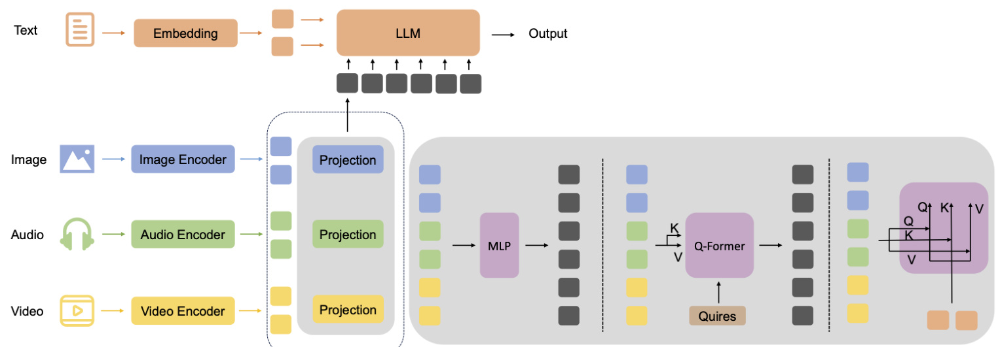

# Multimodal Alignment and Fusion: A Survey  

Songtao Li Hao Tang∗  

Abstract—This survey offers a comprehensive review of recent advancements in multimodal alignment and fusion within machine learning, spurred by the growing diversity of data types such as text, images, audio, and video. Multimodal integration enables improved model accuracy and broader applicability by leveraging complementary information across different modalities, as well as facilitating knowledge transfer in situations with limited data. We systematically categorize and analyze existing alignment and fusion techniques, drawing insights from an extensive review of more than 200 relevant papers. Furthermore, this survey addresses the challenges of multimodal data integration - including alignment issues, noise resilience, and disparities in feature representation - while focusing on applications in domains like social media analysis, medical imaging, and emotion recognition. The insights provided are intended to guide future research towards optimizing multimodal learning systems to enhance their scalability, robustness, and generalizability across various applications.  

Index Terms—Multimodal Alignment, Multimodal Fusion, Multimodality, Machine Learning, Survey  

# INTRODUCTION  

Rapid advancement in technology has led to an exponential increase in the generation of multimodal data, including images, text, audio, and video [1]. This abundance of data presents opportunities and challenges for researchers and practitioners in diverse felds, such as computer vision and natural language processing (NLP). Integrating information from multiple modalities can signifcantly enhance the performance of machine learning models, improving their ability to understand complex, real-world scenarios [2].  

This combination of modalities is generally pursued with two main objectives: (i) Different data modalities can complement each other, thus improving the precision and effectiveness of the model for specifc tasks [3], [4], [5]. (ii) Some modalities may have limited data availability or may be challenging to collect in large quantities; therefore, training in an LLM-based model can leverage knowledge transfer to achieve satisfactory performance in tasks with sparse data [5], [6].  

For example, in social media analysis, combining textual content with related images or videos offers a more comprehensive understanding of user sentiment and behavior [1], [7]. Beyond social networks, multimodal methods have shown promising results in applications such as automated caption generation for medical images, video summarization, and emotion recognition [8], [9], [10], [11], [12]. Despite these advancements, two major technical challenges remain in effectively integrating and utilizing multimodal data: alignment and fusion. Alignment focuses on establishing semantic relationships across different modalities, ensuring that representations from each modality align within a common space. Fusion, on the other hand, integrates multimodal information into unifed predictions, leveraging the strengths of each modality to improve overall model performance.  

The frst component, multimodal alignment, involves establishing relationships across different modalities [1], [49], [50], [51]. For example, aligning action steps in videos with corresponding textual descriptions requires sophisticated methods due to variations in input-output distributions and the possibility of conficting information between modalities [52]. Multimodal alignment can be broadly categorized into explicit and implicit methods [1], [53]. Explicit alignment directly measures inter-modal relationships using similarity matrices, whereas implicit alignment serves as an intermediate step in tasks like translation or prediction.  

The second component, multimodal fusion, involves combining information from different modalities to make unifed predictions, while addressing challenges such as noise variability and reliability differences between modalities [1], [54], [55]. Traditionally, fusion methods are classifed based on the stage in the data processing pipeline at which they occur [53], [56]. For example, early fusion integrates data from multiple modalities in the feature extraction stage, capturing inter-modal interactions early on [56]. This survey focuses on the core characteristics of current fusion technologies to represent modern methodologies more effectively and guide future advancements. We analyze fusion methods within kernel-based, graphical, encoder-decoder, and attention-based fusion frameworks.  

Figure 1 illustrates three typical structures of multimodal models. In (a), simple operations fail to achieve deep and effective fusion due to insuffcient interaction between modalities. In (b), despite the design of a dedicated fusion network, the alignment issue remains signifcant. Specifcally, features derived from images and text by their respective modality-specifc models may not be semantically aligned, and directly passing these features to the fusion module may not yield optimal results. In (c), models use a shared encoder or an integrated encoding-decoding process to handle multimodal inputs simultaneously. This allows image and text data to be transformed into a common representation space, making it easier to combine them more naturally. Such designs typically prioritize model simplicity and effciency, especially when relationships between modalities are well understood and effectively modeled.  

  
Fig. 1: Overview of multimodal model architectures: (a) Two-Tower [13], [14], [15], [16], [17], [18], [19], [20], [21], [22], [23], [24]: processes images and text separately, combining embeddings through simple operations (add, multiple, dot product and concatenate); (b) Two-Leg [25], [26], [27], [28], [29], [30], [31], [32], [33], [34], [35], [36], [37], [38], [39]: combines separate image and text embeddings using a Fusion Network; (c) One-Tower [12], [40], [41], [42], [43], [44], [45], [46], [47], [48]: utilizes a unifed network to jointly embed image and text inputs.  

This research aims to contribute to the feld by providing a comprehensive overview of existing methods, recent advances, and potential future directions, based on a review of over 200 relevant papers. The survey helps researchers understand fundamental concepts, key methodologies, and current progress in multimodal alignment and fusion, with a focus on visual and language modalities, as well as extending to other types such as video and audio.  

The organization of this survey is as follows. Section 2 presents an overview of the foundational concepts in multimodal learning, including recent advances in large language models (LLMs) and vision models, laying the groundwork for discussions on fusion and alignment. Section 3 focuses on why to conduct survey on alignment and fusioin. Section 4 examines alignment methods, focusing on both explicit and implicit techniques for establishing relationships across different modalities. Section 5 explores fusion strategies, categorizing them into early, late, and hybrid fusion, and introduces advanced methods such as kernel-based, graphical, and attention-based fusion frameworks. Section 6 addresses key challenges in multimodal fusion and alignment, including feature alignment, computational effciency, data quality, and scalability. Finally, Section 7 outlines the potential directions for future research and discusses practical implications, with the aim of guiding further innovation in the feld.  

# 2 PRELIMINARIES  

This section provides a brief overview of key topics and concepts to enhance the understanding of our work.  

# 2.1 MLLM  

Recently, both natural language processing (NLP) and computer vision (CV) have experienced rapid development, especially since the introduction of attention mechanisms and the Transformer [57], [58], [59], [60], [61], [62]. Building on this framework, numerous large language models (LLMs) have emerged, such as OpenAI’s GPT series [63], [64], [65] and Meta’s Llama series [66]. Similarly, in the vision domain, large vision models (LVMs) have been proposed, including Segment Anything [67], DINO [68], and DINOv2 [69].  

However, these LLMs struggle to understand visual information and handle other modalities, such as audio or sensor inputs, while LVMs have limitations in reasoning [70]. Given their complementary strengths, LLMs and LVMs are increasingly being combined, leading to the emergence of a new feld called Multimodal Large Language Models (MLLMs). To extend the strong performance of LLMs in text processing to tasks involving other modalities, signifcant research efforts have been dedicated to developing largescale multimodal models.  

To extend the strong performance of LLMs in text processing to tasks involving other modalities, signifcant research efforts have focused on the development of largescale multimodal models [71]. Kosmos-2 [72] introduces grounding capabilities by linking textual descriptions with visual contexts, allowing more accurate object detection and phrase recognition. PaLM-E [73] further integrates these capabilities into real-world applications, using sensor data for embodied tasks in robotics, such as sequential planning and visual question answering. Additionally, models like ContextDET [74] excel in contextual object detection, overcoming previous limitations in visual-language association by directly linking visual elements to language inputs.  

Several models have adopted a hierarchical approach to managing the complexity of multimodal data. For example, SEED-Bench-2 benchmarks hierarchical MLLM capabilities, providing a structured framework to evaluate and improve model performance in both perception and cognition tasks [75]. Furthermore, X-LLM enhances multimodal alignment by treating each modality as a “foreign language”, allowing a more effective alignment of audio, visual, and textual inputs with large language models [76].  

As MLLMs continue to evolve, foundational frameworks such as UnifedVisionGPT enable the integration of multiple vision models into a unifed platform, accelerating advancements in multimodal AI [77]. These frameworks demonstrate the potential of MLLMs to not only leverage vast multimodal datasets but also adapt to a wide range of tasks, representing a signifcant step toward achieving artifcial general intelligence.  

# 2.2 Multimodal Data  

# 2.2.1 Multimodal Dataset  

Different modalities offer unique characteristics. For example, images provide visual information, but are susceptible to variations in lighting and viewpoint [93]. The text data are linguistically diverse and may contain ambiguities [94]. Audio data conveys emotional content and other non-verbal cues [1].  

Multimodal datasets are foundational for training vision-language models (VLMs) by providing large-scale paired image-text data that enable model learning across various tasks, such as image captioning, text-to-image retrieval, and zero-shot classifcation. Key datasets include LAION-5B, WIT, and newer specialized datasets like RS5M, which target specifc domains or challenges within multimodal learning. Table 1 summarizes the commonly used datasets and their characteristics.  

For example, the LAION-5B dataset contains more than 5 billion CLIP-fltered image-text pairs, enabling researchers to fne-tune models such as CLIP and GLIDE, supporting open-domain generation and robust zero-shot classifcation tasks [90]. The WIT (Wikipedia-based Image Text) dataset, with more than 37 million image-text pairs in 108 languages, is designed to support multilingual and diverse retrieval tasks, focusing on cross-lingual understanding [87]. The RS5M dataset, which consists of 5 million remote sensing image-text pairs, is optimized for domain-specifc learning tasks such as semantic localization and vision-language retrieval in geospatial data [92]. Furthermore, fne-grained datasets like ViLLA are tailored to capture complex regionattribute relationships, which are critical for tasks such as object detection in medical or synthetic imagery [95].  

# 2.2.2 Characteristics and Challenges  

Each modality in multimodal learning presents unique challenges. For example, image data often face issues such as lighting variations, occlusions, and perspective distortions, which can affect a model’s ability to recognize objects and scenes under varying conditions [96]. Text data bring complexities due to the variability of natural language, including ambiguity, slang, and polysemy, which complicate accurate interpretation and alignment with other modalities [94]. Similarly, audio data is susceptible to background noise, reverberation, and environmental interference, which can distort the intended signal and reduce model accuracy [97].  

To address these challenges, specifc loss functions are employed in multimodal learning to optimize both representations and alignments. Notable examples include:  

• Contrastive Loss, commonly used in tasks such as image-text matching, aims to bring semantically similar pairs closer in the embedding space while pushing dissimilar pairs apart. This approach improves the representation of multimodal features and is particularly effective in handling noisy data [13], [98], [99]. • Cross-Entropy Loss, a widely used classifcation loss, calculates the divergence between predicted and true probability distributions, enabling label-driven learning across modalities. It is fundamental in supervised classifcation tasks, and variants such as set cross-entropy offer greater fexibility for multimodal tasks by handling multiple target answers [100], [101]. Reconstruction Loss, used in autoencoders and multimodal fusion tasks, aims to reconstruct input data or mask noise, making models more resilient to modalityspecifc distortions. This type of loss is essential for multimodal tasks requiring robust feature alignment and noise resilience, such as visual-textual and audiovisual fusion [102]. • Angular Margin Contrastive Loss (AMC-Loss) introduces geometric constraints to enhance angular separation between classes, leading to clearer class boundaries in embedding spaces. This loss function has proven to be effective in improving both the quantitative accuracy and Building on traditional contrastive loss, supervised contrastive loss combines elements of contrastive and cross-entropy losses to leverage labeled data, enhancing performance and stability, particularly in challenging multimodal conditions [104], [105].  

# 3 WHY ALIGNMENT AND FUSION  

Alignment and fusion are two fundamental concepts in multimodal learning that, while distinct, are deeply interconnected and often mutually reinforcing [1], [50]. Alignment involves ensuring that the different modalities are properly matched and synchronized, making the information they convey coherent and suitable for integration. Fusion, on the other hand, refers to combining information from different modalities to create a unifed representation that captures the essence of the data in a comprehensive way [1], [54], [55]. Furthermore, many recent methods fnd it challenging for fusion without alignment process [49].  

# 3.1 Enhancing Comprehensiveness and Robustness  

Alignment ensures that data from different sources are synchronized in terms of time, space, or context, enabling a meaningful combination. Without proper alignment, the fusion process can result in misinterpretations or loss of crucial information [53].  

Once alignment is achieved, fusion utilizes the aligned data to produce a more robust and comprehensive representation [49]. By integrating multiple perspectives, fusion mitigates the weaknesses of individual modalities, leading to improved accuracy and reliability.  

TABLE 1: Overview of different datasets’ characteristics.   

<html><body><table><tr><td>Dataset</td><td>|Size</td><td>Language</td><td>Modalities</td><td>Features</td></tr><tr><td>SBU Captions [78]</td><td>1M</td><td>English</td><td>Image-Text</td><td>More unique words than CC-3M but fewer captions.</td></tr><tr><td>MS-COCO [79]</td><td>1.64M</td><td>English</td><td>Image-Text</td><td>Created by having crowd workers provide captions for im- ages.</td></tr><tr><td>YFCC-100M [80]</td><td>100M</td><td>English</td><td>Image-Text</td><td>Contains 100 million image-text pairs, unclear average match</td></tr><tr><td>YFCC-15M [80]</td><td>15M</td><td>English</td><td>Image-Text</td><td>degree between text and image. Subset of YFCC-100M cleaned by Redford et al.</td></tr><tr><td>Flickr30k [81]</td><td>30k</td><td>English</td><td>Image-Text</td><td>Created by having crowd workers provide captions for ap- proximately 30,000 images.</td></tr><tr><td>Visual Genome[82]</td><td>5.4M</td><td>English</td><td>Image-Text</td><td></td></tr><tr><td>Conceptual Captions[83]</td><td>一</td><td>English</td><td>Image-Text</td><td>tions, object instances, relationships,etc. Approximately three times more captions than SBU but fewer unique words.</td></tr><tr><td>MulRan [84]</td><td></td><td></td><td>Point Clouds</td><td>Multimodal range dataset for radar and lidar data targeting urbanenvironments.Provides 6Dbaselinetrajectoriesfor place recognition ground truth. Captures temporal and struc- tural diversity of place recognition based on range sensors.</td></tr><tr><td>RedCaps [85]</td><td>12.01M</td><td>English</td><td>Image-Text</td><td>Distributed across 350 subreddits with a long-tail distribu- tion. Contains the distribution of visual concepts encountered by humans in everyday life without predefined object class ontologies. Higher linguistic diversity compared to other</td></tr><tr><td>CC-12M [86]</td><td>12.4M</td><td>English</td><td>Image-Text</td><td>datasets like CC-3M and SBU. Lower linguistic diversity compared to RedCaps.</td></tr><tr><td>WIT [87] CLIP [13]</td><td>37.6M 400M</td><td>Multilanguage English</td><td>Image-Text</td><td>Subset of multilingual Wikipedia image-text dataset. Not publicly released.</td></tr><tr><td>TaiSu [88]</td><td>166M</td><td>Chinese</td><td>Image-Text Image-Text</td><td>TaiSu is a large-scale, high-quality Chinese cross-modal</td></tr><tr><td></td><td></td><td></td><td></td><td>dataset containing 166 million images and 219 million Chinese captions, designed for vision-language pre-training.</td></tr><tr><td>COYO-700M[89] LAION-5B [90]</td><td>700M</td><td>English</td><td>Image-Text</td><td>Collection of 700 million informative image-alt text pairsfrom HTML documents.</td></tr><tr><td></td><td>5.85B</td><td>English</td><td>Image-Text</td><td>LAION-5B is a publicly available, large-scale dataset contain- ing over 5.8 billion image-text pairs filtered by CLIP, designed</td></tr><tr><td>LAION-2B [90]</td><td>2.3B</td><td>English</td><td>Image-Text</td><td>for training the next generation of image-text models. Subset of 2.32 billion English pairs from LAION-5B.</td></tr><tr><td>LAION-COCO [90]</td><td>600M</td><td>English</td><td>Image-Text</td><td>Subset of 600 million images and synthetic captions from LAION-5B.</td></tr><tr><td>LAION-A [90]</td><td>900M</td><td>English</td><td>Image-Text</td><td>Subset of 900 million from LAION-2B, filtered aesthetically and deduplicated using pHash.</td></tr><tr><td>DATACOMP-1B[91]</td><td>1.4B</td><td>English</td><td>Image-Text</td><td>Collected from Common Crawl using simplefiltering.Models trained on this dataset achieve higher accuracy using fewer MACs compared to previous results.</td></tr><tr><td>RS5M [92]</td><td>5M</td><td>English</td><td>Image-Text</td><td>The RS5M dataset is a large-scale remote sensing image-text paired dataset, containing 5 million remote sensing images alongside corresponding English descriptions.</td></tr></table></body></html>  

# 3.2 Addressing Data Sparsity and Imbalance  

In many real-world applications, data from certain modalities may be scarce or challenging to obtain. Alignment helps synchronize the available data, even if limited, to ensure it can be effectively utilized [106], [107].  

Fusion then enables knowledge transfer between modalities, allowing the model to leverage the strengths of one modality to compensate for the weaknesses of another. This is particularly benefcial in scenarios where one modality has abundant data, while another is limited.  

# 3.3 Improving Model Generalization and Adaptability  

Alignment ensures that the relationships between different modalities are well understood and accurately modeled, which is crucial for the model’s ability to generalize across various contexts and applications [1], [53].  

Fusion improves the model’s adaptability by creating a unifed representation that captures the nuances of the data more effectively. This unifed representation can be more easily adapted to new tasks or environments, enhancing the model’s overall fexibility [1], [53].  

# 3.4 Enabling Advanced Applications  

Alignment and fusion together enable advanced applications such as cross-modal retrieval, where information from one modality (e.g., text) is used to search for relevant information in another modality (e.g., images) [108]. These processes are also crucial for tasks like emotion recognition [109], where combining visual and auditory cues provides a more accurate understanding of human emotions compared to using either modality alone.  

# 4 MULTIMODAL ALIGNMENT  

Multimodal alignment involves establishing semantic relationships between two or more different modalities. It has been widely studied in various felds, including network alignment [110], image fusion [50], and feature alignment in multimodal learning [111].  

To align different modalities with the same semantic representation, the similarity between these modalities is measured, accounting for potential long-range dependencies and ambiguities. Simply put, the goal is to construct a mapping that aligns representations from one modality to corresponding representations in another modality that share the same semantics. According to [1], alignment can be categorized into two types: implicit and explicit. Explicit alignment typically involves using similarity matrices to directly measure similarities, while implicit alignment is often an intermediate step for tasks such as translation or prediction.  

# 4.1 Explicit Alignment  

Explicit alignment has an early foundation, often relying on statistical methods such as Dynamic Time Warping (DTW) [112], [113] and Canonical Correlation Analysis (CCA) [114]. DTW measures the similarity between two sequences by fnding an optimal match through time warping, which involves inserting frames to align the sequences [112]. However, the original DTW formulation requires a predefned similarity metric, so it has been extended with Canonical Correlation Analysis (CCA), introduced by Harold Hotelling in 1936 [114], to project two different spaces into a common space through linear transformations. The goal of CCA is to maximize the correlation between the two spaces by optimizing the projection. CCA facilitates both alignment (through DTW) and joint learning of the mapping between modalities in an unsupervised manner, as seen in multimodal applications such as video-text and video-audio alignment. Figure 2 visualizes the CCA method. Specifcally, the objective function of CCA can be expressed as:  

$$
\operatorname*{max}\rho=\operatorname{corr}(u^{T}X,v^{T}Y),
$$  

# where:  

$X$ and $Y$ are the data matrices from two different spaces;   
• $u$ and $v$ are the linear transformation vectors (or canonical vectors) that project $X$ and $Y$ into the common space;   
• $\rho$ is the correlation coeffcient between the projections $u^{T}X$ and $v^{T}Y$ ;   
• The goal is to fnd $u$ and $v$ that maximize the correlation $\rho$ between the projected data.  

However, CCA can only capture linear relationships between two modalities, limiting its applicability in complex scenarios involving non-linear relationships. To address this limitation, Kernel Canonical Correlation Analysis (KCCA) was introduced to handle non-linear dependencies by mapping the original data into a higher-dimensional feature space using kernel methods [115], [116]. Extensions such as multi-label KCCA and Deep Canonical Correlation Analysis (DCCA) further improved upon the original CCA method [115], [116], [117], [118], [119].  

Additionally, Verma and Jawahar demonstrated that multimodal retrieval could be achieved using Support Vector Machines (SVMs) [120]. Furthermore, methods such as linear mapping between feature modalities for image alignment have been developed to address multimodal alignment through complex spatial transformations [121].  

# 4.2 Implicit Alignment  

  
Fig. 2: Canonical Correlation Analysis (CCA), a classic alignment method, aligns different sample matrices with varying feature dimensions using a shared weight matrix to produce a unifed representation.  

Implicit alignment refers to methods used as intermediate steps, often in a latent manner, during the execution of a primary task. Rather than directly aligning data from different modalities, these methods improve the performance of the primary task by learning a shared latent space. Implicit alignment techniques can be broadly categorized into two types: graphical model-based methods and neural networkbased methods.  

# 4.2.1 Graphical Model-Based Methods  

The integration of graph structures allows for better modeling of complex relationships between different modalities, enabling more accurate and effcient processing of multimodal data. Such methods are commonly applied in aligning images with text or images with signals. For instance, certain models enable few-shot in-context imitation learning by aligning graph representations of objects, allowing robots to perform tasks on new objects without prior training [122]. The GraphAlignment algorithm, based on an explicit evolutionary model, demonstrates robust performance in identifying homologous vertices and resolving paralogs, outperforming alternatives in specifc scenarios [123]. Figure 3 illustrates how graphs are used in alignment.  

A signifcant challenge in these tasks is aligning implicit information across modalities, where multimodal signals do not always correspond directly to one another. Graph-based models have proven effective in addressing this challenge by representing complex relationships between modalities as graphs, where nodes represent data elements (e.g., words, objects, or frames) and edges represent relationships (e.g., semantic, spatial, or temporal) between them.  

Recent studies have explored various aspects of multimodal alignment using graph structures. For instance, Tang et al. [124] introduced a graph-based multimodal sequential embedding approach to improve sign language translation. By embedding multimodal data into a unifed graph structure, their model better captures complex relationships.  

Another application is in sentiment analysis, where implicit multimodal alignment plays a crucial role. Yang et al. [125] proposed a multimodal graph-based alignment model (MGAM) that jointly models explicit aspects (e.g., objects, sentiment) and implicit multimodal interactions (e.g., image-text relations).  

  
Fig. 3: In graph-based alignment, different data modalities can form graphs with distinct meanings, where the interpretation of edges and nodes may vary. For example, in [123], the interpretation of vertices and edges depends on the type of biological networks being compared.  

In the domain of embodied AI, Song et al. [126] explore how scene-driven knowledge graphs can be constructed to model implicit relationships in complex multimodal tasks. Their work integrates both textual and visual information into a knowledge graph, where multimodal semantics are aligned through graph-based reasoning. Aligning implicit cues, such as spatial and temporal relationships between objects in a scene, is crucial for improving decision-making and interaction in embodied AI systems.  

For named entity recognition (NER), Zhang et al. [127] propose a token-wise graph-based approach that incorporates implicit visual information from images associated with text. This method leverages spatial relations in the visual domain to improve the identifcation of named entities, which are often ambiguous when using isolated textual data.  

In tasks such as image captioning and visual question answering (VQA), scene graphs also play a crucial role. Xiong et al. [128] introduce a scene graph-based model for semantic alignment across modalities. By representing objects and their relationships as nodes and edges in a graph, the model improves the alignment of visual and textual modalities.  

In summary, graph-based methods provide a powerful framework for representing diverse data types and have great potential for multimodal alignment. However, this fexibility also presents signifcant challenges.  

The sparsity and dynamic nature of graph structures complicate optimization. Unlike matrices or vectors, graphs have irregular unstructured connections, leading to high computational complexity and memory constraints. These issues persist even with advanced hardware platforms. Additionally, Graph Neural Networks (GNNs) are particularly sensitive to hyperparameters. Choices related to network architecture, graph sampling, and loss function optimization directly impact performance, increasing the diffculty of GNN design and practical deployment.  

# 4.2.2 Neural Network-Based Methods  

In recent years, neural network-based methods have become the predominant approach to addressing implicit alignment problems. Particularly in tasks like translation, incorporating alignment as a latent intermediate step often yields better results. Common neural network approaches include encoder-decoder models and cross-modal retrieval. When translation is performed without implicit alignment, it places a heavier burden on the encoder, requiring it to summarize the entire image, sentence, or video into a vector representation.  

One popular solution is the use of attention mechanisms that enable decoders to focus on specifc subcomponents of the source instances. This contrasts with traditional encoder-decoder models that encode all source subcomponents together. Attention modules guide decoders to focus more on specifc subcomponents of the source being translated—such as regions of an image, words in a sentence, segments of audio, frames in a video, or parts of instructions. For example, in image caption generation, attention mechanisms allow decoders (typically recurrent neural networks) to focus on specifc parts of an image when generating each word, instead of encoding the entire image at once [129]. Previous works have achieved this by designing modality-specifc embedders and predictors to interface with the pretrained model from input to output.  

Generative adversarial networks (GANs) have been successfully applied to the synthesis of multimodal data due to their ability to learn complex mappings between highdimensional data spaces [130], [131], [132], [133], [134]. For example, in MRI modalities, using a unifed framework in which a single generator learns mappings across modalities can improve alignment accuracy across multiple data types [130].  

Another deep generative method, C-Flow, utilizes normalizing fows for multimodal alignment in tasks such as 3D point cloud reconstruction, allowing for more granular control over the generation process [135]. Autoencoders and their variants, such as Variational Autoencoders (VAEs), have also been employed to learn latent representations that capture the underlying semantic structures across modalities. This approach has proven effective in compositional representation learning, where VAEs help align image and text modalities by mapping them to a shared latent space [136]. Similarly, multimodal image-text pair generation using cross-modal quantization with VAEs demonstrates how neural networks can align textual and visual data by learning quantized joint representations [137].  

Furthermore, semi-supervised manifold alignment methods, such as Diffusion Transport Alignment (DTA), leverage a small amount of prior knowledge to align multimodal data domains with distinct but related structures [138]. This approach is particularly useful in situations where only partial data alignment is possible, as it relies on geometric similarities between domains.  

In recent developments, the Att-Sinkhorn method, which combines the Sinkhorn metric with attention mechanisms, has demonstrated improved accuracy in multimodal feature alignment by addressing the optimal transport problem between probability distributions of different modalities [139].  

In summary, both explicit and implicit alignment techniques are crucial in the feld of multimodal machine learning. Although explicit methods provide a clear framework for measuring similarity and establishing correspondences, implicit methods are often more fexible and can adapt to a wider range of scenarios, particularly those involving complex or ambiguous data relationships. Future research will likely continue to explore hybrid approaches that combine the strengths of both alignment strategies to address the various challenges presented by multimodal data [110], [111], [139].  

# 5 MULTIMODAL FUSION  

Multimodal data involves the integration of various types of information, such as images, text, and audio, which can be processed by machine learning models to improve performance across numerous tasks [1], [53], [140], [141], [142], [143]. By combining different types of information, multimodal fusion leverages the strengths of each modality while addressing the weaknesses or gaps that might arise from relying on a single type of data [1], [53], [144]. For instance, each modality may contribute differently to the fnal prediction, with one being potentially more informative or less noisy than the others at any given time.  

Fusion methods are crucial for effectively combining information from different modalities. In earlier approaches, images and text were often processed separately, with only basic integration between the two data types. Architectures like CLIP [13] utilized a dual-encoder framework in which visual and textual information were encoded independently, and their interactions were handled through simple operations, typically involving dot product computations [145], [146]. Consequently, the fusion of these two modalities played a relatively minor role in the overall model architecture, which was dominated by the encoders themselves. While this limited integration strategy was effective for retrieval-based tasks [147], [148], it falls short for more sophisticated multimodal challenges that require deep understanding and interaction between modalities [149], [150].  

If robust performance could be achieved simply by independently training specialized encoders for each modality followed by superfcial integration [4], [151], the need for deep multimodal learning would be questionable. However, empirical evidence suggests that for tasks requiring nuanced understanding—such as visual question answering and visual reasoning—a more complex and deeper fusion of both modalities is essential to adequately capture the interrelationships between visual perception and linguistic processing [152].  

Traditionally, fusion methods have been categorized based on the stage in the data processing pipeline where fusion occurs. Early fusion integrates data at the feature level, late fusion does so at the decision level, and hybrid fusion combines aspects of both [1], [53].  

  
Fig. 4: Three types of encoder-decoder fusion: (1) Data-level Fusion: directly combines raw data from multiple modalities; (2) Feature-level Fusion: integrates encoded features from each modality; (3) Model-level Fusion: fuses outputs from individual modality decoders to produce a fnal result.  

Early fusion involves merging data from different modalities at the feature extraction stage [56], allowing interactions between modalities to be captured early. As Zhao et al. [93] explain, integration occurs at the feature level. In contrast, late fusion combines the outputs of individual modality models at the decision stage, which is advantageous when one or more modalities are missing during prediction, as demonstrated by Morvant et al. [153]. Hybrid fusion integrates aspects of both early and late fusion, and Zhao et al. explore its implementation in deep learning contexts [93].  

As technology and fusion techniques evolve, distinguishing between early, late, and hybrid fusion has become increasingly complex. Advanced methods often go beyond traditional timing-based categories, operating simultaneously at both the feature and decision levels, which challenges rigid classifcations.  

To address this complexity, we propose a new classifcation framework based on the core characteristics of current fusion technologies, providing a more accurate representation of modern methods and guiding future advancements. Notably, while many attention-based methods could ft within encoder-decoder or encoder-only frameworks, we categorize them separately due to their recent, signifcant development and unique innovations, which are not adequately captured by conventional categories.  

# 5.1 Encoder-Decoder Fusion  

The encoder-decoder fusion architecture involves an encoder that captures essential features from the input data and compresses them into a compact form, while the decoder reconstructs the output from this compressed representation [26].  

In this architecture, the system is primarily composed of two major components: the encoder and the decoder. The encoder typically functions as a high-level feature extractor, transforming the input data into a latent space of signifcant features [26], [37]. In other words, the encoding process preserves important semantic information while reducing redundancy. Once the encoding step is complete, the decoder generates a corresponding ”reconstructed” output based on the latent representation [26], [31]. In tasks like semantic segmentation, the decoder’s output is usually a semantic label map that matches the size of the input.  

Encoder-decoder fusion typically takes three forms: (1) Data-level fusion, where raw data from different modalities is concatenated and fed into a shared encoder; (2) Featurelevel fusion, where features are extracted separately from each modality, possibly including intermediate layers, and then combined before being input into the decoder; and (3) Model-level fusion, where outputs of individual modalityspecifc models are concatenated after processing. Figure 4 illustrates these three types of encoder-decoder fusion structures. Feature-level fusion is often the most effective, as it considers the relationships between different modalities, enabling deeper integration rather than a superfcial combination.  

# 5.1.1 Data-level Fusion  

In this method, data from each modality or processed data from each modality’s unique preprocessing steps are combined at the input level [27]. After this integration, the unifed input from all modalities is passed through a single encoder to extract higher-level features. Essentially, data from different modalities is merged at the input stage, and a single encoder is used to extract comprehensive features from the multimodal information.  

Recent research has focused on data-level fusion to improve object detection and perception in autonomous vehicles. Studies have explored fusing camera and LiDAR data at the early stages of neural network architectures, demonstrating enhanced 3D object detection accuracy, particularly for cyclists in sparse point clouds [35]. A YOLObased framework that jointly processes raw camera and LiDAR data showed a $5\%$ improvement in vehicle detection compared to traditional decision-level fusion [27]. Additionally, an open hardware and software platform for low-level sensor fusion, specifcally leveraging raw radar data, has been developed to facilitate research in this area [36]. These studies highlight the potential of raw-data-level fusion to exploit inter-sensor synergies and improve overall system performance.  

# 5.1.2 Feature-level Fusion  

The concept behind this fusion technique is to combine data from multiple levels of abstraction, allowing features extracted at different layers of hierarchical deep networks to be utilized, ultimately enhancing model performance. Many applications have implemented this fusion strategy [32], [163].  

Feature-level fusion has emerged as a powerful approach in various computer vision tasks. It involves combining features at different levels of abstraction to improve performance. For instance, in gender classifcation, a two-level hierarchy that fused local patches proved effective [163]. For salient object detection, a network that hierarchically fused features from different VGG levels preserved both semantic and edge information [30]. In multimodal affective computing, a ”divide, conquer, and combine” strategy explored both local and global interactions, achieving stateof-the-art performance [32]. For adaptive visual tracking, a Hierarchical Model Fusion framework was developed to update object models hierarchically, guiding the search in parameter space and reducing computational complexity [33]. These approaches demonstrate the versatility of hierarchical feature fusion across various domains, showcasing its ability to capture both fne-grained and high-level information for improved performance in complex visual tasks.  

# 5.1.3 Model-level Fusion  

Model-level fusion is a technique that improves accuracy in various applications by integrating the outputs from multiple models. For example, in landmine detection using Ground Penetrating Radar (GPR), Missaoui et al. [34] demonstrated that fusing Edge Histogram Descriptors and Gabor Wavelets through a multi-stream Continuous Hidden Markov Model (HMM) outperformed individual features and equal-weight combinations.  

In multimodal object detection, Guo and Zhang [28] applied fusion methods such as averaging, weighting, cascading, and stacking to combine the results from models processing images, speech, and video, thereby improving performance in complex environments. For Facial Action Unit (AU) detection, Jaiswal et al. [29] found that modellevel fusion using Artifcial Neural Networks (ANNs) was more effective than simple feature-level approaches.  

Additionally, for physical systems involving multifdelity computer models, Allaire and Willcox [25] developed a fusion methodology that uses model inadequacy information and synthetic data, resulting in better estimates compared to individual models. In quality control and predictive maintenance, a novel model-level fusion approach outperformed traditional methods, reducing prediction variance by $30\%$ and increasing accuracy by $45\%$ [38]. These studies demonstrate the effectiveness of modellevel fusion across various domains.  

In this section, we review fusion models based on the encoder-decoder architecture. The encoder-decoder framework is an intuitive approach in which an encoder frst extracts features, and then these more expressive representations are used to learn the correlations, enabling interactions between different modalities and integrating features from diverse sources. However, the fusion process in this method often relies on relatively simple operations such as addition or concatenation. Increasingly, researchers are exploring more sophisticated ways to integrate features from different modalities to better reveal the relationships among them. To provide a summary, detailed information on representative models is presented in Table 2.  

TABLE 2: Summary of encoder-decoder models.   

<html><body><table><tr><td>Model</td><td>Year |Category</td><td></td><td>Visual Encoder</td><td>Main Objective</td><td>Method</td></tr><tr><td>Missaoui et al. [34]</td><td>2010</td><td>Model-level</td><td></td><td>Mine Detection</td><td>Processes edge histogram descriptors (EHD) and Gabor wavelets as separate streams using Multi-stream Continuous Hidden Markov Models (MSCHMM).</td></tr><tr><td>Makris et al. [33]</td><td>2011</td><td>Feature-level</td><td></td><td>Visual Target Track ing</td><td>Represents targets hierarchically using mul- tiple models (e.g., keypoints, patches, and contours) and tracks them using particle filters.</td></tr><tr><td>Chen et al. [154]</td><td>2014</td><td>Model-level</td><td>DeepLab</td><td>Road Detection</td><td>Detects roads separately using Deeplab and fuses results using gConditional Random Fields (CRF).</td></tr><tr><td>SegNet [26]</td><td>2017</td><td>Feature-level</td><td>VGG16</td><td>Image Segmenta- tion</td><td>Uses an encoder-decoder structure where the decoder upsamples using max-pooling indices from the encoder.</td></tr><tr><td>SegNet-Basic [26]</td><td>2017</td><td>Feature-level</td><td>VGG16 (Slimmed- down version)</td><td>Image Segmenta- tion</td><td>Smaller version of SegNet for analysis and comparison.</td></tr><tr><td>FCN [155]</td><td>2017</td><td>Feature-level</td><td>VGG16</td><td>Image Segmenta- tion</td><td>Widely used decoding technique but memory-intensive. Processespoint cloud data with PointNet</td></tr><tr><td>PointFusion [156]</td><td>2018</td><td>Model-level</td><td>ResNet, PointNet</td><td>Vehicle Detection</td><td>and image data with ResNet, fusing results using deep fusion module.</td></tr><tr><td>Steinbaeck et al. [36]</td><td>2018</td><td>Data-level</td><td></td><td>Environment Perception</td><td>Integrates ToF and radar data into a com- mon coordinate system for further data pro- cessing and algorithm development.</td></tr><tr><td>Rvid et al. [35]</td><td>2019</td><td>Data-level</td><td></td><td>Autonomous Driv- ing Environment</td><td>Fuses data from camera and LiDAR sen- sors at near-raw data abstraction level to improve 3D object detection accuracy.</td></tr><tr><td>DenseFuse [31]</td><td>2019</td><td>Feature-level</td><td></td><td>Perception Infrared and Visible Light Image Fusion</td><td>Uses encoder-decoder structure with addi- tive and l1-norm strategies to fuse features extractedby encoders.</td></tr><tr><td>HFFN [32]</td><td>2019</td><td>Feature-level</td><td>3D-CNN, Facet</td><td>Multimodal Affect Computation</td><td>Adopts "divide-and-conquer, integrate- and-unify" strategy for multimodal fusion, performing hierarchical fusion considering local and global interactions.</td></tr><tr><td>Uezato et al. [37]</td><td>2020</td><td>Feature-level</td><td></td><td>Image Fusion</td><td>Uses Guided Depth Decoder (GDD) as reg- ularizer which can better utilize multiscale spatial details and semantic features from</td></tr><tr><td>YOLO-RF [27]</td><td>2020</td><td>Data-level</td><td>YOLOv3 (Modified version)</td><td>Vehicle Detection</td><td>guidance images. AddsLiDARreflectanceanddepthmaps as fourth and fifth channels to camera data input into modified YOLOv3.</td></tr><tr><td>WM-YOLO [157]</td><td>2020</td><td>Model-level</td><td>YOLO</td><td>Vehicle Detection</td><td>Performs object detection based on color im- ages and point cloud data separately, com- bining results using weighted averaging.</td></tr><tr><td>HFFNet [30]</td><td>2020</td><td>Feature-level</td><td>VGG</td><td>Salient t Object ：De- tection</td><td>Utilizes Hierarchical Feature Fusion Net- work to combine low-level edge informa- tion and high-level semantic information to</td></tr><tr><td>Guo et al. [28]</td><td>2023</td><td>Model-level</td><td>Faster R-CNN, Op- tical Flow Estima- tion Model</td><td>Multimodal Object Detection and Recognition</td><td>generate saliency maps. Fuses results from image, audio, and video modalities to improve object detection and recognition accuracy.</td></tr><tr><td>121-Mamba [158]</td><td>2024</td><td>Data-level</td><td>CNN</td><td>Improve synthesis performance</td><td>Utilize the sensitivity of SSM to long-range context and the local accuracy of CNNs to concatenate and fuse input images of differ- ent modalities at the data level</td></tr><tr><td>GFE-Mamba [159]</td><td>2024</td><td>Feature-level</td><td>3DGAN-Vit</td><td>Predict disease pro- gression</td><td>Integrate a 3D GAN-Vit model, multimodal Mamba classifier, and pixel-level dual cross- attention mechanism tofuse features of MRI and PET images as well as scale information</td></tr><tr><td>JambaTalk [160]</td><td>2024</td><td>Feature-level</td><td>Jamba (Hybrid Transformer- Mamba Model)</td><td>Enhance animation</td><td>at the feature level Combine the advantagesof Transformer andMamba methods tofuse audiofeatures withfacialfeatures atthefeaturelevel</td></tr><tr><td>UV-Mamba [161]</td><td>2024</td><td>Feature-level</td><td>DCN-enhanced State Space Model</td><td>Improve boundary recognition</td><td>Adopt a Deformable State Space Augmen- tation (DSSA) module to fuse multi-scale features at the feature level Design a plug-and-play decoder that devel-</td></tr><tr><td>PyramidMamba [162]</td><td>2024</td><td>Feature-level</td><td>ResNet18 or Swin- Base</td><td>Enhance multiscale representation</td><td>ops Dense Spatial Pyramid Pooling (DSPP) to encode rich multiscale semantic features, and a Pyramid Fusion Mamba (PFM) to reduce semantic redundancy in multiscale feature fusion, fusing multi-scale features at the feature level</td></tr></table></body></html>  

# 5.2 Kernel-based Fusion  

Kernel-based fusion techniques have gained prominence across various domains for their ability to handle nonlinear relationships and effectively integrate heterogeneous data sources. These methods leverage the kernel trick to map data into higher-dimensional spaces, enabling improved feature representation and analysis [164], [165]. By selecting appropriate kernel functions, such as polynomial kernels or radial basis function kernels, these methods can achieve computational effciency while maintaining model complexity and accuracy.  

Kernel cross-modal factor analysis has been introduced as a novel approach for multimodal fusion, particularly for bimodal emotion recognition [166]. This technique identifes optimal transformations to represent coupled patterns between different feature subsets. In drug discovery, integrating multiple data sources through kernel functions within support vector machines (SVMs) enhances drug-protein interaction predictions [167]. For audio-visual voice activity detection, kernel-based fusion with optimized bandwidth selection outperforms traditional approaches in noisy environments [168]. In multimedia semantic indexing, kernel-based normalized early fusion and contextual late fusion schemes demonstrate improvements over standard fusion methods [169]. For drug repositioning, kernel-based data fusion effectively integrates heterogeneous information sources, outperforming rank-based fusion and providing a unique solution for identifying new therapeutic applications of existing drugs [164].  

Through the use of the kernel trick, these methods achieve computational effciency and improve prediction accuracy by better representing patterns. However, challenges exist, including diffculty in selecting the right kernel and tuning parameters, potential scalability issues with large datasets, reduced interpretability due to higher-dimensional projections, and the risk of overftting if not properly regularized.  

# 5.3 Graphical Fusion  

Graphical models provide a powerful approach for representing and fusing multimodal data, effectively capturing complex relationships between different modalities [170]. These models are particularly useful for handling incomplete multimodal data. For example, the Heterogeneous Graph-based Multimodal Fusion (HGMF) method [171] constructs a heterogeneous hypernode graph to model and fuse incomplete multimodal data. HGMF leverages hypernode graphs to accommodate diverse data combinations without requiring data imputation, enabling robust representations across various modalities [171]. Figure 5 illustrates the construction of hypernodes in [171].  

Graphical fusion methods are increasingly used to combine data from multiple modalities for various applications, such as Alzheimer’s disease (AD) diagnosis and target tracking [172], [173]. For example, in AD diagnosis, heterogeneous graph-based models integrate neuroimaging modalities like MRI and PET, capturing complex brain network structures to improve prediction accuracy [174]. In recommendation systems, heterogeneous graphs enable the effective integration of text, image, and social media data, enhancing the quality of recommendations by capturing multimodal relationships [175]. However, traditional linear combination approaches for multimodal fusion face limitations in capturing complementary information and are often sensitive to modality weights [176].  

  
Fig. 5: Illustration from [171], demonstrating how graph models can effectively fuse modalities, even when some data is missing.  

To address these issues, researchers have developed nonlinear graph fusion techniques that effciently exploit multimodal complementarity [176], [177]. These techniques, such as early fusion operators in heterogeneous graphs, outperform linear approaches by capturing inter-modal interactions and have demonstrated improvements in oneclass learning and multimodal classifcation tasks [178]. For instance, nonlinear fusion methods have shown enhanced classifcation accuracy for AD and its prodromal stage, mild cognitive impairment (MCI) [177].  

Recent advancements include adversarial representation learning and graph fusion networks, which aim to learn modality-invariant embedding spaces and explore multi-stage interactions between modalities [179]. These approaches have demonstrated state-of-the-art performance in multimodal fusion tasks and provide improved visualization of fusion results [172], [179].  

In summary, the feld of graph-based multimodal fusion has advanced signifcantly, moving beyond traditional linear fusion models to more sophisticated nonlinear and adaptive approaches. By leveraging graph structures, these models capture complex, high-order interactions across modalities, making them highly effective for applications in medical diagnosis, social recommendation, and sentiment analysis. With ongoing advancements, graph-based fusion methods hold great promise for handling incomplete, heterogeneous data and driving innovation in AI-powered multimodal applications.  

# 5.4 Attention-based Fusion  

Attention-based fusion is a method that selectively combines information from different sources using attention mechanisms, allowing models to dynamically focus on the most relevant parts of the data during processing [57], [58], [192]. This approach is particularly signifcant in multimodal fusion, where integrating information from multiple modalities is essential for effective information integration.  

  
Fig. 6: Evolution and inheritance relationships of key literature in multimodal fusion. This diagram illustrates the relationships and development paths among various models, originally categorized into visual, textual, multimodal, and object detection-enhanced models. The arrows indicate the infuence or progression from one model to another. Each model’s focus is color-coded to represent its modality, with a legend at the bottom explaining the categories.  

The concept of attention mechanisms gained prominence after Vaswani et al. [57] introduced the Transformer architecture in their groundbreaking work, ”Attention Is All You Need.” Since then, attention mechanisms have become a major topic in the deep learning community due to their ability to model long-range dependencies and improve performance across various tasks.  

In the context of multimodal fusion, attention mechanisms enable models to dynamically weigh the importance of features across different modalities. The attention mechanism operates on inputs consisting of queries (Q), keys (K), and values (V). It computes the dot product of the query with each key, scales the result by $\dot{\sqrt{d_{k}}}$ (where $d_{k}$ is the dimension of the keys), and applies a softmax function to obtain the weights for the values [57]. This operation is formalized as:  

$$
\mathrm{Attention}(Q,K,V)=\mathrm{softmax}\left(\frac{Q K^{\top}}{\sqrt{d_{k}}}\right)V.
$$  

Attention-based fusion is particularly effective in multimodal applications because it can handle the noise and uncertainties inherent in multimodal data [193], [194]. However, this methodology also introduces increased computational complexity and generally requires larger datasets.  

As the representational power of these models grows, the associated computational cost also increases.  

Figure 6 illustrates the relationships among major works related to attention mechanisms and Transformers. Earlier methods, such as OSCAR [185], UNITER [186], VILA [187], and VinVL [188], employed an object detector to extract modality features, followed by a simple fusion process. Later models, like CLIP [13], represented signifcant advancements with their effcient image-text matching capabilities, surpassing earlier object detectors. However, deep fusion of modality features was often overlooked. For instance, CLIP’s interaction between modalities was limited to a simple dot product operation, which hindered its ability to achieve deeper fusion [39].  

To address this limitation, methods focusing on deeper inter-modal interactions were developed, often employing Transformer encoders or other complex architectures to achieve higher-level modality integration [1]. The introduction of the Vision Transformer (ViT) marked a signifcant shift in multimodal learning. ViLT [39] demonstrates the feasibility of performing multimodal tasks without convolutional networks or region supervision, using Transformers exclusively for feature extraction and processing.  

However, the simplistic structure of ViLT led to performance issues, particularly when compared to methods that emphasized deeper inter-modal interactions and fusion [1], [49]. ViLT lagged behind these methods in many tasks, possibly due to dataset bias or the inherent need for stronger visual capabilities [49]. Generally, visual models need to be larger than text models to achieve better results, and the performance degradation was not primarily caused by the lightweight visual embedding strategy.  

  
Fig. 7: Attention-based connectors. This pipeline demonstrates multimodal fusion using a large language model (LLM). Text inputs are embedded and processed by the LLM, while image, audio, and video inputs are encoded, projected into a shared embedding space, and passed through modules such as an MLP and Q-Former. The Q-Former uses attention mechanisms (queries, keys, and values) to align multimodal features before generating a fnal output through the LLM.  

Subsequent works, such as ALBEF [49], introduced more sophisticated model designs. ALBEF emphasized aligning image and text representations before their fusion using a contrastive loss. By employing momentum distillation, it generated pseudo-labels to mitigate challenges posed by noisy datasets. Following this, BLIP [41] adopted a bootstrapping mechanism, using initially generated captions from the model to flter out dataset noise, thereby improving the quality of subsequent training.  

CoCa [190] combined contrastive loss with captioning loss, achieving remarkable performance. In particular, CoCa excelled not only in multimodal tasks, but also achieved a top-1 accuracy of more than $90\%$ on single-modal tasks such as ImageNet classifcation. BEIT-3 [191] further advanced multimodal learning with the implementation of Multiway Transformers, enabling the simultaneous processing of images, text, and image-text pairs. By applying masked data modeling to these inputs, BEIT-3 achieved state-of-theart performance across various visual and vision-language tasks.  

Figure 7 illustrates a common scenario of attention-based fusion. After the encoder extracts features from each modality, a connector maps these features into the text space, where they are processed together by the LLM. Previously, this connector was often a simple MLP, but it can now be a more complex attention mechanism. Recently, researchers have proposed various architectures and techniques aimed at enhancing cross-modal capabilities. They embed adapters into frozen LLMs to facilitate interactions between modalities. Figure 8 shows the basic structure of this approach. The key difference from previous methods is that adapters are embedded directly into the LLMs, allowing for endto-end training with alignment included. For example, the Qwen-VL series models [47] advanced cross-modal learning through the design of visual receptors, input-output interfaces, and a multi-stage training pipeline, achieving notable performance in image and text understanding, localization, and text reading. In video understanding, the ViLA network [195] introduced a learnable text-guided Frame-Prompter and a cross-modal distillation module (QFormer-Distiller) optimized for key frame selection, improving both accuracy and effciency in video-language alignment. Additionally, $\mathrm{CogVLM}$ [196] incorporated visual expertise into pretrained language models using Transformers. In emotion recognition tasks, COLD Fusion added an uncertainty-aware component for multimodal emotion recognition [197].  

  

Various pre-training strategies have been developed to facilitate multimodal fusion. For example, BLIP-2 [42] introduced a bootstrapping approach that used frozen image encoders and large language models for vision-language pre-training, reducing the number of parameters while enhancing zero-shot learning performance. Similarly, the VAST model [198] explored a comprehensive multimodal setup involving vision, audio, subtitles, and text, constructing a large-scale dataset and training a foundational model capable of perceiving and processing all these modalities. Furthermore, the ONE-PEACE model [199] employed a modular adapter design and shared self-attention layers to provide a fexible and scalable architecture that could be extended to more modalities. The research by Zhang et al. [200] used Transformers for end-to-end anatomical and functional image fusion, leveraging self-attention to incorporate global contextual information.  

Despite these advances, the feld still faces several challenges. One of the main challenges is data bias, where inherent biases in training datasets limit model performance. Another concern is maintaining consistency across modalities to ensure coherent information integration without loss or inconsistency. Additionally, as models grow in scale, there is an increasing demand for computational resources, necessitating more effcient algorithms and hardware support. Table 3 summarizes some state-of-the-art (SOTA) or popular attention-based models.  

In conclusion, multimodal fusion remains a dynamic and evolving area of research, driven by advances in attentionbased mechanisms and model architectures. Although signifcant progress has been made in developing models that effectively integrate information from multiple modalities, ongoing challenges such as data bias, modality consistency, and computational demands persist. Continued exploration of new theoretical frameworks and technical solutions is necessary to achieve more intelligent and adaptable multimodal systems, advancing artifcial intelligence technologies, and providing powerful tools for practical applications.  

# 6 CHALLENGES IN MULTIMODAL ALIGNMENT AND FUSION  

# 6.1 Modal Feature Alignment Challenge  

In multimodal learning, aligning visual and linguistic features is a critical task, particularly because earlier models often relied on pre-trained object detection models to extract visual features that were not specifcally tailored for multimodal tasks. This mismatch led to misalignment with textual features [5], which hindered the ability of multimodal encoders to effectively capture robust image-text interactions. For instance, Ma et al. [5] identifed modality misalignment as a signifcant barrier to transferring knowledge across different modalities, emphasizing that pre-trained models frequently struggle with knowledge transfer when there is a substantial semantic gap between modalities.  

Recent approaches aim to address this challenge through innovative methods like noise-injected embeddings. For example, CapDec uses noise injection in CLIP embeddings to mitigate modality gaps, allowing for better alignment in a shared semantic space, even with limited paired data, showing promise in zero-shot learning contexts [209]. Additionally, methods such as Finite Discrete Tokens (FDT) further refne alignment by embedding both images and text into a shared space, reducing the granularity gap that commonly arises from differences between visual patches and textual tokens [210].  

Despite these advancements, the challenge of modality misalignment remains, particularly in complex real-world scenarios where visual and textual features do not naturally align. Models like VT-CLIP attempt to enhance alignment by introducing visual-guided texts, which adaptively explore informative regions in images to better correlate visual and linguistic features. However, these solutions still rely on simplifying assumptions, such as shared embedding spaces, which do not fully capture the diverse semantic interactions across different modalities. This highlights the need for more sophisticated alignment techniques in future research [211].  

# 6.2 Computational Effciency Challenge  

Early multimodal models faced signifcant computational demands due to their reliance on object detectors, particularly during inference. The development of Vision Transformers (ViTs) introduced the use of patch-based visual features instead of bounding boxes, signifcantly reducing computational complexity. However, simply tokenizing textual and visual features remains insuffcient to effectively handle multimodal tasks. Effcient methods for modality fusion, such as attention bottlenecks and exchange-based fusion, are essential to reduce computational costs while maintaining effective modality interaction [212], [213].  

Advanced approaches like TokenFusion have been designed specifcally for transformer-based vision tasks, dynamically replacing uninformative tokens with fused intermodal features to optimize Transformer’s effciency [212]. Similarly, attention bottlenecks during fusion allow models to selectively process critical information across modalities, minimizing computational load without sacrifcing accuracy [213]. Additionally, methods such as PMF (Prompt-based Multimodal Fusion) streamline the fusion process by employing deep-layer prompts within transformers, effectively reducing memory usage while maintaining robust multimodal interaction [214].  

Despite these advances, more research is needed to refne fusion mechanisms and reduce computational requirements as models continue to grow in scale and complexity.  

# 6.3 Data Quality Challenge  

Large-scale multimodal datasets obtained from the Internet, such as image-caption pairs, often contain mismatches or irrelevant content between images and their corresponding texts. This issue arises mainly because these image-text pairs are optimized for search engines rather than for precise multimodal alignment. Consequently, models trained on such noisy data may struggle to generalize effectively. To address this problem, several approaches have been proposed to improve data quality.  

Nguyen et al. [215] tackled noise in web-scraped datasets by using synthetic captions generated through image captioning models. By integrating synthetic descriptions with the original captions, they achieved improvements in data utility across multiple benchmark tasks, demonstrating that improved caption quality can signifcantly beneft model performance. Similarly, CapsFusion [216] introduced a framework that leverages large language models to refne synthetic and natural captions in multimodal datasets, thus improving caption quality and sample effciency for large-scale models. Furthermore, the LAION-5B dataset [90] provides a large collection of CLIP-fltered image-text pairs, showing that combining high data volume with effective fltering can enhance the robustness and zero-shot capabilities of vision language models.  

TABLE 3: Summary of attention-based models.   

<html><body><table><tr><td>Model</td><td></td><td>|Year |Vision Encoder</td><td>|Adapter</td><td>|Used LLM</td><td>[Training Modules</td></tr><tr><td>ViLT [39]</td><td>2021</td><td>ViT</td><td></td><td></td><td>Masked Language Modeling; Image-Text Matching; Word-Patch Alignment</td></tr><tr><td>ALBEF[49]</td><td>2021</td><td>ViT-B/16</td><td></td><td>BERT-base</td><td>Image-Text Contrastive Loss; Image-Text Matching Loss; Masked- Language-Modeling Loss</td></tr><tr><td>Unified-IO [201]</td><td>2022</td><td>VQVAE Encoder (CNN)</td><td></td><td></td><td>Object Segmentation; Visual Ques- tion Answering; Depth Estimation; Object Localization</td></tr><tr><td>BEIT-3 [191]</td><td>2022</td><td>Patch Embeddings</td><td>Multiway Transformer</td><td></td><td>Masked"language" modeling for images, texts, and image-text pairs</td></tr><tr><td>BLIP [41]</td><td>2022</td><td>ViT</td><td></td><td>BERT</td><td>Image-Text Contrastive Loss; Image-Text Matching Loss; Language Modeling Loss</td></tr><tr><td>VLMo [40]</td><td>2022</td><td>Patch Embeddings</td><td>Multiway Transformer</td><td></td><td>Image-Text Contrastive Learning; Masked Language Modeling;</td></tr><tr><td>CoCa [190]</td><td>2022</td><td>ViT</td><td></td><td></td><td>Image-Text Matching Captioning Loss; Contrastive Loss</td></tr><tr><td>MiniGPT-4 [12]</td><td>2023</td><td>ViT-L (EVA-CLIP)</td><td>Single-layer Projection Layer</td><td>Vicuna</td><td>Two-stage training: Stage 1: Freeze visual feature extractor, train pro- jection layer to align visual features with Vicuna; Stage 2:Instruction finetuning on dialogue data</td></tr><tr><td>Qwen-VL [47]</td><td>2023</td><td>ViT-bigG (Openclip)</td><td>Single-layer Cross-Attention</td><td>Qwen-7B</td><td>Stage 1: Image caption generation; Stage 2: Multitask pretraining; Stage</td></tr><tr><td>MiniGPT-v2[202]</td><td>2023</td><td>ViT-L (EVA-CLIP)</td><td></td><td>Vicuna (7B/13B)</td><td>3: Supervised finetuning Multitask learning</td></tr><tr><td>VAST [198]</td><td>2023</td><td>ViT ViT-L/14 (CLIP),</td><td>Q-Former</td><td>BERT</td><td>OM-VCC; OM-VCM;OM-VCG</td></tr><tr><td>BLIP-2 [42]</td><td>2023</td><td>ViT-g/14 (EVA- CLIP)</td><td>(Learnable Query</td><td>OPT, FlanT5</td><td>Stage 1: Vision-Language Represen- tation Learning; Stage 2: Vision-to- Language Generation Learning</td></tr><tr><td>InstructBLIP[43]</td><td>2023</td><td>ViT-L/14 (CLIP)</td><td>Embeddings) Q-Former</td><td>Vicuna (7B/13B)</td><td>Visual Instruction Tuning</td></tr><tr><td>LLaVA [7]</td><td>2023</td><td>Frozen Image En- coder</td><td>一</td><td>GPT-3, GPT-3.5, LLaMA</td><td>Visual Instruction Tuning</td></tr><tr><td>ONE-PEACE [199]</td><td>2023</td><td>hMLP stem</td><td>V-Adapter, A-Adapter, L-Adapter</td><td></td><td>Masked Contrastive Learning</td></tr><tr><td>InternLM- XComposer [203]</td><td>2023</td><td>EVA-CLIP</td><td>LoRA</td><td>InternLM-Chat-7B</td><td>Pre-training, Multi-task Training, Instruction Fine-tuning Three-stage training: 1. Train ViT</td></tr><tr><td>Yi-VL [204]</td><td>2023</td><td>CLIP ViT-H/14</td><td>two-layer MLP</td><td>Yi-Chat</td><td>and projection module 2. Increase image resolution and train ViT and projection module 3. Train the entire model</td></tr><tr><td>Qwen2-VL [46]</td><td>2024</td><td>ViT (improved vision encoder of Qwen-VL)</td><td>Cross-Attention Teacher/Student-</td><td>Qwen-2 Supports Frozen</td><td>Visual Instruction Tuning</td></tr><tr><td>ViLA [195]</td><td>2024</td><td>Frozen visual en- coder</td><td>QFormer, Frame-</td><td>and Finetuned (LoRA) usage JO LLM</td><td>Distillation loss; Visual Question Answering loss</td></tr><tr><td>CAFuser [205] InternLM-</td><td>2024</td><td>Swin Tiny</td><td>Prompter MLP</td><td></td><td>Image-Text Contrastive Loss</td></tr><tr><td>XComposer-2.5</td><td>2024</td><td>OpenAI ViT-L/14</td><td>Partial LoRA</td><td>InternLM2-7B</td><td>Pre-training, Multi-task Training, Instruction Fine-tuning</td></tr><tr><td>[206] MaPPER [207]</td><td>2024</td><td>DINOv2-B/14</td><td>DyPA, LoCA</td><td>BERT-base</td><td>Fine-tuning</td></tr><tr><td>ADEM-VL [208]</td><td>2024</td><td>CLIP</td><td>Cross-Attention</td><td>LLaMA</td><td>Fine-tuning</td></tr></table></body></html>  

Despite these improvements, challenges remain in scalable data fltering and maintaining diversity. For example, DataComp [91] has shown that even with effective fltering, achieving high-quality and diverse representation in large multimodal datasets is complex. It requires ongoing innovation in data pruning and quality assessment to ensure that models trained on these datasets generalize effectively across domains.  

In summary, while synthetic captioning and large-scale fltering methods have improved the quality of multimodal datasets, further advances in scalable fltering techniques and diversity retention are needed to fully address the challenges associated with web-scraped multimodal datasets.  

# 6.4 Scale of Training Datasets Challenge  

Another signifcant challenge in multimodal learning is acquiring suffciently large and high-quality datasets for model training, particularly for combining vision and language tasks. There is a pressing need for extensive and reliable datasets that can be used to train models effectively across a variety of tasks. For instance, the introduction of the LAION-5B dataset, comprising billions of CLIPfltered image-text pairs, has provided a scalable, opensource dataset that supports training and fne-tuning largescale vision-language models, helping democratize access to high-quality data [90]. Similarly, the WIT dataset enables multimodal, multilingual learning by offering a curated, entity-rich dataset sourced from Wikipedia, featuring a high degree of concept and language diversity, which has proven benefcial for downstream retrieval tasks [87].  

Although these datasets represent substantial progress, scalability and data quality remain challenging. For example, [217] proposes compressing vision-language pretraining (VLP) datasets to retain essential information while reducing redundancy and misalignment, resulting in a smaller but higher-quality training set. Additionally, scaling techniques like sparse mixture of experts (MoE) [218] aim to improve the effciency of large models by training specialized sub-models within a unifed framework, balancing compute costs and performance. While these innovations are steps toward addressing data scale and quality challenges, effcient access to diverse and large datasets for multimodal learning remains a diffculty for the research community.  

# 7 CONCLUSION  

Multimodal alignment and fusion offer signifcant potential for advancing machine learning applications by combining the unique strengths of different data modalities. Despite an extensive examination of over 200 academic contributions, the realization of a seamless integration framework continues to be impeded by several critical factors: the complexity of aligning diverse modalities, the variability in data quality, and the substantial computational resources required. Current approaches, such as attention-based mechanisms and encoder-decoder architectures, have laid the foundation for addressing these challenges; however, limitations in managing noisy data and modality misalignment still persist. Future research should focus on developing more adaptive frameworks capable of effciently handling large-scale, heterogeneous datasets, improving model interpretability, and reducing computational costs. By overcoming these challenges, multimodal learning can become more adaptable and effective, advancing artifcial intelligence across increasingly complex real-world scenarios.  

# REFERENCES  

[1] T. Baltrusaitis, C. Ahuja, and L.-P. Morency, “Multimodal machine learning: A survey and taxonomy,” IEEE Transactions on Pattern Analysis and Machine Intelligence, vol. 41, no. 2, 2018. 1, 3, 4, 5, 7, 11, 12   
[2] K. Boehm, P. Khosravi, R. Vanguri, J. Gao, and S. Shah, “Harnessing multimodal data integration to advance precision oncology,” Nature Reviews Cancer, vol. 22, pp. 114–126, 2021. 1   
[3] Y. Li, H. Ding, and H. Chen, “Data processing techniques for modern multimodal models,” arXiv preprint arXiv:2407.19180, 2024. 1   
[4] W. Zhang, J. Yu, Y. Wang, and W. Wang, “Multimodal deep fusion for image question answering,” Knowledge-Based Systems, vol. 212, p. 106639, 2021. 1, 7   
[5] W. Ma, S. Li, L. Cai, and J. Kang, “Learning modality knowledge alignment for cross-modality transfer,” in Proceedings of the 41st International Conference on Machine Learning, ser. Proceedings of Machine Learning Research, vol. 235. PMLR, 21–27 Jul 2024, pp. 33 777–33 793. 1, 13   
[6] P. P. Liang, A. Zadeh, and L.-P. Morency, “Foundations & trends in multimodal machine learning: Principles, challenges, and open questions,” ACM Comput. Surv., vol. 56, no. 10, jun 2024. 1   
[7] H. Liu, C. Li, Q. Wu, and Y. J. Lee, “Visual instruction tuning,” 1A4dvances in neural information processing systems, vol. 36, 2024. 1,   
[8] V. Gabeur, C. Sun, K. Alahari, and C. Schmid, “Multi-modal transformer for video retrieval,” in ECCV, 2020, pp. 214–229. 1   
[9] M. Mahmud, M. Kaiser, A. Hussain, and S. Vassanelli, “Applications of deep learning and reinforcement learning to biological data,” IEEE Transactions on Neural Networks and Learning Systems, vol. 29, pp. 2063–2079, 2017. 1   
[10] K. Chen and Y. Sun, “Llava-med: Medical image understanding with large language models,” IEEE Transactions on Neural Networks and Learning Systems, 2023. 1   
[11] H. Yang and S. Li, “Videochat: Conversational agents in video understanding,” IEEE Transactions on Neural Networks and Learning Systems, 2023. 1   
[12] D. Zhu, J. Chen, X. Shen, X. Li, and M. Elhoseiny, “Minigpt-4: Enhancing vision-language understanding with advanced large language models,” arXiv preprint arXiv:2304.10592, 2023. 1, 2, 14   
[13] A. Radford, J. W. Kim, C. Hallacy, A. Ramesh, G. Goh, S. Agarwal, G. Sastry, A. Askell, P. Mishkin, J. Clark, G. Krueger, and I. Sutskever, “Learning transferable visual models from natural language supervision,” in Proceedings of the 38th International Conference on Machine Learning. PMLR, 2021, pp. 8748–8763. 2, 3, 4, 7, 11   
[14] C. Jia, Y. Yang, Y. Xia, Y.-T. Chen, Z. Parekh, H. Pham, Q. V. Le, Y. Sung, Z. Li, and T. Duerig, “Scaling up visual and visionlanguage representation learning with noisy text supervision,” 2021. 2, 11   
[15] Y. Cui, S. Liang, and Y. Zhang, “Multimodal representation learning for tourism recommendation with two-tower architecture,” PLoS One, 2024. 2   
[16] Y. Vasilakis, R. Bittner, and J. Pauwels, “I can listen but cannot read: An evaluation of two-tower multimodal systems for instrument recognition,” 2024. 2   
[17] X. Xu, C. Wu, S. Rosenman, V. Lal, and W. Che, “Bridgetower: Building bridges between encoders in vision-language representation learning,” in Proceedings of the AAAI Conference on Artifcial Intelligence, 2023. 2   
[18] L. Su, F. Yan, J. Zhu, X. Xiao, and H. Duan, “Beyond two-tower matching: Learning sparse retrievable cross-interactions for recommendation,” in Proceedings of the 46th International ACM SIGIR Conference on Research and Development in Information Retrieval, 2023. 2   
[19] C. Liu, H. Liu, H. Chen, and W. $\mathrm{Du},$ “Touchformer: A transformer-based two-tower architecture for tactile temporal signal classifcation,” IEEE Transactions on Multimedia, 2023. 2   
[20] D. Chen, J. Chen, L. Yang, and F. Shang, “Mix-tower: Light visual question answering framework based on exclusive self-attention mechanism,” Neurocomputing, 2024. 2   
[21] N. Fei, Z. Lu, Y. Gao, G. Yang, Y. Huo, J. Wen, and H. Lu, “Towards artifcial general intelligence via a multimodal foundation model,” Nature Communications, 2022. 2   
[22] H. Wen, H. Zhuang, H. Zamani, A. Hauptmann, and M. Bendersky, “Multimodal reranking for knowledge-intensive visual question answering,” 2024. 2   
[23] J. Tu, X. Liu, R. Lin, Z.and Hong, and M. Wang, “Differentiable cross-modal hashing via multimodal transformers,” in Proceedings of the 30th ACM International Conference on Multimedia, 2022. 2   
[24] S. Yuan, P. Bhatia, B. Celikkaya, H. Liu, and K. Choi, “Towards user friendly medication mapping using entity-boosted twotower neural network,” in International Workshop on Deep Learning for Human Activity Recognition, 2021. 2   
[25] D. L. Allaire and K. E. Willcox, “Fusing information from multifdelity computer models of physical systems,” 2012 15th International Conference on Information Fusion, pp. 2458–2465, 2012. 2, 8   
[26] V. Badrinarayanan, A. Kendall, and R. Cipolla, “Segnet: A deep convolutional encoder-decoder architecture for image segmentation,” IEEE Transactions on Pattern Analysis and Machine Intelligence, vol. 39, pp. 2481–2495, 2015. 2, 8, 9   
[27] G. Danapal, G. A. Santos, J. P. C. L. da Costa, B. J. G. Praciano, and G. P. M. Pinheiro, “Sensor fusion of camera and lidar raw data for vehicle detection,” in 2020 Workshop on Communication Networks and Power Systems (WCNPS), 2020, pp. 1–6. 2, 8, 9   
[28] C. Guo and L. Zhang, “A model-level fusion-based multi-modal object detection and recognition method,” in 2023 7th Asian Conference on Artifcial Intelligence Technology (ACAIT), 2023, pp. 34–38. 2, 8, 9   
[29] S. Jaiswal, B. Mart´ınez, and M. F. Valstar, “Learning to combine local models for facial action unit detection,” 2015 11th IEEE International Conference and Workshops on Automatic Face and Gesture Recognition (FG), vol. 06, pp. 1–6, 2015. 2, 8   
[30] X. Li, D. Song, and Y. Dong, “Hierarchical feature fusion network for salient object detection,” IEEE Transactions on Image Processing, vol. 29, pp. 9165–9175, 2020. 2, 8, 9   
[31] H. Li and X. Wu, “Densefuse: A fusion approach to infrared and visible images,” IEEE Transactions on Image Processing, vol. 28, pp. 2614–2623, 2018. 2, 8, 9   
[32] S. Mai, H. Hu, and S. Xing, “Divide, conquer and combine: Hierarchical feature fusion network with local and global perspectives for multimodal affective computing,” in Annual Meeting of the Association for Computational Linguistics, 2019. 2, 8, 9   
[33] A. Makris, D. I. Kosmopoulos, S. J. Perantonis, and S. Theodoridis, “A hierarchical feature fusion framework for adaptive visual tracking,” Image Vis. Comput., vol. 29, pp. 594–606, 2011. 2, 8, 9   
[34] O. Missaoui, H. Frigui, and P. D. Gader, “Model level fusion of edge histogram descriptors and gabor wavelets for landmine detection with ground penetrating radar,” 2010 IEEE International Geoscience and Remote Sensing Symposium, pp. 3378–3381, 2010. 2, 8, 9   
[35] A. R¨ovid and V. Remeli, “Towards raw sensor fusion in 3d object detection,” 2019 IEEE 17th World Symposium on Applied Machine Intelligence and Informatics (SAMI), pp. 293–298, 2019. 2, 8, 9   
[36] J. Steinbaeck, C. Steger, G. Holweg, and N. Druml, “Design of a low-level radar and time-of-fight sensor fusion framework,” 2018 21st Euromicro Conference on Digital System Design (DSD), pp. 268–275, 2018. 2, 8, 9   
[37] T. Uezato, D. Hong, N. Yokoya, and W. He, “Guided deep decoder: Unsupervised image pair fusion,” in European Conference on Computer Vision, 2020. 2, 8, 9   
[38] Y. Wei, D. Wu, and J. P. Terpenny, “Decision-level data fusion in quality control and predictive maintenance,” IEEE Transactions on 8Automation Science and Engineering, vol. 18, pp. 184–194, 2021. 2,   
[39] W. Kim, B. Son, and I. Kim, “ViLT: Vision-and-language transformer without convolution or region supervision.” 2, 11, 14   
[40] H. Bao, W. Wang, L. Dong, Q. Liu, O. K. Mohammed, K. Aggarwal, S. Som, and F. Wei, “Vlmo: Unifed vision-language pretraining with mixture-of-modality-experts,” 2022. 2, 11, 14   
[41] J. Li, D. Li, C. Xiong, and S. Hoi, “BLIP: Bootstrapping languageimage pre-training for unifed vision-language understanding and generation,” in Proceedings of the 39th International Conference on Machine Learning. PMLR, 2022, pp. 12 888–12 900. 2, 11, 12, 14   
[42] J. Li, D. Li, S. Savarese, and S. Hoi, “Blip-2: Bootstrapping language-image pre-training with frozen image encoders and large language models,” 2023. 2, 11, 12, 14   
[43] W. Dai, J. Li, D. Li, A. M. H. Tiong, J. Zhao, W. Wang, B. Li, P. Fung, and S. Hoi, “Instructblip: Towards general-purpose vision-language models with instruction tuning,” 2023. 2, 11, 14   
[44] H. Chen and T. Xu, “Instructblip 2: Extending vision-language models with fne-grained instruction tuning,” IEEE Transactions on Pattern Analysis and Machine Intelligence, 2023. 2, 11   
[45] Z. Wang, J. Yu, A. W. Yu, Z. Dai, Y. Tsvetkov, and Y. Cao, “Simvlm: Simple visual language model pretraining with weak supervision,” 2022. 2, 11   
[46] P. Wang, S. Bai, S. Tan, S. Wang, Z. Fan, J. Bai, K. Chen, X. Liu, J. Wang, W. Ge, Y. Fan, K. Dang, M. Du, X. Ren, R. Men, D. Liu, C. Zhou, J. Zhou, and J. Lin, “Qwen2-vl: Enhancing visionlanguage model’s perception of the world at any resolution,” 2024. 2, 14   
[47] J. Bai, S. Bai, S. Yang, S. Wang, S. Tan, P. Wang, J. Lin, C. Zhou, and J. Zhou, “Qwen-vl: A versatile vision-language model for understanding, localization, text reading, and beyond,” 2023. 2, 12, 14   
[48] J.-B. Alayrac, J. Donahue, P. Luc, A. Miech, I. Barr, Y. Hasson, K. Lenc, A. Mensch, K. Millican, M. Reynolds, R. Ring, E. Rutherford, S. Cabi, T. Han, Z. Gong, S. Samangooei, M. Monteiro, J. Menick, S. Borgeaud, A. Brock, A. Nematzadeh, S. Sharifzadeh, M. Binkowski, R. Barreira, O. Vinyals, A. Zisserman, and K. Simonyan, “Flamingo: A visual language model for few-shot learning,” in Proceedings of the Conference on Neural Information Processing Systems (NeurIPS 2022), 2022. 2   
[49] J. Li, R. Selvaraju, A. Gotmare, S. Joty, C. Xiong, and S. C. H. Hoi, “Align before fuse: Vision and language representation learning with momentum distillation,” in Advances in Neural Information Processing Systems, vol. 34, 2021, pp. 9694–9705. 1, 3, 11, 12, 14   
[50] A. Akhmerov, A. Vasilev, and A. Vasileva, “Research of spatial alignment techniques for multimodal image fusion,” in Proceedings of the SPIE, vol. 11059, 2019, pp. 1 105 916 – 1 105 916–9. 1, 3, 4   
[51] J. Wu, H. Liu, Y. Su, W. Shi, and H. Tang, “Learning concordant attention via target-aware alignment for visible-infrared person re-identifcation,” in ICCV, 2023. 1   
[52] Y. Li, F.-X. Wu, and A. Ngom, “A review on machine learning principles for multi-view biological data integration,” Briefngs in Bioinformatics, vol. 19, p. 325–340, 2020. 1   
[53] A. Barua, M. U. Ahmed, and S. Begum, “A systematic literature review on multimodal machine learning: Applications, challenges, gaps and future directions,” IEEE Access, vol. 11, pp. 14 804–14 831, 2023. 1, 3, 4, 7   
[54] H. Tian, Y. Tao, S. Pouyanfar, S.-C. Chen, and M.-L. Shyu, “Multimodal deep representation learning for video classifcation,” World Wide Web, vol. 22, pp. 1325–1341, 2019. 1, 3   
[55] S. Shankar, L. Thompson, and M. Fiterau, “Progressive fusion for multimodal integration,” 2022. 1, 3   
[56] C. G. M. Snoek, M. Worring, and A. W. M. Smeulders, “Early versus late fusion in semantic video analysis,” Proceedings of the 13th annual ACM international conference on Multimedia, 2005. 1, 7   
[57] A. Vaswani, N. Shazeer, N. Parmar, J. Uszkoreit, L. Jones, A. N. Gomez, L. Kaiser, and I. Polosukhin, “Attention is all you need.” 2, 10, 11   
[58] S. Islam, H. Elmekki, A. Elsebai, J. Bentahar, N. Drawel, G. Rjoub, and W. Pedrycz, “A comprehensive survey on applications of transformers for deep learning tasks.” 2, 10   
[59] X. Zhang, Z. Xu, H. Tang, C. Gu, W. Chen, S. Zhu, and X. Guan, “Enlighten-your-voice: When multimodal meets zero-shot lowlight image enhancement,” arXiv:2312.10109, 2023. 2   
[60] T. Lin, Y. Wang, X. Liu, and X. Qiu, “A survey of transformers,” AI Open, vol. 3, pp. 111–132, 2022. 2   
[61] X. Zhang, C. Shen, X. Yuan, S. Yan, L. Xie, W. Wang, C. Gu, H. Tang, and J. Ye, “From redundancy to relevance: Enhancing explainability in multimodal large language models,” arXiv preprint arXiv:2406.06579, 2024. 2   
[62] J. Ni, H. Tang, S. T. Haque, Y. Yan, and A. H. Ngu, “A survey on multimodal wearable sensor-based human action recognition,” arXiv preprint arXiv:2404.15349, 2024. 2   
[63] A. Radford, J. Wu, R. Child, D. Luan, D. Amodei, and I. Sutskever, “Language models are unsupervised multitask learners,” 2019. 2   
[64] T. B. Brown, B. Mann, N. Ryder, M. Subbiah, J. Kaplan, P. Dhariwal, and et al., “Language models are few-shot learners.” 2   
[65] OpenAI, J. Achiam, S. Adler, S. Agarwal, L. Ahmad, I. Akkaya, and et al., “GPT-4 technical report.” 2   
[66] A. Dubey, A. Jauhri, A. Pandey, A. Kadian, A. Al-Dahle, A. Letman, and et al., “The llama 3 herd of models.” 2   
[67] A. Kirillov, E. Mintun, N. Ravi, H. Mao, C. Rolland, L. Gustafson, T. Xiao, S. Whitehead, A. C. Berg, W.-Y. Lo, P. Dolla´r, and R. Girshick, “Segment anything,” 2023. 2   
[68] H. Zhang, F. Li, S. Liu, L. Zhang, H. Su, J. Zhu, L. M. $\mathrm{Ni},$ and H.-Y. Shum, “Dino: Detr with improved denoising anchor boxes for end-to-end object detection,” 2022. 2   
[69] M. Oquab, T. Darcet, T. Moutakanni, H. Vo, M. Szafraniec, V. Khalidov, and et al., “Dinov2: Learning robust visual features without supervision,” 2024. 2   
[70] S. Yin, C. Fu, S. Zhao, K. Li, X. Sun, T. Xu, and E. Chen, “A survey on multimodal large language models,” 2024. 2   
[71] H. et al., “Onellm: One framework to align all modalities with language,” in CVPR, 2024. 2   
[72] Z. Peng, W. Wang, L. Dong, Y. Hao, S. Huang, S. Ma, and F. Wei, “Kosmos-2: Grounding multimodal large language models to the world,” 2023. 2   
[73] D. Driess, F. Xia, M. S. M. Sajjadi, C. Lynch, A. Chowdhery, B. Ichter, A. Wahid, J. Tompson, Q. Vuong, T. Yu, W. Huang, Y. Chebotar, P. Sermanet, D. Duckworth, S. Levine, V. Vanhoucke, K. Hausman, M. Toussaint, K. Greff, A. Zeng, I. Mordatch, and P. Florence, “Palm-e: An embodied multimodal language model,” 2023. 2   
[74] Y. Zang, W. Li, J. Han, K. Zhou, and C. C. Loy, “Contextual object detection with multimodal large language models,” 2024. 2   
[75] B. Li, Y. Ge, Y. Ge, G. Wang, R. Wang, R. Zhang, and Y. Shan, “Seed-bench-2: Benchmarking multimodal large language models,” 2023. 3   
[76] F. Chen, M. Han, H. Zhao, Q. Zhang, J. Shi, S. Xu, and B. Xu, “Xllm: Bootstrapping advanced large language models by treating multi-modalities as foreign languages,” 2023. 3   
[77] C. Kelly, L. Hu, C. Yang, Y. Tian, D. Yang, B. Yang, Z. Huang, Z. Li, and Y. Zou, “Unifedvisiongpt: Streamlining vision-oriented ai through generalized multimodal framework,” 2023. 3   
[78] V. Ordonez, G. Kulkarni, and T. Berg, “Im2text: Describing images using 1 million captioned photographs,” in Advances in Neural Information Processing Systems, J. Shawe-Taylor, R. Zemel, P. Bartlett, F. Pereira, and K. Weinberger, Eds., vol. 24. Curran Associates, Inc., 2011. 4   
[79] T.-Y. Lin, M. Maire, S. Belongie, L. Bourdev, R. Girshick, J. Hays, P. Perona, D. Ramanan, C. L. Zitnick, and P. Doll´ar, “Microsoft coco: Common objects in context,” 2015. 4   
[80] B. Thomee, D. A. Shamma, G. Friedland, B. Elizalde, K. Ni, D. Poland, D. Borth, and L.-J. Li, “Yfcc100m: the new data in multimedia research,” Communications of the ACM, vol. 59, no. 2, p. 64–73, Jan. 2016. 4   
[81] B. A. Plummer, L. Wang, C. M. Cervantes, J. C. Caicedo, J. Hockenmaier, and S. Lazebnik, “Flickr30k entities: Collecting regionto-phrase correspondences for richer image-to-sentence models,” 2016. 4   
[82] R. Krishna, Y. Zhu, O. Groth, J. Johnson, K. Hata, J. Kravitz, S. Chen, Y. Kalantidis, L.-J. Li, D. A. Shamma, M. S. Bernstein, and F.-F. Li, “Visual genome: Connecting language and vision using crowdsourced dense image annotations,” 2016. 4   
[83] P. Sharma, N. Ding, S. Goodman, and R. Soricut, “Conceptual captions: A cleaned, hypernymed, image alt-text dataset for automatic image captioning,” in Annual Meeting of the Association for Computational Linguistics, 2018. 4   
[84] G. Kim, Y. S. Park, Y. Cho, J. Jeong, and A. Kim, “Mulran: Multimodal range dataset for urban place recognition,” in 2020 IEEE International Conference on Robotics and Automation (ICRA), 2020, pp. 6246–6253. 4   
[85] K. Desai, G. Kaul, Z. Aysola, and J. Johnson, “Redcaps: webcurated image-text data created by the people, for the people,” 2021. 4   
[86] S. Changpinyo, P. Sharma, N. Ding, and R. Soricut, “Conceptual 12m: Pushing web-scale image-text pre-training to recognize long-tail visual concepts,” 2021. 4   
[87] K. Srinivasan, K. Raman, J. Chen, M. Bendersky, and M. Najork, “Wit: Wikipedia-based image text dataset for multimodal multilingual machine learning,” in Proceedings of the 44th International ACM SIGIR Conference on Research and Development in Information Retrieval, ser. SIGIR ’21. ACM, Jul. 2021. 3, 4, 15   
[88] Y. Liu, G. Zhu, B. Zhu, Q. Song, G. Ge, H. Chen, G. Qiao, R. Peng, L. Wu, and J. Wang, “Taisu: A 166m large-scale high-quality dataset for chinese vision-language pre-training,” in Advances in Neural Information Processing Systems, S. Koyejo, S. Mohamed, A. Agarwal, D. Belgrave, K. Cho, and A. Oh, Eds., vol. 35. Curran Associates, Inc., 2022, pp. 16 705–16 717. 4   
[89] M. Byeon, B. Park, H. Kim, S. Lee, W. Baek, and S. Kim, “Coyo700m: Image-text pair dataset,” 2022. 4   
[90] C. Schuhmann, R. Beaumont, R. Vencu, C. Gordon, R. Wightman, M. Cherti, T. Coombes, A. Katta, C. Mullis, M. Wortsman, P. Schramowski, S. Kundurthy, K. Crowson, L. Schmidt, R. Kaczmarczyk, and J. Jitsev, “Laion-5b: An open large-scale dataset for training next generation image-text models,” 2022. 3, 4, 14, 15   
[91] S. Y. Gadre, G. Ilharco, A. Fang, J. Hayase, G. Smyrnis, T. Nguyen, R. Marten, M. Wortsman, D. Ghosh, J. Zhang, E. Orgad, R. Entezari, G. Daras, S. Pratt, V. Ramanujan, Y. Bitton, K. Marathe, S. Mussmann, R. Vencu, M. Cherti, R. Krishna, P. W. Koh, O. Saukh, A. Ratner, S. Song, H. Hajishirzi, A. Farhadi, R. Beaumont, S. Oh, A. Dimakis, J. Jitsev, Y. Carmon, V. Shankar, and L. Schmidt, “Datacomp: In search of the next generation of multimodal datasets,” 2023. 4, 14   
[92] Z. Zhang, T. Zhao, Y. Guo, and J. Yin, “Rs5m and georsclip: A large-scale vision- language dataset and a large vision-language model for remote sensing,” IEEE Transactions on Geoscience and Remote Sensing, vol. 62, p. 1–23, 2024. 3, 4   
[93] F. Zhao, C. Zhang, and B. Geng, “Deep multimodal data fusion,” ACM Computing Surveys, vol. 56, no. 9, pp. 1–36, 2024. 3, 7   
[94] S. Yin, C. Fu, S. Zhao, K. Li, X. Sun, T. Xu, and E. Chen, “A survey on multimodal large language models.” 3   
[95] M. Varma, J.-B. Delbrouck, S. Hooper, A. Chaudhari, and C. Langlotz, “Villa: Fine-grained vision-language representation learning from real-world data,” 2023. 3   
[96] L. Zhao and H. Wang, “Deep multimodal learning with vision, audio, and text: Challenges and innovations,” IEEE Transactions on Neural Networks and Learning Systems, vol. 35, pp. 1172–1184, 2024. 3   
[97] A. Rahate, R. Walambe, S. Ramanna, and K. Kotecha, “Multimodal co-learning: Challenges, applications with datasets, recent advances and future directions,” Information Fusion, vol. 81, p. 203–239, May 2022. 3   
[98] F. Qian and J. Han, “Contrastive regularization for multimodal emotion recognition using audio and text,” 2022. 3   
[99] R. Nakada, H. I. Gulluk, Z. Deng, W. Ji, J. Zou, and L. Zhang, “Understanding multimodal contrastive learning and incorporating unpaired data,” 2023. 3   
[100] T. Zhou, J. Cao, X. Zhu, B. Liu, and S. Li, “Visual-textual sentiment analysis enhanced by hierarchical cross-modality interaction,” IEEE Systems Journal, vol. 15, pp. 4303–4314, 2021. 3   
[101] M. Asai, “Set cross entropy: Likelihood-based permutation invariant loss function for probability distributions,” 2018. 3   
[102] S. Parekh, S. Essid, A. Ozerov, N. Q. K. Duong, P. P´erez, and G. Richard, “Weakly supervised representation learning for audio-visual scene analysis,” IEEE/ACM Transactions on Audio, Speech, and Language Processing, vol. 28, pp. 416–428, 2020. 3   
[103] H. Choi, A. Som, and P. Turaga, “Amc-loss: Angular margin contrastive loss for improved explainability in image classifcation,” in 2020 IEEE/CVF Conference on Computer Vision and Pattern Recognition Workshops (CVPRW), 2020, pp. 3659–3666.   
[104] P. Khosla, P. Teterwak, C. Wang, A. Sarna, Y. Tian, P. Isola, A. Maschinot, C. Liu, and D. Krishnan, “Supervised contrastive learning,” ArXiv, vol. abs/2004.11362, 2020. 3   
[105] C. Zang and F. Wang, “Scehr: Supervised contrastive learning for clinical risk prediction using electronic health records,” 2021 IEEE International Conference on Data Mining (ICDM), pp. 857–866, 2021. 3   
[106] Z. Song, Z. Zang, Y. Wang, G. Yang, K. yu, W. Chen, M. Wang, and S. Z. Li, “Set-clip: Exploring aligned semantic from lowalignment multimodal data through a distribution view,” 2024. 4   
[107] N. Vouitsis, Z. Liu, S. K. Gorti, V. Villecroze, J. C. Cresswell, G. Yu, G. Loaiza-Ganem, and M. Volkovs, “Data-effcient multimodal fusion on a single gpu,” 2024. 4   
[108] Y. Wan, W. Wang, G. Zou, and B. Zhang, “Cross-modal feature alignment and fusion for composed image retrieval,” in Proceedings of the IEEE/CVF Conference on Computer Vision and Pattern Recognition (CVPR) Workshops, June 2024, pp. 8384–8388. 4   
[109] F. Noroozi, M. Marjanovic, A. Njegus, S. Escalera, and G. Anbarjafari, “Audio-visual emotion recognition in video clips,” IEEE Transactions on Affective Computing, vol. 10, no. 1, pp. 60–75, 2019. 4   
[110] H. Nassar and D. Gleich, “Multimodal network alignment,” ArXiv, 2017. 4, 7   
[111] J. Qin, Y. Xu, Z. Luo, C. Liu, Z. Lu, and X. Zhang, “Alternative telescopic displacement: An effcient multimodal alignment method,” ArXiv, 2023. 4, 7   
[112] Unknown, “Dynamic time warping,” in Information Retrieval for Music and Motion. Berlin, Heidelberg: Springer, 2007. 5   
[113] J. B. Kruskal, “An overview of sequence comparison: Time warps, string edits, and macromolecules,” SIAM Rev., vol. 25, no. 2, p. 201–237, Apr. 1983. 5   
[114] H. Hotelling, “Relations between two sets of variates,” Biometrika, vol. 28, no. 3-4, pp. 321–377, Dec. 1936. 5   
[115] F. R. Bach and M. I. Jordan, “Kernel independent component analysis,” Journal of Machine Learning Research, vol. 3, pp. 1–48, 2002. 5   
[116] D. R. Hardoon, S. Szedmak, and J. Shawe-Taylor, “Canonical correlation analysis: An overview with application to learning methods,” Neural Computation, vol. 16, no. 12, pp. 2639–2664, 2004. 5   
[117] S. Akaho, “A kernel method for canonical correlation analysis,” in Proceedings of the International Meeting on Psychometric Society, 2001. 5   
[118] T. Melzer, M. Reiter, and H. Bischof, “Nonlinear feature extraction using generalized canonical correlation analysis,” in Proceedings of the International Conference on Artifcial Neural Networks (ICANN), 2001. 5   
[119] G. Andrew, R. Arora, J. Bilmes, and K. Livescu, “Deep canonical correlation analysis,” in Proceedings of the 30th International Conference on Machine Learning, 2013. 5   
[120] Y. Verma and C. V. Jawahar, “Im2text and text2im: Associating images and texts for cross-modal retrieval,” in Proceedings of the British Machine Vision Conference (BMVC), 2014, p. 2. 5   
[121] Y. Jiang, Y. Zheng, S. Hou, Y. Chang, and J. Gee, “Multimodal image alignment via linear mapping between feature modalities,” Journal of Healthcare Engineering, 2017. 5   
[122] V. Vosylius and E. Johns, “Few-shot in-context imitation learning via implicit graph alignment,” in Proceedings of The 7th Conference on Robot Learning, ser. Proceedings of Machine Learning Research, vol. 229, 2023, pp. 3194–3213. 5   
[123] M. Kol´aˇr, J. Meier, V. Mustonen et al., “Graphalignment: Bayesian pairwise alignment of biological networks,” BMC Syst Biol, vol. 6, p. 144, 2012. 5, 6   
[124] S. Tang, D. Guo, R. Hong, and M. Wang, “Graph-based multimodal sequential embedding for sign language translation,” IEEE Transactions on Multimedia, vol. 23, pp. 1056–1067, 2021. 5   
[125] H. Yang, Y. Wu, Z. Si, Y. Zhao, J. Liu, and B. Qin, “Macsa: A multimodal aspect-category sentiment analysis dataset with multimodal fne-grained aligned annotations,” Multimedia Tools and Applications, vol. 82, pp. 3839–3858, 2023. 5   
[126] Y. Song, Z. Li, and W. Song, “Scene-driven multimodal knowledge graph construction for embodied ai,” IEEE Transactions on Robotics, vol. 39, no. 1, pp. 45–60, 2023. 6   
[127] Z. Zhang, W. Mai, H. Xiong, and C. Wu, “A token-wise graphbased framework for multimodal named entity recognition,” IEEE Transactions on Knowledge and Data Engineering, vol. 33, no. 10, pp. 3121–3134, 2021. 6   
[128] W. Xiong, Y. Zhang, and W. Li, “Scene graph-based semantic alignment for multimodal tasks,” IEEE Transactions on Multimedia, vol. 22, no. 5, pp. 1231–1243, 2020. 6   
[129] A. Karpathy and F.-F. Li, “Deep visual-semantic alignments for generating image descriptions,” in 2015 IEEE Conference on Computer Vision and Pattern Recognition (CVPR), 2015, pp. 3128–3137. 6   
[130] X. Dai, Y. Lei, Y. Fu, W. Curran, T. Liu, H. Mao, and X. Yang, “Multimodal mri synthesis using unifed generative adversarial networks,” Medical Physics, 2020. 6   
[131] M. Tao, B.-K. Bao, H. Tang, and C. Xu, “Galip: Generative adversarial clips for text-to-image synthesis,” in Proceedings of the IEEE/CVF Conference on Computer Vision and Pattern Recognition, 2023, pp. 14 214–14 223. 6   
[132] H. Tang, B. Ren, and N. Sebe, “A pure mlp-mixer-based gan framework for guided image translation,” Elsevier PR, vol. 157, p. 110894, 2025. 6   
[133] X. Qian, H. Tang, J. Yang, H. Zhu, and X.-C. Yin, “Dual-path transformer-based gan for co-speech gesture synthesis,” International Journal of Social Robotics, pp. 1–12, 2024. 6   
[134] H. Tang and N. Sebe, “Facial expression translation using landmark guided gans,” IEEE Transactions on Affective Computing, vol. 13, no. 4, pp. 1986–1997, 2022. 6   
[135] A. Pumarola, S. Popov, F. Moreno-Noguer, and V. Ferrari, $^{\prime\prime}C.$ fow: Conditional generative fow models for images and 3d point clouds,” in 2020 IEEE/CVF Conference on Computer Vision and Pattern Recognition (CVPR), 2020, pp. 7946–7955. 6   
[136] M. Wu and N. Goodman, “Multimodal generative models for compositional representation learning,” 2019. 6   
[137] H. Lee, S. Park, and E. Choi, “Unconditional image-text pair generation with multimodal cross quantizer,” ArXiv, 2022. 6   
[138] A. F. Duque, G. Wolf, and K. R. Moon, “Diffusion transport alignment,” 2022. 6   
[139] Q. Ma, M. Zhang, Y. Tang, and Z. Huang, “Att-sinkhorn: Multimodal alignment with sinkhorn-based deep attention architecture,” in 2023 28th International Conference on Automation and Computing (ICAC), 2023. 7   
[140] P. P. Liang, A. Zadeh, and L.-P. Morency, “Foundations and trends in multimodal machine learning: Principles, challenges, and open questions,” 2023. 7   
[141] H. Tang, H. Liu, W. Xiao, and N. Sebe, “Fast and robust dynamic hand gesture recognition via key frames extraction and feature fusion,” Elsevier Neurocomputing, vol. 331, pp. 424–433, 2019. 7   
[142] M. Tao, H. Tang, F. Wu, X.-Y. Jing, B.-K. Bao, and C. Xu, “Df-gan: A simple and effective baseline for text-to-image synthesis,” in CVPR, 2022. 7   
[143] B. Duan, H. Tang, W. Wang, Z. Zong, G. Yang, and Y. Yan, “Audio-visual event localization via recursive fusion by joint coattention,” in WACV, 2021. 7   
[144] M. B. Rashid, M. S. Rahaman, and P. Rivas, “Navigating the multimodal landscape: A review on integration of text and image data in machine learning architectures,” Machine Learning and Knowledge Extraction, 2024. 7   
[145] X. Wang, X. Liu, X. Li, and J. Cui, “Multi-granularity text representation and transformer-based fusion method for visual question answering,” in 2023 26th International Conference on Computer Supported Cooperative Work in Design (CSCWD), 2023, pp. 965–971. 7   
[146] M. I. Sarker and M. Milanova, “Deep learning-based multimodal image retrieval combining image and text,” in 2022 International Conference on Computational Science and Computational Intelligence (CSCI), 2022, pp. 1543–1546. 7   
[147] T. M. Thai, A. T. Vo, H. K. Tieu, L. Bui, and T. Nguyen, “Uitsaviors at medvqa-gi 2023: Improving multimodal learning with image enhancement for gastrointestinal visual question answering,” 2023. 7   
[148] T. Siebert, K. N. Clasen, M. Ravanbakhsh, and B. Demir, “Multimodal fusion transformer for visual question answering in remote sensing,” SPIE, vol. 12267, pp. 122 670L–9, 2022. 7   
[149] W. Tang, F. He, Y. Liu, and Y. Duan, “Matr: Multimodal medical image fusion via multiscale adaptive transformer,” IEEE Transactions on Image Processing, vol. 31, pp. 5134–5149, 2022. 7   
[150] C. Zhang, Z. Yang, X. He, and L. Deng, “Multimodal intelligence: Representation learning, information fusion, and applications,” IEEE Journal of Selected Topics in Signal Processing, vol. 14, pp. 478– 493, 2020. 7   
[151] K. E. Ak, G. Lee, Y. ${\mathrm{Xu}},$ and M. Shen, “Leveraging effcient training and feature fusion in transformers for multimodal classifcation,” in 2023 IEEE International Conference on Image Processing (ICIP), 2023, pp. 1420–1424. 7   
[152] N. Srivastava and R. Salakhutdinov, “Multimodal learning with deep boltzmann machines,” Journal of Machine Learning Research, vol. 15, pp. 2949–2980, 2012. 7   
[153] E. Morvant, A. Habrard, and S. Ayache, “Majority vote of diverse classifers for late fusion,” in Structural, Syntactic, and Statistical Pattern Recognition, P. Fr¨anti, G. Brown, M. Loog, F. Escolano, and M. Pelillo, Eds. Springer, 2014, pp. 153–162. 7   
[154] L.-C. Chen, G. Papandreou, I. Kokkinos, K. Murphy, and A. L. Yuille, “Semantic image segmentation with deep convolutional nets and fully connected crfs,” 2016. 9   
[155] J. Long, E. Shelhamer, and T. Darrell, “Fully convolutional networks for semantic segmentation,” 2015. 9   
[156] D. Xu, D. Anguelov, and A. Jain, “Pointfusion: Deep sensor fusion for 3d bounding box estimation,” 2018. 9   
[157] J. Kim, J. Kim, and J. Cho, “An advanced object classifcation strategy using yolo through camera and lidar sensor fusion,” in 2019 13th International Conference on Signal Processing and Communication Systems (ICSPCS), 2019, pp. 1–5. 9   
[158] O. F. Atli, B. Kabas, F. Arslan, M. Yurt, O. Dalmaz, and T. ¸C ukur, “I2i-mamba: Multi-modal medical image synthesis via selective state space modeling,” 2024. 9   
[159] Z. Fang, S. Zhu, Y. Chen, B. Zou, F. Jia, L. Qiu, C. Liu, Y. Huang, X. Feng, F. Qin, C. Wang, Y. Wang, J. Fan, C. Chu, W.-Z. Wu, and H. Zhao, “Gfe-mamba: Mamba-based ad multi-modal progression assessment via generative feature extraction from mci,” 2024. 9   
[160] F. Jafari, S. Berretti, and A. Basu, “Jambatalk: Speech-driven 3d talking head generation based on hybrid transformer-mamba model,” 2024. 9 [161] L. Li, B. Chen, X. Zou, J. Xing, and P. Tao, “Uv-mamba: A dcn-enhanced state space model for urban village boundary identifcation in high-resolution remote sensing images,” 2024.   
9 [162] L. Wang, D. Li, S. Dong, X. Meng, X. Zhang, and D. Hong, “Pyramidmamba: Rethinking pyramid feature fusion with selective space state model for semantic segmentation of remote sensing imagery,” 2024. 9 [163] F. Scalzo, G. Bebis, M. Nicolescu, L. A. Loss, and A. Tavakkoli, “Feature fusion hierarchies for gender classifcation,” 2008 19th International Conference on Pattern Recognition, pp. 1–4, 2008. 8 [164] A. Arany, B. Bolg´ar, B. Balogh, P. Antal, and P. M´atyus, “Multiaspect candidates for repositioning: data fusion methods using heterogeneous information sources.” Current medicinal chemistry, vol. 20 1, pp. 95–107, 2012. 10 [165] A. Mun˜ oz and J. Gonz´alez, “Functional learning of kernels for information fusion purposes,” in Iberoamerican Congress on Pattern Recognition, 2008. 10 [166] Y. Wang, L. Guan, and A. N. Venetsanopoulos, “Kernel crossmodal factor analysis for information fusion with application to bimodal emotion recognition,” IEEE Transactions on Multimedia, vol. 14, pp. 597–607, 2012. 10 [167] Y.-C. Wang, C. Zhang, N. Deng, and Y. Wang, “Kernel-based data fusion improves the drug-protein interaction prediction,” Computational biology and chemistry, vol. 35 6, pp. 353–62, 2011. 10 [168] D. Dov, R. Talmon, and I. Cohen, “Kernel-based sensor fusion with application to audio-visual voice activity detection,” IEEE Transactions on Signal Processing, vol. 64, pp. 6406–6416, 2016. 10 [169] S. Ayache, G. Qu´enot, and J. Gensel, “Classifer fusion for svmbased multimedia semantic indexing,” in European Conference on Information Retrieval, 2007. 10 [170] M. C¸ etin, L. Chen, J. W. F. III, A. T. Ihler, R. L. Moses, M. J. Wainwright, and A. S. Willsky, “Distributed fusion in sensor networks: a graphical models perspective,” 2006. 10 [171] J. Chen and A. Zhang, “Hgmf: Heterogeneous graph-based fusion for multimodal data with incompleteness,” Proceedings of the 26th ACM SIGKDD International Conference on Knowledge Discovery & Data Mining, 2020. 10 [172] E. Blasch, G. M. Levchuk, G. Staskevich, D. Burke, and A. Aved, “Visualization of graphical information fusion results,” in Defense $^+$ Security Symposium, 2014. 10 [173] D. Shi, X. Diao, L. Shi, H. Tang, Y. Chi, C. Li, and H. Xu, “Charformer: A glyph fusion based attentive framework for high-precision character image denoising,” in ACM MM, 2022.   
10 [174] G. Shi, Y. Zhu, W. Liu, Q. Yao, and X. Li, “Heterogeneous graphbased multimodal brain network learning,” 2022. 10 [175] Y. Xiong, D. Wang, Y. Zhang, S. Feng, and G. Wang, “Multimodal data fusion in text-image heterogeneous graph for social media recommendation,” in International Conference on Neural Information Processing, 2014, pp. 96–99. 10 [176] T. Tong, K. R. Gray, Q. Gao, L. Chen, and D. Rueckert, “Nonlinear graph fusion for multi-modal classifcation of alzheimer’s disease,” in Machine Learning for Multimodal Interaction, 2015. 10 [177] — —, “Multi-modal classifcation of alzheimer’s disease using nonlinear graph fusion,” Pattern Recognit., vol. 63, pp. 171–181,   
2017. 10 [178] M. Gˆolo, M. I. De Moraes, R. Goularte, and R. Marcacini, “On the use of early fusion operators on heterogeneous graph neural networks for one-class learning,” in Proceedings of the 29th Brazilian Symposium on Multimedia and the Web, 2023. 10 [179] S. Mai, H. Hu, and S. Xing, “Modality to modality translation: An adversarial representation learning and graph fusion network for multimodal fusion,” 2020. 10 [180] A. Dosovitskiy, L. Beyer, A. Kolesnikov, D. Weissenborn, X. Zhai, T. Unterthiner, M. Dehghani, M. Minderer, G. Heigold, S. Gelly, J. Uszkoreit, and N. Houlsby, “An image is worth 16x16 words: Transformers for image recognition at scale.” 11 [181] H. Bao, L. Dong, S. Piao, and F. Wei, “Beit: Bert pre-training of image transformers,” 2022. 11 [182] Z. Peng, L. Dong, H. Bao, Q. Ye, and F. Wei, “Beit v2: Masked image modeling with vector-quantized visual tokenizers,” 2022.   
11 [183] H. Bao, W. Wang, L. Dong, and F. Wei, “Vl-beit: Generative vision-language pretraining,” 2022. 11 [184] J. Devlin, M.-W. Chang, K. Lee, and K. Toutanova, “Bert: Pretraining of deep bidirectional transformers for language understanding,” 2019. 11 [185] X. Li, X. Yin, C. Li, P. Zhang, X. Hu, L. Zhang, L. Wang, H. Hu, L. Dong, F. Wei, Y. Choi, and J. Gao, “Oscar: Object-semantics aligned pre-training for vision-language tasks,” 2020. 11 [186] Y.-C. Chen, L. Li, L. Yu, A. E. Kholy, F. Ahmed, Z. Gan, Y. Cheng, and J. Liu, “Uniter: Universal image-text representation learning,” 2020. 11 [187] J. Lin, H. Yin, W. Ping, Y. Lu, P. Molchanov, A. Tao, H. Mao, J. Kautz, M. Shoeybi, and S. Han, “Vila: On pre-training for visual language models,” 2024. 11 [188] P. Zhang, X. Li, X. Hu, J. Yang, L. Zhang, L. Wang, Y. Choi, and J. Gao, “Vinvl: Revisiting visual representations in visionlanguage models,” 2021. 11 [189] L. Yao, R. Huang, L. Hou, G. Lu, M. Niu, H. Xu, X. Liang, Z. Li, X. Jiang, and C. Xu, “Filip: Fine-grained interactive languageimage pre-training,” 2021. 11 [190] J. Yu, Z. Wang, V. Vasudevan, L. Yeung, M. Seyedhosseini, and Y. Wu, “CoCa: Contrastive captioners are image-text foundation models.” 11, 12, 14 [191] W. Wang, H. Bao, L. Dong, J. Bjorck, Z. Peng, Q. Liu, K. Aggarwal, O. K. Mohammed, S. Singhal, S. Som, and F. Wei, “Image as a foreign language: BEiT pretraining for all vision and visionlanguage tasks.” 11, 12, 14 [192] G. Yang, E. Fini, D. Xu, P. Rota, M. Ding, H. Tang, X. AlamedaPineda, and E. Ricci, “Continual attentive fusion for incremental learning in semantic segmentation,” IEEE TMM, vol. 25, pp.   
3841–3854, 2022. 10 [193] J. Tang, D. Liu, X. Jin, Y. Peng, Q. Zhao, Y. Ding, and W. Kong, “Bafn: Bi-direction attention based fusion network for multimodal sentiment analysis,” IEEE Transactions on Circuits and Systems for Video Technology, vol. 33, pp. 1966–1978, 2023. 11 [194] J. Wang and X. Tan, “Mutually benefcial transformer for multimodal data fusion,” IEEE Transactions on Circuits and Systems for Video Technology, vol. 33, pp. 7466–7479, 2023. 11 [195] X. Wang, J. Liang, C.-K. Wang, K. Deng, Y. Lou, M. Lin, and S. Yang, “Vila: Effcient video-language alignment for video question answering,” 2024. 12, 14 [196] W. Wang, Q. Lv, W. Yu, W. Hong, J. Qi, Y. Wang, J. Ji, Z. Yang, L. Zhao, X. Song, J. Xu, B. Xu, J. Li, Y. Dong, M. Ding, and J. Tang, “CogVLM: Visual expert for pretrained language models.” 12 [197] M. K. Tellamekala, S. Amiriparian, B. W. Schuller, E. Andr´e, T. Giesbrecht, and M. Valstar, “COLD fusion: Calibrated and ordinal latent distribution fusion for uncertainty-aware multimodal emotion recognition,” IEEE Transactions on Pattern Analysis and Machine Intelligence, vol. 46, no. 2, pp. 805–822, 2024. 12 [198] S. Chen, H. Li, Q. Wang, Z. Zhao, M. Sun, X. Zhu, and J. Liu, “Vast: A vision-audio-subtitle-text omni-modality foundation model and dataset,” 2023. 13, 14 [199] P. Wang, S. Wang, J. Lin, S. Bai, X. Zhou, J. Zhou, X. Wang, and C. Zhou, “One-peace: Exploring one general representation model toward unlimited modalities,” 2023. 13, 14 [200] J. Zhang, A. Liu, D. Wang, Y. Liu, Z. J. Wang, and X. Chen, “Transformer-based end-to-end anatomical and functional image fusion,” IEEE Transactions on Instrumentation and Measurement, vol. 71, pp. 1–11, 2022. 13 [201] J. Lu, C. Clark, R. Zellers, R. Mottaghi, and A. Kembhavi, “Unifed-io: A unifed model for vision, language, and multimodal tasks,” 2022. 14 [202] J. Chen, D. Zhu, X. Shen, X. Li, Z. Liu, P. Zhang, R. Krishnamoorthi, V. Chandra, Y. Xiong, and M. Elhoseiny, “Minigpt-v2: large language model as a unifed interface for vision-language multitask learning,” 2023. 14 [203] P. Zhang, X. Dong, B. Wang, Y. Cao, C. Xu, L. Ouyang, Z. Zhao, H. Duan, S. Zhang, S. Ding, W. Zhang, H. Yan, X. Zhang, W. Li, J. Li, K. Chen, C. He, X. Zhang, Y. Qiao, D. Lin, and J. Wang, “Internlm-xcomposer: A vision-language large model for advanced text-image comprehension and composition,” 2023.   
14 [204] A. Young, B. Chen, C. Li, C. Huang, G. Zhang, G. Zhang, H. Li, J. Zhu, J. Chen, J. Chang, K. Yu, P. Liu, Q. Liu, S. Yue, S. Yang, S. Yang, T. Yu, W. Xie, W. Huang, X. Hu, X. Ren, X. Niu, P. Nie, Y. Xu, Y. Liu, Y. Wang, Y. Cai, Z. Gu, Z. Liu, and Z. Dai, “Yi: Open foundation models by 01.ai,” 2024. 14 [205] T. Broedermann, C. Sakaridis, Y. Fu, and L. V. Gool, “Conditionaware multimodal fusion for robust semantic perception of driving scenes,” 2024. 14 [206] P. Zhang, X. Dong, Y. Zang, Y. Cao, R. Qian, L. Chen, Q. Guo, H. Duan, B. Wang, L. Ouyang, S. Zhang, W. Zhang, Y. Li, Y. Gao, P. Sun, X. Zhang, W. Li, J. Li, W. Wang, H. Yan, C. He, X. Zhang, K. Chen, J. Dai, Y. Qiao, D. Lin, and J. Wang, “Internlmxcomposer-2.5: A versatile large vision language model supporting long-contextual input and output,” 2024. 14 [207] T. Liu, Z. Xu, Y. Hu, L. Shi, Z. Wang, and Q. Yin, “Mapper: Multimodal prior-guided parameter effcient tuning for referring expression comprehension,” 2024. 14 [208] Z. Hao, J. Guo, L. Shen, Y. Luo, H. Hu, and Y. Wen, “Ademvl: Adaptive and embedded fusion for effcient vision-language tuning,” 2024. 14 [209] Association for Computational Linguistics 2022, A. Globerson, R. Mokady, and D. Nukrai, “Text-only training for image captioning using noise-injected clip,” 2022. 13 [210] Y. Chen, J. Yuan, Y. Tian, S. Geng, X. Li, D. Zhou, D. N. Metaxas, and H. Yang, “Revisiting multimodal representation in contrastive learning: From patch and token embeddings to fnite discrete tokens,” in 2023 IEEE/CVF Conference on Computer Vision and Pattern Recognition (CVPR), 2023, pp. 15 095–15 104. 13 [211] L. Qiu, R. Zhang, Z. Guo, Z. Zeng, Z. Guo, Y. Li, and G. Zhang, “Vt-clip: Enhancing vision-language models with visual-guided texts,” 2023. 13 [212] V. G. Morelli, M. P. Barbato, F. Piccoli, and P. Napoletano, “Multimodal fusion methods with vision transformers for remote sensing semantic segmentation,” in 2023 13th Workshop on Hyperspectral Imaging and Signal Processing: Evolution in Remote Sensing (WHISPERS), 2023, pp. 1–5. 13 [213] A. Nagrani, S. Yang, A. Arnab, A. Jansen, C. Schmid, and C. Sun, “Attention bottlenecks for multimodal fusion,” 2022. 13 [214] Y. Li, R. Quan, L. Zhu, and Y. Yang, “Effcient multimodal fusion via interactive prompting,” in 2023 IEEE/CVF Conference on Computer Vision and Pattern Recognition (CVPR), 2023, pp. 2604–   
2613. 13 [215] T. Nguyen, S. Y. Gadre, G. Ilharco, S. Oh, and L. Schmidt, “Improving multimodal datasets with image captioning,” 2023.   
13 [216] Q. Yu, Q. Sun, X. Zhang, Y. Cui, F. Zhang, Y. Cao, X. Wang, and J. Liu, “Capsfusion: Rethinking image-text data at scale,” 2024.   
13 [217] A. J. Wang, K. Q. Lin, D. J. Zhang, S. W. Lei, and M. Z. Shou, “Too large; data reduction for vision-language pre-training,” 2023. 15 [218] S. Shen, Z. Yao, C. Li, T. Darrell, K. Keutzer, and Y. He, “Scaling vision-language models with sparse mixture of experts,” 2023. 15  