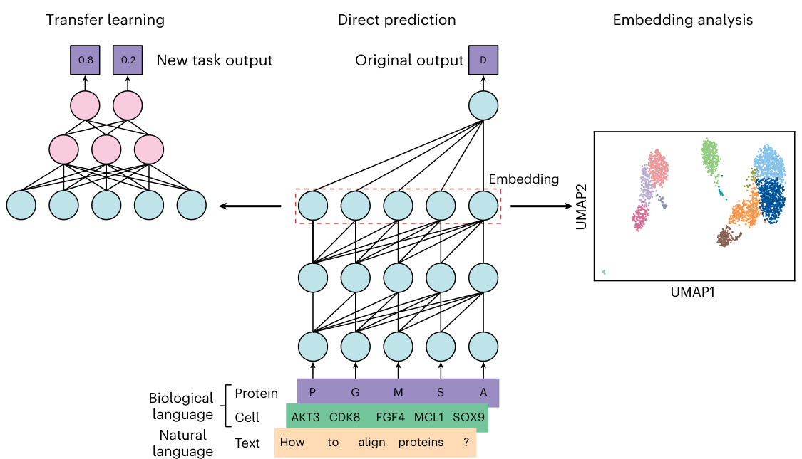
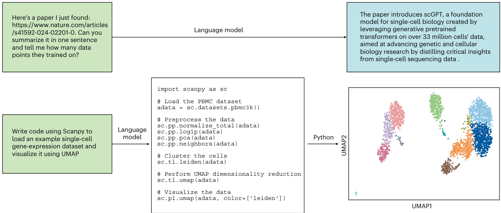
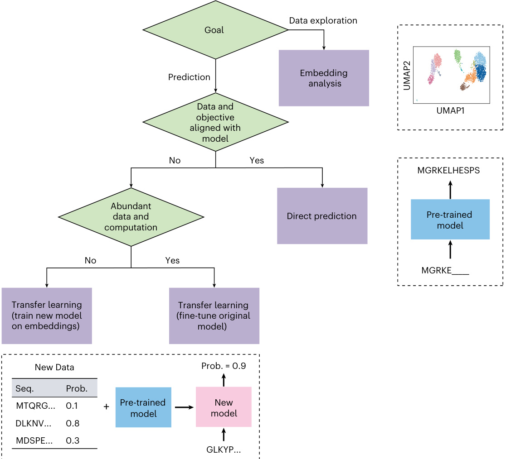

# nature methods  

# Language models for biological research: a primer  

# Received: 20 March 2024  

Elana Simon    1,4, Kyle Swanson    2,4 & James Zou    1,2,3  

Accepted: 18 June 2024  

Published online: 9 August 2024 Check for updates  

Language models are playing an increasingly important role in many areas of artificial intelligence (AI) and computational biology. In this primer, we discuss the ways in which language models, both those based on natural language and those based on biological sequences, can be applied to biological research. This primer is primarily intended for biologists interested in using these cutting-edge AI technologies in their applications. We provide guidance on best practices and key resources for adapting language models for biology.  

Language models are a type of AI that can learn complex patterns within sequences, such as words in a sentence or amino acids in a protein1. These models have gained popularity in recent years owing to the development of large-scale, publicly accessible models that generate text, such as ChatGPT2. Because these models are trained on large heterogeneous collections of sequences, they learn flexible patterns and can be adapted to solve a wide range of specific problems. For example, ChatGPT was trained to fill in missing words in text, but that training procedure has enabled it to reason about language and tackle problems ranging from summarizing papers to writing bioinformatics code. Furthermore, language models can be adapted to solve problems that they were not designed to address initially, outperforming models explicitly trained on those problems. Owing to this flexibility, language models are often foundation models that enable broad downstream applications. Language models are not limited to natural language (for example, English); they can also process biological language, which consists of sequences of biological entities, such as amino acids3 or genes4.  

The language models discussed here are all based on the transformer architecture5, a type of artificial neural network that can capture patterns across long sequences (see Box 1 for a glossary of key terms). For example, it can learn that the abstract of a paper summarizes the subsequent text, and it can learn the physical contacts between amino acids in a protein sequence, even if they are far apart. These models are typically trained in an unsupervised, generative fashion, which means the training sequences do not have particular labels for the model to predict (unsupervised); instead, it learns to regenerate the training input sequences (generative). Through this generative process, the model learns the underlying rules that govern the form of the data. To customize these models for other objectives, a model that has already been trained (pre-trained) on the data is often further trained (fine-tuned) on new data. This process is called transfer learning, in which pre-training on a larger dataset provides the model with a fundamental understanding of the data that enables more efficient learning of the new objective during fine-tuning.  

Language models can be applied to any sequential data, whether the basic unit of the sequence, called a token, is a word in a sentence or an amino acid in a protein. Although sentences and proteins are naturally sequential, other types of biological data can be formulated as sequences. For example, single-cell gene expression data, which are not typically represented as sequences, can be formulated sequentially by creating a sequence in which genes appear in the order of their RNA expression levels in a cell. By viewing each single cell as a sequence of genes, a biological language model can then use these sequences as input to model single-cell RNA expression levels between cells. As the language model processes the input sequence, it internally computes an embedding, which is a numerical representation of the input that can concisely capture its semantic or functional properties.  

Pre-trained language models can be used to tackle many research problems through three common approaches: (1) direct prediction, (2) embedding analysis and (3) transfer learning (Fig. 1). The direct-prediction approach is the simplest; the language model is given certain inputs and used as-is to make predictions. The embedding analysis computes embeddings of input sequences to be used for data analysis and visualization. In the transfer-learning approach, additional training is performed on new data that are relevant to the desired goal. Depending on the availability of task-specific data and computational resources, this could involve fine-tuning the original language model or training a new model using embeddings from the language model (which can also be considered a form of fine-tuning).  

# Box 1  

# Glossary of terms  

<html><body><table><tr><td>Term</td><td>Definition</td></tr><tr><td>Language model</td><td>An Al model that learns to predict the likelihood of items in a sequence on the basis of training data.</td></tr><tr><td>Natural languagemodel</td><td>A language model trained on sequences of text from human language.</td></tr><tr><td>Biological languagemodel</td><td>A language model trained on sequences of biological entities, such as amino acids or genes, that are treated as language.</td></tr><tr><td>Foundation model</td><td>An Al model that can be flexibly adapted to tackle diverse applications.</td></tr><tr><td>Transformer</td><td>A type of model that processes sequential data using a mechanism called attention that dynamically weighs the significance of different parts of the input data.</td></tr><tr><td>Token</td><td>A basic unit of a sequence, such as a word, amino acid or gene, that serves as the fundamental input unit for a language model.</td></tr><tr><td>Embedding</td><td>A numerical representation (a list of numbers) of an input learned by a model, capturing its semantic or functional properties.</td></tr><tr><td>Transfer learning</td><td>A machine-learning approach in which a model trained on one task is adapted to perform a different but related task, often requiring less data and training time.</td></tr><tr><td>Pre-training</td><td>The first step of transfer learning,in which a machine-learning model is trained on a large dataset tolearn general features.</td></tr><tr><td>Fine-tuning</td><td>The second step of transfer learning, in which a pre-trained model is adapted to a specific task by training it on a dataset that is often smaller and task-specific. This could involve either further training the original model or training a new model on embeddings produced by the original model.</td></tr><tr><td>Multimodal model</td><td></td></tr><tr><td>Generative model</td><td></td></tr><tr><td>Unsupervised learning</td><td>A type of machinelearning that learnsfromdatasets withoutexplicit labelsand is oftenusedtofindpatterns orstructure withindata.</td></tr><tr><td>Hallucination</td><td></td></tr><tr><td>Dimensionalityreduction</td><td>A technique for reducing the number of features in high-dimensional data while preserving its essential structure. It is often used to reduce model embeddings to two dimensions forvisualization.</td></tr><tr><td>Mask</td><td>A special token used toreplace a portion of the input sequence,which the model learns to predict on the basis of the surrounding context.</td></tr></table></body></html>  

  
Fig. 1 | Approaches to using language models for biological research. Language models for biological research can use either natural language (for example, English) or biological language (for example, sequences of genes from single-cell data or protein sequences). In either case, the input is broken down into units, called tokens (for example, words or amino acids), that are processed by the model. Language models can then be adapted for biological research in one of three ways. In the transfer-learning approach (left), the pre-trained  

model is optionally modified (for example, expanded) and then further trained (fine-tuned) to solve a particular task that it was not originally trained to solve. In the direct-prediction approach (middle), the model is directly applied to make predictions on the basis of the input data, such as predicting the next word in a sentence. In the embedding-analysis approach (right), the representation of the input computed by the model (that is, the embedding) is used for analyses such as dimensionality reduction and clustering.  

  
Fig. 2 | Example uses of natural language models for biological research. In the illustrated conversations with language models, a user asks a language model a question (green text box), and the language model responds with the answer (blue text box or white code snippet). Top, the user asks for information about a scientific paper, and the language model answers by finding, reading   
and summarizing the paper. Bottom, the user asks for example code for a bioinformatic analysis, and the language model provides Python code that can be run to generate a visual analysis of data. The top example was generated by ChatGPT’s GPT-4 model, and the bottom example was generated by Claude 3 (lightly edited for brevity).  

In this primer, we discuss how natural language and biological language models can be adapted using these three approaches to solve a range of problems in biology. We also discuss best practices when using language models for biology, including suggestions for when to use each approach and caveats to consider given current model limitations.  

# Natural language models  

# Introduction to natural language models for biology  

Although biology fundamentally depends on the characteristics of physical entities—proteins, genes and cells—our understanding of the field is documented in natural language through scientific papers, textbooks, web pages and more. Therefore, there has been increasing interest in using natural language models to provide biology researchers with easy access to the vast quantity of biological information contained in these written resources. Additionally, natural language models can be augmented with data from alternative modalities, such as images or gene sequences, to form multimodal models6 that can provide insight into various forms of biological entities. Below, we explore applications of natural language models to biology research, primarily using the direct-prediction approach.  

# Generalist versus specialist natural language models for biology  

Natural language models can be trained as generalist models (for example, ChatGPT2 or Claude7), which are trained on a broad corpus of text including biological sources such as PubMed. Alternatively, they can be designed as specialist models (for example, BioBERT8 or Med-PaLM 2 (ref. 9)), which are specifically trained or fine-tuned on biological text. The current generalist models can outperform specialist models on biomedical tasks, such as answering medical exam questions, owing to their extensive knowledge10.  

# Natural language models for understanding of the biological literature  

A primary strength of natural language models is their ability to reason across the vast biological literature and distill information into easy-to-understand responses. For example, if a researcher encounters an unfamiliar technical concept (for example, multiple sequence alignment), they can ask a language model to explain the concept in a concise paragraph without spending time looking up references. Furthermore, the researcher can modify the input on the basis of their background, to receive an answer tuned to them (for example, ‘explain multiple sequence alignment to someone with an introductory biology background’). Besides summarizing biological concepts, natural language models can also help researchers understand new scientific content quickly. For instance, scientists can give a language model a link to a new scientific paper and ask the model to summarize the content or answer specific technical questions about its methodology (Fig. 2). Natural language models could even suggest new biomedical research ideas on the basis of the existing research literature (for example, new ways to use AI to process multiple sequence alignments).  

Although natural language models are powerful tools for understanding the biological literature, one well-known limitation is their tendency to ‘hallucinate’11, or generate coherent-sounding text that contains factual errors. Additionally, these models might not critically evaluate the content that they process, potentially reflecting the authors’ interpretations without questioning whether they are supported by the data. Therefore, it is vital to fact-check the output of natural language models for accuracy, and to critically assess any conclusions drawn by the model.  

# Natural language models for interacting with software  

Beyond understanding scientific literature, natural language models can accelerate research by helping scientists interact with software, including writing and debugging code. Natural language models contain significant knowledge about bioinformatics analyses and can therefore aid researchers in writing code for data processing, results analysis, plotting and more12. These models are particularly useful when researchers are unfamiliar with domain-specific software packages (for example, Scanpy for single-cell analysis), because the models know both when these packages are appropriate and how to interface with the various components of each package (Fig. 2). Natural language models are also excellent debugging tools that can be given broken code and/ or error messages and asked to write corrected code. Furthermore, these models can provide a natural language interface to software tools that would otherwise require domain expertise to use. For example, ChemCrow13 allows users to pose problems in natural language (for example, ‘design a soluble molecule’), and it modifies the user’s query to enable ChatGPT to run chemistry-specific software tools (for example, molecular synthesis planning). This ability facilitates access to these tools to a broader scientific audience.  

# Biological language models  

Whereas natural language models are trained to generate text, biological language models are trained to generate sequences of biological data (for example, sequences of amino acids). We explore two powerful examples of biological language models that take this approach: protein language models and single-cell language models. Although we focus on these two examples, biological language models are not limited to these modalities and can be applied to any biological entities with large datasets that can be represented as sequences (for example, $\mathsf{D N A}^{14}$ ).  

# Protein language models  

Why is large-scale pre-training useful? Protein language models that are pre-trained on large datasets of protein sequences can learn representations that capture evolutionary constraints and key properties of proteins15. Subsequent fine-tuning of these models on smaller labeled datasets enables accurate prediction of downstream tasks such as stability, interactions and even design of sequences with specified structures.  

Protein language model example: ESM-2. One such protein language model is ESM-2 (ref. 3), a transformer neural network trained on more than 250 million protein sequences by predicting randomly masked amino acids from the surrounding context. During training, random subsets of amino acids in each sequence are replaced with fake ‘mask’ amino acids, and the model predicts the original amino acids that were masked. By learning to accurately predict which amino acids fit into a given sequence context, the models learn the patterns and constraints that govern protein structure and function. Just as there is an abundance of natural language models, there is a variety of protein language models trained with slightly different formulations. For example, some protein language models might be trained using data focusing on individual protein families, or they might predict amino acids in a sequential order, more similar to natural language models, as opposed to randomly masking amino acids16,17.  

Application: direct prediction. These models can be used, as per their original training goal, to directly predict the probability that each amino acid appears at a given location in the sequence. Because the training data cover the full spectrum of known functional protein sequences, these models effectively learn the patterns of protein evolution. Without experimental measurements of the effects of mutations, the model can implicitly learn which mutations would be deleterious to protein function, because they would be considered unlikely to occur on the basis of the mutations that have been observed empirically throughout evolution. Therefore, these predictions can be used out-of-the-box to estimate the effects of protein-coding mutations18.  

The likelihood of a mutation can be obtained by specifically masking the wild-type amino acid at a given position and asking the model to impute the masked position given the rest of the sequence. If a mutation has a lower likelihood than the wild-type amino acid according to the language model, it suggests that the mutation is potentially deleterious. Experimental studies evaluating mutation pathogenicity have validated these estimates on the basis of model likelihood19.  

One benefit of modeling protein sequences as language is that these sequences do not require prior alignment or annotation; other approaches need evolutionarily aligned protein sequences to predict the effects of mutations . Language model estimates of protein-sequence likelihood can also be used to estimate whether protein sequences are likely to form functional structures, which has enabled protein language models to evaluate and design new sequences21,22.  

Application: embedding analysis. In addition to their outputs, protein language models also provide useful embeddings of proteins. Specifically, when a protein sequence is run through the model, the model’s internal representations (embeddings) of each amino acid in the protein can be extracted. The embeddings for each amino acid can then be used on their own or combined into a single protein representation. For example, prior work has found that clustering protein sequence embeddings can identify homologous proteins. These homologous proteins can then be structured into a multiple sequence alignment on the basis of similarities between individual amino acid embeddings in each protein23.  

Application: transfer learning. The representations learned from these models can be used to address more specific tasks. Because fine-tuning protein language models can be expensive, many applications use embeddings from a model as input to another much smaller model that is trained on the downstream task. For example, these embeddings have been used to predict protein stability24, immune escape with viral antigen mutations25 and, using a small quantity of labeled data, the pathogenicity of missense variants26. Alternatively, there are newer, more efficient techniques for fine-tuning that enable researchers with fewer computational resources to fully fine-tune large protein language models27.  

Interactive example. As a demonstration of how protein language models can be applied to various downstream tasks, we provide an interactive notebook with examples for direct prediction, embedding analysis and transfer learning with ESM-2, which can be run from a browser using Google Colab: https://colab.research.google.com/dri ve/1zIIRGeqpXvKyz1oynHsyLYRxHHiIbrV5?usp=sharing.  

Protein structure models. Although models for protein structure prediction, such as AlphaFold2 (ref. 28) and ESMFold3, are not the focus of this primer, it is worth mentioning that including structural information with protein sequences to train the model, as is done in models for protein structure prediction, can improve protein representations for various downstream tasks. Protein-structure-prediction models, like language models, have proven to be widely adaptable for diverse downstream applications through direct prediction, embedding analysis and transfer learning.  

# Single-cell language models  

Why is large-scale pre-training useful? Single-cell gene expression data provide insights into the cellular state and function of individual cells, but their high dimensionality makes interpretation challenging. AI methods have recently been developed to help analyze these complex data. The growth of publicly available single-cell gene expression data allows training of language models on millions of transcriptomes across diverse cell types, tissues, organisms and experimental conditions. These models can generalize to new datasets and can be fine-tuned for various downstream tasks, including cell-type annotation and batch correction.  

Single-cell language model example: Geneformer. One such single-cell language model is Geneformer4. As with many other biological language models, it has a transformer architecture trained  

# Fig. 3 | Choosing the right approach for adapting a language model.  

Workflow of the main decisions for determining the best way to use a language model. Language models can be adapted for biological research by using direct prediction, embedding analysis or transfer learning. For data exploration, the embedding-analysis approach can visualize the data on the basis of embeddings from the language model. For prediction, the appropriate approach depends on the data and objective of the new problem. If the data and objective of the new problem match that of the original training goal, then direct prediction is to provide a representation of genes and cells for many downstream applications. Geneformer represents each cell as a list of the top 2,048 genes expressed in the cell, sorted on the basis of RNA expression levels. The training process is similar to that of the previously described protein language models, in that subsets of the genes are masked out and the model is trained to predict the missing genes. To properly predict the missing genes in the order of their expression levels, the model must understand interactions between expression levels of various genes and implicitly learn cell-type-specific patterns and context. Geneformer was trained on 30 million single-cell transcriptomes spanning 40 tissue types, which helps it learn diverse expression patterns. Although Geneformer focuses on the relative expression levels of each gene, other single-cell language models use alternative formulations. For example, the single-cell language model scGPT29 is pre-trained on quantitative expression values, enabling slightly different downstream applications. scGPT can also include experimental metadata such as modality, batch and perturbation conditions.  

  
applicable, with potential modification of the input to the model to adjust the model’s predictions. If the new problem does not fully match the original goal, then transfer learning can be useful. This involves either fine-tuning the original (typically large) model or training a new (typically small) model with embeddings from the language model as input. Fine-tuning the original model is often more powerful but requires more data and computational resources than training a new model on embeddings.  

Application: direct prediction. The direct outputs of a single-cell language model enable a variety of creative in silico experiments. The model can estimate the effect of genetic perturbations on cells by taking the original list of genes in a single cell ranked by expression, modifying the order of the genes and quantifying how this changes the output. For example, Geneformer simulated the reprogramming of fibroblasts by artificially adding POU5F1, SOX2, KLF4 and MYC to the top of the gene rankings for the cells, thereby computationally shifting the cells toward the induced pluripotent stem cell state. Similarly, single-cell language models can predict the sensitivity of cells to gene removal by artificially deleting genes from the ranked list for a cell and examining the effect on the cell embeddings.  

Application: embedding analysis. Single-cell language models contain embeddings of each gene that can be combined (for example, averaged) to create one representation for each cell. These cell embeddings can be used for clustering, visualization and cell-type labeling. Owing to the diversity and quantity of training data, these models can implicitly reduce batch effects while maintaining biological variability, enabling them to identify nuanced cell subtypes from datasets containing many experimental batches4.  

Application: transfer learning. Although meaningful clusters, such as cell types, can emerge in these embeddings, models can also be fine-tuned to predict properties of individual cells. For example, single-cell language models can be fine-tuned to integrate data across experimental conditions and predict cell-type labels and cell states. They can even support multimodal representations of genes. For example, scGPT can be fine-tuned to include chromatin accessibility and protein abundance alongside gene expression levels, enabling dataset integration across modalities.  

Table 1 | Biological language model resources   

<html><body><table><tr><td>Name</td><td>What is it</td><td>Where to find it</td><td>How to use it</td></tr><tr><td>ChatGPT</td><td>Natural language(general)</td><td>https://chat.openai.com</td><td>Chat with the model at chat.openai.com or programmatically query the APl as per the documentation.</td></tr><tr><td>BioBERT</td><td>Natural language (biomedical) </td><td>https://github.com/dmis-lab/biobert</td><td>Links to Hugging Face repositories with pre-trained BioBERT models of different sizes, along with code to fine-tune BioBERT.</td></tr><tr><td>Med-PaLM 2</td><td>Natural language (biomedical)</td><td>https://cloud.google.com/vertex-ai/generative-ai/ docs/medlm/overview</td><td>Available to certain customers as part of Google's Vertex Al platform.</td></tr><tr><td>ESM</td><td>Protein language</td><td>https://github.com/facebookresearch/esm</td><td>Links to model code, pre-trained models and tutorials.</td></tr><tr><td>ProGen</td><td>Protein language</td><td>https://github.com/salesforce/progen/tree/main</td><td>Links to pre-trained models and code for making predictions.</td></tr><tr><td>Geneformer</td><td>Single-cell language</td><td>https://huggingface.co/ctheodoris/Geneformer</td><td>Trained models available through Hugging Face. Provides documentation with example code for various applications.</td></tr><tr><td>SCGPT</td><td>Single-cell language</td><td>https://github.com/bowang-lab/scGPT</td><td>Links to pre-trained models and websites with cell annotations and otherfeatures.</td></tr><tr><td>GenePT</td><td>Multimodal: natural language and single-cell gene expression</td><td>https://github.com/yiqunchen/GenePT</td><td>Pre-computed gene embeddings and notebooks with example tutorials for various applications.</td></tr><tr><td>PLIP</td><td>Multimodal:natural language and pathology images</td><td>https://huggingface.co/spaces/vinid/webplip</td><td>Links to training data,pre-trained models and code.</td></tr><tr><td>Hugging Face</td><td>Multiple language model types</td><td>https://huggingface.co</td><td>Repository of many different trained machine-learning models.Query for specific terms (forexample, protein) to find models in a specific domain.</td></tr></table></body></html>  

# Multimodal language models for biology  

Multimodal models can reason across multiple data modalities, such as text and images, thereby empowering these models to solve tasks that inherently involve more than one type of data. For example, Pathology Language-Image Pre-training (PLIP)30 was trained on Twitter data to match pathology images to their captions, enabling users to get captions for a given image or find images for a given text description. Similarly, Med-PaLM Multimodal31 was trained to answer questions on the basis of biomedical images, and MolT5 (ref. 32) was trained to describe molecules in natural language, including information about their potential biological functions, on the basis of their molecular structures. Given sufficient examples of data points with multiple modalities, researchers can train multimodal models for other types of biological data as well.  

Natural language models can also be applied in a multimodal setting without additional training by combining fixed language model embeddings of biological text with data from other domains. GenePT33 provides an example for single-cell data. GenePT leverages the implicit genomic knowledge of language models to embed cells. Specifically, GenePT embeds cells with ChatGPT by first embedding text descriptions of genes from NCBI using ChatGPT and then creating single-cell embeddings by averaging text-based gene embeddings, weighted by single-cell expression. In some applications, these embeddings derived from a natural language model match or outperform embeddings from biological language models such as Geneformer. Similar ideas could be applied in other fields of biology; fixed language model embeddings can be merged with data or models from an alternate modality without additional training.  

# Best practices when using language models for biology  

Natural language and biological language models have numerous applications in biology research. We have discussed three methods for applying these models to downstream research problems: direct prediction, embedding analysis and transfer learning. Here, we outline the process for deciding which methods are appropriate for a given research problem. The best method depends on the research problem, as well as the available data and computational resources. Figure 3 shows a simple workflow summarizing the main decision points for determining how to use a language model. Although these rules are not definitive, they can help guide the process.  

The first decision is determining the goal of the research problem. If the aim is data exploration, then the embedding-analysis approach, along with techniques such as dimensionality reduction and clustering, can be used to reveal structure in the data. However, if the goal is to make predictions from the data, then the direct-prediction and transfer-learning approaches tend to be more useful. If the problem matches the innate capabilities of the model on the basis of its training data and objective, then the direct-prediction approach is appropriate, potentially with modification of the input depending on the goal. If the project goal deviates significantly from the model’s capabilities, or if data are available that are more specific to the task of interest, then transfer learning can be useful. When sufficient data and computational resources are available, the best approach could be to fine-tune some or all of the language model. However, if data or computational resources are limited, an alternative is to compute embeddings of the new data points with the language model and use these embeddings as the input to train a separate, typically smaller model. Furthermore, some models are available only as a web interface or application programming interface (API), which could limit their use to direct prediction. Other models with open-source code and trained model parameters can be used for embedding analysis or transfer learning.  

Language models can be accessed and adapted through a variety of mechanisms. For example, some models have user-friendly web interfaces in which predictions can be made. In other cases, the code and trained models can be downloaded from Hugging Face or GitHub. Some of the models have accompanying Jupyter notebooks or Google Colab notebooks demonstrating how to use the pre-trained models for various applications. When such notebooks do not exist, GitHub repositories that contain the model code often have documentation or example code to follow. Some of the applications that we’ve discussed here have such websites and notebooks available (Table 1).  

Although language models can be very powerful, they have important limitations that users should be aware of. First, language models still cannot perfectly solve many biological problems, even the ones that they were originally trained to address. This can be due to limitations of the models, which may not have the capacity to learn all the patterns governing the training data, as well as limitations of the training data. Training data can be out of date or noisy, and they can have gaps where certain types of data are under-represented. For example, natural language models contain only the biological knowledge that is included in their training data, so they will be unaware of findings discovered after training. Protein language models are typically trained on the standard amino acids and therefore cannot reflect the significance of any post-translational modifications in the input representation. Single-cell expression data can be noisy, and funding priorities can bias the quantities of data toward specific tissue types and disease states, both of which are factors that can influence model performance.  

Additionally, models tailored to specific biological applications can still sometimes outperform biological language models, particularly when prior knowledge can inform the model design. For example, methods that include information about protein structures have been shown to outperform methods that use language models trained on protein sequences34,35. Finally, evaluating the performance of language models adapted to other tasks also requires care. Language models are trained on vast amounts of data that may not be publicly shared, and thus it can be challenging to ensure that there is no data leakage between the language model’s training data and the test data of the downstream task.  

# Conclusion  

This primer illustrates how to use language models, including natural language models such as ChatGPT and biological language models such as ESM-2 and Geneformer, to advance biological research. These models facilitate a range of biological applications through direct prediction, embedding analysis and transfer learning. Although language models can guide hypothesis generation and help interpret results, they do make mistakes and cannot yet replace experimental validation. Language models also require significant data for training, currently limiting their biological use cases to domains with large existing datasets. As more data are generated and shared publicly, we anticipate that language models will impact even more diverse domains in biology.  

# Code availability  

Code for our interactive example of protein language models is available and can be run on Google Colab at https://colab.research.google. com/drive/1zIIRGeqpXvKyz1oynHsyLYRxHHiIbrV5?usp $\lvert=:$ sharing. The same code, as well as the associated data, is available on GitHub at https://github.com/swansonk14/language_models_biology.  

# References  

1.	 Thirunavukarasu, A. J. et al. Large language models in medicine. Nat. Med. 29, 1930–1940 (2023).   
2. OpenAI et al. GPT-4 technical report. Preprint at https://doi.org/ 10.48550/arXiv.2303.08774 (2024).   
3. Lin, Z. et al. Evolutionary-scale prediction of atomic-level protein structure with a language model. Science 379, 1123–1130 (2023). This paper introduces ESM-2, a powerful protein language model, and ESMFold, a model that uses ESM-2 as a foundation to predict protein structure.   
4. Theodoris, C. V. et al. Transfer learning enables predictions in network biology. Nature 618, 616–624 (2023). This paper introduces Geneformer, a single-cell language model trained on gene expression profiles of single-cell transcriptomes.   
0. Vaswani, A. et al. In Proc. Advances in Neural Information Processing Systems 30 (eds. Guyon, I. et al.) 5998–6008 (Curran Associates, 2017). This paper introduces the transformer architecture, which powers all of the language models discussed in this paper and much of the field at large.   
6. Jin, W., Yang, K., Barzilay, R. & Jaakkola, T. Learning multimodal graph-to-graph translation for molecule optimization. Int. Conf. Learn. Represent. (2019).   
7. Anthropic. The Claude 3 Model Family: Opus, Sonnet, Haiku (Anthropic, 2024).   
8. Lee, J. et al. BioBERT: a pre-trained biomedical language representation model for biomedical text mining. Bioinformatics 36, 1234–1240 (2020).   
9. Singhal, K. et al. Towards expert-level medical question answering with large language models. Preprint at https://doi.org/10.48550/arXiv.2305.09617 (2023).   
10.	 Nori, H. et al. Can generalist foundation models outcompete special-purpose tuning? Case study in medicine. Preprint at https://doi.org/10.48550/arXiv.2311.16452 (2023).   
11.	 Ji, Z. et al. Survey of hallucination in natural language generation. ACM Comput. Surv. 55, 248:1–248:38 (2023).   
12.	 Chen, M. et al. Evaluating large language models trained on code. Preprint at https://doi.org/10.48550/arXiv.2107.03374 (2021).   
13.	 Bran, A. M. et al. Augmenting large language models with chemistry tools. Nat. Mach. Intell. 6, 525–535 (2024).   
14.	 Nguyen, E. et al. Sequence modeling and design from molecular to genome scale with Evo. Preprint at https://doi. org/10.1101/2024.02.27.582234 (2024).   
15.	 Rives, A. et al. Biological structure and function emerge from scaling unsupervised learning to 250 million protein sequences. Proc. Natl Acad. Sci. USA 118, e2016239118 (2021).   
16.	 Shin, J.-E. et al. Protein design and variant prediction using autoregressive generative models. Nat. Commun. 12, 2403 (2021).   
17.	 Ferruz, N., Schmidt, S. & Höcker, B. ProtGPT2 is a deep unsupervised language model for protein design. Nat. Commun. 13, 4348 (2022).   
18.	 Meier, J. et al. In Proc. Advances in Neural Information Processing Systems 34 (eds. Ranzato, M., Beygelzimer, A., Dauphin, Y., Liang, P. S. & Wortman Vaughan, J.) 29287–29303 (Curran Associates, 2021).   
19.	 Brandes, N., Goldman, G., Wang, C. H., Ye, C. J. & Ntranos, V. Genome-wide prediction of disease variant effects with a deep protein language model. Nat. Genet. 55, 1512–1522 (2023).   
20.	 Frazer, J. et al. Disease variant prediction with deep generative models of evolutionary data. Nature 599, 91–95 (2021).   
21.	 Ruffolo, J. A. & Madani, A. Designing proteins with language models. Nat. Biotechnol. 42, 200–202 (2024).   
22.	 Hsu, C., Fannjiang, C. & Listgarten, J. Generative models for protein structures and sequences. Nat. Biotechnol. 42, 196–199 (2024).   
23.	 McWhite, C. D., Armour-Garb, I. & Singh, M. Leveraging protein language models for accurate multiple sequence alignments. Genome Res. 33, 1145–1153 (2023).   
24.	 Chu, S. K. S. & Siegel, J. B. Protein stability prediction by fine-tuning a protein language model on a mega-scale dataset. Preprint at bioRxiv https://doi.org/10.1101/2023.11.19.567747 (2023).   
25.	 Swanson, K., Chang, H. & Zou, J. In Proc. 17th Machine Learning in Computational Biology Meeting (eds. Knowles, D. A., Mostafavi, S. & Lee, S.-I.) 110–130 (PMLR, 2022).   
26.	 Jagota, M. et al. Cross-protein transfer learning substantially improves disease variant prediction. Genome Biol. 24, 182 (2023).   
27.	 Sledzieski, S. et al. Democratizing protein language models with parameter-efficient fine-tuning. Proc. Natl Acad. Sci. USA 121, e2405840121 (2024).   
28.	 Jumper, J. et al. Highly accurate protein structure prediction with AlphaFold. Nature 596, 583–589 (2021).   
29.	 Cui, H. et al. scGPT: toward building a foundation model for single-cell multi-omics using generative AI. Nat. Methods https://doi.org/10.1038/s41592-024-02201-0 (2024).   
30.	 Huang, Z., Bianchi, F., Yuksekgonul, M., Montine, T. J. & Zou, J. A visual–language foundation model for pathology image analysis using medical Twitter. Nat. Med. 29, 2307–2316 (2023).   
31.	 Tu, T. et al. Towards generalist biomedical AI. NEJM AI 1, 3 (2024).   
32.	 Edwards, C. et al. In Proc. 2022 Conference on Empirical Methods in Natural Language Processing (eds. Goldberg, Y., Kozareva, Z. & Zhang, Y.) 375–413 (Association for Computational Linguistics, 2022).   
33.	 Chen, Y. & Zou, J. GenePT: a simple but effective foundation model for genes and cells built from ChatGPT. Preprint at bioRxiv https://doi.org/10.1101/2023.10.16.562533 (2024).   
34.	 Cheng, J. et al. Accurate proteome-wide missense variant effect prediction with AlphaMissense. Science 381, eadg7492 (2023).   
35.	 Wang, Z. et al. LM-GVP: an extensible sequence and structure informed deep learning framework for protein property prediction. Sci. Rep. 12, 6832 (2023).  

# Acknowledgements  

We would like to thank M. Karelina, F. Ekman, S. Simon and J. Chang for feedback and Z. Huang for help with the figures. K.S. acknowledges support from the Knight-Hennessy Scholarship. E.S. acknowledges support from the National Institutes of Health (T15LM007033). J.Z. is supported by funding from the CZ Biohub.  

# Author contributions  

E.S. and K.S. wrote and edited the manuscript. J.Z. supervised and edited the manuscript.  

Competing interests The authors declare no competing interests.  

# Additional information  

Correspondence should be addressed to James Zou.  

Peer review information Nature Methods thanks the anonymous reviewers for their contribution to the peer review of this work. Primary Handling Editor: Lin Tang, in collaboration with the Nature Methods team.  

Reprints and permissions information is available at www.nature.com/reprints.  

Publisher’s note Springer Nature remains neutral with regard to jurisdictional claims in published maps and institutional affiliations.  

Springer Nature or its licensor (e.g. a society or other partner) holds exclusive rights to this article under a publishing agreement with the author(s) or other rightsholder(s); author self-archiving of the accepted manuscript version of this article is solely governed by the terms of such publishing agreement and applicable law.  

$\circledcirc$ Springer Nature America, Inc. 2024  