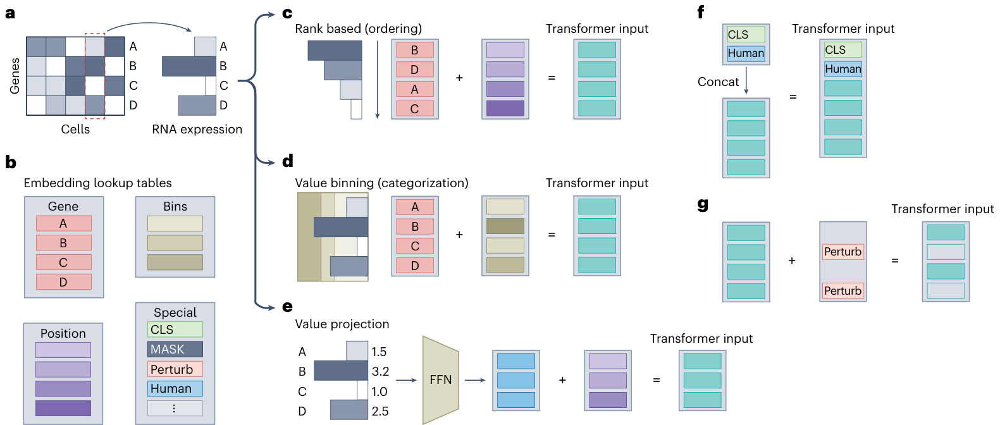

# nature methods  

# Transformers in single-cell omics: a review and new perspectives  

# Received: 19 December 2023  

Accepted: 7 June 2024  

Published online: 9 August 2024 Check for updates  

Artur Szałata    1,2, Karin Hrovatin    1,3, Sören Becker1,2,4, Alejandro Tejada-Lapuerta1,2, Haotian Cui    5,6,7, Bo Wang    5,6,7,8,9,10 & Fabian J. Theis    1,2,3  

Recent efforts to construct reference maps of cellular phenotypes have expanded the volume and diversity of single-cell omics data, providing an unprecedented resource for studying cell properties. Despite the availability of rich datasets and their continued growth, current single-cell models are unable to fully capitalize on the information they contain. Transformers have become the architecture of choice for foundation models in other domains owing to their ability to generalize to heterogeneous, large-scale datasets. Thus, the question arises of whether transformers could set off a similar shift in the field of single-cell modeling. Here we first describe the transformer architecture and its single-cell adaptations and then present a comprehensive review of the existing applications of transformers in single-cell analysis and critically discuss their future potential for single-cell biology. By studying limitations and technical challenges, we aim to provide a structured outlook for future research directions at the intersection of machine learning and single-cell biology.  

The emergence of single-cell omics has deepened our understanding of biological systems, offering a granular view of cellular heterogeneity and dynamics. This includes new insights into cell types, cell states and their changes during development, disease onset and therapeutic response1–3. The vast volume and heterogeneity of the generated data present both opportunities and challenges. Current analytical methods fall short in capturing variation across diverse large-scale single-cell datasets, motivating the development of novel computational strategies.  

In parallel, the machine learning landscape has witnessed the remarkable impact of transformers, initially designed for natural language processing (NLP) tasks and, more recently, used as the backbone of foundation models across domains4–6. A foundation model is a machine learning model trained on broad data, usually by self-supervision, that can be effectively adapted to a wide range of downstream tasks, often with minimal additional training6. Transformer-based foundation models have been successfully applied in numerous fields, including computer vision7, speech processing8 and time series analysis9, as well as in categorically valued sequence modeling in genomics10 and proteomics11,12. The ability of transformers to leverage large-scale, heterogeneous datasets and to generalize to many tasks across domains positions them as potential game changers for single-cell omics analysis (Fig. 1). Nonetheless, a notable property of data in all these domains that is not present in the raw single-cell omics data is sequentiality, which poses unique challenges.  

# Overview of the transformer architecture  

Deep learning has been widely applied in single-cell biology13–16. Most deep learning models regard the input as a vector to which they iteratively apply a series of learnable layers, where each layer usually consists of a linear transformation followed by an element-wise nonlinearity. In the context of single-cell genomics, the input vector may for instance represent a cell, with individual vector components corresponding to the RNA expression of individual genes. A common model architecture in single-cell applications is the autoencoder, as it does not rely on hard-to-obtain data annotations. As illustrated in Fig. 2a, autoencoders consist of an encoder and a decoder and are trained to map the input to a low-dimensional latent representation that constitutes a bottleneck from which the decoder attempts to faithfully reconstruct the input. An autoencoder trained on single-cell RNA counts can be used for dimensionality reduction of the cells’ transcriptomic profiles. As an autoencoder learns a fixed set of parameters that are used for all inputs (that is, all cells), the bottleneck compels the model to learn feature extractors that capture the globally most relevant patterns while filtering out noise, which ultimately results in a meaningful latent representation of cellular variation.  

  
Fig. 1 | Transformers for single-cell omics. The input to the model is one or multiple single-cell omics modalities. The transformer constitutes a series of M layers modifying the input representation. Single-cell transformers are often pretrained with SSL tasks, such as predicting masked expression of a subset of   
genes within a cell, and can be used for a wide range of downstream tasks, at either the cell level, such as cell annotation, or gene level, such as gene function prediction.  

The transformer architecture, shown in Fig. 2, is a type of deep learning model using self-attention mechanisms to process input data represented as a set of embeddings. It shares some of the ideas underlying autoencoders but also departs from them in essential ways. For instance, similar to the autoencoder, the originally proposed transformer consists of an encoder and a decoder, and it can also be trained without the need for data annotations. However, there are important differences between the two architectures. First, unlike autoencoders, transformers adjust how they process a specific input feature based on all other input features in a data sample via the attention mechanism5. This, for example, allows a transformer to flexibly account for different gene interaction patterns depending on the cell type that it is currently processing. Second, transformers regard every input sample as a set of embeddings, which necessitates embedding of the cell’s transcriptomic profile into such a format before passing it to a transformer. For example, a cell can be represented by a set of gene embeddings that capture their respective RNA counts. Third, the encoder and decoder components in transformers are distinct in function and design compared to their counterparts in autoencoders. Whereas the encoder in an autoencoder maps the input to a bottleneck latent space and thus performs dimensionality reduction (Fig. 2a), the representation produced by the encoder in a transformer is not constrained by a bottleneck (Fig. 2b).  

The transformer decoder, unlike its autoencoder counterpart, processes the output of the transformer encoder and generates a sequence, one element at a time. Transformer encoders and decoders are often used independently, with encoder-only models commonly used for generating contextualized input embeddings per gene. Such embeddings capture the properties of a given gene and its expression level within the context of a given cell, taking into account the expression of other genes, which opens the possibility of addressing gene-level tasks, such as gene dosage sensitivity prediction in specific cells17. Decoder-only models as well as encoder–decoder transformers are used for sequence generation, enabling, for example, transcriptomic cell profile simulation, but require representation of the RNA counts as a sequence. These substantial differences compared to commonly used single-cell models underscore the need for an in-depth description of single-cell transformers. In this section, we review the various parts of the transformer architecture together with recently proposed single-cell-specific adaptations. For a glossary of terms, see Box 1.  

# Representing single-cell input data  

Transformers have been very impactful in the processing of sequential data, for which they were originally designed5, such as natural language18, DNA10 or protein sequences19. However, nonsequential single-cell omics data pose a challenge, because this requires embedding the data into a format suitable for transformers. Transformers regard every input sample as a set S composed of embeddings $\pmb{x}_{i}$ . The number of the embeddings in S can vary across samples. In single-cell data, the input set S could, for instance, indicate a collection of cells within a tissue or donor with $\pmb{x}_{i}$ representing individual cells. Alternatively, S could correspond to a single cell with $\pmb{x}_{i}$ representing the attributes of individual genes, such as RNA counts. This is analogous to the tokenization in NLP, where text is segmented into subword units called ‘tokens’, where a unique subword has a corresponding embedding that is learned during training. Transformers are invariant to the order of input embeddings, which motivates ‘positional encodings’, which are added to the token embeddings to indicate the position of the tokens within the input. $\pmb{x}_{i}$ is then defined as an element-wise sum of the token embedding and positional encoding of the same dimensionality5. Positional encodings are either calculated using a fixed formula or learned like token embeddings. Such encodings have been used in many transformer application domains, including in natural language5, computer vision7 and time series analysis9.  

Notably, existing single-cell transformers primarily differ in the approach used to translate single-cell omics data into suitable transformer inputs. The most commonly used approaches can be classified into three main categories (Fig. 3), described below. For simplicity, we assume that the input sample, S, captures the transcriptional profile of  

  

Fig. 2 | Single-cell transformer architecture. a, A typical autoencoder for singlecell analysis. b, A transformer requires input preprocessing, where each gene of a cell’s genomic profile is mapped to a gene-embedding vector. Transformers are often pretrained by predicting masked parts of input. c, Multihead attention consists of several attention heads that process the input in parallel. Each attention head processes the entire input set of all embedding vectors using its own set of learnable parameters. d, The attention head uses three distinct FFNs to compute three sets of embedding vectors, denoted as keys, queries and values. Each individual key embedding is compared to all query embeddings, resulting in pairwise attention scores. Attention scores allow the transformer to focus on different gene interactions. e, Feed-forward layers process each embedding separately using the same set of parameters for all genes. f, Separate attention heads in the multihead attention layer may focus on specific gene interactions.  

a cell. Note that other omics modalities have been parsed in a similar manner as well20.  

1.	 Ordering. The data are represented as a sequence of tokens similar to natural language input, which allows direct reuse of the wellstudied NLP transformer methods. In iSEEEK21, Geneformer17 and $\mathbf{tGPT}^{22}$ , for example, each gene is a token with a corresponding learnable embedding and the order of the gene tokens is determined by ranking them within a cell by normalized expression level (Fig. 3c). Positional encodings are added to the token embeddings just as in NLP. This method reduces data resolution, which results in information loss23.  

2.	 Value categorization. Each gene is represented by an embedding, and its RNA counts per cell undergo value binning (Fig. 3d). Binning allows us to use methods designed for categorical data even when the raw input is continuous. Similarly to ordering, it reduces data resolution. In value binning, we define consecutive value intervals. Each value interval has a corresponding embedding and $\pmb{x}_{i}$ is a sum of the gene embedding and value bin embedding20,24. The intervals can be equally sized, as in a single-cell transformer scBERT24, or adaptively sized, as in $\mathsf{s c G P T}^{20}$ . In the latter, binning is performed per cell, where each interval represents an equal portion of all expressed genes in a single cell. Such adaptively sized bins retain the semantic meaning across sequencing batches, because the highest expression in a cell always corresponds to the highest-expression bin. In addition, scBERT’s24 equally sized bins were shown to in some cases result in nearly all of the values falling into a single bin, drastically reducing data resolution.  

<html><body><table><tr><td colspan="2">BOX1</td></tr><tr><td colspan="2">Glossary</td></tr><tr><td>Transformer: deep learning architecture based on parallel attention mechanism5 Autoencoder:neuralnetworkthatconsistsofanencoderand a</td><td>attentionmechanismsthatfocusontherelationshipbetweenthe input and outputembeddingsaswell.Inthiswork,werelate to self-attentionwheneverattentionismentioned</td></tr><tr><td>decoder that learns a compressed representation of the input data through unsupervised learning Embedding: numerical representation of data as a vector</td><td>Key, query and value: components of the attention mechanism in transformermodels.Queries areelementsforwhichthemodel seeks relevant information. Keys are compared to queries to produce attention scores and values are the actual content that the</td></tr><tr><td>Token: a distinct element of the input data. In single-cell omics, tokens may, for example, correspond to individual cells, genes, or othermolecularfeatures</td><td>model retrieves, which is finally weighted based on the query-key comparison (Fig. 2d) Multihead attention: a neural network composed of multiple</td></tr><tr><td>CLS token:a special tokenused in some transformers for aggregating information across all input tokens (that is, input sample) Attentionmechanism:a data-adaptive neural networkcomponent</td><td>attention mechanisms (heads), each with a separate set of parameters Foundation model: a machine learning model trained on a large</td></tr><tr><td>that dynamically focuses on the relevant information in the input to compute the output5.98</td><td>quantity of data that can be effectively adapted to a wide range of downstream tasks</td></tr><tr><td>Self-attention: a type of attentionmechanism that focuses solely on the relationships between the input embeddings, unlike traditional</td><td>Large language model (LLM): deep learning model that is trained on text to performNLP tasks</td></tr></table></body></html>  

3.	 Value projection. Another approach uses a projection of the input data. In the case where input data correspond to the transcriptomic profile of a cell represented as a vector of gene expression values, $\pmb{x}_{i}$ is a sum of two components: a projection of the gene expression vector and a positional or gene embedding, where the projection is often linear25 (Fig. 3e). The advantage of this solution over ordering and value categorization is that it does not necessarily reduce the data resolution. However, it results in continuous embeddings, which differs from the successful NLP transformers, and its impact on model performance is unclear. The number of transformer input embeddings may or may not correspond to the number of genes in the input data. The number of output embeddings may correspond, for example, to the number of selected gene pathways, as in the model $\mathrm{TOSICA}^{25}$ , where this choice was made to enhance model interpretability.  

Additionally, transformers can incorporate extra layers of information through special tokens. These tokens might represent, for example, perturbations applied to a given cell or gene20,26, information about species26, data batches or data modalities20. Special token embeddings are either added to individual input embeddings $\pmb{x}_{i}$ for token-level information (Fig. 3f), or added to the input set S for sample-level information (Fig. 3g). Special token embeddings are often learnable, similarly to gene or positional token embeddings.  

In scenarios where S represents a collection of cells within a tissue and $\pmb{x}_{i}$ denotes individual cells, $\pmb{x}_{i}$ can be modeled as a sum of the positional encoding and the cell’s expression profile embedding. The positional encoding is derived from the spatial coordinates of a cell, reflecting its location within the tissue structure. The embedding of the cell’s expression profile can be calculated as a sum of learnable gene embeddings, each weighted by the gene’s expression level in the cell. Such a representation allows for modeling of cell–cell relationships but limits the ability to analyze individual gene interactions27.  

Given that single-cell transformers were introduced only recently, there are few evaluations of the impact of nonsequential omic data encoding methods. We expect the field to converge on best practices once these are established.  

# Gene and cell attention  

A transformer layer consists of two subsequent layers, an attention layer that transforms every element $\pmb{x}_{i}$ via ‘attending’ to other elements in S, followed by a classical feed-forward network (FFN) that processes the elements $\pmb{x}_{i}$ individually. The attention mechanism is a key component of a transformer and allows it to capture dependencies between input embeddings and to generate contextualized embeddings5. For details on attention computation, see Box 2. In transformers for single-cell omics in which input embeddings correspond to genes, this implies that attention over genes may allow transformers to capture the underlying gene regulatory network (GRN). So-called multihead attention allows each attention layer to capture multiple facets of gene–gene relationships; for instance, each attention head could capture a different cellular mechanism, such as cell cycle, apoptosis, metabolism or DNA repair (Fig. 2f).  

While in most current transformers input embeddings correspond to genes17,20–22,24, modeling interactions between cells within a tissue where input embeddings correspond to cells has been proposed as well27,28. Attention over cells may leverage spatial positional information from cells to encode intercellular relationships and capture cell–cell communication. Despite the promising aspects of modeling groups of cells, this review primarily focuses on gene-centric attention within single cells, due to its prevalence and more established position.  

The variant of attention described here is called self-attention. The output of attention is a transformed set $S^{\prime}$ of embeddings $\pmb{x}_{i}^{\prime}$ that has the same number of embeddings as S and the output embeddings most often have the same dimensions as $\pmb{x}_{i}$ .  

  
Fig. 3 | Embedding gene expression of an individual cell. a–e, There are three common approaches $(\mathbf{c}{-}\mathbf{e})$ to transform the RNA counts of an individual cell (a) to a format used by transformers, with each approach using additional embeddings that can be stored in a lookup table (b). Such embeddings are often learned during model training. All three methods obtain transformer input embeddings through the element-wise summing of different embeddings. Common approaches use gene embeddings and positional encodings, where the order is determined by the normalized RNA read count (c), gene embeddings and the embeddings of bins corresponding to the expression levels of each gene (d)  

and an embedding obtained through projection of the gene expression values and positional encodings or gene embeddings (e). f,g, Certain models define special tokens to encode additional information. f, A special token, often named CLS, can be used for cell (sample) representation. Such sample-level tokens make up additional transformer input embeddings that are concatenated (denoted “concat”) with the input embeddings. g, It is also common to add certain special token embeddings to the input embeddings, similarly to positional encodings, to encode additional gene (token)-level information. Such tokens may, for example, indicate gene perturbation (denoted “perturb”).  

Figure 2d illustrates the computation of attention. $\pmb{x}_{i}^{\prime}$ is a weighted average of the linear projections of all input elements $\pmb{x}_{j}$ from S. Importantly, the weights, which we call attention scores, depend on the elements in S themselves and are computed by the attention function. For simplicity, we described above what would be referred to as a single attention head, that is, attention with a single set of learnable parameters for attention computation. Transformers use multihead attention (Fig. 2c) across multiple transformer layers5.  

The computational complexity and memory requirements of the attention function grow quadratically, $\mathcal{O}(n^{2})$ , with the number of input embeddings, due to their pairwise interactions. This can be problematic when the number of input elements in S is large, for example, when the input embeddings correspond to more than a few thousand genes24. More efficient ways to compute attention were developed to tackle this issue, such as FlashAttention29, Performer30, sparse attention31 and iterative attention32.  

Efficient computation of attention and attention approximations as well as general deep learning acceleration frameworks, such as DeepSpeed33, are still active areas of research and development, which, from a mere computational perspective, will presumably allow future models to be scaled up in terms of both model capacity (the number of model parameters) and input dimensionality (for example, the number of genes). Recent innovations in optimization libraries such as in DeepSpeed (used in Geneformer17), efficient computation of attention such as in FlashAttention29 (used in scGPT20 and Cell2Sentence23) and efficient attention approximations such as in Performer30 (used in scBERT24) have already been incorporated in various transformer models for single-cell applications.  

The magnitude of the attention scores can be used to infer the relative importance of the input embeddings, by essentially acting as weighing factors to the value embedding. However, multiple layers and multiple attention heads in each layer require attention score aggregation (for example, summation), which reduces interpretability. Attention scores and feature importance have been shown to not always correlate34 and are hence not necessarily reliable tools for identifying which input elements are responsible for an output.  

# Encoder and decoder  

Transformers were originally conceived as a combination of an encoder and a decoder, where the transformer encoder and decoder are composed of a stack of several identical layers5. The encoder (Box 3) processes the input data and generates latent representations, and the decoder outputs a sequence based on these representations. The encoder and decoder have slightly different architectures, both based on multiple layers of attention and FFNs. The decoder differs from the encoder only by the attention components, using masked attention and encoder–decoder attention in place of the encoder’s attention. Masked attention restricts the attention mechanism such that each output can be influenced only by the preceding elements in the sequence (Fig. 4c,d). While encoder attention operates solely on the input sequence, encoder–decoder attention allows the decoder to attend to the encoder’s outputs in add ition to the decoder’s own input elements. This mechanism enables the decoder to align its generated output with the input embeddings produced by the encoder.  

So far, most single-cell transformers rely on the encoder-only17,24,26 architecture, which enables masked language modeling (MLM), an effective pretraining strategy detailed in the following section. tGPT22 and scMulan35, which use a decoder-only model, stand out as the exceptions. Decoder-only models allow for generation of conditional data, for example, a transcriptomic profile given a cell type, donor age or sequencing technology35,36. Certain models use variants of transformer layers that are based on the encoder or decoder. For example, scGPT20 uses customized masked attention inspired by decoder attention masking, allowing autoregressive generation.  

# Box 2  

# Attention computation  

The attention mechanism is a key component of a transformer that allows it to capture dependencies between individual input embeddings and contextual information defined by the rest of the input embeddings5. An attention layer computes a weighted average of linear projections of all input elements $\pmb{x}_{j}$ of the input set S, where the weights (attention scores) depend on the elements in S. Computation of the attention layer for a single element $\pmb{x}_{i}^{\prime}$ in the output set $\mathsf{S}\!=\!\{\mathbf{x}_{1}^{\prime},...,\mathbf{x}_{n}^{\prime}\}$ can, in general, be written as  

$$
{\pmb x}^{\prime}_{i}=\sum_{j=1}^{n}a(S)_{i,j}\times W{\pmb x}_{j}
$$  

$$
a(S)_{i,j}=\mathrm{softmax}\bigg({(W^{\mathrm{k}}X)}^{\mathrm{T}}W^{\mathrm{q}}{\bf x}_{i}/\sqrt{d_{k}}\bigg)_{j}
$$  

In the equations above, $X$ is a matrix made up of stacked input embeddings $\pmb{x}_{i}$ . Wv, Wq and $W^{\kappa}$ are value, query and key projection matrices, respectively, and $d_{k}$ corresponds to the dimensionality of the projection matrices. $a(S)_{i,j}$ is the attention function computed between the query element i and element j.  

We call the products $W{\pmb x}_{i},W{\pmb x}_{i}$ and $W^{\star}\mathbf{x}_{i}$ the value, the query and the key vectors. The key vectors of dimension $d_{k}$ are used to determine the relevance of different parts of the input in relation to a given query vector. The value vectors represent the actual representation of the input data. The query vectors represent the current context or the information being sought. The attention mechanism computes a weighted sum of the value vectors based on the similarity of the key vectors to the query vector.  

# Training transformers  

If sufficiently annotated data are available, transformers can be trained directly on the task of interest. However, although single-cell datasets with millions of observations are readily available37, the cell annotations are often limited and inconsistent across datasets38. This makes self-supervised learning (SSL) as implemented by masked-token or next-token prediction (NTP) attractive for single-cell modeling, because it relies on the inherent structure in the data instead of human annotations. A very common strategy for self-supervised pretraining is called MLM. The MLM strategy is to replace parts of the input tokens with the MASK token embedding and predict the masked tokens from the final embedding (transformer output)4. MLM is used in many single-cell transformers17,20,24,26,39,40. An alternative form of pretraining used in transformer decoder and transformer encoder–decoder models is the NTP task. This task assumes that the input is a sequence, and the model is trained to predict the next token given the preceding tokens. While some models show improvement after self-supervised pretraining4, others achieve state-of-the-art results even without it8. Similarly, certain single-cell transformers leverage SSL pretraining17,20,24, as shown in Fig. 4a,b, while others are trained only on the task of interest in a supervised manner25. Moreover, it has been shown that SSL pretraining may not improve performance on certain tasks41.  

# Applications of single-cell transformers  

Transformers have so far been applied to various single-cell tasks, such as cell annotation, cell and gene representation learning, and single-cell modality prediction, for a chosen condition or perturbation17,20,36. Figure 5 shows use cases of single-cell RNA sequencing (scRNA-seq) transformers. We provide a list of selected single-cell transformers and their applications in Table 1 and an extended  

# Box 3  

# Transformer encoder layer  

Transformers are composed of a transformer encoder, a transformer decoder or both. In single-cell applications, a transformer encoder-based architecture is the most popular choice. A transformer encoder is composed of a series of self-similar transformer encoder layers. Each layer is composed of an attention module, an FFN, residual connections99 and layer normalization (LayerNorm)5,100, which can be represented in the following manner:  

$$
H=\mathsf{L a y e r N o r m}(\mathsf{A t t e n t i o n}(X\,)+X\,)
$$  

$$
X^{\prime}=\mathsf{L a y e r N o r m}(\mathsf{F F N}(H\,)+H\,)
$$  

where $X$ and $X^{\prime}$ represent, respectively, the input and output of a transformer layer. Residual connections are implemented by adding the input X to the output of the attention module and, similarly, adding H to the output of the FFN. This approach helps in preserving information from the input throughout the layers and facilitates the training of deeper networks. Layer normalization stabilizes training by normalizing the outputs of each layer to have a mean of zero and a standard deviation of one.  

comprehensive and categorized list at https://github.com/theislab/ single-cell-transformer-papers.  

While some transformers were developed for a single task, such as cell type annotation or cross-modality prediction25,42, others attempt to solve various tasks. The hope is that a model trained on sufficiently diverse data (often by SSL) will acquire foundational knowledge about cell biology, allowing it to perform well on a wide range of tasks related to cell functions. Technically, solving different tasks is achieved by either using the model in a zero-shot fashion or adapting the final layer and fine-tuning the model to a chosen task17,20.  

# Challenges in modeling single-cell data  

There are several major challenges in modeling single-cell data that need to be accounted for. These challenges include43:  

•  Noise. Single-cell data are affected by different technical factors. For example, these data contain sequencing noise, such as dropout and cell variation, that cannot be attributed to naturally occurring cell states but that is rather a consequence of technical effects during processing, such as stress. Arguably, seeing many more cells than a typical single-dataset model can improve learning of general noise characteristics in transformer-based models. Some transformers also attempt to improve signal quality by preprocessing the data with value categorization20,24.   
•  Batch effects. Data generated across different experiments, conditions or laboratories can have systematic differences, known as batch effects, which can confound analysis. Some transformers attempt to explicitly correct batch effects, for example, through batch tokens20, while others rely on the ability of the models to better generalize after exposure to heterogeneous datasets17.   
•  Sparsity. Many single-cell readouts, for example, single-cell assay for transposase-accessible chromatin using sequencing (scATAC-seq) and scRNA-seq44, have a high degree of sparsity, with a large fraction of the measurements having a value of zero. Machine learning models need to account for this to be effective and avoid excessive computation. Many single-cell transformers deal with sparsity by either processing only nonzero values17 or grouping features into pathways25.  

  
Fig. 4 | Training single-cell transformers. a,b, Two commonly used SSL methods. a, In masked-input prediction (MLM), some parts of the input are replaced with MASK token embeddings summed with the corresponding positional encoding, and the loss function is based on the difference between the predicted output and the masked ground truth. b, In NTP tasks, the model predicts what output should appear next in the sequence. The loss function depends on the difference between the output and ground-truth next tokens. c,d, Training of the transformer encoder and transformer decoder makes them effective at different sets of tasks. c, The task of single-cell data imputation can be cast similarly to masked-input prediction. d, Data simulation can be cast similarly to NTP, by iteratively feeding the subsequent predicted embeddings back to the input.  

# Gene representation  

Transformers applied to single-cell data usually encode gene expression (or other gene-related omic modalities) as input embeddings, which give rise to gene-level representations. Such gene embeddings vary depending on the context provided by the expression of other genes in a cell, making them context specific. Context specificity is achieved by applying attention between genes (or other omic features) within a cell17,20. Context-specific embeddings can be used in various tasks that have, until now, relied on fixed gene representations, for instance, identification of functionally similar genes, gene function prediction and prediction of changes in gene function in different conditions (through, for example, changes in a gene embedding after in silico treatment)17,20. Contextualized gene embeddings can provide new insights by comparing the similarity scores of such embeddings across cells. For example, the gene embeddings from pretrained scGPT20 were used to construct similarity networks that grouped functionally related genes, identifying known pathways, including some that are not revealed in coexpression networks. In addition, fine-tuning the gene embeddings in Geneformer17 was shown to be effective when predicting chromatin states and distinguishing central versus peripheral factors within gene networks in particular cell types.  

Embeddings generated by transformers can also be used to inform other models that rely on predefined gene embeddings26,39,45, such as the perturbation response prediction model GEARS46. Similarly, while most cross-species analyses currently use fixed gene orthology information (that is, gene identifiers (IDs) matched across species), the predefined ortholog mapping may lack functional gene information, relying solely on protein sequence similarity, and is context agnostic47. Thus, multispecies transformers26 could provide improved context-specific orthology mapping.  

# Interactions between omic features  

Omic features encompass the diverse data obtained from the study of various ‘omics’ fields, such as genomics, epigenomics, transcriptomics, proteomics and metabolomics. These features include, but are not limited to, genes, transcripts, proteins, metabolites and accessible chromatin regions. The interactions among omic features are important to understanding cellular and organismal biology. For example, paired transcriptomic and chromatin accessibility profiling is used to describe interactions between genes48, which has important implications for disease prevention49.  

Transformers introduce a novel methodology for examining multimodal interactions through attention mechanisms between omic features, producing a learnable data relation map. Thus, attention scores between cell and omic feature tokens can be used for the identification of cell type marker genes, genes associated with specific cell phenotypes and genes associated with biological processes, such as developmental regulators and genes associated with specific cell phenotypes22,25,50. Similarly, attention can be used to predict interactions between omic features and to identify hub genes—genes that regulate or are regulated by a large number of other genes17,51. For example, gene attention scores in Geneformer17 were shown to focus on transcription factors and hub genes, revealing cellular regulatory mechanisms. Attention values are context specific, so incorporating ATAC-seq and RNA-seq data may reveal context-specific (for example, cell state-specific) gene regulation based on the expression of co-binding transcription factors and chromatin accessibility. This approach to model interpretability and biological insight discovery has been explored, for instance, in TOSICA25. Using pathway embeddings, TOSICA operates on pathway attention scores as cell representations that capture cellular trajectories and link changes in the trajectory to specific pathways or regulons, highlighting the regulatory networks driving disease progression. Furthermore, scGPT20 uses gene attention scores not only to infer GRNs, but also to analyze the impact of genetic perturbations on these networks, showcasing the variety of insights that can be extracted from attention scores in single-cell transformers. Despite these successes, the utility of attention scores for interpretability is nuanced. As noted above, transformers’ attention scores have been shown not to correlate with feature importance in some cases34, which highlights the need for caution in generalizing their reliability as tools for feature importance attribution.  

# Cell representation  

High-quality representation of individual cells in low-dimensional spaces is a critical component of various downstream single-cell analyses52. Essential to this is the preservation of biological variations, such as cell type and cell state, while minimizing technical confounding, such as batch effects, between datasets53. However, discerning between unwanted batch effects and relevant covariates when integrating data from multiple studies, tissues and even organisms is challenging and often context dependent54. Transformers offer a promising solution to the problem through batch-unaware pretraining, which has been shown to be robust to certain batch effects. For example, Universal Cell Embeddings (UCE)55 and GeneCompass26 have been used to integrate at-scale molecular profiles of cells across studies, tissues and species, which allowed UCE to transfer cell type annotations to data from species not seen by the model.  

  
Fig. 5 | Single-cell transformer applications. Single-cell transformers can be used in a wide range of tasks. Here we illustrate examples of applications of a model that operates on RNA counts, where the input tokens correspond to genes. a, Transformers can be used to predict the transcriptional outcomes of perturbations. One method of modeling perturbations is to add a learnable embedding that indicates gene perturbation (denoted “Pert.”) to the embedding of a gene20. G1–G4 indicate embeddings that correspond to particular genes.   
The model outputs gene embeddings changed by perturbation. b, Single-cell transformers have been used to integrate the molecular profiles of cells across studies, tissues and even species26,55. c, CLS token output can be used for cell-level tasks, and the remaining outputs are used in gene-level tasks20. d, Attention scores may capture the gene–gene relationships in a cell, which can be used to infer ${\bf G R N s}^{20}$ .  

Transformer-based embeddings differ in many ways from other techniques. In contrast to popular models based on variational autoencoders (VAEs)56 such as $\mathsf{s c V I}^{13}$ and scArches57 or recently proposed SCimilarity14 that explicitly learn low-dimensional embeddings, transformers do not produce low-dimensional cell embeddings through the commonly used pretraining tasks alone. Instead, cell embeddings can be achieved either by pooling the output embeddings of a transformer for an individual cell, which could correspond to contextualized gene embeddings17,45, or by introducing a special cell token (CLS) into the inputs, which is trained on a task that captures cell properties20,25. Moreover, while VAE-based models typically explicitly learn the impact of batch covariates by passing them alongside the input features, such as the cell’s gene expression13, some transformers are claimed to be robust to batch-dependent technical artifacts despite not explicitly using batch covariate information17,26. In addition, some transformers were also able to generalize to bulk data, producing meaningful bulk embeddings22,39. Furthermore, the flexibility of transformer input tokens facilitates the use of multimodal features for cell representation. For example, scGPT20 treats individual features across omic layers as separate tokens, thus enabling paired and mosaic integration20, and was shown to capture immune cell subgroups not identified by other state-of-the-art multiomic integration methods. Other applications of transformers’ cell embeddings include identifying therapeutic targets by analyzing the shift in cell embeddings as a result of a perturbation. For example, in Geneformer17, the shift in cell embeddings for cardiomyocytes from patients with hypertrophic or dilated cardiomyopathy toward embeddings corresponding to a nonfailing heart state after in silico gene deletion indicated genes whose inhibition could improve cardiomyocyte function. The predicted effects were experimentally validated, demonstrating the utility of single-cell transformers.  

# Single-cell modality generation  

Transformers have been applied to various tasks that are based on the prediction of gene expression or other omic modalities in individual cells. We call such tasks single-cell modality generation. This includes prediction of gene expression under perturbation, achieved through simulation of a perturbation (for example, knockout or knockdown) of individual input genes or introduction of a perturbation condition such as cell exposure to a small molecule17,20,58,59, read depth enhancement39, data imputation36 and cross-modality prediction, which uses a known modality or modalities to predict the missing ones42,51. For instance, in a task of predicting a perturbed cell’s expression profile when given a control cell’s state as input, scGPT was fine-tuned on a subset of genetic perturbations from Perturb-seq datasets, with special tokens indicating which genes were perturbed. The model was then shown to accurately predict gene expression responses to unseen perturbations. In addition, generative transformers could potentially simulate data directly, for example, with only conditions specified as input without the need for any omic features36. Once such models are developed, they could be used for perturbation modeling and prediction of control datasets in contexts where obtaining matched control tissue is challenging, including for studies involving invasive biopsies or phase 1 clinical trials.  

# Cell annotation  

Many single-cell transformers are designed for the task of single-cell annotation, primarily using cells’ transcriptomic profiles. The main focus of annotation is cell type prediction, with models such as scBERT24 and TOSICA25 focusing on this task alone. Generalist single-cell transformers are often evaluated on cell type annotation as well17,20,26,40, and self-supervised pretraining by masked-input modeling on large datasets has been shown to improve their classification capabilities17,20. Transformers show a promising ability to generalize to unseen datasets36, which is crucial to leverage reference datasets with consensus annotations to annotate new datasets. For example, TOSICA was shown to predict cell types effectively even in datasets unseen in training, overcoming batch effects25. In addition, the UCE model was used to transfer cell type annotations to unseen species55. Still, non-deep learning cell type predictors are often difficult to outperform. For example, in organ-specific cell type annotation, logistic regression is often on par with more complex nonlinear predictors41,60,61. In cross-organ cell type annotation, a nontransformer model, scTab, was shown to outperform both non-deep learning state-of-the-art cell type predictors and scGPT62. Moreover, while the abundance of data with cell type annotations facilitates evaluation on cell type annotation tasks, the annotations across datasets often do not agree with one another and the reliability of cell type annotations has been called into question38. Hence, the task of cell type annotation may not be a reliable measure of a model’s performance.  

Table 1 | Selected transformers for single-cell omics   

<html><body><table><tr><td>Model</td><td>Omic modalities</td><td>Pretraining dataset no. of cells/diversity</td><td>Input embedding</td><td>Architecture</td><td>SSL tasks</td><td>Supervised tasks</td><td>Zero-shot tasks</td></tr><tr><td>Geneformer17</td><td>SCRNA-seq</td><td>30 million/ cross-tissue, human</td><td>Ordering: rank based</td><td>Encoder</td><td>MLM with CE loss, gene ID prediction</td><td>Gene function prediction, cell annotation</td><td>Cell clustering, GRN inference, genetic perturbation effect</td></tr><tr><td>Universal Cell Embedding55 </td><td>sCRNA-seq</td><td>36 million/ cross-tissue, cross-species</td><td>Other: ESM-2 (ref. 11)- based gene embeddings. Gene embeddings are sampled according to expression levels and order is determined by position on chromosomes</td><td>Encoder</td><td>Modified MLM</td><td>Cell annotation</td><td>Cell clustering, cross-species integration</td></tr><tr><td>SCGPT20</td><td>SCRNA-seq (scATAC-seq, CITE-seq, spatial transcriptomics; not for pretraining)36</td><td>33 million/ cross-tissue, human, nondisease</td><td>Value categorization: value binning</td><td>Other, attention masking in encoder</td><td>Iterative MLM variant with MSE loss, cell token expression prediction, gene expression prediction</td><td>Cell type annotation, genetic perturbation effect prediction, reverse perturbation prediction, cell clustering, multimodal embedding, gene function prediction</td><td>Cell clustering, GRN inference, simulation, gene expression imputation</td></tr><tr><td>SCBERT24</td><td>sCRNA-seq</td><td>1 million/ cross-tissue, human</td><td>Value categorization, binning</td><td>Encoder</td><td>MLM with CE loss, gene expression</td><td>Cell type annotation, unseen cell type</td><td>None</td></tr><tr><td>TOSICA25</td><td>SCRNA-seq</td><td>None</td><td>Value projection</td><td>Encoder</td><td>prediction None</td><td>detection Cell type annotation</td><td>None</td></tr><tr><td>scMoFormer42</td><td>scRNA-seq, SCATAC-seq, CITE-seq</td><td>None</td><td>Other: based on singular value decomposition</td><td>Encoder and graph transformers</td><td>None</td><td>Cross-modality prediction</td><td>None</td></tr><tr><td>tGPT22</td><td>SCRNA-seq</td><td>22 million/ cross-tissue, cross-species, disease and nondisease, organoids</td><td>Ordering</td><td>Decoder</td><td>NTP with CE loss, gene ID prediction</td><td>None</td><td>Cell clustering, trajectory inference</td></tr><tr><td>SpaFormer28</td><td>Spatial transcriptomics</td><td>None</td><td>Cells as tokens, value projection</td><td>Encoder</td><td>Modified MLM with MSE loss, gene expression prediction</td><td>Gene expression imputation</td><td>Cell clustering</td></tr><tr><td>scFoundation39 CelLM96</td><td>SCRNA-seq</td><td>50 million/ cross-tissue, human,disease and nondisease 1.8 million/</td><td>Value projection</td><td>Other:two encoders</td><td>Modified MLM with MSE loss, gene expression prediction</td><td>Drug response prediction, genetic perturbation effect prediction</td><td>Read depth enhancement, cell clustering</td></tr><tr><td>SCCLIP97</td><td>sCRNA-seq</td><td>cross-tissue, human, disease and nondisease</td><td>Value categorization</td><td>Encoder</td><td>Contrastive loss, MLM with CE loss</td><td>Nondisease versus cancer prediction, cell type annotation, drug response prediction</td><td>None</td></tr><tr><td></td><td>SCRNA-seq, SCATAC-seq</td><td>377,000/ cross-tissue, human fetal</td><td>Value projection</td><td>Encoder</td><td>Contrastive loss, CE matching modalities</td><td>None</td><td>Multimodal embedding</td></tr><tr><td>GenePT70 GeneCompass2</td><td>SCRNA-seq SCRNA-seq</td><td>Natural language 126 million/ cross-tissue,</td><td>Other, embedding from LLM Ordering: rank based</td><td>Closed source Other:two encoders</td><td>Closed source MLM with CE and MSE loss, gene ID</td><td>Gene function prediction Cell type annotation, drug response</td><td>Cell clustering, GRN inference Cross-species integration,</td></tr><tr><td>CellPLM27</td><td>sCRNA-seq, spatial transcriptomics</td><td>human and mouse,disease and nondisease 11 million/ cross-tissue, human, disease and nondisease</td><td>Cells as tokens, value projection</td><td>Encoder</td><td>and expression prediction Modified MLM with MSE loss and Kullback-Leibler divergence losses, gene expression prediction</td><td>prediction, gene functionprediction Gene expression imputation, cell type annotation, genetic perturbation effect prediction</td><td>genetic perturbation effect prediction, GRN inference Cell clustering, sCRNA-seq denoising</td></tr></table></body></html>

The categories used in the table are defined in sections ‘Overview of the transformer architecture’ and ‘Applications of single-cell transformers’. CE and MSE denote cross entropy and mean squared error loss, respectively. CITE-seq denotes joint transcriptomic and surface protein single-cell data. The extended table is available at https://github.com/theislab/single-cell-transformer-papers.  

# Spatial omics  

Transformers have also shown promise in spatial omics applications27,28,36. In this work, we consider only models that are applied directly to spatial omics data, excluding those that work on slide images. Nicheformer showed promising results in spatial neighborhood cell density prediction and neighborhood composition prediction. Furthermore, it enabled transfer learning between spatial and RNA-seq assays, allowing prediction of the spatial context of dissociated cells based on their gene expression63. scGPT36, SpaFormer28 and CellPLM27 were shown to be effective at the task of spatial transcriptomic gene expression imputation, but only SpaFormer and CellPLM process multiple cells (instead of genes) at a time to model intercellular relationships. These two are also the only models at the time of writing that include spatial information in the model input, using positional encodings to encode cells’ spatial coordinates. In addition, CellPLM performs well at denoising scRNA-seq data by leveraging the expression of similar cells within the same tissue. The rapid growth of the field of spatial transcriptomics64,65 and the ability of transformers to parse spatial coordinates in other domains7 make the integration of these technologies a promising frontier.  

# LLMs for single-cell analysis  

In addition to transformers being trained on molecular data, there have been efforts to model single-cell data using transformers trained on text, that is, large language models (LLMs). Note that we restrict LLM to the context of modeling natural language, while some sources use the term to describe any transformer on sequential data. Some methods use language models directly, while others encode molecular data as text for further fine-tuning. Such approaches have been motivated by the success of LLMs such as GPT-4 (ref. 66), which is reported to be able to solve diverse and difficult tasks in various domains67. GPT-4, having been trained on general language datasets, exhibits promise in cell type annotation68 and various other biomedical tasks69 without task-specific training. Moreover, embeddings from generalist LLMs have been shown to be useful for certain single-cell tasks, including batch integration, cell type classification and gene property prediction70, which suggests that LLMs encode some single-cell knowledge. Early attempts have tried to build on LLM capabilities by fine-tuning pretrained language models on single-cell data after converting single-cell omics data to text23. Models that integrate text with transcriptomic data, such as Cell2Sentence23, typically represent a cell’s transcriptomic profile as a sequence of genes ordered by their expression level. This does not differ from the rank-ordering method for embedding transcriptomic data but allows for additional textual cell descriptors. In addition to integrating text with omics data, a specialized multimodal transformer that, after pretraining on general text, was trained on biomedical text, imaging and genomic data demonstrated significant performance improvement over its generalist counterpart in multiple biomedical tasks71. These results show promise in leveraging generalist language models as a foundation for specialized single-cell models. Yet, the challenge of effectively merging textual data and text-centric models with single-cell omics data, which significantly differs from natural language, remains open.  

# Foundation models  

A ‘foundation model’ is a recently coined term describing a category of artificial intelligence (AI) systems trained on large, diverse datasets to learn patterns without human annotations. Training on large unannotated datasets allows them to be adapted to various tasks with much less data than would be needed to train a model from scratch. Transformers are the architecture of choice for foundation models. Some examples are the BERT4 and GPT-4 (ref. 66) natural language transformer architectures, Whisper8 for speech recognition and Vision Transformer7 for image recognition. Recent work has explored the possibility of developing foundation models using alternative architectures, including graph neural networks (GNNs)72,73. GNNs show promise in applications such as modeling GRNs, molecule structures74 and intercellular communication in spatial transcriptomics75. However, they have yet to demonstrate the scalability across large and diverse datasets that transformers have achieved. Transformers are suitable when the relationships between entities are unknown, as is common in biological data modeling. While models combining the advantages of transformers with GNNs are under active development, the flexibility and efficient implementations of transformers have made them the dominant architecture for the development of foundation models6,72,73.  

A single-cell foundation model is a machine learning model trained on a large quantity of data that can be effectively adapted to a wide range of applications relevant for single-cell studies. A number of recent single-cell models have been pretrained on large datasets and are claimed to be foundation models, including autoencoder-based SCimilarity14 and multiple transformers20,26,39. GeneCompass26, with its 12-layer transformer architecture and over 100 million parameters, is notable for using the largest pretraining dataset so far, comprising over 120 million single-cell transcriptomes. On the other hand, UCE55 trained on 36 million cells is the largest single-cell transformer as of writing in terms of reported parameter count, with 650 million parameters across 33 layers. In comparison, these models are still much smaller than NLP models. PaLM, for example, has 112 layers and about 540 billion parameters76. Despite the scale of the single-cell transformers and their training datasets, independent benchmarks suggest that the current single-cell foundation models are often outperformed by simpler, task-specific models that require significantly less training data and compute resources36,41,77.  

# Current limitations and evaluation of model capabilities  

While the promise of transformers in single-cell genomics is clear, the field is currently young and facing a series of limitations. For example, it is unclear where the sequential structure needed for straight-forward transformer application is coming from. Current solutions such as rank ordering of genes to transform tabular data into sequences17,21 or ordering genes along their position on chromosomes55 are probably preliminary.  

To discern the added value of transformers in single-cell omics, a rigorous evaluation is essential. This would help to answer multiple methodological questions, such as what the optimal data encoding, architecture and training procedure are, and to assess the utility of transformers in biologically relevant single-cell applications that extend beyond existing methods. For instance, while transformers may be trained on vast datasets, it is crucial to ascertain whether nontransformer-based approaches, when trained on similar datasets and with similar compute resources, yield comparable or superior results. Thus, multiple benchmarks of transformer models have been performed36,41,77–79. Preliminary results suggest that, while single-cell transformers may be able to generalize across datasets, state-of-the-art task-specific models as well as simpler models such as logistic regression often outperform them, even on tasks with few annotations, and that zero-shot performance of the current transformers is questionable36,41,77. Notably, SCimilarity14, despite its autoencoder architecture, has shown potential in integrating diverse single-cell datasets after training on large datasets. Therefore, transformers cannot yet be viewed as the method of choice for the future.  

Despite the importance of model evaluation, there are multiple issues in the design of the existing benchmarks. First, a recurring problem is the inadequate evaluation of competing models. Comparisons often skip hyperparameter tuning of the competing models and overlook state-of-the-art models, such as XGBoost80 and logistic regression for classification or principal-component analysis81 and VAEs such as scVI13 for dimensionality reduction and representation learning. All models that can leverage pretraining would need to be pretrained on the same dataset. Second, many biological tasks, such as prediction of perturbation effects, do not have universally recognized metrics and benchmarks. Third, the lack of evaluation on large and diverse datasets may be an issue when assessing the performance of models that are claimed to have attained broad single-cell capabilities. Such a large-scale benchmark has recently been proposed for cell type classification62. Fourth, dataset leakage, especially in large-scale single-cell models, is an emerging concern that warrants attention. Namely, because the models leverage large datasets in the pretraining phase, it may be hard to ensure that the data that models are evaluated on, or other highly similar datasets, have not previously been seen and memorized by the model. Lastly, benchmarking itself is complicated due to resource intensity and a lack of easy access to the datasets, code and model weights used for model training and evaluation in original publications.  

Aside from models that model omics measurements directly, the evaluation of generative language models on single-cell tasks poses unique challenges. Namely, the output of these models may not conform to the desired format due to their training on text generation. Moreover, many state-of-the-art language models are not publicly available and results obtained through the provided interfaces may change over time23,68. Therefore, the evaluation of LLMs on single-cell tasks warrants special adaptations.  

Currently, discrepancies in the evaluation of single-cell transformers contribute to a confusing picture. Therefore, the field would benefit from comprehensive evaluations, as is commonly done in other domains82. A transparent public leaderboard open to contributions would further increase the credibility of model comparisons83.  

# Conclusions and outlook  

We have reviewed current approaches for transformers in single-cell genomics. Here we will close with a few points on upcoming topics.  

# Toward a multimodal foundation model of cellular variation  

Ongoing efforts aim to build comprehensive reference atlases of all human and model organism cells84–86. Nonetheless, despite the growing volume of single-cell data, the issue of jointly modeling cells across different studies, tissues, conditions and species remains unresolved. At present, the predominant strategy for dataset integration creates low-dimensional, batch-corrected cell embeddings for selected datasets of interest, often confined to a single organ and a single species, and relies on the learned representations for downstream analyses87,88. Single-cell transformers offer an alternative approach. They have the capacity for pretraining on a diverse array of datasets, potentially encompassing all of the generated single-cell omics data across modalities. Joint modeling of omics data, including from transcriptomics, epigenomics, proteomics and spatial organization of cells, could allow transformers to accurately encode cell biology by integrating the different views that each omics modality offers. A multiomics view of cells is necessary for a fundamental understanding of the molecular hierarchy from genome to phenome. For example, joint profiling with epigenomics and transcriptomics enabled new insights into the role of DNA methylation in cell differentiation89. While current single-cell transformers integrate multiple modalities, they use only a small number of studies with readouts other than scRNA-seq. Therefore, development of a large-scale multiomic transformer remains an aspiration for future research20. Diverse input and pretraining techniques could capture biological phenomena at different scales, including at the subcellular, cellular and tissue level, making the transformer a viable architecture for the development of a single-cell foundation model. Such a multimodal foundation model may have the potential to accurately model the gene regulatory structure of a cell as well as interactions on the tissue level in a true multiscale fashion. However, multimodal foundation models present a significant challenge in terms of computational resource requirements, as incorporating more modalities may require longer input sequences. To mitigate the memory and computational demands of increased context length, models may adopt sparse data representation techniques, such as considering only nonzero features or grouping the raw omic features into meaningful units, such as pathways.  

An ongoing general discussion in the wider machine learning community is whether the future will hold a single multimodal model, broadly applicable across all domains and use cases. Such a ‘universal foundation model’ would link all kinds of modalities, including text, images and audio, across domains—with examples such as general conversations, medical diagnosis and scientific experiments—all interfaced by natural language. An alternative to this are individual domain or even modality-specific foundation models trained on massive but domain-specific datasets. Recent proposals of multimodal biomedical foundation models90 focus on the latter, and the first examples have also emerged in single-cell genomics and many other fields91–93. In parallel, work on textual representations23 of cellular profiles could potentially contribute to the development of a universal text-based foundation model across multiple scientific areas, including biology, medicine and chemistry.  

# Modeling the perturbation landscape  

Recent perspectives on cell representation underscore the necessity to go beyond using a snapshot of a cell’s molecular features to describe a cell, advocating for capturing the cell’s responses to perturbation58,94. As perturbation datasets become more comprehensive, we expect that future single-cell transformers will be pretrained on rich perturbation screens in addition to the currently used omics snapshots, which would allow us to get closer to a holistic understanding of cellular states and GRNs . If generative transformers were to achieve such a detailed understanding of single-cell data, they could become universal single-cell data simulators. Such models could be used to synthesize desired cell omics data for specified cell characteristics95.  

# Conclusion  

Application of transformers in single-cell omics holds great potential but warrants caution until a thorough evaluation is in place. Currently, it is unclear whether transformers are the right architecture to model nonsequential omics data and whether they surpass existing approaches in the domain. Nevertheless, unlike other machine learning models, transformers have demonstrated improvements on a wide range of tasks after pretraining on large, diverse and unannotated datasets. Effective self-supervised pretraining makes them likely to benefit from the growing availability of large omics datasets and potentially applicable to a wide range of data and downstream tasks. However, while the aspiration to develop a general, foundational transformer that encapsulates all known single-cell biology is compelling, such a model is far from being realized. Despite transformers’ success across diverse modalities in other fields, their applications to modeling single-cell omics data are still emerging. Combined with general work regarding metrics for interpreting learned models and their attention scores, it will be exciting to follow developments in this rapidly growing field. An extended list of categorized single-cell transformer papers can be found at https://github.com/theislab/single-cell-transformer-papers.  

# References  

1. Zhu, C., Preissl, S. & Ren, B. Single-cell multimodal omics: the power of many. Nat. Methods 17, 11–14 (2020).   
2. Kashima, Y. et al. Single-cell sequencing techniques from individual to multiomics analyses. Exp. Mol. Med. 52, 1419–1427 (2020).   
3. Method of the Year 2013. Nat. Methods 11, 1 (2013).   
4. Devlin, J., Chang, M.-W., Lee, K. & Toutanova, K. BERT: pre-training of deep bidirectional transformers for language understanding. In Proc. 2019 Conference of the North American Chapter of the Association for Computational Linguistics: Human Language Technologies (eds Burstein, J., Doran, C. & Solorio, T.) 4171–4186 (2019).   
5. Vaswani, A. et al. Attention is all you need. Adv. Neural Inf. Process. Syst. 30, 5998–6008 (2017). This work introduced the transformer architecture, originally designed and evaluated on NLP tasks.   
6.	 Bommasani, R. et al. On the opportunities and risks of foundation models. Preprint at https://doi.org/10.48550/arXiv.2108.07258 (2021). This study introduced the nowadays popular notion of a foundation model. Dosovitskiy, A. et al. An image is worth 16x16 words: transformers for image recognition at scale. In Proc. 9th International Conference on Learning Representations (eds Hofmann, K. et al.) (2021).   
8. Radford, A. et al. Robust speech recognition via large-scale weak supervision. PMLR (ed. Lawrence, N.) 202, 28492–28518 (2023).   
9. Wen, Q. et al. Transformers in time series: a survey. In Proc. 32nd International Joint Conference on Artificial Intelligence (eds Stone, P. et al.) 6778–6786 (2023).   
10.	 Avsec, Ž. et al. Effective gene expression prediction from sequence by integrating long-range interactions. Nat. Methods 18, 1196–1203 (2021).   
11.	 Lin, Z. et al. Evolutionary-scale prediction of atomic-level protein structure with a language model. Science 379, 1123–1130 (2023).   
12.	 Abramson, J. et al. Accurate structure prediction of biomolecular interactions with AlphaFold 3. Nature 630, 493–500 (2024).   
13.	 Lopez, R., Regier, J., Cole, M. B., Jordan, M. I. & Yosef, N. Deep generative modeling for single-cell transcriptomics. Nat. Methods 15, 1053–1058 (2018).   
14.	 Heimberg, G. et al. Scalable querying of human cell atlases via a foundational model reveals commonalities across fibrosis-associated macrophages. Preprint at bioRxiv https://doi.org/10.1101/2023.07.18.549537 (2023).   
15.	 Amodio, M. et al. Exploring single-cell data with deep multitasking neural networks. Nat. Methods 16, 1139–1145 (2019).   
16.	 Eraslan, G., Simon, L. M., Mircea, M., Mueller, N. S. & Theis, F. J. Single-cell RNA-seq denoising using a deep count autoencoder. Nat. Commun. 10, 390 (2019).   
17.	 Theodoris, C. V. et al. Transfer learning enables predictions in network biology. Nature 618, 616–624 (2023). This work proposed the first single-cell transformer that has successfully predicted candidate therapeutic targets.   
18.	 Brown, T. et al. Language models are few-shot learners. Adv. Neural Inf. Process. Syst. 33, 1877–1901 (2020).   
19.	 Rives, A. et al. Biological structure and function emerge from scaling unsupervised learning to 250 million protein sequences. Proc. Natl Acad. Sci. USA 118, e2016239118 (2021).   
20.	 Cui, H. et al. scGPT: toward building a foundation model for single-cell multi-omics using generative AI. Nat. Methods https://doi.org/10.1038/s41592-024-02201-0 (2024). This work proposed a single-cell transformer architecture that has been used for a wide range of tasks, including perturbation response prediction and multiomic data integration.   
21.	 Shen, H. et al. A universal approach for integrating super large-scale single-cell transcriptomes by exploring gene rankings. Brief. Bioinform. 23, bbab573 (2022). This work introduced the first gene-ranking-based single-cell transformer. It was also the first single-cell transformer pretrained on a large dataset of over 10 million cells.   
22.	 Shen, H. et al. Generative pretraining from large-scale transcriptomes for single-cell deciphering. iScience 26, 106536 (2023).   
23.	 Levine, D. et al. Cell2Sentence: teaching large language models the language of biology. In Proc. 41st International Conference on Machine Learning (eds Salakhutdinov, R. et al.) (2024).   
24.	 Yang, F. et al. scBERT as a large-scale pretrained deep language model for cell type annotation of single-cell RNA-seq data. Nat. Mach. Intell. 4, 852–866 (2022).   
25.	 Chen, J. et al. Transformer for one stop interpretable cell type annotation. Nat. Commun. 14, 223 (2023).   
26.	 Yang, X. et al. GeneCompass: deciphering universal gene regulatory mechanisms with knowledge-informed cross-species foundation model. Preprint at bioRxiv https://doi.org/10.1101/2023.09.26.559542 (2023).   
27.	 Wen, H. et al. CellPLM: pre-training of cell language model beyond single cells. In International Conference on Learning Representations (eds Kim, B. et al.) (2024).   
28.	 Wen, H. et al. Single cells are spatial tokens: transformers for spatial transcriptomic data imputation. Preprint at https://doi.org/10.48550/arXiv.2302.03038 (2023).   
29.	 Dao, T., Fu, D. Y., Ermon, S., Rudra, A. & Ré, C. FlashAttention: fast and memory-efficient exact attention with IO-awareness. Adv. Neural Inf. Process. Syst. 35, 16344–16359 (2024).   
30.	 Choromanski, K. M. et al. Rethinking attention with performers. In Proc. 9th International Conference on Learning Representations (eds Hofmann, K. et al.) (2021).   
31.	 Roy, A., Saffar, M., Vaswani, A. & Grangier, D. Efficient content-based sparse attention with routing transformers. Trans. Assoc. Comput. Linguist. 9, 53–68 (2021).   
32.	 Jaegle, A. et al. Perceiver: general perception with iterative attention. In Proc. 38th International Conference on Machine Learning (eds Balcan, N. et al.) 4651–4664 (2021).   
33.	 Rasley, J., Rajbhandari, S., Ruwase, O. & He, Y. DeepSpeed: system optimizations enable training deep learning models with over 100 billion parameters. In Proc. 26th ACM SIGKDD International Conference on Knowledge Discovery & Data Mining (eds Gupta, R. et al.) 3505–3506 (2020).   
34.	 Serrano, S. & Smith, N. A. Is attention interpretable? In Proc. 57th Annual Meeting of the Association for Computational Linguistics (eds Màrquez, L. et al.) 2931–2951 (2019).   
35.	 Bian, H. et al. scMulan: a multitask generative pre-trained language model for single-cell analysis. In Research in Computational Molecular Biology. RECOMB 2024. Lecture Notes in Computer Science (ed. Ma, J.) Vol. 14758, 479–482 (Springer, Cham, 2024).   
36.	 Liu, T., Li, K., Wang, Y., Li, H. & Zhao, H. Evaluating the utilities of large language models in single-cell data analysis. Preprint at bioRxiv https://doi.org/10.1101/2023.09.08.555192 (2023). This study introduced the first multitask benchmark of multiple single-cell transformers trained on large-scale data.   
37.	 CZI Single-Cell Biology Program et al. CZ CELL×GENE Discover: a single-cell data platform for scalable exploration, analysis and modeling of aggregated data. Preprint at bioRxiv https://doi.org/10.1101/2023.10.30.563174 (2023). This work introduced a single-cell data platform with over 50 million cells that has been used for training many single-cell transformers.   
38.	 Domcke, S. & Shendure, J. A reference cell tree will serve science better than a reference cell atlas. Cell 186, 1103–1114 (2023).   
39.	 Hao, M. et al. Large scale foundation model on single-cell transcriptomics. Nat. Methods https://doi.org/10.1038/ s41592-024-02305-7 (2024).   
40.	 Oh, G., Choi, B., Jung, I. & Ye, J. C. scHyena: foundation model for full-length single-cell RNA-seq analysis in brain. Preprint at https://doi.org/10.48550/arXiv.2310.02713 (2023).   
41.	 Boiarsky, R., Singh, N., Buendia, A., Getz, G. & Sontag, D. A deep dive into single-cell RNA sequencing foundation models. Preprint at bioRxiv https://doi.org/10.1101/2023.10.19.563100 (2023).   
42.	 Tang, W. et al. Single-cell multimodal prediction via transformers. In Proc. 32nd ACM International Conference on Information and Knowledge Management 2422–2431 (2023).   
43.	 Tung, P.-Y. et al. Batch effects and the effective design of single-cell gene expression studies. Sci. Rep. 7, 39921 (2017).   
44.	 Fiers, M. W. E. J. et al. Mapping gene regulatory networks from single-cell omics data. Brief. Funct. Genomics 17, 246–254 (2018).   
45.	 Gong, J. et al. xTrimoGene: an efficient and scalable representation learner for single-cell RNA-seq data. Adv. Neural Inform. Process. Syst. 36, 69391–69403 (2024).   
46.	 Roohani, Y., Huang, K. & Leskovec, J. Predicting transcriptional outcomes of novel multigene perturbations with GEARS. Nat. Biotechnol. 42, 927–935 (2023).   
47.	 Tarashansky, A. J. et al. Mapping single-cell atlases throughout Metazoa unravels cell type evolution. eLife 10, e66747 (2021).   
48.	 Badia-I-Mompel, P. et al. Gene regulatory network inference in the era of single-cell multi-omics. Nat. Rev. Genet. 24, 739–754 (2023).   
49.	 Claringbould, A. & Zaugg, J. B. Enhancers in disease: molecular basis and emerging treatment strategies. Trends Mol. Med. 27, 1060–1073 (2021).   
50.	 Liu, X. et al. Pathformer: a biological pathway informed transformer for disease diagnosis and prognosis using multi-omics data. Bioinformatics 40, btae316 (2024).   
51.	 Liu, L., Li, W., Wong, K.-C., Yang, F. & Yao, J. A pre-trained large generative model for translating single-cell transcriptome to proteome. Preprint at bioRxiv https://doi.org/10.1101/ 2023.07.04.547619 (2023).   
52.	 Heumos, L. et al. Best practices for single-cell analysis across modalities. Nat. Rev. Genet. 24, 550–572 (2023).   
53.	 Luecken, M. D. et al. Benchmarking atlas-level data integration in single-cell genomics. Nat. Methods 19, 41–50 (2022).   
54.	 Tyler, S. R., Guccione, E. & Schadt, E. E. Erasure of biologically meaningful signal by unsupervised scRNAseq batch-correction methods. Preprint at bioRxiv https://doi.org/10.1101/ 2021.11.15.468733 (2023).   
55.	 Rosen, Y. et al. Universal Cell Embeddings: a foundation model for cell biology. Preprint at bioRxiv https://doi.org/10.1101/ 2023.11.28.568918 (2023).   
56.	 Kingma, D. P. & Welling, M. Auto-encoding variational Bayes. In International Conference on Learning Representations (eds Bengio, Y. et al.) (2014).   
57.	 Lotfollahi, M. et al. Mapping single-cell data to reference atlases by transfer learning. Nat. Biotechnol. 40, 121–130 (2022).   
58.	 Ji, Y., Lotfollahi, M., Wolf, F. A. & Theis, F. J. Machine learning for perturbational single-cell omics. Cell Syst. 12, 522–537 (2021).   
59.	 Lotfollahi, M. et al. Predicting cellular responses to complex perturbations in high-throughput screens. Mol. Syst. Biol. 19, e11517 (2023).   
60.	 Köhler, N. D., Büttner, M., Andriamanga, N. & Theis, F. J. Deep learning does not outperform classical machine learning for cell-type annotation. Preprint at bioRxiv https://doi.org/ 10.1101/653907 (2021).   
61.	 Domínguez Conde, C. et al. Cross-tissue immune cell analysis reveals tissue-specific features in humans. Science 376, eabl5197 (2022).   
62.	 Fischer, F., Fischer, D. S., Biederstedt, E., Villani, A.-C. & Theis, F. J. Scaling cross-tissue single-cell annotation models. Preprint at bioRxiv https://doi.org/10.1101/2023.10.07.561331 (2023).   
63.	 Schaar, A. C. et al. Nicheformer: a foundation model for single-cell and spatial omics. Preprint at bioRxiv https://doi.org/ 10.1101/2024.04.15.589472 (2024). This work proposed the first single-cell transformer pretrained on a large-scale spatial dataset of over 53 million spatially resolved cells.   
64.	 Marx, V. Method of the year: spatially resolved transcriptomics. Nat. Methods 18, 9–14 (2021).   
65.	 Moses, L. & Pachter, L. Museum of spatial transcriptomics. Nat. Methods 19, 534–546 (2022).   
66.	 OpenAI. GPT-4 technical report. Preprint at https://doi.org/ 10.48550/arXiv.2303.08774 (2023).   
67.	 Bubeck, S. et al. Sparks of artificial general intelligence: early experiments with GPT-4. Preprint at https://doi.org/10.48550/ arXiv.2303.12712 (2023).   
68.	 Hou, W. & Ji, Z. Assessing GPT-4 for cell type annotation in single-cell RNA-seq analysis. Nat. Methods https://doi.org/ 10.1038/s41592-024-02235-4 (2024).   
69.	 Schaefer, M. et al. GPT-4 as a biomedical simulator. Comput. Biol. Med. 178, 108796 (2024).   
70.	 Chen, Y. T. & Zou, J. GenePT: a simple but effective foundation model for genes and cells built from ChatGPT. Preprint at bioRxiv https://doi.org/10.1101/2023.10.16.562533 (2024).   
71.	 Tu, T. et al. Towards generalist biomedical AI. NEJM AI https://doi.org/10.1056/AIoa2300138 (2024).   
72.	 Mao, H. et al. Position: graph foundation models are already here. In International Conference on Machine Learning (eds Salakhutdinov, R. et al.) (2024).   
73.	 Liu, J. et al. Towards graph foundation models: a survey and beyond. Preprint at https://doi.org/10.48550/arXiv.2310.11829 (2023).   
74.	 Hetzel, L., Fischer, D. S., Günnemann, S. & Theis, F. J. Graph representation learning for single-cell biology. Curr. Opin. Syst. Biol. 28, 100347 (2021).   
75.	 Fischer, D. S., Schaar, A. C. & Theis, F. J. Modeling intercellular communication in tissues using spatial graphs of cells. Nat. Biotechnol. 41, 332–336 (2022).   
76.	 Chowdhery, A. et al. PaLM: scaling language modeling with pathways. J. Mach. Learn. Res. 24, 240:1–240:113 (2022).   
77.	 Kedzierska, K. Z., Crawford, L., Amini, A. P. & Lu, A. X. Assessing the limits of zero-shot foundation models in single-cell biology. Preprint at bioRxiv https://doi.org/10.1101/2023.10.16.561085 (2023).   
78.	 Khan, S. A. et al. Reusability report: learning the transcriptional grammar in single-cell RNA-sequencing data using transformers. Nat. Mach. Intel. 5, 1437–1446 (2023).   
79.	 Alsabbagh, A. R. et al. Foundation models meet imbalanced single-cell data when learning cell type annotations. Preprint at bioRxiv https://doi.org/10.1101/2023.10.24.563625 (2023).   
80.	 Chen, T. & Guestrin, C. XGBoost: a scalable tree boosting system. In Proc. 22nd ACM SIGKDD International Conference on Knowledge Discovery and Data Mining (eds Krishnapuram, B et al.) 785–794 (2016).   
81.	 Pearson, K. LIII. On lines and planes of closest fit to systems of points in space. Lond. Edinb. Dublin Philos. Mag. J. Sci. 2, 559–572 (1901).   
82.	 Wang, A. et al. GLUE: a multi-task benchmark and analysis platform for natural language understanding. In International Conference on Learning Representations (eds Sainath, T. et al.) (2019).   
83.	 Luecken, M. D. et al. Defining and benchmarking open problems in single-cell analysis. Preprint at Research Square https://doi.org/ 10.21203/rs.3.rs-4181617/v1 (2024).   
84.	 Regev, A. et al. The Human Cell Atlas. eLife 6, e27041 (2017).   
85.	 Börner, K. et al. Anatomical structures, cell types and biomarkers of the Human Reference Atlas. Nat. Cell Biol. 23, 1117–1128 (2021).   
86.	 Tabula Muris Consortium. A single-cell transcriptomic atlas characterizes ageing tissues in the mouse. Nature 583, 590–595 (2020).   
87.	 Cao, J. et al. A human cell atlas of fetal gene expression. Science 370, eaba7721 (2020).   
88.	 Sikkema, L. et al. An integrated cell atlas of the lung in health and disease. Nat. Med. 29, 1563–1577 (2023).   
89.	 Vandereyken, K., Sifrim, A., Thienpont, B. & Voet, T. Methods and applications for single-cell and spatial multi-omics. Nat. Rev. Genet. 24, 494–515 (2023).   
90.	 Moor, M. et al. Foundation models for generalist medical artificial intelligence. Nature 616, 259–265 (2023).   
91.	 Zhou, Y. et al. A foundation model for generalizable disease detection from retinal images. Nature 622, 156–163 (2023).   
92.	 Huang, Z., Bianchi, F., Yuksekgonul, M., Montine, T. J. & Zou, J. A visual-language foundation model for pathology image analysis using medical Twitter. Nat. Med. 29, 2307–2316 (2023).   
93.	 Guo, L. L. et al. EHR foundation models improve robustness in the presence of temporal distribution shift. Sci. Rep. 13, 3767 (2023).   
94.	 Fleck, J. S., Camp, J. G. & Treutlein, B. What is a cell type? Science 381, 733–734 (2023).   
95.	 Polychronidou, M. et al. Single-cell biology: what does the future hold? Mol. Syst. Biol. 19, e11799 (2023).   
96.	 Zhao, S., Zhang, J. & Nie, Z. Large-scale cell representation learning via divide-and-conquer contrastive learning. Preprint at https://doi.org/10.48550/arXiv.2306.04371 (2023).   
97.	 Xiong, L., Chen, T. & Kellis, M. scCLIP: multi-modal single-cell contrastive learning integration pre-training. In NeurIPS 2023 AI for Science Workshop (eds Welling, M. et al.) (2023).   
98.	 Bahdanau, D., Cho, K. & Bengio, Y. Neural machine translation by jointly learning to align and translate. In International Conference on Learning Representations (eds Bengio, Y. et al.) (2015).   
99.	 He, K., Zhang, X., Ren, S. & Sun, J. Deep residual learning for image recognition. In Proc. IEEE Conference on Computer Vision and Pattern Recognition (eds Bajcsy, R. et al.) 770–778 (2016).   
100.	Ba, J. L., Kiros, J. R. & Hinton, G. E. Layer normalization. In NIPS 2016 Deep Learning Symposium (eds Fitzgibbon, A. et al.) (2016).  

# Acknowledgements  

We thank G. Palla, T. Treis, L. Sikkema, J. Engelmann, A. Palma, T. Richter and S. Sherman for their helpful comments on the manuscript. ChatGPT by OpenAI was used to reformulate parts of the writing. Figma, BioRender.com and diagrams.net were used in creating figures. We thank L. Hetzel, V. Shitov, I. Ibarra, L. Dony, P. Weiler, T. Richter, A. Schaar, F. Curion and L. Zappia for their comments on  

the figures. K.H. acknowledges financial support from Joachim Herz Stiftung via Add-on Fellowships for Interdisciplinary Life Science and support from the Helmholtz Association under the joint research school ‘Munich School for Data Science’. S.B. is supported by the Helmholtz Association under the joint research school ‘Munich School for Data Science–MUDS’. This work was supported by funds from the Helmholtz Association and Helmholtz Munich. This work was co-funded by the European Union (ERC, DeepCell 101054957, to A.S., A.T.-L. and F.J.T.). Views and opinions expressed are however those of the authors only and do not necessarily reflect those of the European Union or the European Research Council. Neither the European Union nor the granting authority can be held responsible for them. This work was supported by funding from the Natural Sciences and Engineering Research Council of Canada (RGPIN-2020-06189 and DGECR-2020-00294, B.W.), the CIFAR AI Chairs Program (B.W.) and the Peter Munk Cardiac Centre AI Fund at the University Health Network (B.W.).  

# Author contributions  

A.S. and F.J.T. conceptualized the work. A.S., K.H. and S.B. wrote the original draft and created the figures. A.T.-L. contributed to the section ‘Overview of the transformer architecture’. A.S. and S.B. created the table. A.S. created the repository. All authors critically reviewed and edited the manuscript. F.J.T. supervised the project.  

# Competing interests  

F.J.T. consults for Immunai Inc., Singularity Bio B.V., CytoReason Ltd and Cellarity and has ownership interest in Dermagnostix GmbH and Cellarity. B.W. is on the advisory board of Vevo Therapeutics. The other authors declare no conflicts of interest.  

# Additional information  

Correspondence should be addressed to Fabian J. Theis.  

Peer review information Nature Methods thanks Jiliang Tang, Yuedong Yang and the other, anonymous, reviewer(s) for their contribution to the peer review of this work. Primary Handling Editor: Lin Tang, in collaboration with the Nature Methods team.  

Reprints and permissions information is available at www.nature.com/reprints.  

Publisher’s note Springer Nature remains neutral with regard to jurisdictional claims in published maps and institutional affiliations.  

Springer Nature or its licensor (e.g. a society or other partner) holds exclusive rights to this article under a publishing agreement with the author(s) or other rightsholder(s); author self-archiving of the accepted manuscript version of this article is solely governed by the terms of such publishing agreement and applicable law.  

$\circledcirc$ Springer Nature America, Inc. 2024  