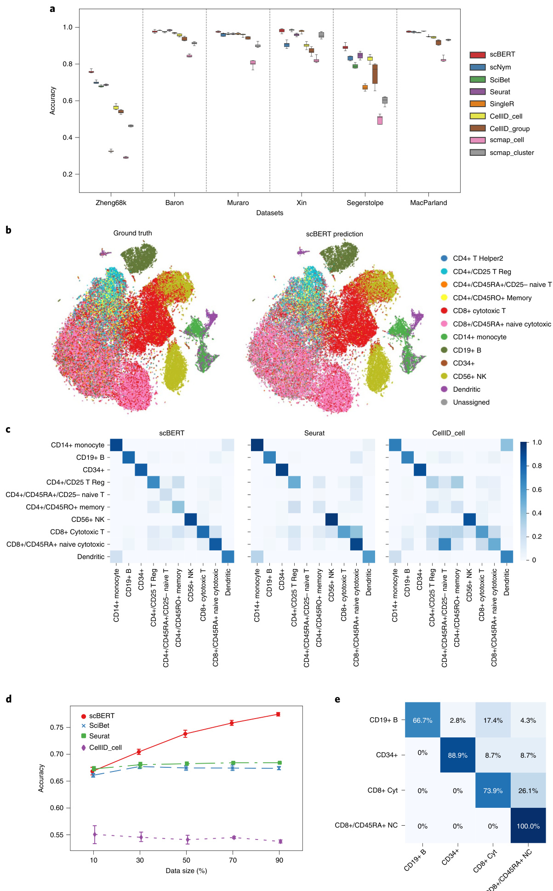

# nature machine intelligence  

# scBERT as a large-scale pretrained deep language model for cell type annotation of single-cell RNA-seq data  

Received: 3 February 2022  

Accepted: 19 August 2022  

Published online: 26 September 2022  

# Check for updates  

Fan Yang1,7, Wenchuan Wang1,2,7, Fang Wang1,7, Yuan Fang1,3,4, Duyu Tang1, Junzhou Huang5, Hui Lu    2,6   and Jianhua Yao    1  

Annotating cell types on the basis of single-cell RNA-seq data is a prerequisite for research on disease progress and tumour microenvironments. Here we show that existing annotation methods typically suffer from a lack of curated marker gene lists, improper handling of batch effects and difficulty in leveraging the latent gene–gene interaction information, impairing their generalization and robustness. We developed a pretrained deep neural network-based model, single-cell bidirectional encoder representations from transformers (scBERT), to overcome the challenges. Following BERT’s approach to pretraining and fine-tuning, scBERT attains a general understanding of gene–gene interactions by being pretrained on huge amounts of unlabelled scRNA-seq data; it is then transferred to the cell type annotation task of unseen and user-specific scRNA-seq data for supervised fine-tuning. Extensive and rigorous benchmark studies validated the superior performance of scBERT on cell type annotation, novel cell type discovery, robustness to batch effects and model interpretability.  

Single-cell RNA-sequencing (scRNA-seq) has been extensively used for the characterization of complex tissues and organisms at the single-cell level1–3, which has revolutionized transcriptomic studies. Accurate cell type annotation on scRNA-seq is critical for biological and medical research4. Cell type annotation methods can be categorized into three types: (1) annotation using marker genes, (2) annotation using correlation-based methods and (3) annotation by supervised classification5.  

Cluster-then-annotate is the commonly used method6, where manually curated marker genes identified from the literature are employed to assign cell types for clusters derived from unsupervised learning5. However, selecting the marker genes depends on the prior knowledge of researchers and is therefore prone to biases and errors7. Furthermore, marker genes for interested cell types are not always available, and novel cell types do not have marker gene sets yet. Besides, most cell types are determined by a set of genes instead of a single marker gene8. Without a proper method to integrate the expression information of multiple marker genes, it is difficult to guarantee a unified and accurate cell type assignment for each cluster9,10. For example, some automatic annotation methods are built on the hypothesis that marker genes should have high expression in cells. However, even some well-documented marker genes do not have high expression in all of the cells in the corresponding cell types11. The absence or fluctuation of the expression of these marker genes might therefore considerably affect the preciseness of markergene-based methods.  

Instead of relying on a spot of marker genes, correlation-based methods measure the correlation of gene expression profiles between the query samples and reference dataset5. These methods are potentially affected by the batch effect across platforms and experiments12. Although batch-effect correction methods exist, it is still challenging to distinguish true biological diversity from technical differences and thus preserve important biological variations13. Meanwhile, the commonly used similarity measures (that is, cosine similarity, Spearman’s correlation and Pearson correlation) may not be robust or efficient at measuring the distance between two sets of high-dimensional, sparse scRNA-seq data14.  

Annotation by supervised/semi-supervised classification methods follows the classic paradigm in machine learning that recognizes patterns in gene expression profiles and then transfers the labels from labelled to unlabelled datasets5. Such methods have been widely used recently due to their robustness to noise and variability of data, as well as their independence from artificially selected marker genes. Nevertheless, due to their limited model capacity, most of these methods need to perform highly variable gene (HVG) selection and dimensionality reduction before inputting the data into the classifier15–19. However, HVGs are variable across different batches and datasets, hindering their generalization ability across cohorts16. Dimensionality reduction techniques such as principal component analysis (PCA) may lose high-dimensional information as well as gene-level independent interpretability. Furthermore, the parameter settings for HVG selection and PCA in these methods are far from reaching a consensus and inevitably introduce artificial bias for performance evaluation15–19. Given that the HVGs are selected on the basis of the expression variance across the whole dataset, in which the dominant cell types account for the most variance, there is a risk of overlooking the key genes of rare cell types. Selecting HVGs ignores co-occurrence and the biological interactions of genes (especially between HVGs and non-HVGs), which are useful for cell type annotation20. Besides, simple classifiers such as fully connected networks were not able to efficiently capture gene–gene interactions. A new method with improved pattern recognition ability is therefore required to overcome the above issues of under-fitting to large-scale datasets.  

A growing number of deep learning-based methods have recently been applied to scRNA-seq data analyses and achieved superior performance21–23. The bidirectional encoder representations from transformers (BERT) is a state-of-the-art (SOTA) Transformer-based language representation learning model. It has made breakthrough progress in the fields of natural language processing (NLP) due to the powerful self-attention mechanism and long-range information integration capability introduced by transformer layers24,25. BERT’s paradigm of pretraining and fine-tuning enables the use of large-scale unlabelled data to improve the generalizability of the AI model. Inspired by such exciting progress, we developed single-cell BERT (scBERT) model for the cell annotation of scRNA-seq data. Following the pretraining and fine-tuning paradigm, we validated the power of applying self-supervised learning on large-scale unlabelled scRNA-seq data to improve the model’s generalizability and overcome the batch effect. Extensive benchmarking indicated that scBERT can provide robust and accurate cell type annotations with gene-level interpretability. To the best of our knowledge, scBERT pioneered the application of Transformer architectures in scRNA-seq data analysis with innovatively designed embeddings for genes.  

# Results  

# The scBERT algorithm  

The original BERT25 proposed a revolutionary technique that generates generic knowledge of language by pretraining and then transfers the knowledge to downstream tasks of different configurations using fine-tuning. Following BERT’s mentality and paradigm, we developed a novel and unified architecture named scBERT (Fig. 1), which learns general scRNA-seq knowledge by being pretrained on millions of unlabelled scRNA-seq data with a variety of cell types from different sources, and assigns cell types by simply plugging in a classifier and fine-tuning the parameters supervised by reference datasets. Pretraining enables the model to learn the general syntax of gene–gene interactions, which helps to remove the batch effects across datasets and improve the generalizability (Extended Data Fig. 1a). Fine-tuning ensures that the output embedding for each gene encodes context information that is more relevant to the transcriptional profiles of the reference dataset. To annotate a query cell, scBERT computes the probability for the cell to be any of the cell types labelled in the reference dataset by mining the high-level implicit patterns (Extended Data Fig. 1b). Note that if there is no cell type to assign with high confidence, the query cell would be labelled as unassigned to prevent incorrect assignment and to allow novel cell type discovery. Compared with the original BERT model, scBERT has some innovative designs to unleash its power in the cell type annotation task.  

First, the embedding of BERT includes token and position embeddings25. Our design of embeddings is similar to BERT in some aspects while having unique features to leverage gene knowledge. The token embedding of the original BERT is a discrete variable (standing for a word), whereas the raw expression input to our model is a continuous variable (standing for the expression of a gene in a single cell) with biological and technical noise. We draw on the bag-of-words technology in the $\mathsf{N L P}^{26}$ field to bin the expressions of genes (which could be considered as the gene transcript frequency in each cell), thus converting them to discrete values with the additional benefit of the reduction of the data noise to some extent. As shuffling the columns of our input does not change its meaning (like the extension of BERT to understand tabular data with TaBERT27), absolute positions are meaningless for genes. Instead, gene embeddings were obtained from gene2vec28 to represent the gene identity (each gene has a unique gene2vec embedding), which could be viewed as relative embeddings26 to capture the semantic similarity from the aspect of general co-expression. The co-expression genes retain closer representations, and distributed representations of genes have proven useful for capturing gene–gene interactions28. In this way, scBERT formalizes information on the gene expressions for Transformer efficiently and generates a single-cell-specific embedding (scBERT embedding) that represents the cell-specific expression (Extended Data Fig. 1c) after pretraining.  

Second, existing single-cell methods have to pre-process the raw data with selection or manipulation of genes (that is, HVG selection, manually selecting marker genes and PCA) due to their limited capability to efficiently model high-dimension data9,10,19,29–31; they would unavoidably bring artificial bias and overfitting problems, which in turn may severely impair their generalizability. Conversely, a Transformer with a large receptive field could effectively leverage the global information in scRNA-seq data and learn a comprehensive global representation for each cell by unbiasedly capturing long-range gene– gene interactions. Due to the computational complexity, the input sequence of Transformer is limited to a length of 512, whereas most of the scRNA-seq data contain over 10,000 genes. We therefore replaced the Transformer encoder used in BERT with Performer32 to improve the scalability of the model to tolerate over 16,000 gene inputs. With Performer, scBERT keeps the full gene-level interpretation, abandons the use of HVGs and dimensionality reduction and lets discriminative genes and useful interactions come to the surface by themselves (Extended Data Fig. 1d). scBERT therefore allows for the discovery of gene expression patterns and longer-range dependency for cell type annotation in an unbiased data-driven manner. scBERT is stable and robust, instead of relying heavily on the hyperparameter selection (Extended Data Fig. 1e).  

  
Fig. 1 | Overview of the scBERT model. a, Self-supervised learning on unlabelled data and fine-tuning on task-specific data. At the self-supervised pretraining stage, unlabelled data were collected from PanglaoDB. Masked expression embedding and gene embedding were added as input and then fed into the Performer blocks. The reconstructor was used to generate outputs. Outputs for masked genes were used to calculate the reconstruction loss. At the supervised fine-tuning stage, the task-specific scRNA-seq data were input into the pretrained encoder. The output representation then passed a one-dimensional convolution layer and a classifier to generate the cell type prediction. ⊕ represents elementwise addition. The Performer encoder is the component that is shared between the models used in the pretraining and fine-tuning stages. The reconstructor and   
the classifier are independently and separately employed for the models during the pretraining and fine-tuning processes. b, Illustration of the embeddings of scBERT. The preprocessed scRNA-seq data are first converted into discretized expression, and then the non-zero expressions are randomly masked. Taking the first gene as an example, the gene embedding $\mathsf{E}_{\mathrm{G}1}$ (the gene identity from gene2vec falling into the first bin) and the expression embedding $\boldsymbol{\mathrm{E}}_{\mathtt{B}2}$ (the gene expression falling into the second bin and being transformed to the same dimension as the $\mathsf{E}_{\mathrm{G}1})$ are summed and fed into scBERT to generate representations for genes. The representations are then used for pretraining or fine-tuning.  

# Evaluating cell type annotation robustness on intra-dataset  

We first benchmarked the performance of scBERT against other methods on nine scRNA-seq datasets covering 17 major organs/tissues, more than 50 cell types, over 500,000 cells, and mainstream single-cell omics technologies (Drop-seq, 10X, SMART-seq and Sanger-Nuclei), comprehensively considering the diversity in data size, as well as the data complexity33 (Supplementary Table 1). Marker-gene-based methods (SCINA, Garnett, scSorter), correlation-based methods (Seurat v4, SingleR, scmap_cell, scmap_cluster, Cell_ID(c), Cell_ID(g)) and machine learning-based methods (SciBet, scNym) were used for comparison (Supplementary Table 2). For each of the datasets, we applied the fivefold cross-validation strategy to avoid the influence of random results on the conclusion. scBERT surpassed the comparison methods in both accuracy and macro F1-score on most of the datasets (Fig. 2a and Extended Data Fig. 2).  

Among the intra-dataset, the Zheng68K dataset from human peripheral blood mononuclear cells (PBMCs) is the most representative dataset for benchmarking cell type annotation methods. Due to the severe cell type imbalance and the extremely high similarities between subtypes, even the SOTA method could not achieve an accuracy above 0.71. The performance of scBERT, with complete deletion of reported marker genes, is already on par with the best performance of existing methods (Extended Data Fig. 1b), demonstrating the superiority of scBERT’s pattern recognition ability on gene expressions compared with those methods that heavily depend on known marker genes. With the addition of marker genes, scBERT could capture more comprehensive gene expression patterns constructed by them. With all genes as inputs, scBERT surpassed SOTA methods by a large margin on overall cells (Fig. 2b,c, and Extended Data Figs. 3 and Fig. 4a; scBERT F1-score $=0.691$ , accuracy $=0.759$ ; best F1-score by other methods $=0.659$ , accuracy $=0.704\$ ) and achieved the highest performance for $\mathsf{C D8+}$ cytotoxic T cells and $\mathsf{C D8+/C D45R A^{+}}$ T cells (F1-score $=0.788$ versus 0.617, $P$ -value $=9.025\times10^{-5}$ ; accu$\mathbf{racy}=0.801$ versus 0.724, $P$ -value $=2.265\times10^{-5}\phantom{^{-}}$ ), which are highly similar and were difficult to distinguish in previous studies34. The results indicated that scBERT could recognize the underlying gene expression patterns and long-range gene–gene dependency after pretraining, capture diverse feature subspace by multi-head attention and enjoy comprehensive high-level representation of cell type-specific global information.  

Notably, the list of best-performing methods changes across different tasks and datasets, whereas scBERT is always among it. For instance, the top-tier methods for the inter-dataset (that is, scNym and Seurat) performed badly on the Xin dataset in Fig. 2. These uncertainties in performance reflect the limitations of the comparison methods in their generalizability, as well as the generalization of our method across all of the benchmarking datasets.  

To explore whether the number of cells of a reference dataset affects the performance of scBERT, we constructed a series of reference datasets from the Zheng68K dataset by uniformly subsampling it proportionally from $10\%$ to $90\%$ (Fig. 2d). With only $30\%$ of the cells, scBERT outperformed all of the other methods and its performance improved rapidly as the reference cell number increased.  

Fig. 2 | Benchmarking and robustness evaluation by intra-dataset crossvalidation. a, Performance of cell type annotation methods measured by accuracy and F1-score on $n\,{=}\,9$ datasets using fivefold cross-validation. Box plots show the median (centre lines), interquartile range (hinges) and 1.5-times the interquartile range (whiskers). The F1-scores of these datasets are shown in Extended Data Fig. 2a. The performance of SCINA, Garnett and scSorter is shown in Extended Data Fig. 2b. The results of Tucker dataset, Lung dataset and Human Cell Atlas dataset are shown in Extended Data Fig. 2c,d. b, t-SNE plot of the whole Zheng68K dataset $^{\prime}\!{n}\!=\!68{,}450$ cells). Left panel is coloured by expert-annotated cell types from the original research; right panel is coloured by scBERT predictio results. The t-SNE plots of the annotation of comparison methods are shown  

We next tested the robustness of scBERT when the distributions of cell types were severely biased. Four cell types from the Zheng68K dataset ( $\scriptstyle\mathrm{CD}8+$ cytotoxic T cells, CD19 $^+$ B cells, $\mathsf{C D34+}$ cells and $\mathsf{C D}8\!+\!/$ $\mathsf{C D45R A^{+}}$ naive cytotoxic cells), with transcriptomic similarity between each pair, were selected for class-imbalanced tests. scBERT surpassed all of the other methods (accuracy $=0.840$ and F1-score $=0.826\$ ). Seurat misidentifed $\mathrm{{CD8+}}$ cytotoxic T cells as $\mathrm{CD8+/CD45RA+}$ naive cytotoxic cells, whereas SingleR misclassified all of the ${\mathsf{C D19}}\!+\!\mathbf{B}$ cells due to their rarity. scBERT, however, exhibited the lowest misclassification rate even though the two cell populations are highly similar (Fig. 2e and Extended Data Fig. 4b). Overall, the results indicate that scBERT is robust to class-imbalanced datasets.  

# Cell type annotation across cohorts and organs  

In real-world circumstances, the reference and query datasets are always sourced from multiple studies, and even different sequencing platforms, where the batch effects can lead to poor performance on cell type annotation (Fig. 3a). Here we benchmarked scBERT and comparison methods by employing a leave-one-dataset-out strategy with human pancreas datasets generated by distinct sequencing techniques (Baron35, Muraro36, Segerstolpe37 and $\mathsf{X i n}^{38}$ ; Fig. 3 and Extended Data Fig. 5). Machine-learning-based methods (scBERT, scNym and SciBet) achieved the best results, indicating that cell-type-specific patterns could be discovered by pattern recognition without being affected by batch effects; Seurat, however, relies on compulsive batch correction before the annotation. For cross-cohort data, scBERT achieved a superior performance by a large magin, with an accuracy of 0.992 compared with scNym (accuracy of 0.904), and outperformed other popular methods (accuracies: SciBet $=0.985$ , Seurat $=0.984$ , SingleR $=0.987$ ; Fig. 3b). scBERT correctly annotated most cells $(>\!97\%)$ in the Muraro dataset, and over $99\%$ of the cells in the other three datasets, demonstrating the superb and stable performance of our method in cross-cohort tasks. By contrast, scNym misclassified the alpha cells as the beta cell type and was confused by the beta and delta cells (Fig. 3e,f). We then used cells from different organs to benchmark the performance of scBERT and comparison methods on cross-organ dataset. The experiment results demonstrated that scBERT is on par with comparison methods on cross-organ task (Extended Data Fig. 5b). scBERT showed its robustness in identifying cells from different sequencing technologies, experiments, different disease states (type-2 diabetes and health) and even different organs.  

# Discovery of novel cell types  

In most tasks, the reference dataset may not cover all of the cell types present in the query dataset. The marker-based methods are hindered by the manually selected markers of known cell types and therefore may face difficulty distinguishing unseen cell types; the correlation-based methods, however, usually force the model to assign a novel class to the closest known class. The machine learning-based methods could automatically and actively detect the novel cell types by checking the predicted probability. Besides, scBERT enjoys some potential advantages. First, the multi-head attention mechanism allows scBERT to extract information from different representation subspaces, which in Extended Data Fig. 3. c, Heatmaps for the confusion matrices of the crossvalidation results on the Zheng68K dataset for scBERT, Seurat and CellID_cell. The confusion matrices of other methods are included in Extended Data Fig. 4a. d, The influence on the cell type annotation performance by splitting different proportions of the Zheng68K dataset as the reference set for finetuning. The standard deviations are shown as the error bar. e, Heatmap for the confusion matrices of scBERT of cross-validation on the imbalanced dataset reconstructed from Zheng68K dataset. The confusion matrices of other methods are included in Extended Data Fig. 4b. The detailed reconstruction process is introduced in the Methods.  

might be a benefit for capturing the subtle differences between novel and known cell types. Second, scBERT may have possibly seen the novel cells and learnt their unique patterns during pretraining on a large-scale, diverse dataset. Third, Transformer with a large receptive field could effectively learn comprehensive global representation by capturing long-range gene–gene interactions, which may better characterize and distinguish novel cells41. scBERT performed the best on novel cell types and achieved the top-ranked performance on the known cell types (Fig. 4). CellID_cell performed well on known cell types but failed to discover any novel cells. SciBet and scmap_cluster are prone to assigning unknown labels to those cells from known types, which greatly reducees their known cell type classification accuracy.  

  

  
Fig. 3 | Performance of scBERT across independent datasets generated by different single-cell sequencing technologies. a, A t-SNE representation of 10,220 cells from four independent datasets (Baron, Muraro, Segerstolpe and Xin) generated by different sequencing platforms (inDrop, CEL-Seq2, SMARTSeq2 and SMARTer). Cells are coloured by the source of datasets. b, t-SNE representation of alpha, beta, delta and gamma cells from four pancreas datasets coloured by the annotated cell types provided by the atlas from the original paper. c, Comparison of accuracy and F1-score of inter-dataset cross-validation among different methods. The lower and upper hinges denote the first and third   
quartiles, with the whiskers in the range of 1.5-times the interquartile. d, Zoomedin plot of accuracy and F1-score of the top-tier methods. e, t-SNE representation of alpha, beta, delta and gamma cells from four pancreas datasets (left), beta cells from the Muraro dataset (middle) and alpha cells from the Segerstolpe dataset (right) coloured by scBERT prediction. f, t-SNE representation of alpha, beta, delta and gamma cells from four pancreas datasets (left), beta cells from the Muraro dataset (middle) and alpha cells from the Segerstolpe dataset (right) coloured by scNym prediction. t-SNE plots of other comparison methods are shown in Extended Data Fig. 5a.  

  
Fig. 4 | Identification of novel cell types. a, Performance of scBERT on the MacParland dataset from human liver tissue by removing alpha–beta T cell, gamma–delta T cell, mature B cell and plasma cell populations during the scBERT training process. The accuracy and F1-score of both novel cell types and known cell types are shown in the box plots, where the median (centre lines), interquartile range (hinges) and 1.5-times the interquartile range (whiskers) are shown. b, Left: the confidence scores provided by scBERT for the cell types of   
MacParland; the cells with low probability of model prediction (probability $<0.5$ ) for all known cell types are assigned as potential novel cell types. Right: Sankey plot comparing scBERT predictions on known and novel cell types with original cell-type annotations for the MacParland dataset, where plasma cells are labelled as novel cell type as they are unseen by the scBERT training process. EC: endothelial cell.  

  
Fig. 5 | Model interpretability. a, Heatmap for the attention weights provided by scBERT on the Pancreas cell type annotation task. The detailed attention estimation process is described in Methods. Top 10 genes with highest attention weights are listed for each cell type. The complete top gene list can be found in Supplementary Table 3. b, The results of enrichment analysis of the top attention genes from scBERT, with the complete information provided in Supplementary   
Tables 4–15. c, Dot plot showing z-scores among the ten genes receiving the highest attention, and the cell types. The size and colour of each dot reflect the $z$ -score. d, UMAP representation of alpha, beta, delta and gamma cells from the Muraro dataset coloured by cell types, based on the scBERT embedding (left) and the raw expression (right) of each cell. The adjusted Rand index (ARI) score is calculated and shown in the plot.  

Compared with SciBet and scmap_cluster, our method achieves superior accuracy on both the novel (scBERT $=0.329\$ versus SciBet $=0.174$ and scmap_cluster $=0.174\$ ) and known $(\mathsf{s c B E R T}=0.942$ versus SciBet $=0.784$ and scmap_cluster $=0.666^{}$ ) classes. Taken together, these results suggest that scBERT can correctly discover novel cell types that are not present in original reference datasets while remaining accurate in predicting the performance of other cell types.  

# Investigating scBERT model interpretability  

Existing machine learning methods have to select HVGs or reduce dimensionality due to their simplified network architecture and low model capacity, hence destroying the gene-level interpretability. By contrast, the attention mechanism employed in scBERT naturally provides hints for the decision-making of the model using every individual gene.  

Here we took the Muraro dataset as an illustration, and top-attention-gene lists were produced for the four kinds of pancreas islet cells, with well-studied biological functions (Fig. 5a). The top-attention genes included reported markers of specific cell types (LOXL4 for alpha cells and ADCYAP1 for beta cells39; Extended Data Fig. 6a). Almost all of the top-attention genes, except markers, were identified as differentially expressed genes using DESeq40, as potential novel markers (Fig. 5c and Extended Data Fig. 6b). For instance, SCD5 has not been reported as a cell-type-specific marker for beta cells, but in a GWAS study, a novel loci for type-2 diabetes susceptibility was fine-mapped to a coding variant of ${\mathsf{S C D}}^{41}$ . The results demonstrated that scBERT could facilitate understanding the cell type annotated and provide some support for further biological findings.  

Enrichment analysis was performed for the top-50 attention-gene lists using various gene-set libraries; the results revealed that there were some interesting relationships between the top enriched terms and the corresponding cell types (Fig. 5b and Supplementary Tables 3–15). In particular, with the cell-type-associated gene-set library from PanglaoDB, the top-one-enriched term for each type always hits the true cell population. As another example, insulin secretion and AMPK signal pathway, the top-two-enriched KEGG pathways in beta cells, are vital to beta cell function. Furthermore, based on the clustering performance, the scBERT embedding is more distinguishable for cell type annotation than raw gene expression (ARI: 0.95 versus 0.87), indicating the efficiency of scBERT in learning single-cell-specific representation, which can be used for downstream analysis (Fig. 5d).  

# Discussion  

To improve the generalization ability of the cell type annotation algorithm and the interpretability of individual gene importance, we developed scBERT (a deep learning model with a multi-head attention mechanism and self-supervised strategy) to learn domain-irrelevant gene expression patterns and interactions from the whole genome expression of large-scale, unlabelled scRNA-seq data; transfer the general knowledge to cell type annotation task by fine-tuning; and trace back to the importance of each individual gene for model interpretability. By systematically analysing the components of scBERT, we gain several insights into the application of Transformer in single-cell data analysis (that is, the benefits of pretraining, recognization of non-marker patterns, detection of subtle gene–gene interactions, single-cell-specific embeddings and hyperparameters sensitivity). See the Methods and Extended Data Fig. 1 for a systematic analysis.  

scBERT surpasses the existing advanced methods on diverse benchmarks, collectively involving 9 single-cell datasets, 17 major organs/tissues, more than 50 cell types, over 500,000 cells and the mainstream single-cell omics technologies (that is, Drop-seq, 10X, SMART-seq and Sanger-Nuclei), indicating its generalization and robustness. Notably, we employed the accuracy, macro F1-score and confusion matrix as evaluation metrics to benchmark the performance of cell type annotation methods on their classification ability for a fair comparison in this study.  

To the best of our knowledge, there is currently no research on applying Transformer architectures to gene expression data analysis. The originally designed end-to-end scBERT framework, with gene expression embedding and a self-learning strategy, has superior performance, interpretability and generalization potential on cell type annotation tasks. Beyond that, scBERT can also be applied to other tasks by simply modifying the output and supervision signals. scBERT, as an effective cell type annotation tool, has been released on the platform for public usage. We hope that scBERT could improve understanding of cell-type-associated gene–gene interactions and nurture the revolution of AI paradigm in single-cell RNA-seq analysis.  

Despite the above advantages, the scBERT may face potential limitations including gene expression embedding, modelling gene interactions and the masking strategy during the pretraining stage.  

First, the token embedding of the original BERT is for discrete variables (standing for a word), whereas the expression input is a continuous variable (standing for the expression of a gene in a single cell), which may have biological and technical noise. scBERT converts them to discrete values and could thus reduce some data noise compared with existing methods, which utilize the expression values directly; however, it sacrifices some data resolution, and there is still room to optimize the embedding of gene expression for model input. Our approach for binning the expression may cause some resolution loss. Second, gene interactions usually exist in the form of networks (that is, gene regulatory networks and biological signalling pathways)42, and this kind of prior knowledge has not been explicitly incorporated in scBERT. Aggregating information from neighbours within a graph neural network based on biological networks may better mimic gene– gene interactions. The idea could be applied to the single-cell analysis by building cell-level graph using the scRNA-seq data. From this point of view, it can be foreseen that Transformers for graph43 may be the future development direction of scBERT44. Third, the efficiency of masking during pretraining is another point worth optimizing. The current masking strategy in scBERT is simplified with non-zero masking. With the zero-inflated input45, the model might be inclined to output all zeroes for the reconstruction task during pretraining. We therefore masked the non-zero values and calculated the loss based on the non-zero values during pretraining; however, masking only the non-zero values may lower the utilization of the single-cell data for pretraining, due to their minority. Advanced masking strategy tailored for single-cell data could be introduced to improve the computational efficiency of the masking process.  

For future work, we would like to explore the versatility and flexibility of scBERT in a variety of downstream tasks (that is, gene–gene interaction, batch correction, clustering, differential analysis in disease conditions)46.  

# Methods  

# The scBERT model  

The scBERT model adopts the advanced paradigm of BERT and tailors the architecture to solve single-cell data analysis. The connections of our model with BERT are given as follows. First, scBERT follows BERT’s revolutionary method to conduct self-supervised pretrain$\mathbf{ing}^{25}$ and use Transformer as the model backbone32. Second, our design of embeddings is similar to BERT in some aspects while having unique features to leverage gene knowledge. From this perspective, our expression embedding could be viewed as the token embedding of BERT. As shuffling the columns of our input does not change its meaning (like the extension of BERT to understand tabular data with TaBERT27), absolute positions are meaningless for gene. We instead use gene2vec to produce gene embeddings, which could be viewed as relative embeddings26 that capture the semantic similarities between any of two genes. Third, Transformer with global receptive field could effectively learn global representation and long-range dependency without absolute position information, achieving excellent performance on non-sequential data (such as images, tables)24,27.  

Gene embedding. In NLP, the inputs of the BERT model are word embeddings, a set of real-valued vectors in a pre-defined vector space that represent individual words. The word embedding technology helps to better represent the text by assuring the words with similar meanings have a similar representation46. However, from the aspect of scRNA-seq, the inputs are constituted by individual genes and a pre-defined vector space is needed to represent the similarity between them. Hence we employed gene2vec28 to specifically encode gene embeddings. In this way, the difficulty of model training is reduced, with the help of the inter-gene relationship provided by past knowledge.  

Expression embedding. In spite of the gene embedding, there is also a challenge on how to utilize the transcription level of each gene, which is actually a single continuous variable. It is worth noting that the frequency of a word’s occurrence in a text is valuable information for text analysis and is often transformed as a bag-of-words by term-frequency statistical analysis for downstream tasks in the area of $\mathbf{\partial}^{\mathbf{N}\mathbf{L}\mathbf{P}^{47}}$ . The gene expression could also be considered as the occurrence of each gene that has already been well-documented in a biological system. From this insight, we applied the conventionally used term-frequency-analysis method that discretizes the continuous expression variables by binning, and converts them into 200-dimensional vectors, which are then used as token embeddings for the scBERT model.  

Model building. The quadratic computational complexity of the BERT model with Transformer as the basic unit does not scale very well to long sequences, whereas the gene number of scRNA-seq can be up to more than 20,000. To this end, a matrix decomposition version of Transformer (that is, Performer) was employed to enlarge the sequence length. The regular dot-product attention in Transformer is a mapping of $Q,K,V,$ which are encoded representations of the input queries, keys and values created for each unit, respectively. The bidirectional attention matrix is formulated as:  

$$
\mathsf{A t t}\,(Q,K,V)=D^{-1}\left(Q K^{T}\right)\,V,D=\mathsf{d i a g}\left(Q K^{T}\mathbf{1}_{L}\right)
$$  

where $Q=W_{q}X,K=W_{K}X,V=W_{V}X\colon$ re linear transformations of the input $X;W_{Q},W_{K},W_{V}$ are the weight matrices as parameters; ${\bf1}_{L}$ is the all-ones vector of length $L$ ; and diag(⋅) is a diagonal matrix with the input vector as the diagonal.  

The attention matrix in Performer is described as follows:  

$$
\widehat{\mathsf{A t t}}\left(Q,K,V\right)=\hat{D}^{-1}\left(Q^{\prime}\left(\left(K^{\prime}\right)^{T}V\right)\right),\hat{D}=\mathsf{d i a g}\left(Q^{\prime}\left(\left(K^{\prime}\right)^{T}\mathbf{1}_{L}\right)\right)
$$  

where $Q^{\prime}=\varnothing(Q),K^{\prime}=\varnothing(K),$ , and the function $\emptyset(x)$ is defined as:  

$$
\otimes(X)={\frac{c}{\sqrt{m}}}f\!\left(\omega^{T}X\right)
$$  

where $c$ is a positive constant, $\omega$ is a random feature matrix, and $m$ is the dimesionality of the matrix. Here we constructed our model with six Performer encoder layers and ten heads for each layer.  

The model training process contains two stages: self-supervised learning on unlabelled data to get a pretrained model and supervised learning on the specific cell type annotation tasks to get the fine-tuned model.  

Self-supervised learning on unlabelled data. In this study, we followed the conventional self-learning strategy of the BERT model in NLP tasks by randomly masking the input data value and making a prediction on the basis of the remaining inputs. Considering the dropout zeroes phenomenon48, we randomly masked the non-zero gene expression and then reconstructed the original inputs by model predictions using the remaining genes. We ultilized cross-entropy loss as the reconstruction loss, formulated as:  

$$
L_{\mathrm{Rec}}=-\sum_{i=1}^{M}\sum_{j=1}^{N}y_{i,j}\log\left(p_{i,j}\right)
$$  

where M is the number of cells and $N$ is the number of masked gene expression values; $y_{i,j}$ and $p_{i,j}$ are the true and predicted expressions, respectively, of gene j in cell i. With this self-supervised strategy, the model can learn general deep representations of gene expression patterns on the large amount of unlabelled data, which might alleviate the efforts of the downstream fine-tuning process.  

Supervised learning on specific tasks. The output of scBERT was a 200-dimensional feature corresponding to each gene, and a one-dimensional convolution was applied for abstract information extraction for each gene feature. A three-layer neural network was then applied as the classification head and transformed the gene features into the probability for each cell type. Cross-entropy loss was also employed as the cell type label prediction loss, calculated as:  

$$
L_{\mathrm{Pred}}=-\sum_{i=1}^{M}z_{i}\log\left(q_{i}\right)
$$  

where $z_{i}$ and $q_{i}$ indicate the ground-truth cell type label and predicted label of cell i, respectively.  

# Datasets  

As the model training consists of two stages, self-supervised learning on unlabelled data and fine-tuning on task-specific data, the dataset used in the two stages were collected from different sources to avoid data leakage. In the first stage, large amounts of data without annotations were used for general pattern learning, whereas, in the second, task-specific data with well-annotated cell labels were required for the subsequential systematic benchmarking of the scBERT and SOTA methods. To this end, we only included scRNA-seq datasets that provided highly credible cell type annotation and had been cited by the majority of the cell type annotation methods for performance evaluation.  

The Panglao dataset. The Panglao dataset49 was downloaded from the PanglaoDB website (https://panglaodb.se/). In brief, PanglaoDB integrated 209 human single-cell datasets comprising 74 tissues with 1,126,580 cells originating from different experimental sources via various platforms. In this study, we used scRNA-seq data from PanglaoDB for first-stage pretraining. No annotations or cell labels were used at the first stage as the self-learning strategy was employed, and only the genes and their expression levels were needed as inputs for the scBERT model.  

Zheng68k dataset. The Zheng68k is a classic PBMC dataset by 10X CHROMIUM that is widely used for cell type annotation performance acessment34. It contains about 68,450 cells within eleven subtypes of cells: $\mathbf{CD8+}$ cytotoxic T cells $(30.3\%)$ , $\mathsf{C D8+/C D45R A+}$ naive cytotoxic cells $(24.3\%)$ , $C_{ Ḋ }\mathsf{D}56+$ NK cells $(12.8\%)$ , ${\mathsf{C D4+}}/{\mathsf{C D}25}^{\prime}$ T Reg cells $(9.0\%)$ , ${\bf C D19+\Omega}$ B cells $(8.6\%)$ , ${\mathsf{C D4+}}/{\mathsf{C D45R O^{+}}}$ memory cells $\left(4.5\%\right)$ , $\mathsf{C D14+}$ monocyte cells $(4.2\%)$ , dendritic cells $(3.1\%)$ , $\mathrm{CD4+/CD45RA+/CD25}$ - naive T cells $(2.7\%)$ , $\mathsf{C D34+}$ cells $\left(0.4\%\right)$ and $\mathsf{C D4+}$ T Helper2 cells $(0.1\%)$ . The Zheng68k dataset contains rare cell types, and the distribution of cell types in this dataset is imbalanced. Strong correlations between cell types make it difficult to differentiate them.  

Pancreas datasets. The pancreas datasets comprise Baron, Muraro, Segerstolpe and Xin. The cell type labels were aligned and four cell types were included. The Baron dataset was downloaded from the Gene Expression Omnibus (GEO) (accession no. GSE84133) and the protocol was inDrop35. The Muraro dataset was downloaded from GEO (accession no. GSE85241) and the protocol was CEL-Seq236. The Segerstolpe dataset was accessed from ArrayExpress (accession no. E-MTAB-5061) and the protocol was Smart-Seq237. The Xin dataset was downloaded from GEO (accession no. GSE81608) and the protocol was SMARTer38. The above pancreas datasets were generated from different experiment platforms (Supplementary Table 1).  

MacParland dataset. The MacParland dataset50 from human liver tissue contains 20 hepatic cell populations from the transcriptional profiling of 8,444 cells by 10X CHROMIUM. We downloaded the data from GEO (accession no. GSE115469) and generated the cell type annotation following the authors’ reported procedure.  

Heart datasets. The heart datasets contain one large dataset51 for pretraining, and the Tucker dataset52 for benchmarking and evaluation in the hyperparameter sensitivity analysis. The large heart dataset for pretraining contains 451,513 cells from 11 cell types by four different sequencing platforms (Harvard-Nuclei, Sanger-Nuclei, Sanger-Cells, and Sanger-CD45) and was downloaded from https:// data.humancellatlas.org/explore/projects/ad98d3cd-26fb-4ee3- 99c9-8a2ab085e737. The Tucker dataset contains 287,269 cells from 11 cell types via single nuclear RNA-sequencing and was downloaded from https://singlecell.broadinstitute.org/single_cell/study/SCP498/ transcriptional-and-cellular-diversity-of-the-human-heart.  

Lung dataset. The lung dataset was from human lung tissue and analysed for COVID-19-related disease mechanisms53. The dataset contains samples from 12 donors by 10X Genomics sequencing, and 39,778 cells from nine cell types. The data were downloaded from https://doi. org/10.6084/m9.figshare.11981034.v1.  

Human Cell Atlas dataset. The Human Cell Atlas dataset54 contains 84,363 cells from 27 cell types among 15 major organs (skin, oesophagus, trachea, heart, spleen, common bile duct, stomach, liver, blood, lymph node, small intestine, bladder, rectum, marrow, muscle) by HiSeq X Ten sequencing. The dataset was downloaded from GEO (accession no. GSE159929).  

# Data pre-processing  

As for the data provided in gene expression matrix format, log-normalization was performed on the data, using a size factor of 10,000 and quality control by filtering cell outliers with less than 200 genes expressed. As for the input of scBERT, no dimension reduction or HVG selection was processed as scBERT has a capacity of more than 20,000 genes as input and retains full gene-level interpretability.  

# Comparison methods  

For benchmarking, we implemented SOTA methods from the three annotation categories: marker-based, correlation-based and supervised classification. Among them, SCINA, Garnett and scSorter represent annotation using marker gene databases; Seurat, SingleR, CellID and scmap are correlation-based methods; and scNym and Scibet are the SOTA methods that conduct annotation by supervised/semi-supervised classification. Notably, this categorization depends on how the most important process is conducted. As for marker gene-based annotation, the CellMarker database with manually curated cell-type markers using a literature search of over 100 000 papers was applied for the marker database55. No manual selection of the marker genes was included for an unbiased and fair comparison of all of the methods.  

scNym. scNym is a recently proposed semi-supervised learning annotation method that leverages the unlabelled target data through training a domain adversary56. It requires no prior manual specification of marker genes. It makes use of the target data by domain adaptation and achieves the best performance on several tasks; however, users have to endure the inconvenience that they must re-train the model on each batch of new-coming data.  

SciBet. Scibet is a supervised classification method that selects genes using E-test for multinomial model building and annotates cell types for a new cell in the test set19. We adopted SciBet in R package for benchmarking.  

Seurat. As a popular single-cell data analysis pipeline, Seurat is widely used by biologists and clinical experts. Seurat maps the query samples to the reference dataset in a reference-based annotation manner57. In this study, we adopted the implementation of the cell type annotation of Seurat v.4.0 and followed the cell type annotation tutorial provided by Seurat for benchmarking.  

SingleR. SingleR is a reference-based analysis method that calculates the Spearman coefficient on variable genes and aggregates the coefficients to score the cell for each cell type58. It iterates on the above process by subsampling top genes until the most closely related cell types are distinguished. The SingleR package was applied for benchmarking.  

CellID. CellID is a clustering-free multivariant statistical method for cell type annotation that performs dimensionality reduction, evaluates the gene-to-cell distance and extracts gene signatures for cells (cell-to-cell strategy) and groups (group-to-cell strategy)29. In this study, both strategies from the R package were used for benchmarking.  

scmap. A reference-based annotation method including two strategies: scmap_cluster and scmap_cell; scmap_cluster maps individual cells from query samples to certain cell types in the reference dataset, whereas scmap_cell maps individual cells from query samples to individual cells in a reference dataset30. Both scmap_cluster and scmap_cell perform feature selection and calculate distances (the cosin and euclidean distances). The reference is searched for the nearest neighbours to a query cell. We used the R package of scmap for the scmap-cluster and scmap_cell tools.  

SCINA. SCINA is a typical marker gene-based annotation method that requires a list of marker genes for different cell types and identifies the cell types based on the assumption that there exists a bimodal distribution for each marker gene and the higher modes belong to the relevant cell type9. We used the Scina package for benchmarking.  

Garnett. Garnett requires a user-defined cell hierarchy of cell types and marker genes as input. Garnett aggregates marker gene scores using term frequency-inverse document frequency transformation and uses an elastic-net regression-based model for annotation10. We adopted the original R package to use the garnet model for benchmarking.  

scSorter. Scsorter employs marker genes and the HVGs for clustering and cell type annotation based on the observation that most marker genes do not consistently preserve high expression levels in all of the cells belonging to the related cell types31. Here we adopted the R implement of Scsorter.  

# Benchmarking  

To assess the performance of the annotation methods under different scenarios, nine pairs of reference and test datasets were generated, and the performance was evaluated using scBERT and all the above methods. The details are listed below.  

Performance on intra-dataset data using cross-validation. The PBMC data are from Zheng68k with high inter-class similarity, the Pancreas datasets (Baron, Muraro, Segerstolpe and Xin), the MacParland dataset, the Tucker dataset, the Lung dataset and the Human Cell Atlas dataset and were employed to test the performance on the intra-dataset in a fivefold cross-validation manner. Notably, the reference dataset in this section also refers to the training dataset for the supervised methods, including scBERT.  

Performance on the inter-dataset data. To evaluate the robustness of the methods on cross-cohort data with batch effects from different single-cell sequencing platforms, we tested the methods on four pancreas datasets (Baron, Muraro, Segerstolpe and Xin), taking three datasets as the training set and the remaining one as the test set each time. Considering the difference in cell populations among these datasets, all datasets were aligned, retaining only four kinds of pancreas islet cells (alpha, beta, delta and gamma cells) that are common in these datasets. To evaluate the robustness of the methods on cross-organ data, we tested the methods on three major organs (the oesophagus, rectum and stomach) from Human Cell Atlas dataset.  

The influence of reference cell amount on the performance. The number of reference cells is prone to influence the model performance. In this study, $10\%$ , $30\%$ , $50\%$ , $70\%$ and $90\%$ of the PBMC cells from the Zheng68K dataset were randomly selected as the reference for fine-tuning while the remaining as the query samples for testing.  

Class-imbalanced data tests. Following the construction method for class-imbalanced data4, we collected four PBMC cell types $\left(\mathbf{CD19}\!+\!\mathbf{B}\right)$ , $\mathsf{C D8+}$ cytotoxic T, $\mathsf{C D34+}$ and $\mathsf{C D8+},$ /CD45RA naive cytoxic cells) that contain various levels of similarity across cell types from Zheng68K data. The cells of the four types were randomly selected with the cell numbers 10,000, 100, 10,000 and 100, respectively, as reference data for fine-tuning. As for model testing, 100 cells were randomly selected per cell type as query data.  

Novel cell type detection. Human liver tissue was used to assess the unknown cell type identification. Here we adopted MacParland dataset50 from human liver tissues with 8,434 cells belonging to 14 cell types. In this experiment, we took four immune cells for novel cell type simulation, which were absent from other liver datasets. Following the schema proposed in the previous study7, we performed leave-out one cell type evaluation by removing one cell type from the reference dataset while keeping the cell type groups in the query dataset. The evaluation process was iterated on each cell type. At present, there is no unified quantitative evaluation metrics for detection of novel cell type. Some approaches compute the accuracy by putting the novel class together with known classes, which unavoidably overwhelms the models’ accuracy for rare and novel cell types. Besides accurately detecting novel cell types, a good cell type annotation method should maintain the ability to accurately discriminate known cell types. In this regard, we evaluate the accuracy of novel cell type and known cell types, separately. Notably, we employed a strict evaluation method for novel cell types with the accuracy calculated on the union set of cells with the novel cell type label and the cells that are predicted as novel cell types.  

Assessment on the necessity of self-learning. To illustrate the necessity of the self-learning process of scBERT, the performance gain was evaluated on the model after self-learning and fine-tuning compared to the model training from scratch.  

Evaluation metrics. Cell type annotation performance of each method at cell-level and cell-type-level was evaluated using the metrics of accuracy and macro F1-score, respectively. Since cell type annotation task and cell clustering task are not equivalent, those metrics assessing the quality and distance of clusters are excluded from this study.  

Sensitivity analysis on the hyperparameters. The influence of the hyperparameters (size of the embedding vector, the binning setting, the number of encoder layers and the number of heads for each layer) were systematically estimated on the heart datasets with large-scale heart dataset (451,513 cells) as the pretraining dataset and the Tucker dataset as the evaluation dataset.  

Scalability. When evaluating on the large Tucker datasets with 287,269 cells, those comparison methods implemented in R faced severe problem in scalability due to their poor memory management. For instance, CellID met the memory bottleneck when calculating a matrix of $50,000\times230,000$ , and we made efforts to split the matrix into pieces to avoid memory overflow. Conversely, benefiting from mini-batch sampling and the efficient Performer encoder, scBERT could easily deal with large-scale datasets at both the pretraining and the fine-tuning stage.  

Marker genes for the marker-based comparison methods. To avoid bias introduced by marker selection, well-documented marker lists associated with well-defined cell types from CellMarker55 were used.  

# Systematic analysis of scBERT  

Pretraining versus not pretraining. Following BERT’s pretraining and fine-tuning paradigm, our method is prone to generate an efficient encoder and provide a general embedding that better represents the gene expression of each cell by revealing critical patterns with lower data noise. The results of the ablation study on model performance with and without pretraining (Extended Data Fig. 1a) demonstrated the essentiality of pretraining for the model’s downstreaming task (that is, cell type annotation), with a relatively large and important difference in the bioinformatics field. The scBERT model extracts the useful attention pattern on gene expressions and interactions from a large scale of various scRNA-seq data, alleviating the efforts of the fine-tuning process on the specific downstream tasks.  

Feasibility on classifying with gene expression patterns. It is well known that marker genes play a key role in cell type annotation for marker gene-based annotation, and most of the reference-based annotation. Even some of the supervised-based methods are heavily dependent on prior marker gene knowledge. Among the current mainstream methods that use marker genes for classification, some methods use the gene expression pattern for cell type annotation. Both types of method were reported to achieve good performance on variable cell type annotation tasks, indicating that both types of data imply discriminative information for different cell types. To investigate the effect of marker genes and the discriminant ability of the remaining expression patterns that comprise only the non-marker genes, we conducted experiments in which marker genes were eliminated gradually, leaving the remaining expression profiles for cell type annotation (Extended Data Fig. 1b and Supplementary Table 16). The results prove that the marker genes are important for cell type annotation; however, in addition to the marker genes, there are still informative gene patterns that have good distinguishing power on cell type classification. With deletion of $100\%$ of marker genes, scBERT can still efficiently learn the informative gene patterns and achieve a performance that is on par with the best performance achieved by comparison methods with all of the marker genes on the representative Zheng68K dataset (Extended Data Fig. 1b). We also explored detected gene lists from scBERT, and other machine learning (scNym) and non-machine learning (Seurat) methods on MacParland and Baron, respectively (Supplementary Tables 17 and 18). Consistent with the above experiment on the deletion of markers, we observe that machine learning-based methods tend to learn high-level implicit cell-type-specific patterns (that is, discovering some genes with a high rank across cell types), whereas non-machine-learning-based methods usually simply find differentially expressed genes using statistics analysis. The results indicated that the attention mechanism, saliency mechanism and statistics analysis could gain complementary information from different perspectives on the mining pattern of single-cell data.  

General gene embedding versus single-cell-specific embedding. Gene2vec is based on bulk data28, which measures the average expression of genes from tissues and is the sum of cell type-specific gene expression weighted by cell type proportions59. In this regard, gene2vec maintains the general co-expression patterns of genes but stays away from strong noise and high sparsity of single-cell sequencing. We therefore utilized gene2vec as our gene embedding to represent the gene identity (each gene has a unique gene2vec embedding) and the semantic similarity from the aspect of general co-expression pattern. The encoder of scBERT could also learn a single-cell-specific embedding (we briefly call it scBERT embedding) that represents the cell-specific expression. To illustrate the evolution of the embedding (or representation) during the model learning, we visualized the examples of gene2vec and scBERT embedding in Extended Data Fig. 1b. Our model could generate different representations of the same gene for different cell inputs, whereas gene2vec generated all of the same representations of the same gene for different cell inputs. We observed that the scBERT embedding exhibits a cell-type-specific representation (that is, the example representation of the gene is substantially enriched in alpha cells), which is suitable for downstreaming the cell type annotation task. Furthermore, the cell-type-specific representation learns some correlation beyond gene2vec. Benefiting from the attention mechanism of the Performer, the model could detect the subtle gene interaction patterns that can only be seen in single-cell data after model training on scRNA-seq data (Extended Data Fig. 1d). It could be observed that some genes have strong attention weights to all other genes, indicating that it plays a critical role in identifying the implicit patterns, which is consistent with the conclusion of the detected gene lists in Supplementary Tables 17 and 18.  

Influence of hyperparameters. A systematic investigation into the sensitivity of hyperparameters—including the number of bins, the size of scBERT embedding vector, the number of attention heads, and the number of Performer encoder layers—was performed on scBERT (Extended Data Fig. 1b). First, the expression embedding by ranking raw expression into seven bins is suitable for scBERT. Increasing the bin numbers to nine hinders the model performance, indicating that ranking the gene expression would denoise the raw data and improve scBERT’s efficiency in learning meaningful patterns. By contrast, reducing the bin numbers would also affect the model performance due to the loss of gene expression information (that is, blurring the relatively large gene expression difference). The above experimental results proved that the proper design of bin numbers that balance denoising while reserving expression information would benefit the model performance. Second, gene2vec provided an embedding of 200 dimensions and achieved the best performance compared with other dimensions. Reduction of the dimension of scBERT embedding vector in the latent space would impair the model’s representation ability and performance (especially when the dimension is 50). Third, the Performer with ten attention heads is suitable for our method. Decreasing the number of attention heads might reduce the model representation ability due to fewer representative subspaces. Increasing the number of attention heads seems to have limited influence on the performance; however, the over-parameterized model (with 20 attention heads) faces a risk of overfitting, especially when applying to small datasets. Similarly, the model performs stable with four and six of Performer encoder layers but might suffer from an under- or overfitting problem when decreasing or increasing the number of layers. Overall, the small fluctuations of the above parameters had little effect on the performance of the model, which also verified the robustness of scBERT.  

# Model interpretability  

We conducted a comprehensive interpretability analysis to explore the key genes for decision-making, as scBERT models were built on the self-attention mechanism and all of the genes’ representations remained at the end of our workflow. The attention weights reflect the contribution of each gene and the interaction of gene pairs. The attention weights can be obtained from equation (1), modified by replacing V with $V^{0}$ , where $V^{0}$ contains one-hot indicators for each position index. We integrated all the attention matrices into one matrix by taking an element-wise average across all attention matrices in multi-head multi-layer Performers. In this average attention matrix, each value $A\,(i,j)$ represented how much attention from gene i was paid to gene j. To focus on the importance of genes to each cell, we summed the attention matrix along with columns into an attention-sum vector, and its length is equal to the number of genes. In this way, we could obtain the top attention genes corresponding to a specific cell type compared to other cell types. The attention weights were visualized and the top genes were sent to Enrichr32 for enrichment analysis.  

Enrichment analysis was performed for the top-50-attention-gene lists using various gene-set libraries, and the results revealed there were some interesting relationships between top-enriched terms and the corresponding cell types.  

# Statistical analysis  

The Wilcoxon test was applied for the significance test. Cross-validation was employed in all the benchmarking experiments, and standard deviations were drawn in the figures. Normalized confusion matrix was used for displaying the prediction. The significance was calculated by Wilcoxon test on the paired groups. Jaccard index was used for similarity measure for the detected gene lists by different methods. The ARI was applied to for similarity measure for clusters.  

# Reporting summary  

Further information on research design is available in the Nature Research Reporting Summary linked to this article.  

# Data availability  

All data used in this study are publicly available and the usages are fully illustrated in the Methods. The published Panglao dataset was downloaded from https://panglaodb.se/. The published Zheng68k dataset was downloaded from the ‘Fresh 68K PBMCs’ section at https:// support.10xgenomics.com/single-cell-gene-expression/datasets (SRP073767)34. The published pancreatic datasets were downloaded from github at https://hemberg-lab.github.io/scRNA.seq.datasets/ (Baron: GSE84133, Muraro: GSE85241, Segerstolpe: E-MTAB-5061, Xin: GSE81608)35–38. The MacParland dataset was downloaded from https://www.ncbi.nlm.nih.gov/geo/ (GSE115469)50. The heart datasets were downloaded from https://data.humancellatlas.org/ explore/projects/ad98d3cd-26fb-4ee3-99c9-8a2ab085e737 and https://singlecell.broadinstitute.org/single_cell/study/SCP498/ transcriptional-and-cellular-diversity-of-the-human-heart (refs. 51,52). The lung dataset for COVID-19 study was downloaded from https:// doi.org/10.6084/m9.figshare.11981034.v1 (ref. 53). The adult Human Cell Atlas of 15 major organs dataset was downloaded from https:// www.ncbi.nlm.nih.gov/geo/ (GSE159929)54. Source Data are provided with this paper.  

# Code availability  

The source code of the pre-processing, scBERT modelling and fine-tuning processes are freely available on Github (https://github.  

com/TencentAILabHealthcare/scBERT) and Zenodo (https://doi. org/10.5281/zenodo.6572672)60 with detailed instructions. The source code for the other comparison methods are publicly available (see Supplementary Table 2).  

# References  

1.	 Plass, M. et al. Cell type atlas and lineage tree of a whole complex animal by single-cell transcriptomics. Science 360, aaq1723 (2018).   
2.	 Cao, J. et al. The single-cell transcriptional landscape of mammalian organogenesis. Nature 566, 496–502 (2019).   
3.	 Schaum, N. et al. Single-cell transcriptomics of 20 mouse organs creates a Tabula Muris. Nature 562, 367–372 (2018).   
4.	 Zhao, X., Wu, S., Fang, N., Sun, X. & Fan, J. Evaluation of single-cell classifiers for single-cell RNA sequencing data sets. Briefings Bioinform. 21, 1581–1595 (2020).   
5. Pasquini, G., Rojo Arias, J. E., Schäfer, P. & Busskamp, V. Automated methods for cell type annotation on scRNA-seq data. Comput. Struct. Biotechnol. J.19, 961–969 (2021).   
6.	 Cao, Y., Wang, X. & Peng, G. SCSA: a cell type annotation tool for single-cell RNA-seq data. Front. Genet. 0, 490 (2020).   
7.	 Huang, Q., Liu, Y., Du, Y. & Garmire, L. X. Evaluation of cell type annotation R packages on single-cell RNA-seq data. Genomics Proteomics Bioinform. 19, 267–281 (2020).   
8.	 Moffitt, J. R. et al. Molecular, spatial, and functional single-cell profiling of the hypothalamic preoptic region. Science 362, aau5324 (2018).   
9.	 Zhang, Z. et al. SCINA: a semi-supervised subtyping algorithm of single cells and bulk samples. Genes 10, 531 (2019).   
10.	 Pliner, H. A., Shendure, J. & Trapnell, C. Supervised classification enables rapid annotation of cell atlases. Nat. Methods 16, 983–986 (2019).   
11.	 Grabski, I. N. & Irizarry, R. A. A probabilistic gene expression barcode for annotation of cell types from single-cell RNA-seq data. Biostatistics. https://doi.org/10.1093/biostatistics/kxac021 (2022).   
12.	 Haghverdi, L., Lun, A. T. L., Morgan, M. D. & Marioni, J. C. Batch effects in single-cell RNA-sequencing data are corrected by matching mutual nearest neighbors. Nat. Biotechnol. 36, 421–427 (2018).   
13.	 Tran, H. T. N. et al. A benchmark of batch-effect correction methods for single-cell RNA sequencing data. Genome Biol. 21, 1–32 (2020).   
14.	 Serra, A., Coretto, P., Fratello, M. & Tagliaferri, R. Robust and sparse correlation matrix estimation for the analysis of high-dimensional genomics data. Bioinformatics 34, 625–634 (2018).   
15.	 Ma, F. & Pellegrini, M. ACTINN: automated identification of cell types in single cell RNA sequencing. Bioinformatics 36, 533–538 (2020).   
16.	 Alquicira-Hernandez, J., Sathe, A., Ji, H. P., Nguyen, Q. & Powell, J. E. scPred: accurate supervised method for cell-type classification from single-cell RNA-seq data. Genome Biol. 20, 1–17 (2019).   
17.	 Cao, Z.-J., Wei, L., Lu, S., Yang, D.-C. & Gao, G. Searching large-scale scRNA-seq databases via unbiased cell embedding with Cell BLAST. Nature Commun. 11, 1–13 (2020).   
18.	 Xie, P. et al. SuperCT: a supervised-learning framework for enhanced characterization of single-cell transcriptomic profiles. Nucleic Acids Res. 47, e48–e48 (2019).   
19.	 Li, C. et al. SciBet as a portable and fast single cell type identifier. Nat. Commun. 11, 1–8 (2020).   
20.	 Qiu, P. Embracing the dropouts in single-cell RNA-seq analysis. Nat. Commun. 11, 1–9 (2020).   
21.	 Wang, T. et al. MOGONET integrates multi-omics data using graph convolutional networks allowing patient classification and biomarker identification. Nat. Commun. 12, 1–13 (2021).   
22.	 Wang, T. et al. BERMUDA: a novel deep transfer learning method for single-cell RNA sequencing batch correction reveals hidden high-resolution cellular subtypes. Genome Biol. 20, 1–15 (2019).   
23.	 Menden, K. et al. Deep learning–based cell composition analysis from tissue expression profiles. Sci. Adv. 6, aba2619 (2020).   
24.	 Parmar, N. et al. Image transformer. In Proc. 35th International Conference on Machine Learning Vol. 80, 4055–4064 (PMLR, 2018); https://proceedings.mlr.press/v80/parmar18a.html   
25.	 Devlin, J., Chang, M.-W., Lee, K. & Toutanova, K. BERT: pre-training of deep bidirectional transformers for language understanding. In Proc. 2019 Conference of the North American Chapter of the Association for Computational Linguistics: Human Language Technologies Vol. 1, 4171–4186 (Association for Computational Linguistics, 2018).   
26.	 Le, Q. V. et al. XLNet: generalized autoregressive pretraining for language understanding. In Advances in Neural Information Processing Systems Vol. 32 (NeurIPS 2019); https://proceedings. neurips.cc/paper/2019/hash/dc6a7e655d7e5840e66733e9ee67c c69-Abstract.html   
27.	 Yin, P., Neubig, G., Yih, W. & Riedel, S. TaBERT: pretraining for joint understanding of textual and tabular data. In Proc. 58th Annual Meeting of the Association for Computational Linguistics 8413– 8426 (Association for Computational Linguistics, 2020); https:// doi.org/10.18653/V1/2020.ACL-MAIN.745   
28.	 Du, J. et al. Gene2vec: distributed representation of genes based on co-expression. BMC Genomics 20, 7–15 (2019).   
29.	 Cortal, A., Martignetti, L., Six, E. & Rausell, A. Gene signature extraction and cell identity recognition at the single-cell level with Cell-ID. Nat. Biotechnol. 39, 1095–1102 (2021).   
30.	 Kiselev, V. Y., Yiu, A. & Hemberg, M. scmap: Projection of single-cell RNA-seq data across data sets. Nat. Methods 15, 359–362 (2018).   
31.	 Guo, H. & Li, J. scSorter: assigning cells to known cell types according to marker genes. Genome Biol. 22, 1–18 (2021).   
32.	 Choromanski, K. et al. Rethinking attention with performers. In International Conference on Learning Representations (NIPS, 2021).   
33.	 Abdelaal, T. et al. A comparison of automatic cell identification methods for single-cell RNA sequencing data. Genome Biol. 20, 1–19 (2019).   
34.	 Zheng, G. X. Y. et al. Massively parallel digital transcriptional profiling of single cells. Nat. Commun. 8, 1–12 (2017).   
35.	 Baron, M. et al. A single-cell transcriptomic map of the human and mouse pancreas reveals inter- and intra-cell population structure. Cell Syst. 3, 346–360.e4 (2016).   
36.	 Muraro, M. J. et al. A single-cell transcriptome atlas of the human pancreas. Cell Syst. 3, 385–394.e3 (2016).   
37.	 Segerstolpe, Å. et al. Single-cell transcriptome profiling of human pancreatic islets in health and type 2 diabetes. Cell Metabol. 24, 593–607 (2016).   
38.	 Xin, Y. et al. RNA sequencing of single human islet cells reveals type 2 diabetes genes. Cell Metabol. 24, 608–615 (2016).   
39.	 Nica, A. C. et al. Cell-type, allelic, and genetic signatures in the human pancreatic beta cell transcriptome. Genome Res. 23, 1554–1562 (2013).   
40.	 Anders, S. & Huber, W. Differential expression analysis for sequence count data. Nat. Precedings https://doi.org/10.1038/ npre.2010.4282.1 (2010).   
41.	 Mahajan, A. et al. Fine-mapping type 2 diabetes loci to single-variant resolution using high-density imputation and islet-specific epigenome maps. Nat. Genet. 50, 1505–1513 (2018).   
42.	 Hwang, S. et al. HumanNet v2: human gene networks for disease research. Nucl. Acids Res. 47, D573–D580 (2019).   
43.	 Liu, T.-Y. et al. Do transformers really perform badly for graph representation? In Advances in Neural Information Processing Systems Vol. 34 (NeurIPS, 2021).   
44.	 Yun, S., Jeong, M., Kim, R., Kang, J. & Kim, H. J. Graph transformer networks. In 33rd Conference on Neural Information Processing Systems (NeurIPS, 2019).   
45.	 McDavid, A. et al. Data exploration, quality control and testing in single-cell qPCR-based gene expression experiments. Bioinformatics 29, 461–467 (2013).   
46.	 Goldberg, Y. Neural Network Methods for Natural Language Processing Vol. 10, 1–311 (Springer, 2017); https://doi.org/10.2200/ S00762ED1V01Y201703HLT037   
47.	 Zhang, Y., Jin, R. & Zhou, Z.-H. Understanding bag-of-words model: a statistical framework. Int. J. Mach. Learn. Cybernetics 1,   
43–52 (2010).   
48.	 Kharchenko, P. V., Silberstein, L. & Scadden, D. T. Bayesian approach to single-cell differential expression analysis. Nat. Methods 11, 740–742 (2014).   
49.	 Franzén, O., Gan, L.-M. & Björkegren, J. L. M. PanglaoDB: a web server for exploration of mouse and human single-cell RNA sequencing data. Database 2019, 46 (2019).   
50.	 MacParland, S. A. et al. Single cell RNA sequencing of human liver reveals distinct intrahepatic macrophage populations. Nat. Commun. 9, 1–21 (2018).   
51.	 Litviňuková, M. et al. Cells of the adult human heart. Nature 588,   
466–472 (2020).   
52.	 Tucker, N. R. et al. Transcriptional and cellular diversity of the human heart. Circulation 142, 466–482 (2020).   
53.	 Lukassen, S. et al. SARS-CoV-2 receptor ACE2 and TMPRSS2 are primarily expressed in bronchial transient secretory cells. EMBO J.   
39, e105114 (2020).   
54.	 He, S. et al. Single-cell transcriptome profiling of an adult human cell atlas of 15 major organs. Genome Biol. 21, 1–34 (2020).   
55.	 Zhang, X. et al. CellMarker: a manually curated resource of cell markers in human and mouse. Nucl. Acids Res. 47, D721–D728 (2019).   
56.	 Kimmel, J. C. & Kelley, D. R. Semi-supervised adversarial neural networks for single-cell classification. Genome Res. 31, gr.268581.120 (2021).   
57.	 Hao, Y. et al. Integrated analysis of multimodal single-cell data. Cell 184, 3573–3587.e29 (2021).   
58.	 Aran, D. et al. Reference-based analysis of lung single-cell sequencing reveals a transitional profibrotic macrophage. Nat. Immunol. 20, 163–172 (2019).   
59.	 Wang, X., Park, J., Susztak, K., Zhang, N. R. & Li, M. Bulk tissue cell type deconvolution with multi-subject single-cell expression reference. Nat. Commun. 10, 1–9 (2019).   
60.	 Yang, F. et al. scBERT as a Large-scale Pretrained Deep Language Model for Cell Type Annotation of Single-cell RNA-seq (Zenodo,   
2022); https://doi.org/10.5281/zenodo.6572672  

# Acknowledgements  

We thank B. Jiang and Y. Ji for their valuable suggestions on model building and experimental design. We thank T. Shen for advice on the large-scale model pretraining. H.L. was supported by the National Key R&D Program of China (grant no. 2018YFC0910500), a SJTU-Yale Collaborative Research Seed Fund, and Neil Shen’s SJTU Medical Research and Key-Area Research. F.Y. was supported by Development Program of Guangdong Province (grant no. 2021B0101420005).  

# Author contributions  

F.Y. and J.Y. conceived and designed the project. W.W. developed and implemented the algorithms under the guidance of F.Y. and J.Y.. W.W. and F.W. collected the datasets. W.W., F.Y. and F.W. conducted the experiments, data analysis and method comparisons. F.Y. and W.W. drew the figures and wrote the manuscript, with the guidance of J.Y. and H.L. Y.F. and F.W. finalized the manuscript and figures. D.T. gave suggestions for the design of the Transformer architecture, and the application of the NLP technology. J.H. gave suggestions on improving the manuscript. F.Y. and F.W. revised the figures and manuscript. All of the authors reviewed and approved the manuscript.  

# Competing interests  

The authors declare no competing interests.  

# Additional information  

Extended data is available for this paper at https://doi.org/10.1038/ s42256-022-00534-z.  

Supplementary information The online version contains supplementary material available at https://doi.org/10.1038/s42256- 022-00534-z.  

Correspondence and requests for materials should be addressed to Hui Lu or Jianhua Yao.  

Peer review information Nature Machine Intelligence thanks Jesper Tegner and the other, anonymous, reviewer(s) for their contribution to the peer review of this work.  

Reprints and permissions information is available at www.nature.com/reprints.  

Publisher’s note Springer Nature remains neutral with regard to jurisdictional claims in published maps and institutional affiliations.  

Springer Nature or its licensor holds exclusive rights to this article under a publishing agreement with the author(s) or other rightsholder(s); author self-archiving of the accepted manuscript version of this article is solely governed by the terms of such publishing agreement and applicable law.  

$\circledcirc$ The Author(s), under exclusive licence to Springer Nature Limited 2022  

  
Extended Data Fig. 1 | See next page for caption.  

# Extended Data Fig. 1 | The system analysis of the architecture design of  

scBERT. a, Performance of scBERT (with/without pre-training) measured by accuracy and F1-score on Zheng68K dataset using 5-fold cross-validation. scBERT with pre-training is trained on over 1,000,000 cells from public scRNA-seq data from PanglaoDB. In the contrast, the model weights of scBERT without pre-training are initiated randomly. Box plot shows the median (centre lines), interquartile range (hinges) and 1.5 times the interquartile range (whiskers). b, Performance evaluation on the effect of gradually removing marker genes (no deletion, deletion of $10\%$ , deletion of $50\%$ and deletion of $100\%$ markers) on accuracy. Box plot shows the median (centre lines), interquartile range (hinges), and 1.5 times the interquartile range (whiskers). The green dashed line represents the best performance achieved by other cell type annotation methods with all marker genes. c, UMAP representation of alpha, beta, delta, and gamma cells from Muraro dataset coloured by gene2vec embedding (sum of 200-dimension vectors) (top) and scBERT embedding (bottom) of alpha-specific gene LOXL4. d, The heatmap of average attention matrix obtained by taking an element-wise average across all attention matrices in multi-head multi-layer Performers. Each value $A\left(i,j\right)$ (i and j indicate the index of row and column) represents how much attention from gene i was paid to gene j. e, Sensitivity analysis of hyperparameters includes the number of bins (top left), the dimension of scBERT embedding vector (top right), the number of attention heads (bottom left) and the number of Performer encoder layers (bottom right).  

  
Extended Data Fig. 2 | See next page for caption.  

Extended Data Fig. 2 | Performance comparison between scBERT and other cell type annotation methods on intra-datasets. a, Performance of scBERT and other automatic cell type annotation methods measured by F1-score on $\mathfrak{n}\!=\!6$ datasets (Zheng68K, Baron, Muraro, Xin, Segerstolpe, and MacParland) using 5-fold cross-validation. Box plots show the median (centre lines), interquartile range (hinges), and 1.5 times the interquartile range (whiskers). b, Performance of scBERT and marker-based methods (SCINA, Garnett, scSorter) measured by accuracy (left) and F1-score (right) on Zheng68K dataset using 5-fold crossvalidation. Box plot shows the median (centre lines), interquartile range (hinges), and 1.5 times the interquartile range (whiskers). c-d, Performance of scBERT and other automatic cell type annotation methods measured by accuracy (c) and F1-score (d) on $\mathsf{n}=3$ datasets (Tucker dataset, lung dataset and Human Cell Atlas dataset) using 5-fold cross-validation. Box plots show the median (centre lines), interquartile range (hinges), and 1.5 times the interquartile range (whiskers).  

  
Extended Data Fig. 3 | Heatmaps for the confusion matrices of the results on Zheng68k dataset for other comparison methods. a, The tSNE plots show the cell type annotation results of comparison methods (scNym, SciBet, Seurat,   
SingleR, CellID_cell, CellID_group, scmap_cell, scmap_cluster, SCINA, Garnett, scSorter) on Zheng68K dataset. The colours indicate the cell types annotation result from each individual method.  

  
Extended Data Fig. 4 | t-SNE plots of the cell type annotation results on Zheng68K dataset $\mathbf{\delta(n=68,450}$ cells). a, Heatmaps for the prediction confusion matrices on Zheng68K dataset for scNym, SciBet, SingleR, CellID_group, scmap_   
cell, and scmap_cluster. b, Heatmaps for the prediction confusion matrices on the imbalanced dataset constructed from Zheng68K dataset for Seurat, SingleR, CellID_cell, CellID_group, scmap_cell, and scmap_cluster.  

  
Extended Data Fig. 5 | Performance comparison between scBERT and other cell type annotation methods on cross-cohort dataset and cross-organ dataset. a, t-SNE representation of alpha, beta, delta, and gamma cells from four pancreas datasets $^{(\mathrm{n}=10,220}$ cells). The top left t-SNE plot is coloured by the annotated cell types provided by the atlas from the original paper, meanwhile other t-SNE plots are coloured by the cell type annotation results of comparison   
methods (SciBet, Seurat, SingleR, CellID_cell, CellID_group, scmap_cell, and scmap_cluster). b, Performance of scBERT and other cell type annotation methods measured by accuracy (left) and F1-score (right) on datasets from 3 organs $\mathbf{\dot{n}}\!=\!17{,}384\!\!$ ) using 5-fold cross-validation. Box plots show the median (centre lines), interquartile range (hinges), and 1.5 times the interquartile range (whiskers).  

  
Extended Data Fig. 6 | See next page for caption.  

Extended Data Fig. 6 | The distribution of the top attention sum genes across the four cell types of the Muraro dataset. a, UMAP representation of alpha, beta, delta, and gamma cells from Muraro dataset coloured by expression distribution of top attention sum genes that are consistent with reported marker genes for alpha, beta, delta and gamma cells, respectively. b, UMAP  

representation of alpha, beta, delta, and gamma cells from Muraro dataset coloured by expression distribution of top attention sum genes that have distinguishing patterns on corresponding cell types but have not been reported as markers yet.  

# nature portfolio  

# Reporting Summary  

Nature Portfolio wishes to improve the reproducibility of the work that we publish. This form provides structure for consistency and transparency in reporting. For further information on Nature Portfolio policies, see our Editorial Policies and the Editorial Policy Checklist.  

# Statistics  

For all statistical analyses, confirm that the following items are present in the figure legend, table legend, main text, or Methods section. n/a|Confirmed   
The exact sample size $(n)$ for each experimental group/condition, given as a discrete number and unit of measurement   
A statement on whether measurements were taken from distinct samples or whether the same sample was measured repeatedly A description of all covariates tested   
A description of any assumptions or corrections, such as tests of normality and adjustment for multiple comparisons   
Aaastanddevrsadesfuneadenl A full description of the statistical parameters including central tendency (e.g. means) or other basic estimates (e.g. regression coefficient) $F,\,t,\,r)$ with confidence intervals, effect sizes, degrees of freedom and $P$ value noted For Bayesian analysis, information on the choice of priors and Markov chain Monte Carlo settings   
For hierarchical and complex designs, identification of the appropriate level for tests and fullreporting of outcomes   
Estimates of effect sizes (e.g Cohen's d, Pearson's $r)$ , indicating how they were calculated  

Our web collection on statisticsfor biologists contains articles on many of the points above.  

# Software and code  

Policy information about availability of computer code  

Data collection scanpy==1.7.2 seurat=4.1.0  

Custom software: https://github.com/TencentAlLabHealthcare/scBERT Public softwares: scipy $\mathrel{=}1.5.4$ torch $==:$ 1.8.1 numpy $==$ 1.19.2 pandas $\scriptstyle\mathtt{?=}1.1.5$ scanpy $==1.7.2$ scikit-learr $1{=}{=}0.24.2$ transformers $_{;==4.6.1}$  

For manuscripts utilizing custom algorithms or software that are central to the research but not yet described in published literature, software must be made available to editors and reviewers. We strongly encourage code deposition in a community repository (e.g. GitHub). See the Nature Portfolio guidelines for submitting code & software for further information.  

# Data  

Policy information about availability of data  

All manuscripts must include a data availability statement. This statement should provide the following information, where applicable:  

- Accession codes, unique identifiers, or web links for publicly available datasets - A description of any restrictions on data availability - For clinical datasets or third party data, please ensure that the statement adheres to our policy hemberg-lab.github.io/scRNA.seq.datasets/ (Baron: GSE84133, Muraro: GSE85241, Segerstolpe: E-MTAB-5061, Xin: GSE81608)). The MacParland dataset was downloaded from the repository (https:/www.ncbi.nlm.nih.gov/geo/ (GSE115469) The heart datasets were downloaded from the websites (https:/ data.humancellatlas.org/explore/projects/ad98d3cd-26fb-4ee3-99c9-8a2ab085e737 and https://singlecell.broadinstitute.org/single_cell/study/SCP498/ transcriptional-and-celular-diversity-of-the-human-heart). The lung dataset for COVID-19 study was downloaded from the website (https://doi.org/10.6084/ m9.figshare.11981034.v1). The adult human celatlas of 15 major organs dataset was downloaded from the website (https://www.ncbi.nlm.nih.gov/geo/ (GSE159929)).  

# Human research participants  

Policy information about studies involving human research participants and Sex and Gender in Research.  

<html><body><table><tr><td>Reportingonsexandgender</td><td>N/A. Didn't perform any sex-or gender- based analyses.</td></tr><tr><td>Populationcharacteristics</td><td>N/A.Didn'tconduct anypopulationbased analyses.</td></tr><tr><td>Recruitment</td><td>Usedpublicallyavailabledata.Didn'trecruitanyparticipants.</td></tr><tr><td>Ethicsoversight</td><td>Usedpublicallyavailable data.Nostudyprotocol approvalisneeded.</td></tr></table></body></html>

at full information on the approval of the study protocol must also be provided in the m  

# Field-specific reporting  

Please select the one below that isthe best fit for your research. If you are not sure, read the appropriate sections before making your selection.  

For a reference copy of the document with all sections, see nature.com/documents/nr-reporting-summary-flat.pdf  

# Life sciences study design  

All studies must disclose on these points even when the disclosure is negativ  

<html><body><table><tr><td>Sample size</td><td>In thiswork,weinvestigated the modelperformance on nine datasets:(1) Zheng68k dataset contains 68450 cells;(2)Baron dataset contains 8569 cells;(3)Xin datasetcontains1449 cells;(4)Segerstolpe datasetcontains2133 cells;(5)Muraro dataset contains2122cells;(6) MacParland dataset contains 8444 cells;(7)Tucker dataset contains 287269cells;(8) Lung dataset contains39778cells;(9) Human CellAtlas dataset contains84363cells.Allthenine datasets arepublicly available and illustrated inthe data availabilitystatement.Thedatasets are</td></tr><tr><td>Dataexclusions</td><td>usedindifferentexperimentswithelaboratedexperimentdesigninthemethodsection. No datawasexcluded from the analysis.</td></tr><tr><td>Replication</td><td>Inthiswork,wevalidatedthemodelperformanceusingfive-foldcross-validation.Wethereforeusetheaveragevaluesfromdifferent combinationsoftrainingsetsandtestsets.</td></tr><tr><td>Randomization</td><td></td></tr><tr><td>Blinding</td><td>Duringthe model pre-trainingonunlabeledPanlaoDB dataset, all thecell typelabels areunseenforthe model.Allthe nine datasetsfor benchmarkingarenotincluded in thedatasetforpre-training.Asforthenovel celltypediscoveryexperiments,thenovel cell types are unseen during fine-tuning stage. Therefore, potential information leakage or overfitting was avoided during the pre-training and fine-tuning.</td></tr></table></body></html>  

# Reporting for specific materials, systems and methods  

We require information from authors about some types of materials, experimental systems and methods used in many studies. Here, indicate whether each material, system or method listed is relevant to your study. If you are not sure if a list item appliesto your research, read the appropriate section before selecting a response.  

# Materials & experimental systems  

n/a Involved in the study   
区 Antibodies   
区 Eukaryotic cell lines   
区 Palaeontology and archaeology   
区 Animals and other organisms   
区 Clinical data Dual use research of concern  

# Methods  

n/a Involved in the study 区 ChIP-seq 区 Flow cytometry MRI-based neuroimaging  