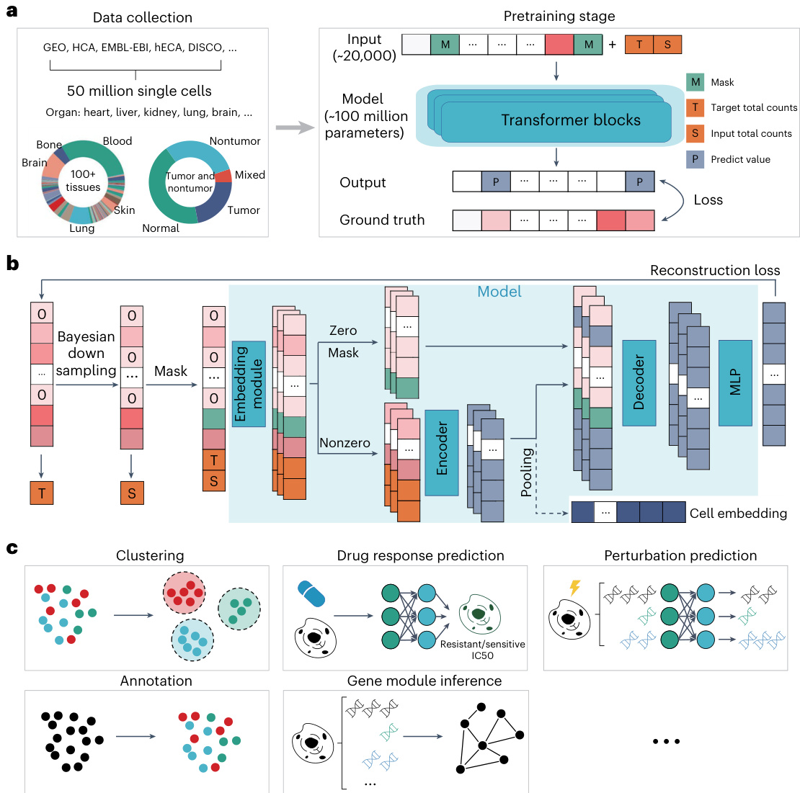
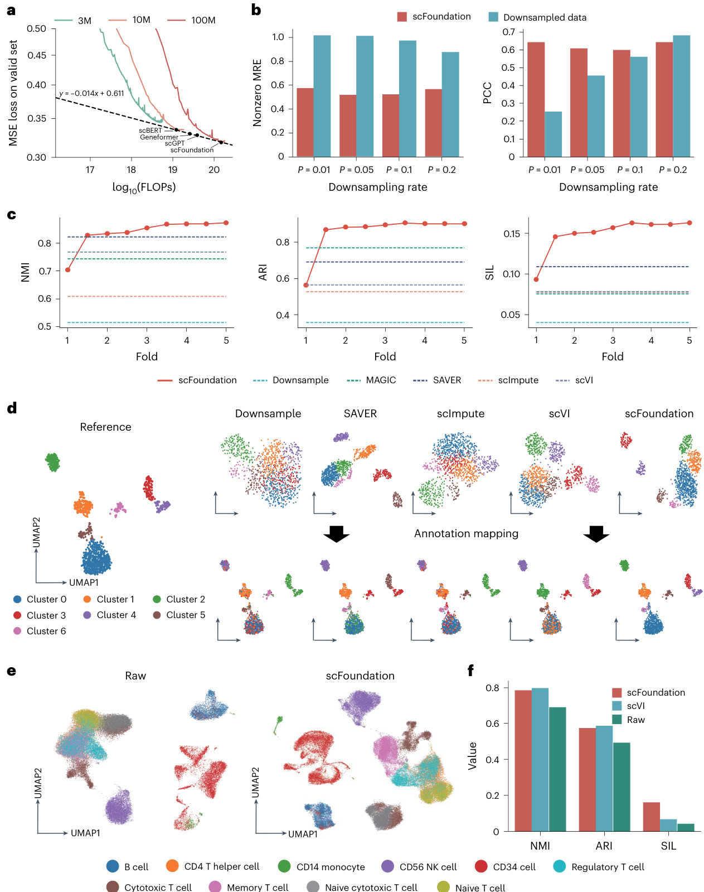
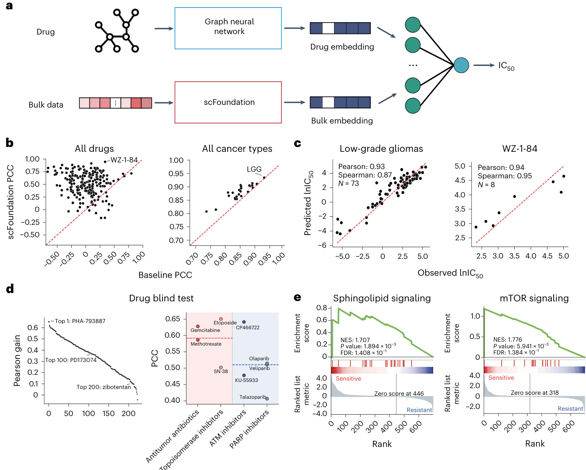
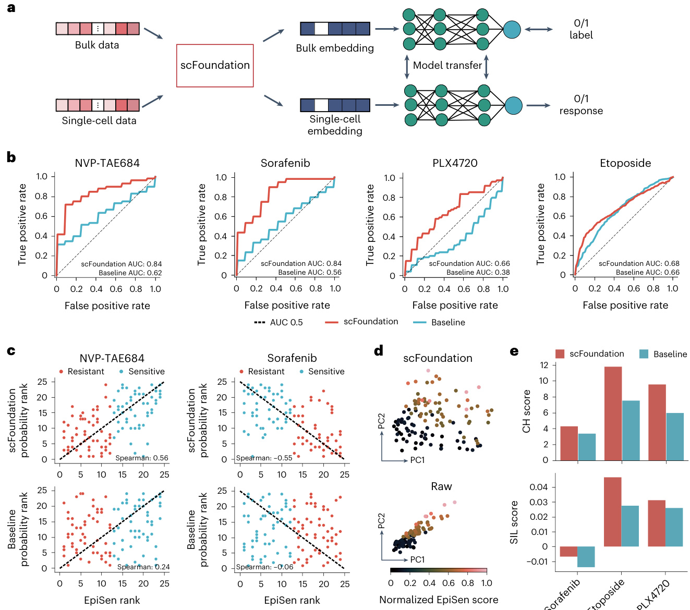

# nature methods  

# Large-scale foundation model on single-cell transcriptomics  

# Received: 2 June 2023  

Accepted: 10 May 2024  

Published online: 6 June 2024 Check for updates  

Minsheng Hao    1,2, Jing Gong2, Xin Zeng2, Chiming Liu    2, Yucheng Guo    2, Xingyi Cheng2, Taifeng Wang    2, Jianzhu Ma    3,4  , Xuegong Zhang    1,5 & Le Song    2,6  

Large pretrained models have become foundation models leading to breakthroughs in natural language processing and related fields. Developing foundation models for deciphering the ‘languages’ of cells and facilitating biomedical research is promising yet challenging. Here we developed a large pretrained model scFoundation, also named ‘xTrimoscFoundationα’, with 100 million parameters covering about 20,000 genes, pretrained on over 50 million human single-cell transcriptomic profiles. scFoundation is a large-scale model in terms of the size of trainable parameters, dimensionality of genes and volume of training data. Its asymmetric transformer-like architecture and pretraining task design empower effectively capturing complex context relations among genes in a variety of cell types and states. Experiments showed its merit as a foundation model that achieved state-of-the-art performances in a diverse array of single-cell analysis tasks such as gene expression enhancement, tissue drug response prediction, single-cell drug response classification, single-cell perturbation prediction, cell type annotation and gene module inference.  

Large-scale pretrained models are revolutionizing research in natural language processing related fields and becoming a new paradigm toward general artificial intelligence. These models trained on huge corpora become foundation models due to their fundamental roles in leading breakthroughs in many downstream tasks and their ability in discerning patterns and entity relationships within language1. In life sciences, living organisms have their underlying ‘languages’. Cells, the basic structural and functional units of the human body, constitute ‘sentences’ composed of a myriad of ‘words’ such as DNA, RNA, proteins and gene expression values. An intriguing question is: Can we develop foundation models of cells based on massive cell ‘sentences’?  

Single-cell RNA sequencing (scRNA-seq) data, also known as single-cell transcriptomics, offer high-throughput observations into cellular systems2, providing massive archives of transcriptomic sentences of all types of cells for developing foundation models. In transcriptomic data, gene expression profiles depict complex systems of gene–gene co-expression and interaction within cells. With the efforts of the Human Cell Atlas $({\mathsf{H C A}})^{3}$ and many other studies4–8, the data scale is exponentially growing9. With about 20,000 protein-coding genes across millions of cells, the observed gene expression values scale to a magnitude of trillion ‘tokens’ (Supplementary Table 1), which is comparable to the volume of natural language texts used to train large language models (LLMs) such as generative pretrained transformers. This provides the foundation for us to pretrain a large-scale model to extract complex, multifaceted internal patterns of cells in a manner similar to LLMs learning human knowledge from huge archives of natural language texts.  

In the LLM pretraining10,11, the growth in both model and data scale is critical for constructing foundation models that can effectively mine intricate multilevel internal relationships. Recently, progress has been made in pretraining models on single-cell data12–15, but creating large-scale foundation models still presents unique challenges. First, the gene expression pretraining data need to encompass a landscape of cells across different statuses and types. Currently, most scRNA-seq data are loosely organized, and a comprehensive and complete database is still lacking. Second, when modeling each cell as a sentence and each gene expression value as a word, the nearly 20,000 protein-coding genes make the ‘sentence’ exceptionally long, a scenario that traditional transformers struggle to handle16,17. Existing work often had to restrict their models to a small list of selected genes. Third, scRNA-seq data across different techniques and laboratories exhibit high variance in sequencing read depth. Unlike random noises due to technical effects such as contamination that would be reduced by training on large-volume data, read depth is not random and its variation hinders models from learning uniform and meaningful cell and gene representations.  

In this Article, we addressed these challenges and designed a large-scale foundational model scFoundation of 100 million parameters working on \~20,000 genes. We collected the scRNA-seq dataset with over 50 million gene expression profiles for pretraining. We developed an asymmetric architecture for scRNA-seq data to accelerate the training process and improve model scalability. We designed a read-depth-aware (RDA) modeling pretraining task that enables scFoundation to not only model the gene co-expression patterns within a cell but also link the cells with different read depths.  

To verify the ability of scFoundation, we conducted experiments on multiple downstream tasks, including cell clustering, drug response prediction on bulk data, single-cell drug response classification, single-cell perturbation prediction and cell type annotation. Recognizing the computational burden for users to fine-tune the large-scale models, we achieved advanced performance by adapting non-fine-tuned or light-fine-tuned scFoundation’s context embeddings to the corresponding downstream models. We also showcased using gene embeddings from scFoundation to infer the gene modules and gene regulation networks. All results demonstrated the power and value of scFoundation for transcriptomics data analyses and as foundation functions in facilitating biology and medical task learning. The work explored and pushed the boundaries of foundation models in the single-cell field.  

# Results  

# The scFoundation pretraining framework  

We developed scFoundation to model 19,264 genes with \~100 million parameters pretrained on over 50 million scRNA-seq data. This is a large-scale model of large parameter size, gene coverage and data scale in the single-cell field. The ability to efficiently train such a model was empowered by three key parts in our pretraining frameworks: model design, pretraining tasks and data collection (Fig. 1a).  

We developed xTrimoGene, a scalable transformer-based model with strategies for both algorithmic efficiency and engineering acceleration18. It included an embedding module and an asymmetric encoder– decoder structure. The embedding module converted continuous gene expression scalars into learnable high-dimensional vectors ensuring full retention of raw expression values, which was a notable improvement over the discretized values used in previous models13,19. The asymmetric encoder–decoder architecture had a similar form to the masked autoencoder20 model in computer vision but was designed to accommodate the high sparsity of scRNA-seq data, achieving efficient learning of all gene relationships without any selection. Moreover, we incorporated a variety of large-scale model training optimization techniques in the model deployment to ensure efficient training (Methods).  

We designed a pretraining task called the RDA modeling, an extension of masked language modeling21, by considering the high variance of read depth in large-scale data. In RDA modeling, the model predicted the masked gene expression of a cell on the basis of its context genes. The context was from a duplication or a low-read-depth variant of that cell’s gene expression profile (Methods). We treated the total count as one cell’s read depth and defined two total counts indicators: T (‘target’) and S (‘source’), for the total counts of the raw and the input samples, respectively. We randomly masked both zero- and nonzero-expressed genes in the input sample and recorded their index. Then the model took the masked input sample and two indicators to predict the expression value of the raw sample at the masked index (Fig. 1b). This enabled the pretrained model not only to capture the gene–gene relationship within the cell but also to harmonize the cell with different read depths. When used for inference, we feed the cell’s raw gene expression to the pretraining model and set the T higher than its total counts S to generate gene expression values with enhanced read-depth. We conducted several ablation experiments with cell clustering performance as an evaluation to show the advantage of our model architecture and pretraining task design (Methods and Supplementary Note 1).  

We constructed a comprehensive single-cell dataset by collecting data from all publicly available single-cell resources, including Gene Expression Omnibus (GEO)22, Single Cell Portal, HCA3, human Ensemble Cell Atlas (hECA)4, Deeply Integrated human Single-Cell Omics data (DISCO)7, European Molecular Biology Laboratory-European Bioinformatics Institute database (EMBL-EBI)8 and so on. We aligned all data to a gene list composed of 19,264 protein-coding and common mitochondrial genes, as identified by the HUGO Gene Nomenclature Committee23. After data quality control (Methods), we got over 50 million human scRNA-seq data for pretraining. The abundant data sources made the pretraining dataset rich in biological patterns. Anatomically, it spans over 100 tissue types across various diseases, tumors and normal states (Fig. 1a), encompassing almost all known human cell types and states.  

After pretraining, we applied the scFoundation model to multiple downstream tasks (Fig. 1c). The outputs of the scFoundation encoder were pooled into cell-level embeddings, which were used for cell-level tasks including clustering (within and across datasets), bulk and single-cell level drug response prediction and cell type annotation. The outputs of the scFoundation decoder were gene-level context embeddings, which were used for gene-level tasks such as perturbation prediction and gene module inference.  

Scalable read-depth enhancement model without fine-tuning In our study, we found a power-law decline in validation loss correlating with increased model size and computation, which is called ‘scaling law’10,24 in LLMs. We trained three models with parameter sizes of 3, 10 and 100 million, respectively, and recorded their losses on the validation dataset. As the model parameters and the total number of floating-point operations (FLOPs) increased, the loss on the validation dataset exhibited a power-law decline. We then estimated the performance of various scale xTrimoGene architecture models with parameter sizes equivalent to previous transformer-based models13–15, and compared with $\mathbf{scVl}^{25}$ (Supplementary Note 2). The scFoundation model with 100 million parameters surpassed all other models (Fig. 2a). We further evaluated our three models on a cell-type annotation task and observed the trend that the performance was improved as the model size increased (Supplementary Table 2).  

The RDA modeling enables scFoundation to enhance the read depth of the input cell by setting T as a higher number than S. We assessed this ability on independent test data of 10,000 cells randomly sampled from the validation dataset. We downsampled the total counts to $1\%,5\%$ , $10\%$ and $20\%$ of the original profiles, generating four corresponding datasets with varying total count fold changes. For each dataset, we utilized non-fine-tuned scFoundation to enhance the cells with low total counts by setting the desired total counts T as the reciprocal of the sampling rate. We measured the mean absolute error (MAE), mean relative error (MRE) and Pearson correlation coefficient (PCC) between predicted and actual nonzero gene expressions. As shown in Fig. 2b and Supplementary Fig. 1, scFoundation demonstrated a notable reduction of half the MAE and MRE from the downsampled data even when the downsampling rate was below $10\%$ . These observations showed the ability of scFoundation to enhance gene expressions in scenarios even with extremely low total counts.  

  
Fig. 1 | The schematic overview of the pretraining framework. a, Fifty million single-cell gene expression profiles were collected, covering tumor and nontumor cells from various tissues. These data were used for the RDA modeling task to pretrain the model. In the RDA task, the input consists of the masked gene expression vector and two total count indicators (T and S). The output is the predicted expression value for all genes, and the loss is computed at the masked positions. b, Outline of the pretraining process. A raw gene expression vector serves as a training sample. A hierarchical Bayesian downsampling strategy generates the input sample. The gene expression total counts (T and S) of the raw and input samples are computed. Values in the input sample are randomly masked. The scalar expression values are converted into embeddings. Only   
embeddings corresponding to nonzero and nonmasked values (including T and S) are fed into the model encoder. The output embeddings of the encoder are then combined with mask and zero embeddings and fed into the decoder. Also, the encoder output can be pooled to generate a cell embedding for downstream usage. The decoder output embeddings are projected to the gene expression value via a shared MLP layer. The regression loss between the predicted and raw sample’s gene expression values is computed. c, The pretraining embeddings can be leveraged as substitutes for the gene expression profiles, facilitating downstream tasks such as cell clustering, drug response prediction, single-cell level perturbation prediction, cell-type annotation, gene module inference and so on.  

We then compared scFoundation with imputation methods including MAGIC26, SAVER27, scImpute28 and $\mathbf{\deltascVl}^{25}$ on a human pan­ creatic islet dataset processed by SAVER. This dataset contained manually generated downsampled gene expression profiles and their corresponding reference data. For scFoundation, we obtained five sets of cell embeddings from the non-fine-tuned encoder by setting T as the different folds of S ranging from 1 to 5. For other methods, we first used the downsampled data to train the methods, and then got imputed cell embeddings and gene expression from scVI and other methods, respectively. The ground truth cluster labels were obtained from the reference data (Methods). For evaluating clustering accuracy, we employed metrics including normalized mutual information (NMI), adjusted Rand index (ARI) and silhouette coefficient (SIL) (Supplementary Note 3). The clustering performance obtained from the downsampled data was used as the baseline.  

scFoundation outperformed both the baseline and scImpute n all metrics when T was set equal to $S$ (fold change of 1; Fig. 2c) but it exhibited lower performance compared with smaller models like SAVER. This phenomenon wherein the read depth is unaltered has also been reported in a recent work29. As the $T/S$ fold increased, we observed a quick jump in scFoundation’s performance that surpassed all other methods. Its performance reached a plateau on higher T/S folds, indicating the cell embeddings were not sensitive to the value of T higher than 3.5S. We visualized the scFoundation embedding results at fold change 5 and results from other methods (Fig. 2d). Notably, scFoundation’s cell embeddings exhibited more distinctive cluster boundaries compared with the baselines and other methods. Furthermore, we clustered the results of all methods and applied the cluster labels back onto the reference Uniform Manifold Approximation and Projection (UMAP). Other methods showed mixed labels, especially for cluster 0 in the ground truth. scFoundation was the only method that aligned all cell cluster assignments consistently with the reference results.  

We then applied scFoundation to the Zheng68K dataset30, comprising about 60,000 human peripheral blood mononuclear cells counts, and the y axis represents the score. d, UMAP plots of cell embeddings generated by different methods. The left plot shows the reference UMAP plot obtained using raw gene expression, with colors indicating cell clusters. The upper-right plots display clustering results obtained by different methods: downsample (no imputation), SAVER, scImpute, scVI and scFoundation. The numbers of clusters are aligned. The lower-right plots depict the clustering results of each method mapped onto the reference UMAP plot. e, UMAP plot comparing raw gene expression and scFoundation-imputed cell embeddings on the Zheng68K dataset. f, Comparison of clustering performance among scFoundation, scVI and raw data on the Zheng68K dataset.  

  
Fig. 2 | Performance of read-depth enhanced clustering results. a, Training loss under different parameter sizes and FLOPs. The dots noted as other models’ names were the performance of various scale xTrimoGene architecture models with parameter sizes equivalent to other models. The scVI model achieved an MSE of 0.98. Since it was not a transformer-based model and not applicable to plot on the figure. b, Evaluation of read-depth enhancement performance on the unseen dataset. MREs of nonzero genes and PCCs of all genes were used to evaluate the recovered gene expression performance. Lower MREs and higher PCCs indicate better performance. c, Comparison of the scFoundation model with other imputation methods based on cell clustering metrics. The x axis represents the fold change between the desired total counts and the input total  

sequenced on an early $10\times$ Chromium platform. Each cell had about 500 expressed genes and fewer than 2,000 total reads, making cell type distinction challenging13,31 (Supplementary Fig. 2). scFoundation was used without fine-tuning to enhance cell embeddings by setting the T value as 10,000. The resulting UMAP plots showed that scFoundation effectively separated memory T cells from other T cells and distinguished CD14 monocytes and CD34 cells better (Fig. 2e). We compared our results with scVI trained on the same dataset. Both methods outperformed the raw data in clustering. While their NMI and ARI metrics were similar, scFoundation had a higher SIL score, showing its generalization ability in non-fine-tuning mode (Fig. 2f).  

scFoundation also showcased its capability to facilitate read depth enhanced clustering across different batches. Note that merely aligning the read depth would not eliminate the entire batch effect since batch effects can involve other variations such as donor gender, experiment treatment, cell cycle and so on32. We mapped single-cell data from different batches together by feeding the read-depth-enhanced cell embeddings into a nontrainable downstream header BBKNN33. Results on simulated data and on data collected from organoid and in vivo experiments showed that scFoundation can achieve better cell mapping while slightly reducing the dispersion of different cell types (Supplementary Table 3 and Supplementary Figs. 3 and 4; details in Supplementary Note 4).  

These results demonstrated that scFoundation possessed the capability to enhance the read-depth of cells. Notably, an important distinction between scFoundation and other imputation methods was that scFoundation could achieve the best performance without the need for dataset-specific fine-tuning.  

# Improving cancer drug response prediction  

Cancer drug responses (CDRs) study tumor cells’ responses upon drug intervention. Computationally predicting CDR is critical to guiding anticancer drug design and understanding cancer biology34. We combined scFoundation with the CDR prediction method DeepCDR35 to predict the half-maximal inhibitory concentration $\mathbf{lC}_{50}$ values of drugs across several cell line data. This experiment served as a validation of whether scFoundation could provide informative embeddings for bulk-level gene expression data, despite being trained on single cells.  

The original DeepCDR model used drug structural information and multiomics data as input and outputted the predicted $\mathbf{lC}_{50}$ . Here, we focused on gene expression data and replaced the transcriptome multilayer perceptron (MLP) subnetwork in DeepCDR with scFoundation (Fig. 3a). We used the Cancer Cell Line Encyclopedia36 and Genomics of Cancer Drug Sensitivity37 datasets to obtain the input cell line gene expression data, the input drugs and $\mathrm{IC}_{50}$ labels (Methods).  

We evaluated the performance of scFoundation-based results with gene expression-based results across multiple drugs and cancer cell lines (Fig. 3b). Most drugs and all cancer types achieved a higher PCC by using scFoundation embeddings. We visualized the best prediction case of drug and cancer types (Fig. 3c). Regardless of high or low ${\sf I C}_{50},$ the scFoundation-based DeepCDR model could predict accurate values and achieved a PCC above 0.93. In a drug-blind test that left out one drug at a time from the dataset, scFoundation-based models consistently outperformed the original model (Fig. 3d). The top 1 PCC-gaining drug PHA793887, a potent ATP-competitive CDK inhibitor, improved the PCC from 0.07 to 0.73. Even for the 200th-ranked drug zobotentan used for blocking endothelin A receptor activity, its PCC improved from 0.49 to 0.64.  

We further grouped drugs into different therapy types to examine whether the $\mathrm{K}_{50}$ prediction performance was related to their intrinsic mechanisms. Based on scFoundation-predicted results, drugs belonging to chemotherapy such as antitumor antibiotics and topoisomerase inhibitors tend to have higher PCC than drugs belonging to targeted therapy such as ataxia telangiectasia mutated (ATM) and poly(ADP-ribose) polymerase (PARP) inhibitors (Fig. 3d). This may be due to the fact that specific gene mutations often have important impacts on targeted therapy34 but such information is hardly revealed in gene expression data, while chemotherapy drugs were widely reported to be related to gene expression38,39 so their $\mathbf{lC}_{50}$ is easier to predict. As for the gene expression-based results, they had an overall lower PCC, and we did not observe a performance difference between therapy types.  

Then we used our model to predict unknown CDR in the data. To validate these predictions, we performed a gene set enrichment analysis $({\bf G S E A})^{40}$ on the new predictions with relatively low $\mathrm{IC}_{50}$ , which indicated that the cell line is sensitive to the drug (Fig. 3e). For instance, the sphingolipid signaling pathway was enriched in doxorubicin-sensitive cell lines. According to the Kyoto Encyclopedia of Genes and Genome database41, this pathway was related to sphingomyelin and its metabolism. Sphingomyelin was reported to interact synergistically with doxorubicin by altering cell membrane permeability resulting in a lower $\mathrm{IC}_{50}$ of the drug in these cell lines42. The mTOR signaling pathway was enriched in vorinostat-sensitive cell lines. Previous studies have shown that vorinostat inhibits carcinoma growth by dampening the mTOR signaling pathway43. Other clinical studies have also shown that mTOR inhibitors were often used in conjunction with vorinostat44,45, suggesting a relationship between vorinostat and the mTOR pathway. These examples supported the validity of our predictions.  

Although scFoundation was pretrained on single-cell transcriptomics data, the learned gene relationships were transferable to bulk-level expression data to produce condensed embeddings, facilitating more accurate $1C_{50}$ prediction. These findings illustrated the potential of scFoundation in expanding the understanding of drug responses in cancer biology and possibly guiding the design of more effective anticancer treatments.  

# Transferring bulk drug response to single cells  

Inference of drug sensitivities at the single-cell level can help identify specific cell subtypes that exhibit different drug resistance characteristics, offering valuable insights into underlying mechanisms and potential new therapies46. We applied scFoundation to the crucial task of single-cell-level drug response classification based on a downstream model called ${\mathsf{S C A D}}^{47}$ . Due to the limited single-cell drug response data, SCAD used domain adaption to eliminate the single-cell and bulk differences, and transferred knowledge learned on bulk data to infer the drug sensitivity of single cells. The process took both bulk and singlecell data as input and output predicted the sensitivity for each cell. In our setting, we used non-fine-tuned scFoundation to obtain unified embeddings of bulk and single-cell data, and used these embeddings to train SCAD models (Fig. 4a).  

We focused on the four drugs (sorafenib, NVP-TAE684, PLX4720 and etoposide) that exhibited lower area under the receiver operating characteristic curve (AUC) values in the original study. These drugs had drug-sensitive labels of bulk data in the Genomics of Cancer Drug Sensitivity37 database, and the true cell-level drug-sensitive labels were obtained in different ways. For drug PLX4720 and etoposide-affected single cells, cells from untreated cell lines were considered sensitive, while cells that survived after drug exposure were considered resis­tant48. For drug sorafenib and NVP-TAE684-affected cells, the cells’ sensitive labels were determined by the value of senescence-related (EpiSen) program scores that were proven to have a relation with drug responses previously49 (Methods).  

We compared the scFoundation-based model with the baseline SCAD model that took all genes’ expression values as input. The scFoundation-based model achieved higher AUC values for all drugs, with notable improvements for NVP-TAE684 and sorafenib, exceeding a 0.2 increase in AUC. Baseline results for all four drugs were at best 0.66, with one result even worse than random, highlighting the task’s difficulty (Fig. 4b). We used the Spearman correlation to assess the relationship between predicted drug sensitivity and EpiSen scores. For NVP-TAE684 and sorafenib, there should be a positive and negative correlation with EpiSen scores, respectively. The scFoundation model showed Spearman correlations of 0.56 and −0.55 for these drugs, while the baseline model achieved only 0.24 and $-0.06$ (Fig. 4c), indicating that using scFoundation embeddings had the potential to capture the signal of drug sensitivity biomarkers. These results further motivated us to investigate whether the embeddings were more informative than gene expression without the necessity for extracting the signal. We conducted principal component analysis (PCA) on embeddings of single-cell dataset SSC47 and visualized the first two principal components. Results showed less linear correlation compared with raw data PCA, suggesting richer information captured by the embeddings (Fig. 4d). Furthermore, we computed the clustering performance based on the embeddings and gene expression of both bulk and single-cell data, using drug sensitivity as the label. The results of higher Calinski– Harabasz (CH) and SIL scores (Fig. 4e and Supplementary Fig. 5) demonstrated that the scFoundation better-grouped cells or bulk cell lines with the same drug response, compared with the gene expression baseline.  

  
Fig. 3 | Drug response prediction using scFoundation embeddings. a, Illustration of the scFoundation-based CDR prediction model. b, PCC between all drugs and cancer types in the test set. Each dot represents a drug or cancer type, with the x axis and y axis showing PCCs obtained by the baseline CDR model and scFoundation-based model, respectively. c, Comparison of predicted and observed $\mathbf{lC}_{50}$ values for the drug WZ-1-84 on the cancer-type low-grade gliomas. Each dot represents a drug and cell-line combination. d, Leave-one-drug-out blind test performance. The Pearson gain plot shows the PCC gain obtained by replacing gene expression with embeddings. Each dot represents a drug, with the y axis indicating the gained PCC values and the x axis representing the rank. Higher-ranked drugs have a higher PCC gain. In the PCC plot, each dot   
represents a drug, with the y axis indicating the PCC between predicted and ground truth $\mathbf{IC}_{50}$ and the $x$ axis representing four drug types. The first two belong to chemotherapy and the last two belong to targeted therapy. The dashed line showed the mean PCC within each therapy type. e, GSEA results on cell-line data with lower predicted $\mathbf{IC}_{50}$ values. The Sphingolipid signaling pathway was enriched in doxorubicin-sensitive cell lines, while the mTOR signaling pathway was enriched in vorinostat-sensitive cell lines. The P value is one-sided and calculated from the standard GSEA permutation test. For the false discovery rate (FDR) value, adjustments were made for multiple comparisons. NES, normalized enrichment score.  

These findings highlighted that the unified embedding obtained from scFoundation aligned bulk and single-cell data into a unified representation space. This condensed representation produced a clear distinction between data with sensitive and resistant states, facilitating the downstream model to better transfer pharmacogenomics information from bulk cell lines to single-cell data.  

Facilitating perturbation response prediction Understanding cellular responses to perturbations is crucial for biomedical applications and drug design, as it helps identify gene–gene interactions across different cell types and potential drug targets50. Using Perturb-seq51,52 data resources to train models for modeling cellular response to perturbations is a key task of computational biology53–55. We combined the scFoundation with an advanced model called GEARS53 for predicting the single-cell-resolution perturbation. The original GEARS model used a Gene Ontology knowledge graph to represent unseen gene perturbations by learning from a combination of previously observed gene perturbation nodes, and a gene co-expression graph combined with perturbation information to predict the post-perturbation gene expression. Each node in the co-expression graph represented a gene with initially randomized embeddings, and edges connected to co-expressed genes. This graph was shared across all cells. In our method, we obtained gene context embeddings for each cell from the scFoundation decoder and set these embeddings as the nodes in the graph (Methods), resulting in a cell-specific gene co-expression graph for predicting perturbations (Fig. 5a).  

We trained and tested models on three perturbation datasets following the original study (Supplementary Note 5). Since there was no single-cell-level ground truth in the perturbed data, we computed the averaged mean square error (MSE) of the top 20 differentially expressed (DE) genes between pre- and post-gene expression profiles for evaluation. The scFoundation-based model achieved lower MSE values compared with the original GEARS baseline model. On the more challenging two-gene perturbations predictions, the model achieved the lowest averaged MSE in the $_{0/2}$ unseen case and outperformed GEARS and another baseline called $\mathsf{C P A}^{56}$ model across all cases (Fig. 5b and Supplementary Fig. 6). For each two-gene perturbation in the test set, we further examined the proportion of the top 20 DE genes with mean predicted values falling in the $45{-}55\%$ quantile of the true expression distribution interval. The scFoundation-based model exhibited a higher percentage compared with the baseline (Fig. 5c), indicating it predicted a more reasonable distribution of post-gene expression values. Figure 5d showcased the top 20 genes’ expression changes of two-gene perturbation $\mathsf{E T S2+C E B P E}$ .  

  
Fig. 4 | Single-cell drug response classification tasks based on scFoundation cell embeddings. a, Illustration of the scFoundation-based single-cell response classification model. b, Receiver operating characteristic (ROC) curves for the four drugs. The red and blue lines represent the performance of the scFoundationbased model and the baseline SCAD model, respectively. AUC, area under the receiver operating characteristic curve. c, The correlation between drug-sensitivity   
probability and normalized EpiSen score. Each row corresponds to a model, and each column represents a drug. d, PCA plots of cells in the SSC47 single-cell dataset drawn with scFoundation embeddings and with raw data. Color denotes the reference EpiSen score. Cells with different EpiSen scores exhibit distinct responses to drugs. e, The clustering performance on all three drug-related bulk datasets. Each bulk dataset has two types of label: sensitive and resistant.  

One application for predicting two-gene perturbations was to classify two-gene perturbation into different genetic interaction (GI) types. We identified synergy and suppressor GI types by using the magnitude score (Methods). We first computed the PCC of magnitude score between predicted and ground truth magnitude scores of all two-gene perturbations in test set, and we found that the scFoundation-based model achieved a higher PCC compared with the baseline (Fig. 5e). Then, we ranked two-gene perturbations by predicted magnitude scores, considering the top 20 as potential synergy and the bottom 20 as suppressor GIs. The Venn plot in Fig. 5f revealed that the scFoundation-based model identified a higher number of true perturbations for both synergy and suppressor types.  

These results highlighted that the cell-specific gene context embeddings obtained from scFoundation served as valuable foundational representations for perturbation prediction. The analysis of two-gene perturbations underscored the model’s capability to accurately classify different types of GI.  

# Annotating cell types  

Cell type annotation is crucial in single-cell studies, and various methods have been developed for this purpose. To assess the performance of scFoundation, we conducted experiments using the Zheng68K dataset30 and the Segerstolpe dataset57 that were shown to be challenging in the previous study13. We fine-tuned only a single layer of the scFoundation encoder and added an MLP head for predicting labels.  

  
Fig. 5 | Perturbation prediction tasks using scFoundation gene context embeddings. a, An illustration of the perturbation prediction model based on cell-specific gene embeddings of scFoundation. b, MSE between predicted and ground truth post-gene expressions. Results given by the scFoundation-based GEARS model and baseline GEARS model are shown in red and blue, respectively. c, The average proportion of predicted values of the top 20 DE genes falling within $45{-}55\%$ quantile of the corresponding true expression distribution interval. The dashed black lines represent the expected percentage $(10\%)$ . d, The predicted gene expression over control for the top 20 most DE genes after a combinatorial perturbation (ETS2 $^+$ CEBPE). The red and blue boxes indicate gene prediction results by the scFoundation-based GEARS model and the baseline GEARS model, respectively. The green boxes represent the ground   
truth post-gene distribution. For each gene, $n\,{=}\,313$ cells were examined. The two edges of a box and horizontal bars inside a box indicate the interquartile and median of all values, respectively. The length of the whiskers extends to 1.5 times the interquartile range (IQR) from the quartiles. e, Magnitude scores computed for all test perturbing combinations on the Norman dataset. Each dot represents a specific perturbing combination. The y axis shows the magnitude score computed from the prediction results, while the $x$ axis represents the ground truth magnitude score computed using real post-gene expression. f, Top 20 perturbations with synergistic and suppressor gene interaction types identified using scFoundation and baseline methods. The Venn plot illustrates the relationship between the identified perturbation set and the verified perturbation set.  

We benchmarked scFoundation against the methods CellTypist58, scBERT13, scANVI59, ACTINN60, Scanpy61 and SingleCellNet62 (Methods). Supplementary Table 4 shows that scFoundation achieved the highest macro F1 score on both datasets. Compared with the second-place method CellTypist, the higher performance of scFoundation came from improvements in rare cell types such as $\mathbf{CD4^{+}}$ T helper 2 and $\mathsf{C D34^{+}}$ (Supplementary Table 5). We visualized scFoundation and CellTypist predictions on the UMAP obtained from latent embeddings and PCA components, respectively. Supplementary Figs. 7 and 8 showed that scFoundation had clear separations between different cell types.  

These results indicated that scFoundation’s ability to utilize the entire gene set as input could lead to more accurate annotations, compared with other methods that unavoidably lose information by using a gene subset or discretized gene expression.  

# Inferring gene modules and gene regulation networks  

One advantage of scFoundation is that it extends gene expression values into context embeddings, compared with other architectures such as the vanilla MLP model (Supplementary Note 6). These embeddings could not only facilitate graph-based downstream methods such as GEARS, but also be used to infer gene–gene networks. Here, we used the gene embeddings from three immune cell types (monocytes, cytotoxic $_{\mathrm{CD8^{+}}}$ T cells and B cells) for validation and exploration of this usage (Methods).  

We clustered genes into modules based on their embeddings’ similarity. Results showed that scFoundation could identify the differential expressed gene modules of each cell type (Supplementary Figs. 9 and 10). Gene enrichment analysis validated that the identified gene modules were enriched in their respective cell types (Supplementary Fig. 11), indicating that the gene embeddings have learned functional relations among genes. Further, we explored the gene network constructed within the top 1 DE gene module of T cells (Supplementary Fig. 12). Genes CD8A and CD8B encoding chains of the CD8 molecule exhibited strong similarities, while the S100A8 gene showed limited correlation with other T cell markers as expected. This suggested that the embeddings could provide insights into gene relations within modules. Additionally, we conducted experiments on gene regulatory network (GRN) inference with the downstream model SCENIC63 (Methods). We identified cell-specific regulators such as KLF6, SPIB and MXD4, which were confirmed by the previous work as the regulators for monocyte64, B cell65 and $_{\mathrm{CD8^{+}}}$ T cell66, respectively (Supplementary Fig. 13). These examples underscored the potential of scFoundation gene embeddings for inferring GRNs.  

# Discussion  

Recent breakthroughs in LLMs motivated us to explore whether large-scale models can also be effective for learning the cellular and molecular ‘languages’ of biology from single-cell transcriptomic data, which exhibit large data scales, complex biological patterns, diversity and technical noises. Combining the xTrimoGene architecture with the RDA pretraining task, we developed scFoundation, a large-scale foundation model with 100 million parameters pretrained on over 50 million single-cell data. Ablation experiments and applications on downstream tasks showed the advantage of its design of the pretraining task and the model. Supplementary Table 1 provides a comparison of the major features with the released similar models.  

scFoundation was pretrained as a general-purpose foundation model for many downstream tasks: it achieved superior performance in read-depth enhancement, drug response prediction, single-cell drug sensitivity prediction, perturbation predictions and cell type annotation tasks. It also showed high potential in gene module inference and in better facilitating cell mapping by cooperating with downstream batch removal headers like BBKNN33.  

The scFoundation model does not need further fine-tuning on most tasks. This design reduced computational and time costs for users and offered flexibility in downstream model design, allowing scFoundation to better serve as a foundational model for a variety of downstream tasks in the field of single-cell biology.  

We recommend using scFoundation to extract embeddings from datasets without explicit batch-effect or modality differences. Given that batch effects or modality differences may encompass a range of variations, we took the strategy in scFoundation to consider only read depth and leave other possible differences to cooperative methods on downstream tasks, such as BBKNN and SCAD. Furthermore, we suggest using cell and gene embeddings instead of the predicted gene expression values because the current data used as pretraining labels suffered from a high dropout rate and the model pretraining loss was not optimized to zero.  

scFoundation still faces some limitations. Although the pretraining data contained virtually all human scRNA-seq data publicly available at the time of our curation, they may still not be sufficient to fully reflect the complexity of human organ development and health states. The pretraining demands substantial computational resources, requiring further optimization for efficiency. The current model focused on transcriptomic data only, and did not include genomic or epigenomic data. Also, its unsupervised pretraining process had the advantage of not relying on human annotation of the massive data but overlooked the rich information in metadata. Including cells’ metadata with transcriptomic data in the model may have the potential to link cells’ molecular features with phenotypes.  

In the future, we will pretrain models with more parameters and larger datasets using our effective pretraining framework, and we believe several works could be developed on the basis of the insights from scFoundation. For instance, designing more effective pretraining tasks could potentially improve the model’s performance29. The effect of various dataset characteristics on training performance also remains to be explored29. Furthermore, the emerging field of single-cell multiomics data67,68 presents opportunities for developing models that can delineate multilevel complex laws of cells. One doable case can be to predict gene expression values based on assay for transposase-accessible chromatin with sequencing (ATAC-seq) context and vice versa (Supplementary Note 7).  

The general applicability of scFoundation shown in the variety of tasks indicates that it has succeeded in learning underlying relations among genes in their expressions in different types of cell. We expect that the pretraining architecture and the pretrained scFoundation model can serve as fundamental contributions supporting both studies on large biological models and a variety of downstream research. This work as well as other recent reports suggest that large biological models pretrained on high-throughput single-cell data are opening a new route to deciphering and modeling complex molecular systems.  

# Online content  

Any methods, additional references, Nature Portfolio reporting summaries, source data, extended data, supplementary information, acknowledgements, peer review information; details of author contributions and competing interests; and statements of data and code availability are available at https://doi.org/10.1038/s41592-024-02305-7.  

# References  

1. Srivastava, A. et al. Beyond the imitation game: quantifying and extrapolating the capabilities of language models. Preprint at arXiv https://doi.org/10.48550/arXiv.2206.04615 (2023).   
2. Jovic, D. et al. Single-cell RNA sequencing technologies and applications: a brief overview. Clin. Transl. Med. 12, e694 (2022).   
3. Regev, A. et al. The Human Cell Atlas. eLife 6, e27041 (2017).   
4. Chen, S. et al. hECA: the cell-centric assembly of a cell atlas. iScience 25, 104318 (2022).   
5. Snyder, M. P. et al. The human body at cellular resolution: the NIH Human Biomolecular Atlas Program. Nature 574, 187–192 (2019).   
6. The Tabula Sapiens Consortium. The Tabula Sapiens: a multiple-organ, single-cell transcriptomic atlas of humans. Science 376, eabl4896 (2022).   
7. Li, M. et al. DISCO: a database of deeply integrated human single-cell omics data. Nucleic Acids Res. 50, D596–D602 (2022).   
8. Papatheodorou, I. et al. Expression Atlas update: from tissues to single cells. Nucleic Acids Res. 48, D77–D83 (2020).   
9. Svensson, V., Vento-Tormo, R. & Teichmann, S. A. Exponential scaling of single-cell RNA-seq in the past decade. Nat. Protoc. 13, 599–604 (2018).   
10.	 Brown, T. B. et al. Language models are few-shot learners. Adv. Neural Inf. Process. Syst. 33, 1877–1901 (2020).   
11.	 Zhao, W. X. et al. A survey of large language models. Preprint at arXiv https://doi.org/10.48550/arXiv.2303.18223 (2023).   
12.	 Zhang, R., Luo, Y., Ma, J., Zhang, M. & Wang, S. scPretrain: multi-task self-supervised learning for cell-type classification. Bioinformatics 38, 1607–1614 (2022).   
13.	 Yang, F. et al. scBERT as a large-scale pretrained deep language model for cell type annotation of single-cell RNA-seq data. Nat. Mach. Intell. 4, 852–866 (2022).   
14.	 Cui, H., Wang, C., Maan, H. & Wang, B. scGPT: towards building a foundation model for single-cell multi-omics using generative AI. Nat Methods https://doi.org/10.1038/s41592-024-02201-0 (2024).   
15.	 Theodoris, C. V. et al. Transfer learning enables predictions in network biology. Nature https://doi.org/10.1038/s41586-023- 06139-9 (2023).   
16.	 Choromanski, K. et al. Rethinking attention with performers. Preprint at arXiv https://doi.org/10.48550/arXiv.2009.14794 (2022).   
17.	 Ma, X. et al. Luna: Linear Unified Nested Attention. Adv. Neural Inf. Process. Syst. 34, 2441–2453 (2021).   
18.	 Gong, J. et al. xTrimoGene: an efficient and scalable representation learner for single-cell RNA-seq data. Preprint at bioRxiv https://doi.org/10.1101/2023.03.24.534055 (2023).   
19.	 Chen, J. et al. Transformer for one stop interpretable cell type annotation. Nat. Commun. 14, 223 (2023).   
20.	 He, K. et al. in Proc. IEEE/CVF Conference on Computer Vision and Pattern Recognition 16000–16009 (IEEE, 2022).   
21.	 Devlin, J., Chang, M.-W., Lee, K. & Toutanova, K. in Proc. 2019 Conference of the North American Chapter of the Association for Computational Linguistics 4171–4186 (ACL, 2019).   
22.	 Edgar, R., Domrachev, M. & Lash, A. E. Gene Expression Omnibus: NCBI gene expression and hybridization array data repository. Nucleic Acids Res. 30, 207–210 (2002).   
23.	 Seal, R. L. et al. Genenames.org: the HGNC resources in 2023. Nucleic Acids Res. 51, D1003–D1009 (2023).   
24.	 Kaplan, J. et al. Scaling laws for neural language models. Preprint at arXiv https://doi.org/10.48550/arXiv.2001.08361 (2020).   
25.	 Lopez, R., Regier, J., Cole, M. B., Jordan, M. I. & Yosef, N. Deep generative modeling for single-cell transcriptomics. Nat. Methods 15, 1053–1058 (2018).   
26.	 van Dijk, D. et al. Recovering gene interactions from single-cell data using data diffusion. Cell 174, 716–729.e27 (2018).   
27.	 Huang, M. et al. SAVER: gene expression recovery for single-cell RNA sequencing. Nat. Methods 15, 539–542 (2018).   
28.	 Li, W. V. & Li, J. J. An accurate and robust imputation method scImpute for single-cell RNA-seq data. Nat. Commun. 9, 997 (2018).   
29.	 Kedzierska, K. Z., Crawford, L., Amini, A. P. & Lu, A. X. Assessing the limits of zero-shot foundation models in single-cell biology. Preprint at bioRxiv https://doi.org/10.1101/2023.10.16.561085 (2023).   
30.	 Zheng, G. X. Y. et al. Massively parallel digital transcriptional profiling of single cells. Nat. Commun. 8, 14049 (2017).   
31.	 Abdelaal, T. et al. A comparison of automatic cell identification methods for single-cell RNA sequencing data. Genome Biol. 20, 194 (2019).   
32.	 Luecken, M. D. et al. Benchmarking atlas-level data integration in single-cell genomics. Nat. Methods 19, 41–50 (2022).   
33.	 Polański, K. et al. BBKNN: fast batch alignment of single cell transcriptomes. Bioinformatics 36, 964–965 (2020).   
34.	 Unger, F. T., Witte, I. & David, K. A. Prediction of individual response to anticancer therapy: historical and future perspectives. Cell. Mol. Life Sci. 72, 729–757 (2015).   
35.	 Liu, Q., Hu, Z., Jiang, R. & Zhou, M. DeepCDR: a hybrid graph convolutional network for predicting cancer drug response. Bioinformatics 36, i911–i918 (2020).   
36.	 Barretina, J. et al. The Cancer Cell Line Encyclopedia enables predictive modelling of anticancer drug sensitivity. Nature 483,   
603–607 (2012).   
37.	 Iorio, F. et al. A landscape of pharmacogenomic interactions in cancer. Cell 166, 740–754 (2016).   
38.	 Bellamy, D., Celi, L. & Beam, A. L. Evaluating progress on machine learning for longitudinal electronic healthcare data. Preprint at arXiv https://doi.org/10.48550/arXiv.2010.01149 (2020).   
39.	 Geeleher, P., Cox, N. J. & Huang, R. Clinical drug response can be predicted using baseline gene expression levels and in vitro drug sensitivity in cell lines. Genome Biol. 15, R47 (2014).   
40.	 Subramanian, A. et al. Gene set enrichment analysis: a knowledge-based approach for interpreting genome-wide expression profiles. Proc. Natl Acad. Sci. USA 102, 15545–15550 (2005).   
41.	 Kanehisa, M. & Goto, S. KEGG: Kyoto Encyclopedia of Genes and Genomes. Nucleic Acids Res. 28, 27–30 (2000).   
42.	 Saddoughi, S. A., Song, P. & Ogretmen, B. in Lipids in Health and Disease (eds Quinn, P. J. & Wang, X.) 413–440 (Springer, 2008).   
43.	 Kurundkar, D. et al. Vorinostat, an HDAC inhibitor attenuates epidermoid squamous cell carcinoma growth by dampening mTOR signaling pathway in a human xenograft murine model. Toxicol. Appl. Pharmacol. 266, 233–244 (2013).   
44.	 Park, H. et al. Phase I dose-escalation study of the mTOR inhibitor sirolimus and the HDAC inhibitor vorinostat in patients with advanced malignancy. Oncotarget 7, 67521–67531 (2016).   
45.	 Zibelman, M. et al. Phase I study of the mTOR inhibitor ridaforolimus and the HDAC inhibitor vorinostat in advanced renal cell carcinoma and other solid tumors. Invest. N. Drugs 33,   
1040–1047 (2015).   
46.	 Vasudevan, S. et al. Drug-induced resistance and phenotypic switch in triple-negative breast cancer can be controlled via resolution and targeting of individualized signaling signatures. Cancers 13, 5009 (2021).   
47.	 Zheng, Z. et al. Enabling single-cell drug response annotations from bulk RNA-seq using SCAD. Adv. Sci. 10, e2204113 (2023).   
48.	 Ho, Y.-J. et al. Single-cell RNA-seq analysis identifies markers of resistance to targeted BRAF inhibitors in melanoma cell populations. Genome Res. 28, 1353–1363 (2018).   
49.	 Kinker, G. S. et al. Pan-cancer single-cell RNA-seq identifies recurring programs of cellular heterogeneity. Nat. Genet. 52,   
1208–1218 (2020).   
50.	 Rood, J. E., Maartens, A., Hupalowska, A., Teichmann, S. A. & Regev, A. Impact of the Human Cell Atlas on medicine. Nat. Med.   
28, 2486–2496 (2022).   
51.	 Adamson, B. et al. A multiplexed single-cell CRISPR screening platform enables systematic dissection of the unfolded protein response. Cell 167, 1867–1882 (2016).   
52.	 Dixit, A. et al. Perturb-Seq: dissecting molecular circuits with scalable single-cell RNA profiling of pooled genetic screens. Cell   
167, 1853–1866 (2016).   
53.	 Roohani, Y., Huang, K. & Leskovec, J. Predicting transcriptional outcomes of novel multigene perturbations with GEARS. Nat. Biotechnol. https://doi.org/10.1038/s41587-023-01905-6 (2023).   
54.	 Lotfollahi, M., Wolf, F. A. & Theis, F. J. scGen predicts single-cell perturbation responses. Nat. Methods 16, 715–721 (2019).   
55.	 Lotfollahi, M. et al. Learning interpretable cellular responses to complex perturbations in high-throughput screens. Preprint at bioRxiv https://doi.org/10.1101/2021.04.14.439903 (2021).   
56.	 Lotfollahi, M. et al. Predicting cellular responses to complex perturbations in high-throughput screens. Mol. Syst. Biol. 19, e11517 (2023).   
57.	 Segerstolpe, Å. et al. Single-cell transcriptome profiling of human pancreatic islets in health and type 2 diabetes. Cell Metab. 24,   
593–607 (2016).   
58.	 Domínguez Conde, C. et al. Cross-tissue immune cell analysis reveals tissue-specific features in humans. Science 376, eabl5197 (2022).   
59.	 Xu, C. et al. Probabilistic harmonization and annotation of single-cell transcriptomics data with deep generative models. Mol. Syst. Biol. 17, e9620 (2021).   
60.	 Ma, F. & Pellegrini, M. ACTINN: automated identification of cell types in single cell RNA sequencing. Bioinformatics 36, 533–538 (2020).   
61.	 Wolf, F. A., Angerer, P. & Theis, F. J. SCANPY: large-scale single-cell gene expression data analysis. Genome Biol. 19, 15 (2018).   
62.	 Tan, Y. & Cahan, P. SingleCellNet: a computational tool to classify single cell RNA-seq data across platforms and across species. Cell Syst. 9, 207–213 (2019).   
63.	 Aibar, S. et al. SCENIC: single-cell regulatory network inference and clustering. Nat. Methods 14, 1083–1086 (2017).   
64.	 Date, D. et al. Kruppel-like transcription factor 6 regulates inflammatory macrophage polarization. J. Biol. Chem. 289,   
10318–10329 (2014).   
65.	 Willis, S. N. et al. Environmental sensing by mature B cells is controlled by the transcription factors PU.1 and SpiB. Nat. Commun. 8, 1426 (2017).   
66.	 Vasilevsky, N. A., Ruby, C. E., Hurlin, P. J. & Weinberg, A. D. OX40 engagement stabilizes Mxd4 and Mnt protein levels in antigen-stimulated T cells leading to an increase in cell survival. Eur. J. Immunol. 41, 1024–1034 (2011).   
67.	 Ma, S. et al. Chromatin potential identified by shared single-cell profiling of RNA and chromatin. Cell 183, 1103–1116 (2020).   
68.	 Chen, S., Lake, B. B. & Zhang, K. High-throughput sequencing of the transcriptome and chromatin accessibility in the same cell. Nat. Biotechnol. 37, 1452–1457 (2019).  

Publisher’s note Springer Nature remains neutral with regard to jurisdictional claims in published maps and institutional affiliations.  

Springer Nature or its licensor (e.g. a society or other partner) holds exclusive rights to this article under a publishing agreement with the author(s) or other rightsholder(s); author self-archiving of the accepted manuscript version of this article is solely governed by the terms of such publishing agreement and applicable law.  

$\circledcirc$ The Author(s), under exclusive licence to Springer Nature America, Inc. 2024  

# Methods  

# Pretraining data collection and preprocessing  

Data collection. Many human scRNA-seq data were deposited in the Gene Expression Omnibus (GEO) repository, HCA, Single Cell Portal, EMBL-EBI and so on. There were also several studies to integrate human single cells from multiple resources, such as hECA4, DISCO7 and so on. Each dataset in these databases was linked to a published study and thus had a corresponding DOI ID. We manually collected scRNA-seq data from these databases and removed the dataset with a duplicated ID. Most of the datasets provided the raw count matrix. For the dataset with normalized expression profiles, we converted them back to the raw count form: we treated the smallest nonzero value in the original matrix as a raw count value of 1, all remaining nonzero values were divided by this smallest value and the integer part was taken. For the dataset with transcripts per million (TPM) or fragments per kilobase of transcript per million fragments mapped (FKPM) expression profiles that cannot be converted back to raw counts, we kept them unchanged.  

Our data collection comprises over 50 million single cells of diverse organs and tissues from samples of healthy donors and of various diseases and cancer types, representing a full spectrum of human single-cell transcriptomes. We split all data into training and validation datasets. The validation dataset was randomly sampled and contained 100,000 single cells, and remained consistent for all test models.  

Gene symbol unification. We unified the gene symbols of all raw count gene expression matrices by using the gene symbol mapping reference provided by HUGO Gene Nomenclature Committee. We included human protein-coding genes and common mitochondrial genes, constituting a total of 19,264 genes. If some symbols were missing, we padded them with zero values.  

Quality control. To filter contaminated empty droplets, extremely low-quality cells and damaged cells, we kept cells with over 200 genes expressed (that is, expression vector with nonzero value count ${>}200$ ) for pretraining by using the Seurat69 and Scanpy61 packages.  

# scFoundation model architecture  

We developed the xTrimoGene model as the backbone model of scFoundation. It had three modules: the embedding module converted scalar value into embeddings that were required for the transformer block; the encoder took the nonzero and nonmasked expressed genes as input, used the vanilla transformer block and had large parameter size; and the decoder took all genes as input, used the performer block and had a relatively small parameter size. Ablation experiments showed that such asymmetric design reduced the computational and memory challenges compared with other architectures (Supplementary Table 6).  

Embedding module. Given a cell’s gene expression value vector $\mathbf{X}^{\mathrm{input}}\in\mathbb{R}^{n=19,264}$ , the expression value $x_{i}^{\mathrm{input}}$ of gene i was a continuous scalar greater than or equal to zero. Unlike the previous language or recently developed single-cell transformer-based model, for each gene i the embedding module directly converted the expression scalar into a learnable value embedding $\mathbf{E}_{i}$ without any discretization. Then, the value embedding was added with gene name embeddings $\mathbf{T}_{i}^{G}$ to form the final input embeddings $\mathbf{E}_{i}^{\mathrm{input}}$ . The value embeddings were a weighted summarization of a set of embeddings, where the weights were learned from the gene expression scalar values. The gene name embeddings were retrieved from a look-up table, where the embeddings in the table are randomly initialized and can be learned during pretraining (Supplementary Note 8). The ablation of continuous embeddings scheme showed that the benefit of our design compared with other value discretization methods (Supplementary Fig. 14).  

Encoder. The encoder only processed the embeddings of nonzero and nonmasked values (that is, the expressed genes and two total count numbers) so the input length of the encoder was about $10\%$ of the full gene length. Denoting $\boldsymbol{S^{E}}=\{S_{0}^{E},S_{1}^{E},\ldots,S_{K^{\vphantom{E}}}^{E}\}$ as the index set of nonzero and nonmasked values with $K$ elements, the input of encoder was defined as  

$$
X^{\mathrm{Enc-input}}=\left[\mathbf{E}_{S_{0}^{E}}^{\mathrm{input}},\mathbf{E}_{S_{1}^{E}}^{\mathrm{input}},...\right].
$$  

The design of encoder greatly reduced the required computational resources, making it possible for the encoder to employ a series of vanilla transformer blocks to capture gene dependency without any kernel or low-rank approximation. The outputs of encoder were intermediate embeddings $\lambda^{\mathrm{nter}}$ :  

$$
\begin{array}{r}{X^{\mathrm{inter}}=\mathsf{T r m}(X^{\mathrm{Enc-input}})\in\mathbb{R}^{K\times d},}\end{array}
$$  

where Trm represents a series of transformer blocks and the core function in these blocks is the attention mechanism that can be formulated as  

$$
\mathsf{A t t}\,(Q,K,V)=D^{-1}A V\ A=\exp\left(\frac{Q K^{T}}{\sqrt{d}}\right),D=\mathsf{d i a g}(A\mathbf{1}_{\mathbf{K}}),
$$  

where $Q=X W_{q}.$ , $K\!=\!X W_{k}$ and $V\!=\!X W_{\upsilon}$ are linear transformation of the input $\chi$ , and $W.$ are training parameters. $\mathbf{1}_{\mathbf{K}}$ is the all-ones vector of length $K_{\iota}$ and diag(·) is a diagonal matrix with the input vector as the diagonal.  

The intermediate embeddings $\lambda^{\mathrm{nter}}$ had two usages: (1) they were sent into the decoder with the zero and mask embeddings, and (2) they were pooled as cell embeddings for downstream usages.  

Decoder. To establish a transcriptome-wide gene regulation relationship, the zero-expressed genes should also be considered for recovering expression values at mask positions. The intermediate embeddings from encoder were concatenated with the zero and mask embeddings to form a decoder input tensor $X^{\mathrm{{Dec-input}}}$ with full gene length  

$$
\boldsymbol{X}^{\mathrm{{Dec-input}}}=\left[\boldsymbol{X}^{\mathrm{inter}},\mathbf{E}_{0}^{0},\ldots,\mathbf{E}_{K_{0}}^{0},\mathbf{E}_{0}^{\mathrm{m}},\ldots,\mathbf{E}_{K_{m}}^{m}\right]^{T}\in\mathbb{R}^{19,266\times d},
$$  

where $K_{0}$ and $K_{m}$ were the number of zero and masked embeddings, respectively. We used the kernel-based approximation transformer variant Performer  as the backbone in the decoder, since the attention calculation was challenging for long sequences16,70. In Performer, the kernelizable attention mechanism is used:  

$$
\overline{{\mathsf{A t t}}}\left(Q,K,V\right)=\hat{D}^{-1}\left(\mathcal{Q}\left(Q\right)\left(\mathcal{Q}\left(K\right)\right)^{T}V\right)\hat{D}^{-1}=\mathsf{d i a g}(\mathcal{Q}\left(Q\right)\left(\mathcal{Q}\left(K\right)\right)^{T}\mathbf{1}_{\mathsf{K}}),
$$  

where $\emptyset(\bullet)$ is a kernel function that used for approximating the A matrix in the original attention equation.  

The output of decoder is $X^{\mathrm{out}}$ , where  

$$
\chi^{\mathrm{Out}}=\mathsf{P e r f o r m e r}(\chi^{\mathrm{Dec-input}})\in\mathbb{R}^{19,266\times f}.
$$  

For predicting the expression value, the embeddings of $T$ and $S$ were dropped and an MLP was followed to project $X^{\mathrm{{out}}}$ to scalars. These scalars formed a prediction vector P, where  

$$
\mathbf{P}=\mathsf{M L P}(X^{\mathrm{Out}})\in\mathbb{R}^{19,264}.
$$  

All parameters $\Theta=\{\mathbf{E}_{\mathrm{i}},\mathbf{T}_{i}^{G}$ , $\Theta_{\mathrm{Encoder}}$ , ΘDecoder, $\Theta_{\mathsf{M L P}}\}$ were optimized during the pretraining. The detailed hyperparameter setting of different models can be found in Supplementary Table 7.  

# RDA pretraining task  

We trained the model with an RDA gene expression prediction task. For each raw pretraining single-cell gene expression vector, we used a hierarchical Bayesian downsampling strategy to generate its low total counts variant or unchanged profiles as the input vector. We normalized and log-transformed the raw and input gene expression, and set the total counts of the raw and input vectors as two total count indicators T and $s$ , respectively. After normalizing gene expression, the original total count value of cells is removed. By reintroducing this information through tokens, we believe it can enhance the model’s pretraining performance since the dropout in cells is usually correlated with the total count value. Please refer to Supplementary Notes 9 and 10 for details of the sampling strategy and count indicators calculation.  

Then we randomly masked the genes’ expressions of the input vector. In this study, we used $30\%$ as the masking ratio for both zero and nonzero values. Then the masked input vector was concatenated with two total count indicators T and S and fed into the model. After getting the model-predicted raw gene expression, we conducted the regression loss on the masked genes between the predicted and the raw values (Supplementary Note 11). If the input vector was unchanged, the model learned to capture the relation between genes within a single cell. If the input vector was the low-total-count variant, the model learned the relationship between cells with different read depths. The ablation studies (Supplementary Note 1) of taking downsampling strategy (Supplementary Table 8) and regression loss (Supplementary Fig. 15) showed that the current setting could facilitate learning cell characteristics.  

The overall model architecture of scFoundation is shown in Supplementary Fig. 16. For the model and pretraining implementation, please refer to Supplementary Note 12.  

# Read-depth enhancement analysis  

For the gene expression prediction evaluation, we sampled 10,000 cells with high total counts (higher than 1,000) from 50 million single-cell data as the validation dataset. These 10,000 cells were excluded at the training stage. Then, we used a binomial distribution to generate the low total counts gene expression vector and fed it into our model. We only evaluate nonzero gene expression values considering that 0 expression values do not change in value after downsampling. In addition to using MSE as the evaluation metric, we also used the MRE, which can reflect the relative error  

$$
\mathsf{M R E}=\frac{1}{|M|}\sum_{i=0}^{|M|}\frac{\left(X_{i}-P_{i}\right)^{2}}{X_{i}}.
$$  

For the clustering analysis, we got the cell embeddings from scFoundation and scVI encoder. For others, we got the imputed gene expression profiles. All methods were used with the default parameter setting. Then, we followed the SCANPY pbmc3k tutorial and got the cell cluster by the function ‘sc.tl.leiden’.  

For the evaluation of the clustering results, we first used ARI and NMI (scikit-learn71 package) as indicators to evaluate the degree of consistency between the clustering results obtained by different methods and the actual cell type labels. Considering that the acquisition of cluster labels will also be affected by the choice of the clustering algorithm, we used SIL as another evaluation indicator, which measures the aggregation degree of true cell type labels on the cell neighborhood maps given by different methods and, thus, is independent of the choice of clustering algorithm, reflecting the intrinsic properties of cell representation.  

# Downstream methods  

All baseline models were trained with default parameters. We dumped the cell embeddings for DeepCDR and SCAD tasks, and gene embeddings for the GEARS task. As for cell embeddings, we found that concatenating the embeddings obtained by max-pooling and mean-pooling the embeddings of all genes, and the embeddings of the S token and T token, achieved the best performance (Supplementary Note 13 and Supplementary Tables 9 and 10). The concatenation of the four embeddings built the new cell embeddings with 3,072 dimensions, and we trained the downstream model based on these cell embeddings.  

DeepCDR. We used the cell line and drug-paired data preprocessed by DeepCDR. The cell line data contain 697 gene expression profiles, and we aligned these genes with our unified gene symbol list. The drugs were represented as graphs with consistent feature matrices and adjacent matrix sizes. In total, 223 drugs and 561 cell lines data from 31 cancer types were considered. We followed the original study to randomly split $5\%$ of data as the test set, resulting in 89,585 and 4,729 cell line-drug samples for training and testing, respectively. For each cell line, we set both indicators S and T equal to the sum of all gene expression values. And we fed the nonzero gene expression values and two indicators into the model encoder and got the context embedding for each gene. The bulk-level cell-line embedding was obtained by the max-pooling operation for each embedding dimension across all genes.  

We trained the baseline DeepCDR model by setting parameters ‘-use_gexp’ as True and ‘-use_mut’ and ‘-use_methy’ as False. Then for the scFoundation-based model, we directly replaced the gene expression with the cell-line embedding and trained the DeepCDR with the same setting. For each gene, we computed the PCC between predicted $\mathbf{lC}_{50}$ and truth $\mathrm{IC}_{50}$ across all cell lines. For each cell line, we computed the PCC across all drugs conducted on this cell line.  

SCAD. We followed the same experimental setting as the original SCAD study, conducting fivefold cross-validation. For each split, four folds of the bulk and single-cell data were used to train the model, and the other fold was left for prediction, and we merged all split results to get the prediction for all cells. We used all genes and conducted the weighted sampling in the model training process. For training the baseline model, gene expression values were transformed into the z score in their provided processed data.  

For training the scFoundation-based model, we used the normalized gene expression data. For bulk data, we set both S and T to the sum of all gene expression values to maintain original cell line features. For single-cell data, we set token $S$ to the sum of gene expression values and token T to 10,000, the empirically maximum sequencing depth per cell. Then, the nonzero values of each sample and two indicators were fed into the encoder of the pretrained model. The outputs were the context embeddings of genes for each sample and then condensed into the cell embeddings.  

Perturbation prediction. We unified the gene symbol list to 19,264 and generated the gene co-expression network on each dataset. Following the original GEARS study, for one-gene perturbations, we randomly assigned $75\%$ of perturbations as training data. For two-gene perturbations, $75\%$ of perturbations where both genes were in the seen set (0/2 unseen) were designated as the training set, while all other combinations $_{\textrm I/2}$ and 2/2 unseen) were held out for testing. Then, we trained the GEARS baseline model by setting epoch to 15 and batch size to 30. The CPA model does not have gene embeddings, and it takes the drug or gene perturbation embeddings as the input model. We trained the CPA model with the same parameter setting used in the GEARS study. Gene perturbations were encoded as one-hot vectors, and two-gene perturbations were represented by the addition of two one-gene perturbation vectors. In the embedding-based model, each cell’s T and $\boldsymbol{S}$ values equaled its total counts, with gene expression and indicators fed into the model. The scFoundation’s last MLP layer was dropped to extract gene context embeddings from the decoder, serving as node features for the co-expression graph. We froze scFoundation and solely trained the downstream GEARS model, employing gradient accumulation to maintain consistent batch size with the baseline during training.  

We followed the definition and metrics used in GEARS. We focused on the synergy and suppression gene intersection types since they were the most basic types. Identification of these two types was based on the magnitude score, which measured the similarity between the two-gene perturbation and combining two single-gene perturbations. Specifically, let the mean change between post- and pre-A perturbed cells as $\updelta g_{a}$ . A linear model was used to fit the effect of $\updelta g_{a},\updelta g_{b}$ and $\updelta g_{a+b}$ :  

$$
\S g_{a+b}=c_{a}\times\S g_{a}+c_{b}\times\S g_{b}+\epsilon,
$$  

where ϵ captures the error in the model fit. We used the robust regression with a Theil–Sen estimator following the same procedure used in previous study72. Using the values of the coefficients, magnitude was defined as  

$$
\mathrm{Magnitude}=\sqrt{c_{a}^{2}+c_{b}^{2}}.
$$  

All test two-gene perturbations were ranked by magnitude score, with the top- and bottom-ranked being considered synergistic and repressive types, respectively.  

Cell type annotation. We randomly split each dataset into train:valid:test of 8:1:1. For scFoundation, we added a two-layer MLP with ReLU as the activation function after the encoder. The output of MLP is the predicted label. Considering the imbalanced cell numbers of different cell types, we used a weighted cross entropy loss. Given in total $c$ cell types, and cell type i has $A_{i}$ cells, the weight of each cell type $w_{i}$ in the loss was defined as  

$$
w_{i}=\frac{B_{i}}{\sum_{i=1}^{C}\!B_{i}}\!=\!\operatorname*{max}\left(\frac{\operatorname*{max}_{i=1,...,C}{A_{i}}}{A_{i}},50\right),
$$  

where $B_{i}$ was the scaled number. We set the learning rate as 0.001, the gradient accumulation step as 5 and the batch size in each step was 64. We got the model with highest F1 score on the validation dataset as the best model for testing.  

For scBERT, we converted the gene expression matrix to match their input required gene symbol list and fine-tuned their pretrained model. We used the validation dataset to select the best model. For methods CellTypist, scANVI, ACTINN and SingleCellNet, we fed the training and valid dataset into models and trained them with default parameter settings. We got the prediction results of test data from the corresponding function such as ‘celltypist.annotate’ of CellTypist. As for Scanpy, we used the ‘sc.tl.ingest’ function to transfer the cell type label into the test data based on the PCA components, and treated the transferred label as the prediction. For each method on the test split, we computed the average macro F1 score of the top three performed model replicates.  

Gene module and gene regulation inference. We randomly selected 100 cells from the three cell types (Monocytes, $\mathbf{CD8^{+}}$ cytotoxic T cells, and B cell) in Zheng68K data, resulting in a total of 300 cells. These data were processed through scFoundation to obtain the context embedding for all genes, resulting in a matrix of dimensions $300\times19,264\times512$ After selecting the highly variable genes and averaging the gene embeddings across cells, we derived 495 gene embeddings, each of 512 dimensions and used the Leiden clustering method to get 34 gene modules based on embeddings. We then computed the average expression of each gene module across the 300 cells using the ‘scanpy.tl.score_genes’ function, producing a scoring matrix of $300\times34.$ . We conducted differential analysis on this score matrix to identify marker gene modules for each cell type. Then, we did the enrichment analysis on the differential expressed gene modules via the online EnrichR73 tools. We used the ‘PanglaoDB Augmented 2021’ dataset and selected the term with the lowest adjusted P value to interpret gene modules. As for gene network, we computed the similarity of gene embeddings with a module, and marked the top 5 edges with the highest value.  

As for gene regulation inference, we got all known transcription factor (TF)–target gene pairs from SCENIC and quantified their relationships based on the similarity of their gene embeddings. For each TF, we selected the top 1,000 pairs with high similarity as the candidate pairs. Since transcriptomic data do not provide direct insights into TF–gene binding at the sequence level, we used RcisTarget module of SCENIC to refine our selected pairs. Using the auc_cell module of SCENIC, we then derived the TF enrichment scores in cell types and identified the top-ranked cell-specific TFs. However, we would like to point out that directly calculating similarity from embeddings is a simplistic approach that may not fully harness the rich information within the vectors. Future endeavors could explore algorithms that leverage context embeddings for more sophisticated GRN inference, such as those employing graph neural networks.  

# Reporting summary  

Further information on research design is available in the Nature Portfolio Reporting Summary linked to this article.  

# Data availability  

All data used in this study are publicly available and the usages are illustrated in the Methods. The pretraining datasets were mainly downloaded from GEO (https://www.ncbi.nlm.nih.gov/geo/), Single Cell Portal (https://singlecell.broadinstitute.org/single_cell), HCA (https://data.humancellatlas.org/) and EMBL-EBI (https://www.ebi. ac.uk/), and the detailed dataset list we used is in Supplementary Data 1 and 2. The datasets used for downstream tasks can be downloaded from the following links: Baron dataset (https://github.com/ mohuangx/SAVER-paper); Zheng68K dataset (https://www.dropbox. com/sh/w3yg2nucnng5v1u/AAAM8Ym_KU9XF4z51RT81eNEa?dl=0); Segerstolpe dataset (https://zenodo.org/records/3357167); CDR dataset (https://github.com/kimmo1019/DeepCDR); Single cell drug response classification dataset (https://github.com/CompBioT/ SCAD); Perturbation dataset (https://github.com/snap-stanford/ GEARS); Simulated reference and query dataset used for cell mapping (https://doi.org/10.6084/m9.figshare.21456645.v4); and Organoid and in vivo data used for cell mapping (https://doi.org/10.17632/ sm67hr5bpm.1). The processed gene expression data and the embeddings generated by scFoundation can be found in our GitHub repository (https://github.com/biomap-research/scFoundation) and figshare (https://doi.org/10.6084/m9.figshare.24049200) (ref. 74).  

# Code availability  

The code for using the online API, the model codes and weight, a demonstration of inferring embeddings, codes of producing the results for the downstream tasks are at the GitHub repository at https://github. com/biomap-research/scFoundation or Zenodo75. A summary of all code and data information is in Supplementary Data 3.  

# References  

69.	 Hao, Y. et al. Integrated analysis of multimodal single-cell data. Cell 184, 3573–3587 (2021).   
70.	 Beltagy, I., Peters, M. E. & Cohan, A. Longformer: the long-document transformer. Preprint at arXiv https://doi. org/10.48550/arXiv.2004.05150 (2020).   
71.	 Pedregosa, F. et al. Scikit-learn: machine learning in Python. J. Mach. Learn. Res. 12, 2825–2830 (2011).   
72.	 Norman, T. M. et al. Exploring genetic interaction manifolds constructed from rich single-cell phenotypes. Science 365, 786–793 (2019).   
73.	 Chen, E. Y. et al. Enrichr: interactive and collaborative HTML5 gene list enrichment analysis tool. BMC Bioinf. 14, 128 (2013).   
74.	 Hao, M. scFoundation: large scale foundation model on single-cell transcriptomics - processed datasets. figshare. https://doi.org/10.6084/m9.figshare.24049200.v3 (2023).   
75.	 Hao, M. code of scFoundation: large scale foundation model on single-cell transcriptomics. Zenodo https://doi.org/10.5281/ zenodo.8330924 (2023).  

# Acknowledgements  

We thank Q. Yin, L. Chao and Z. He from Biomap and Y. Chen, C. Li, H. Bian, J. Li, T. Ma, L. Wei and R. Jiang from Bioinfo Division, Tsinghua University for discussions and comments. This work was partially supported by the National Key R&D Program of China (grant 2021YFF1200901), National Natural Science Foundation of China (NSFC) (grants 62250005 and 61721003) and Tsinghua-Fuzhou Institute for Data Technology (TFIDT2021005).  

# Author contributions  

M.H., J.M., L.S. and X. Zhang conceived the study. M.H. X. Zeng and Y.G. collected the downstream datasets involved in this article. Y.G. and L.S. developed data collection criteria and strategies for pretraining. M.H., J.G., X. Zeng, C.L., T.W. and X.C. proposed the pretraining framework. M.H., J.G., X. Zeng and C.L. implemented and pretrained the models. M.H. and J.G. benchmarked all methods.  

J.G., X. Zeng, C.L., T.W., X.C., J.M., L.S. and X. Zhang provided advice on pretraining framework design and downstream tasks. M.H., J.G., J.M., L.S. and X. Zhang wrote the manuscript. All authors read and approved the final manuscript.  

# Competing interests  

J.G., X.Ze., C.L, Y.G., X.C., T.W. and L.S. are employees of BioMap. M.H. contributed to this work while part-time interning at BioMap. The remaining authors declare no competing interests.  

# Additional information  

Supplementary information The online version contains supplementary material available at https://doi.org/10.1038/s41592-024-02305-7.  

Correspondence and requests for materials should be addressed to Jianzhu Ma, Xuegong Zhang or Le Song.  

Peer review information Nature Methods thanks the anonymous reviewers for their contribution to the peer review of this work. Primary Handling Editor: Lin Tang, in collaboration with the Nature Methods team. Peer reviewer reports are available.  

Reprints and permissions information is available at www.nature.com/reprints.  

# nature portfolio  

Corresponding author(s): Xuegong Zhang Last updated by author(s): Apr 8, 2024  

# Reporting Summary  

Nature Portfolio wishes to improve the reproducibility of the work that we publish. This form provides structure for consistency and transparency in reporting. For further information on Nature Portfolio policies, see our Editorial Policies and the Editorial Policy Checklist.  

# Statistics  

For all statistical analyses, confirm that the follwing items are present in the figure legend, table legend, main text, or Methods section.  

n/a| Confirmed   
The exact sample size (n) for each experimental group/condition, given as a discrete number and unit of measurement   
A statement on whether measurements were taken from distinct samples or whether the same sample was measured repeatedly   
A description of ll covariates tested   
A description of any assumptions or corrections, such as tests of normality and adjustment for multiple comparisons   
Avadderssfe A full description of the statistical parameters including central tendency (e.g. means) or other basic estimates (e.g. regression coefficien   
Forhytesstestinsthetesstastc $F,\,t,\,r)$ Wthonef $P$ value noted   
For Bayesian analysis, information on the choice of priors and Markov chain Monte Carlo settings   
For hierarchical and complex designs, identification ofthe appropriate level for tests and fullreporting of outcomes   
Estimates of effect sizes (e.g. Cohen's d, Pearson's r), indicating how they were calculated  

Our web collection on statistics for biologists contains articles on many of the points above.  

# Software and code  

Policy information about availability of computer code  

<html><body><table><tr><td>Datacollection Dataanalysis</td><td>Thepre-training datawereprocessed byscanpy=1.9.o.No specificsoftwarewas used forprocessing thedata used in the downstream task.</td></tr><tr><td></td><td>For modelpre-training:torch==1.10.0 mmf==1.0.0rc12Forread depthenhancement:SAVER==1.1.3(https://github.com/mohuangx/SAVER) DeepCDR==commit3df1a63(https://github.com/kimmo1019/DeepCDR),gseapy==1.0.4Forsinglecelldrugsensitivity:SCAD==commit c9cea4c(https://github.com/CompBioT/SCAD)Forperturbationprediction:GEARS==0.1.O(https://github.com/snap-stanford/GEARS)Forcell annotation:celltypist==1.3.0,scvi-tools==0.17.1,scBERT==1.0.0,ACTINN==commit a326866(https://github.com/mafeiyang/ACTINN), scanpy==1.9.1,SingleCellNet==commit 1f55f24(https://github.com/pcahan1/singleCellNet)Forgene module inference:scanpy==1.9.1,</td></tr><tr><td>Seaborn==o.11.2 Zen0do.8330924)</td><td>ThecodeforusingtheonlineAPl,themodel codesandweight,ademonstrationofinferringembeddings,codesofproducingtheresultsfor thedownstreamtasksareatGitHubrepositoryhttps://github.com/biomap-research/scFoundationorZenodo(https://doi.org/10.5281/</td></tr></table></body></html>  

# Data  

Policy information about availability of data  

All manuscripts must include a data availability statement. This statement should provide the following information, where applicable: - Accession codes, unique identifiers, or web links for publicly available datasets - A description of any restrictions on data availability - For clinical datasets or third party data, please ensure that the statement adheres to our policy  

Alldataedin thistudyare publicavailalandthesagesareilstratedintheMethodTh pre-training datasetsweremainl dloadedfrmGEh// www.ncbi.nlm.nih.gov/geo/), Single Cell Portal (https://singlecell.broadinstitute.org/single_cell), HCA (https://data.humancellatlas.org/), EMBL-EBl (https:// www.ebi.ac.uk/), and the detailed dataset list we used was in the Supplementary Data 1&2. The datasets used for downstream tasks can be downloaded from the following link: Baron dataset(https://github.com/mohuangx/SAVER-paper); Zheng68K dataset (https://www.dropbox.com/sh/w3yg2nucnng5v1u/ AAAM8Ym_KU9XF4z51RT81eNEa?d $=\!0$ ). Segerstolpe dataset (https://zenodo.org/records/3357167); Cancer drug response dataset (https://github.com/ kimmo1019/DeepCDR); Single cell drug response classification dataset(https://github.com/CompBioT/SCAD); Perturbation dataset (https://github.com/snapstanford/GEARS). Simulated reference and query dataset used for cell mapping: https://doi.org/10.6084/m9.figshare.21456645.v4 . Organoid and in vivo data used for cell mapping: https://doi.org/10.17632/sm67hr5bpm.1 . The processed gene expression data and the embeddings generated by scFoundation can be found in our GitHub repository (https://github.com/biomap-research/scFoundation ) and Figshare(https://doi.org/10.6084/m9.figshare.24049200 ).  

# Human research participants  

ion about studies involving human research participants and Sex and Gender in  

<html><body><table><tr><td>Reporting on sex and gender</td><td>Notapplicable</td></tr><tr><td>Populationcharacteristics</td><td>Notapplicable</td></tr><tr><td>Recruitment</td><td>Notapplicable</td></tr><tr><td>Ethicsoversight</td><td>Nostudyprotocolapprovalisneeded.</td></tr></table></body></html>

Note that full information on the approval of the study protocol must also be provided in the manuscript.  

# Field-specific reporting  

Please select the one below that is the best fit for your research. If you are not sure, read the appropriate sections before making your selection.  

Life sciences Behavioural & social sciences Ecological, evolutionary & environmental sciences  

reference copy of the document with all sections, see nature.com/documents/nr-reporting-summary-fl  

# Life sciences study design  

All studies must disclose on these points even when the disclosure is negative.  

<html><body><table><tr><td>Samplesize</td><td>datasetfromSAVER[1] study and a Zheng68Kdataset processed byHou et.al[2].We used all samplesin our task without anyselection.For the cancer drug response prediction task, We used all samples from the dataset processed by the DeepCDR study[3] without any selection. We randomly split 5% of data as the test set, resulting in 89,585 and 4,729 cell line-drug samples for training and testing, respectively.For the single cell drugsensitivity task,Weused allavailable samplesoffourdrugs'(Sorafenib,NVP-TAE684,PLX4720,and Etoposide)datasets processedbySCAD[4]studywithoutanyselection.Fortheperturbationpredictionstudy,weused all samplesfromthreedatasetsprocessed dataset processed by Hou et. al[2] without any selection. We randomly split each dataset into train:valid:test=8:1:1. For the gene module inference task, We randomly selected 100 cells from the three cell types(Monocytes, CD8 cytotoxic T cells, and B cell) from the Zheng68K data, resulting in a total of 300 cells. The sample size was determined by sampling 50% of the minimum size of these three cell types, which wasapproximately200cells. [1] Huang, M. et al. SAVER: gene expression recovery for single-cell RNA sequencing. Nat Methods 15, 539-542 (2018) [2] Hou, W., Ji, Z., Ji, H. & Hicks, S. C. A systematic evaluation of single-cell RNA-sequencing imputation methods. Genome Biol 21, 218 (2020). i911-i918 (2020).</td></tr><tr><td>Dataexclusions</td><td>[4] Zheng, Z. et al. Enabling Single-Cell Drug Response Annotations from Bulk RNA-Seq Using SCAD. Advanced Science n/a, 2204113. [5] Roohani, Yusuf, Kexin Huang, and Jure Leskovec. "Predicting transcriptional outcomes of novel multigene perturbations with gears." Nature Biotechnology (2023):1-9.</td></tr><tr><td>Replication</td><td>Some cells for pre-training were excluded using quality control metrics described fully in the Methods section.</td></tr></table></body></html>  

<html><body><table><tr><td>Replication</td><td>fixedandcanbereproduced.Fordownstreamtasks,thedatasetissplitintotrainingandtestsetandthensaved,accordingtotheir experimentalsetting.</td></tr><tr><td>Randomization</td><td>Werandomlysplittraining,validationandtestsamples.</td></tr><tr><td>Blinding</td><td>Duringpre-training,allcell metainformation(e.g.celltype,cellstate)isunseenforthemodel.Alltestandvalidationdatasetsarenotincluded inthetrainingdataset.</td></tr></table></body></html>  

# Reporting for specific materials, systems and methods  

We require information from authors about some types of materials, experimental systems and methods used in many studies. Here,indicate whether each material, system or method listed is relevant to your study.If you are not sure if a list item applies to your research, read the appropriate section before selecting a response.  

# Materials & experimental systems  

n/a Involved in the study Antibodies   
区 Eukaryotic cell lines Palaeontology and archaeology   
区 Animals and other organisms   
区 Clinical data Dual use research of concern  

# Methods  

n/a Involved in the study ChIP-seq Flow cytometry MRI-based neuroimaging  