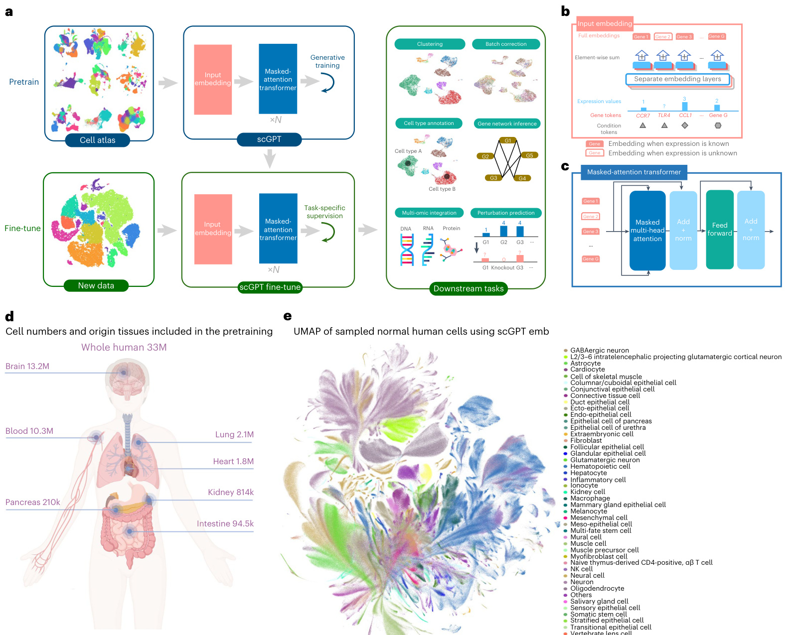
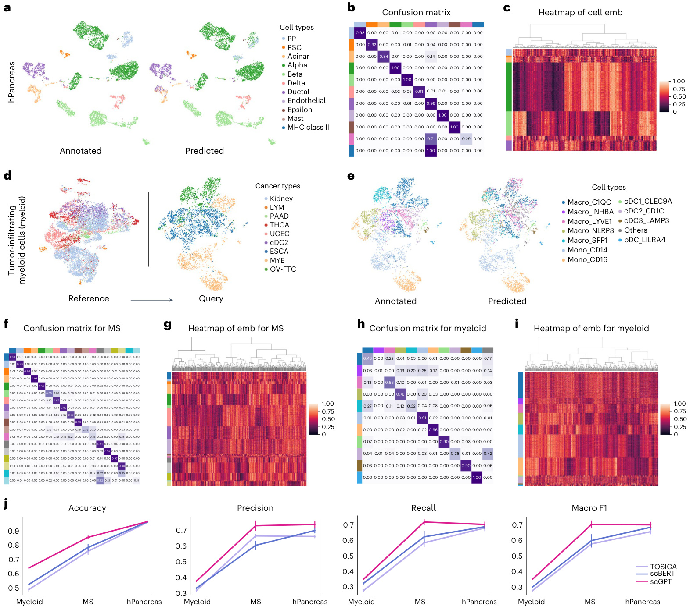
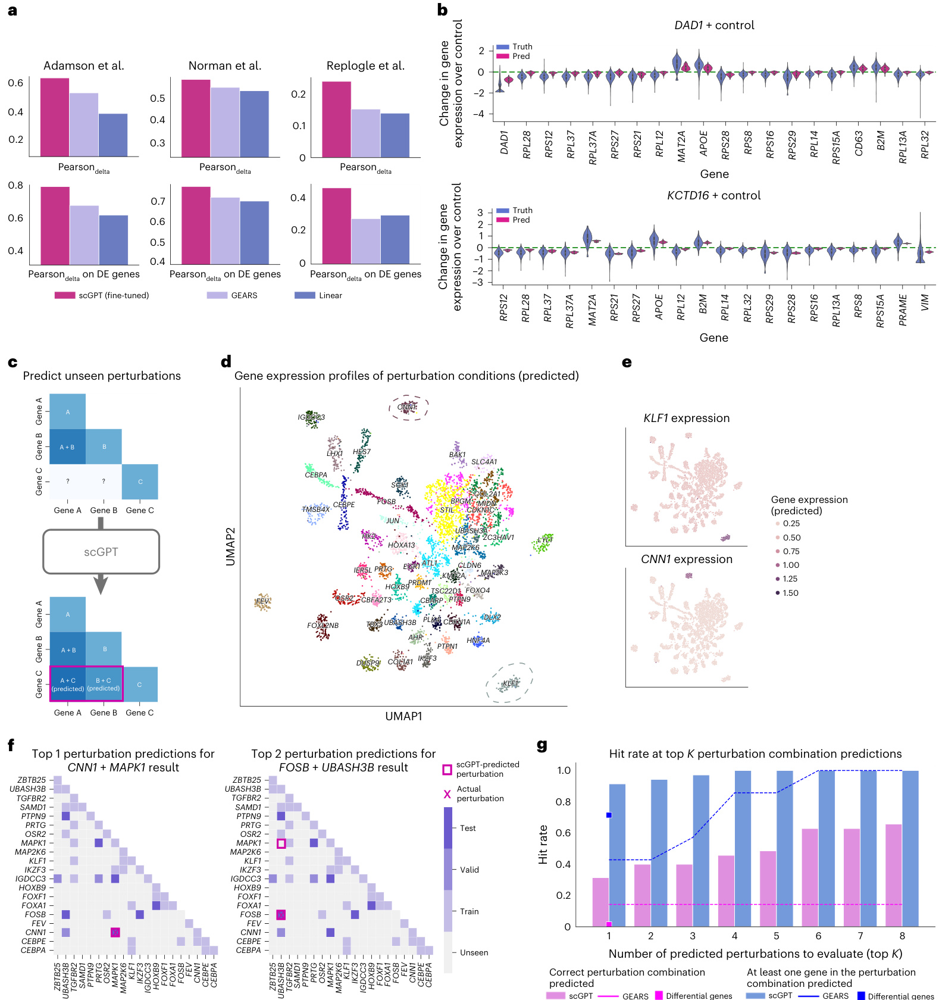
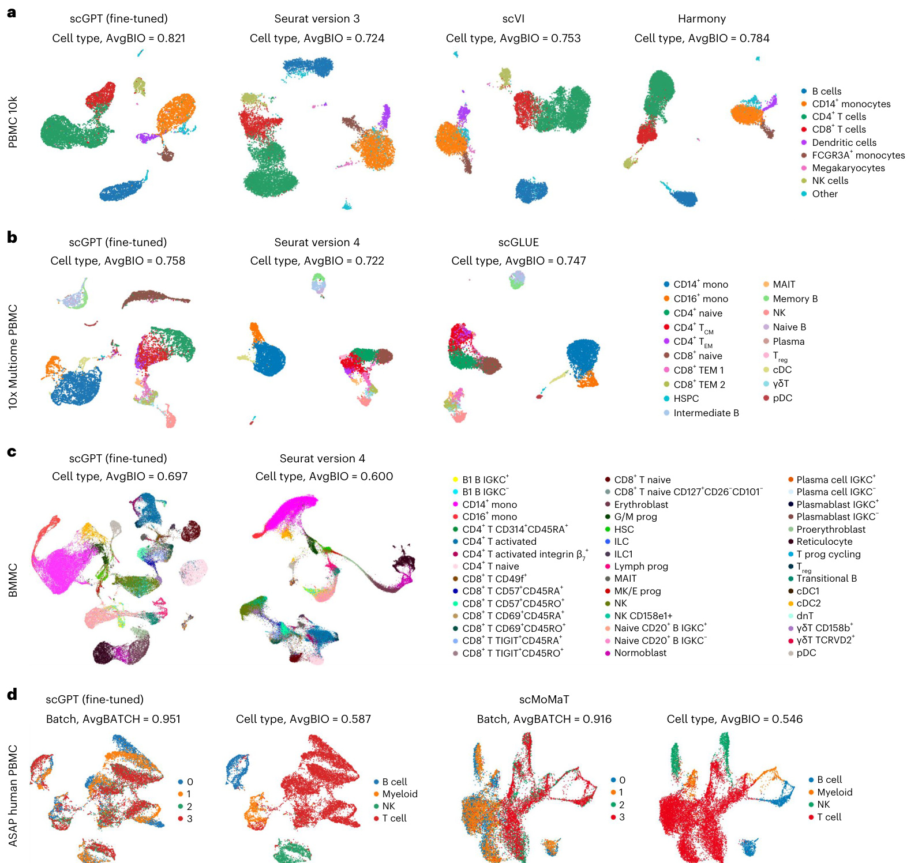
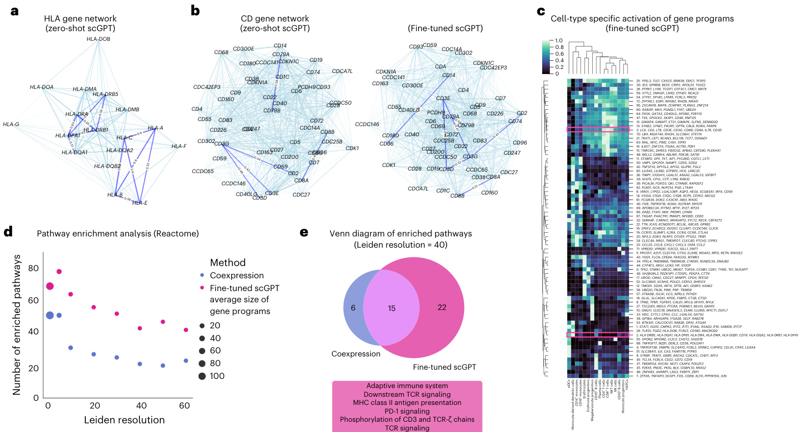
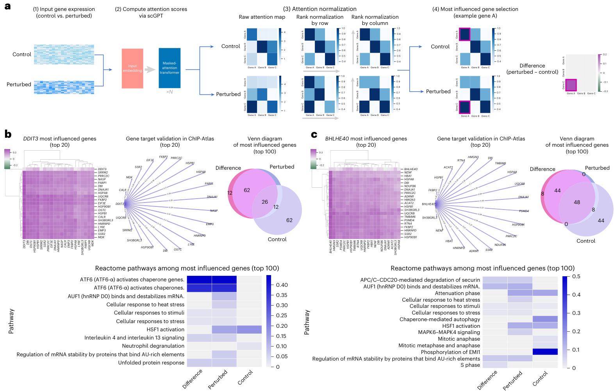

# nature methods  

# scGPT: toward building a foundation model for single-cell multi-omics using generative AI  

# Received: 12 July 2023  

Accepted: 30 January 2024  

Published online: 26 February 2024 Check for updates  

Haotian Cui    1,2,3,8, Chloe Wang1,2,3,8, Hassaan Maan    1,3,4, Kuan Pang    2,3, Fengning Luo2,3, Nan Duan    5 & Bo Wang    1,2,3,4,6,7  

Generative pretrained models have achieved remarkable success in various domains such as language and computer vision. Specifically, the combination of large-scale diverse datasets and pretrained transformers has emerged as a promising approach for developing foundation models. Drawing parallels between language and cellular biology (in which texts comprise words; similarly, cells are defined by genes), our study probes the applicability of foundation models to advance cellular biology and genetic research. Using burgeoning single-cell sequencing data, we have constructed a foundation model for single-cell biology, scGPT, based on a generative pretrained transformer across a repository of over 33 million cells. Our findings illustrate that scGPT effectively distills critical biological insights concerning genes and cells. Through further adaptation of transfer learning, scGPT can be optimized to achieve superior performance across diverse downstream applications. This includes tasks such as cell type annotation, multi-batch integration, multi-omic integration, perturbation response prediction and gene network inference.  

Single-cell RNA sequencing (scRNA-seq), by enabling intricate characterization of distinct cell types and advancing our understanding of disease pathogenesis, paves the way for cellular heterogeneity exploration, lineage tracking, pathogenic mechanism elucidation and, ultimately, personalized therapeutic strategies1–4. The broad-scale application of scRNA-seq has led to comprehensive data atlases such as the Human Cell Atlas, which now encompasses tens of millions of cells5–7. Recent advancements in sequencing technology promote the diversity of data modalities and extend our understanding beyond genomics to epigenetics, transcriptomics and proteomics, thus providing multi-modal insights8,9. These breakthroughs have also raised new research questions such as reference mapping, perturbation prediction and multi-omic integration10–14. It is critical to parallelly develop methodologies capable of effectively harnessing, enhancing and adapting to the rapid expansion of sequencing data.  

One promising approach to address this challenge is the generative pretraining of foundation models15,16. Foundation models, often built upon the self-attention transformer architecture17 for its effectiveness in learning expressive data representations, are a class of deep learning models that are pretrained on large-scale, diverse datasets and can be readily adapted for a variety of downstream tasks. Such models have recently achieved unprecedented success across various fields, exemplified by DALL-E 2 and GPT-4 in computer vision and natural language generation $(\mathsf{N L G})^{18-20}$ and recently Enformer21 for biological applications. More interestingly, these generative pretrained models consistently outperform task-specific models trained from scratch22,23. This indicates a task-agnostic understanding of knowledge in these domains, inspiring us to explore its adoption for single-cell omic research. However, current machine-learning-based methods in single-cell research are rather scattered, with specific models dedicated to distinct analysis tasks24–26. As a result, the datasets used in each study are often limited in breadth and scale7. To confront this limitation, there is a need for a foundation model that is pretrained on large-scale data and can comprehend the complex interactions between genes across diverse tissues.  

To enhance the modeling of large-scale single-cell sequencing data, we draw inspiration from the self-supervised pretraining workflow in NLG, in which the self-attention transformer17 has demonstrated great capability of modeling input tokens of words. While texts are made up of words, cells can be characterized by genes and the protein products they encode. By learning gene and cell embeddings simultaneously, we can better comprehend cellular characteristics. Moreover, the flexible nature of transformer input tokens enables easy incorporation of additional features and meta-information. This direction was also explored recently in Geneformer27, in which transformer-based encoders are trained with genes ranked by expression levels and demonstrate abilities for cell type and gene function prediction. Advancing beyond this, we envision the need to tailor a pretraining workflow for directly modeling the intricacies of non-sequential omics data and to extend its applicability to a broader spectrum of tasks.  

In this work, we present the single-cell foundation model scGPT by pretraining on over 33 million cells. We establish a unified generative pretraining workflow specifically for non-sequential omics data and adapt the transformer architecture to simultaneously learn cell and gene representations. Additionally, we provide fine-tuning pipelines with task-specific objectives, designed to facilitate application of the pretrained model across a range of diverse tasks.  

Our model, scGPT, demonstrates the transformative potential of the single-cell foundation model through three key aspects. First, scGPT represents a large-scale generative foundation model that enables transfer learning across a diverse range of downstream tasks. By achieving state-of-the-art performance on cell type annotation, genetic perturbation prediction, batch correction and multi-omic integration, we showcase the effectiveness of the ‘pretraining universally, fine-tuning on demand’ approach as a generalist solution for computational applications in single-cell omics. Second, through the comparison of gene embeddings and attention weights between fine-tuned and raw pretrained models, scGPT uncovers valuable biological insights into gene– gene interactions specific to various conditions, such as cell types and perturbation states. Third, our observations reveal a scaling effect: larger pretraining data sizes yield superior pretrained embeddings and further lead to improved performance on downstream tasks. This finding highlights the exciting prospect that foundation models can continuously improve alongside the expansion of available sequencing data in the research community. Based on these findings, we envision that the adoption of pretrained foundation models will greatly expand our understanding of cellular biology and serve as a solid foundation for future discoveries. The release of the scGPT models and workflow aims to empower and expedite research in these areas and beyond.  

# Results Single-cell transformer foundation model overview  

Single-cell sequencing enables the profiling of molecular characteristics at the individual cell level. For instance, scRNA-seq measures the abundance of RNA transcripts, providing insights into cell identity, developmental stage and functionality. We introduce scGPT, a foundation model in the single-cell domain with a generative pretraining approach. The core model contains stacked transformer layers with multi-head attention17 that generate cell and gene embeddings simultaneously (Methods). scGPT consists of two training stages: initial general-purpose pretraining on large cell atlases and follow-up fine-tuning on smaller datasets for specific applications (Fig. 1a–c). In the pretraining stage, we introduce a specially designed attention mask and generative training pipeline to train scGPT in a self-supervised manner to jointly optimize cell and gene representations (Methods). This technique addresses the non-sequential nature of gene expression to adapt to the NLG framework of sequential prediction. During training, the model gradually learns to generate gene expression of cells based on cell states or gene expression cues. In the fine-tuning stage, the pretrained model can be adapted to new datasets and specific tasks (Methods). We offer flexible fine-tuning pipelines suitable for a variety of essential tasks in single-cell research, including scRNA-seq integration with batch correction, cell type annotation, multi-omic integration, perturbation prediction and gene regulatory network (GRN) inference.  

To collect diverse and extensive sequencing data for self-supervised pretraining of scGPT, we assembled scRNA-seq data from 33 million human cells under normal (non-disease) conditions, obtained from the CELLxGENE collection (https://cellxgene.cziscience. com/; Fig. 1d). This comprehensive dataset encompasses a wide range of cell types from 51 organs or tissues and 441 studies, providing a rich representation of cellular heterogeneity across the human body. After pretraining, we visualized the scGPT cell embeddings on $10\%$ of the human cells of the 33 million cells using uniform manifold approximation and projection (UMAP) visualization28 (Fig. 1e). The resulting UMAP plot exhibits intriguing clarity, with cell types accurately represented by distinct colors at localized regions and clusters. Considering the inclusion of over 400 studies in the dataset, this demonstrates the remarkable capability of pretraining to distill biological variation.  

# scGPT improves the precision of cell type annotation  

To fine-tune the pretrained scGPT for cell type annotation, a neural network classifier takes the scGPT transformer output cell embedding as input and outputs categorical predictions for cell types. The whole model was trained with cross-entropy on a reference dataset with expert annotations and then used to predict cell types on a held-out query data partition. We conducted extensive experiments on diverse datasets to evaluate the performance of scGPT for cell type annotation. First, we adapted scGPT to predict cell types in a human pancreas dataset. We visualized the predictions in Fig. 2a. Notably, scGPT achieved high precision $_{(>0.8)}$ for most cell types shown in the confusion matrix (Fig. 2b), except only for rare cell types with extremely low cell numbers in the reference partition. For example, fewer than 50 cells belong to mast and major histocompatibility (MHC) class II cell types out of the 10,600 cells in the reference set. Fig. 2c visualizes the cell embeddings in the fine-tuned scGPT, which demonstrate high intra-cell type similarities.  

Next, we tested the model on a disease dataset of multiple sclerosis $({\sf M S})^{29}$ . The model was fine-tuned on a reference partition of healthy human immune cells and evaluated on the prediction for cells with the MS condition. The fine-tuned model demonstrated strong alignment with the cell type annotations provided by the original study and achieved a high accuracy of around 0.85 (Fig. 2f,g). Furthermore, we applied the model to a more challenging scenario for generalization across disease types using a tumor-infiltrating myeloid dataset30. The model was fine-tuned on six cancer types in a reference data partition (Methods) and evaluated on the query partition of three unseen cancer types (Fig. 2d). The results demonstrated high precision in distinguishing immune cell subtypes (Fig. 2e,h), and the cell embeddings exhibited clear separability among different cell types (Fig. 2i). Finally, we benchmarked the fine-tuned scGPT against two other recent transformer-based methods, TOSICA31 and scBERT32, across the three datasets (Methods). scGPT constantly outperformed the other methods in all classification metrics, including accuracy, precision, recall and macro F1 (Fig. 2j).  

In addition to cell type classification, we further explored the ability of scGPT to project unseen query cells to reference datasets through reference mapping (Supplementary Note 1 and Supplementary Fig. 11). We discovered that scGPT, with only pretrained weights, achieved competitive performance compared with existing methods. Further performance improvement can be achieved through fine-tuning on reference datasets.  

scGPT predicts unseen genetic perturbation responses Recent advancements in sequencing and gene editing techniques have greatly facilitated large-scale perturbation experiments, enabling the characterization of cellular responses to various genetic perturbations.  

  
Fig. 1 | Model schematic. a, The workflow of scGPT. The model is generatively pretrained on large-scale scRNA-seq data from cell atlases. The core component of scGPT contains stacked transformer blocks with specialized attention masks for generative training. For downstream applications, the pretrained model parameters can be fine-tuned on new data. We applied scGPT in a variety of tasks including cell type annotation, batch correction, multi-omic integration, genetic perturbation prediction and gene network inference. b, Detailed view of the input data embeddings. The input contains three layers of information: gene tokens, expression values and condition tokens (modality, batch, perturbation  

conditions, etc.). c, Detailed view of the scGPT transformer layer. We introduced a specially designed attention mask in the masked multi-head attention block to conduct generative pretraining on single-cell sequencing data. Norm represents the layer normalization operation. d, Diagram illustrating the size of training data and the organs of origin. The scGPT whole-human model was pretrained on scRNA-seq data of 33 million (M) normal human cells. k, thousand. e, UMAP visualization of the pretrained scGPT cell embeddings (emb; a random $10\%$ subset), colored by major cell types. GABA, γ-aminobutyric acid.  

This approach holds immense promise for uncovering new gene interactions and advancing regenerative medicine. However, the vast combinatorial space of potential gene perturbations quickly surpasses the practical limits of experimental feasibility. To overcome this limitation, scGPT can be used to leverage the knowledge gained from cellular responses in known experiments and extrapolate them to predict unknown responses. The utilization of self-attention mechanisms over the gene dimension enables encoding of intricate interactions between perturbed genes and the responses of other genes. By leveraging this capability, scGPT can effectively learn from existing experimental data and accurately predict gene expression responses of unseen perturbations.  

Prediction of unseen gene perturbations. For the perturbation prediction task, we evaluated our model using three Perturb-seq datasets of leukemia cell lines: the Adamson dataset33 consisting of 87 one-gene perturbations, the curated Replogle dataset34 consisting of 1,823 one-gene perturbations and the Norman dataset35 consisting of 131 two-gene perturbations and 105 one-gene perturbations. To assess the perturbation prediction capability of scGPT, we fine-tuned the model on a subset of perturbations to predict the perturbed expression profile given an input control cell state and the genes of intervention. Next, the model was tested on perturbations involving unseen genes (Methods). We calculated the Pearson $\mathrm{\delta}$ metric, which measures the correlation between predicted and observed post-perturbation expression changes. Additionally, we reported this metric on the top 20 most significantly changed genes for each perturbation, denoted as Pearson $\mathrm{\delta}$ on differentially expressed genes. See Supplementary Note 12 for details on metric calculations. We conducted a performance comparison between scGPT and two other methods, GEARS36 and a linear regression baseline (Methods). Our results demonstrate that scGPT achieved the highest scores for all three datasets (Fig. 3a and Supplementary Table 6). Particularly, scGPT excelled in predicting post-perturbation changes, consistently outperforming the others by $5–20\%$ margins. Additionally, we visualized predictions for two example perturbations in the Adamson dataset in Fig. 3b, where scGPT accurately predicted the trend of expression change for all top 20 differentially expressed genes.  

  
Fig. 2 | Cell type-annotation results using scGPT. a, UMAP of gene expression of cells from the human pancreas dataset, colored by the cell types annotated in the original study (left) and by the cell types predicted by the fine-tuned scGPT (right). PP, pancreatic polypeptide cell; PSC, pancreatic stellate cell. b, The confusion matrix between predicted and annotated cell types in the human pancreas dataset. c, Heatmap of 512-dimensional cell embeddings from scGPT in the human pancreas dataset. d, UMAP visualization of the myeloid dataset, colored by cancer types. scGPT was fine-tuned on the reference partition (left) and evaluated on the query partition (right). These two data partitions contain distinct cancer types. cDC2, type 2 (CD1A+CD172A+) conventional dendritic cell; ESCA, esophageal carcinoma; LYM, lymphoma; MYE,   
myeloma; OV-FTC, ovarian or follicular thyroid carcinoma; PAAD, pancreatic adenocarcinoma; THCA, thyroid carcinoma; UCEC, uterine corpus endometrial carcinoma. e, On the query partition, UMAP is colored by the cell types annotated in the original study (left) and by scGPT-predicted cell types. f,h, Confusion matrices between predicted cell types and actual annotations for the MS and myeloid datasets, respectively. g,i, Heatmaps showing 512-dimensional cell embeddings in scGPT for cells in the MS and myeloid datasets, respectively. j, Evaluation of the cell-annotation performance of scGPT through $n\!=\!5$ random train–validation splits on the myeloid, MS and human pancreas datasets. Performance metrics from the test sets are presented as mean values $\pm$ s.e.m.  

The ability to predict unseen perturbation responses could expand the scope of perturbation experiments, as depicted in Fig. 3c. To explore the expanded space of predicted perturbation responses, we conducted clustering analysis using the Norman dataset to validate biologically relevant functional signals. The original Perturb-seq study covered 236 perturbations targeting 105 genes. However, considering all possible combinations of these target genes, there are a total of 5,565 potential perturbations, indicating that the experimental Perturb-seq data only represent $5\%$ of the entire perturbation space. Therefore, we applied the fine-tuned scGPT to expand the perturbation in silico and visualized the predicted mean response for each perturbation in Fig. 3d using UMAP. Using the annotations from the original study, we found that perturbation conditions of the same functional groups clustered in neighboring regions (Supplementary Fig. 4). Next, we clustered the predicted expression using Leiden37 and observed that the clusters exhibited high association with the ‘dominant gene’ within the perturbation combinations. For example, the circled cluster associated with the KLF1 gene indicated that the data points in this cluster underwent combined perturbations involving KLF1 along with another gene (that is, $K L F I+X)$ . Using the KLF1 and CNN1 clusters as two examples, we further validated that the corresponding predicted expression was exclusively high in these regions (Fig. 3e), which aligns with expected outcomes of the CRISPRa (CRISPR-mediated transcriptional activation) Perturb-seq experiments in the Norman dataset. The dominant gene clusters demonstrate the capability of scGPT to uncover associations between perturbation combinations.  

  
Fig. 3 | Prediction results for perturbation response and reverse perturbation. a, Comparison between scGPT and other perturbation prediction methods. Pearson correlation between predicted and actual gene expression changes is reported. The metric is computed for all genes and the top differentially expressed (DE) genes, respectively. b, Two example perturbations in the Adamson test dataset, distribution of predicted (pred; $n\!=\!300$ cells) and actual gene expression change $.n\!=\!405$ cells for the perturbation of gene KCTD16 and $n\,{=}\,618$ cells for the perturbation of gene DAD1) of the top 20 differentially expressed genes. The box denotes the interquartile range of expression change. The median is marked by the central line within each box. Whiskers extend to 1.5 times the interquartile range. Horizontal dashed lines represent the null baseline of gene expression changes. c, Illustration diagram for predicting unseen perturbation responses using scGPT. d, UMAP of predicted gene expression profiles of the   
perturbation conditions. The UMAP plot is colored by Leiden clusters and labeled with the dominant gene of each cluster. e, Expression patterns of two selected perturbed genes (KLF1 and CNN1) over UMAP of perturbation conditions. f, Visualization of possible perturbation combinations over the perturbation combination space of 20 genes. The grid is colored by experiment type (train, valid, test, unseen). All predicted perturbations are highlighted by square boxes, and the actual source perturbation is marked with a cross. g, Top 1–8 accuracy by scGPT for correct and relevant predictions among the seven test cases, benchmarked against GEARS and the naive baseline of the top two differential genes. The relevant predictions (blue) indicate that at least one of the perturbed genes in the perturbation combination is found in the predictions. The hit rates of scGPT are represented by the bars, those of GEARS are shown by the lines, and differential genes (for top 1 predictions only) are represented by square markers.  

In silico reverse perturbation prediction. scGPT is also capable of predicting the source of genetic perturbation for a given resulting cell state, which we refer to as in silico reverse perturbation prediction. An ideal prediction model conducting such reverse prediction can be used to infer important driving genes for lineage development or to facilitate the discovery of potential therapeutic gene targets. A hypothetical example application of such capability could be to predict CRISPR target genes that influence cells to recover from a disease state. To showcase the effectiveness of reverse perturbation prediction, we used a subset of the Norman dataset focusing on perturbations involving 20 genes (Fig. 3f). This combinatorial space consists of a total of 210 one-gene or two-gene perturbation combinations. We fine-tuned scGPT using 39 $(18\%)$ known perturbations (the training group in Fig. 3f). We then tested the model on queries of unseen perturbed cell states, and scGPT successfully predicted the source of perturbations (within top-ranked predictions) that would generate the observed results. For example, scGPT ranked the correct perturbation of $C N N I+M A P K I$ genes as the top prediction for one test example, and the correct perturbation of $F O S B+U B A S H3B$ genes was ranked as the second prediction for another case (Fig. 3f). Overall, scGPT identified on average $91.4\%$ relevant perturbations (6.4 of seven) within the top 1 predictions (blue bars in Fig. 3g) and $65.7\%$ correct perturbations (4.6 of seven test cases) within the top 8 predictions (pink bars in Fig. $3\mathrm{g},$ ), outperforming GEARS and the differential gene baseline by a considerable margin. We envision that these predictions can be used for planning perturbation experiments by maximizing the possibility of deriving target cell states. Compared to random tryouts, which would on average require 105.5 attempts of the 210 possible perturbations in this subset, finding the correct source of genetic change with fewer attempts offers a valuable tool for accelerating the discovery of important genetic drivers and optimizing perturbation experiments.  

# scGPT enables multi-batch and multi-omic integration  

Multi-batch scRNA-seq integration. Integrating multiple scRNA-seq datasets from different batches poses unique challenges in simultaneously preserving the biological variance of integrated data and removing technical batch effects. To integrate sequencing samples, we fine-tuned scGPT in a self-supervised manner by learning unified cell presentations that recover masked gene expression (Methods). In our benchmarking experiments, we compared scGPT with three popular integration methods: $\mathsf{s c V I}^{38}$ , Seurat39 and Harmony40. The evaluation was conducted on three integration datasets, namely, COVID-19 (18 batches)12, peripheral blood mononuclear cell (PBMC) 10k (two batches)41 and perirhinal cortex (two batches)42 datasets. In the PBMC 10k dataset, scGPT successfully separated all cell types (Fig. 4a). The superior integration performance of scGPT was further supported by its high biological conservation score, with an AvgBIO score of 0.821, which was $5–10\%$ higher than that of the compared methods.  

The AvgBIO score aggregates three cell type-clustering metrics, normalized mutual information $(\mathsf{N M I}_{\mathrm{cell}})$ , adjusted Rand index $(\mathbf{A}\mathbf{R}\mathbf{I}_{\mathrm{cell}})$ and average silhouette width $\left(\mathbf{A}\mathbf{S}\mathbf{W}_{\mathrm{cell}}\right)$ as detailed in Supplementary Note 12. Notably, scGPT also demonstrated considerable performance for integrating the PBMC 10k dataset even without fine-tuning (Supplementary Fig. 5), highlighting the generalizability of the pretraining. In the context of the perirhinal cortex dataset, scGPT remained competitive against all other methodologies (Supplementary Fig. 6c). This finding highlights the transferability and robustness of the features learned from the whole-human dataset when applied to specific organs or tissues such as the brain. Furthermore, scGPT consistently achieves competitive scores across all integration metrics and demonstrates strong conservation of biological signals (Supplementary Table 3 and Supplementary Figs. 6 and 7). Additionally, we have developed strategies to accelerate the fine-tuning process for the integration task, including freezing specific model layers and excluding genes with no expression while maintaining results comparable to those of our original approach (Supplementary Note 3).  

Single-cell multi-omic integration. Single-cell multi-omic (scMultiomic) data, which combine multiple views of genetic regulation such as epigenetic, transcriptomic and translation activities, present a unique challenge in aggregating cell representations while preserving biological signals8,9. scGPT addresses this challenge by effectively extracting integrated cell embeddings across different omics datasets. In the case of the 10x Multiome PBMC dataset43, which includes joint gene expression and chromatin accessibility measurements, we compared scGPT with two state-of-the-art methods, scGLUE13 and Seurat $(\mathbf{v}.4)^{44}$ . As depicted in Fig. 4b, scGPT stands out as the only method that successfully generates a distinct cluster for $\mathbf{CD8^{+}}$ naive cells. Next, we tested scGPT on the paired gene expression and protein abundance dataset from bone marrow mononuclear cells (BMMCs)45 as illustrated in Fig. 4c. This dataset contains additional complexity from the large amount of data (90,000 cells), multiple batches (12 donors) and fine-grained subgroup annotations (48 cell types). scGPT presented more defined cluster structures than Seurat (v.4), with a $9\%$ improvement in the AvgBIO score. Notably, scGPT was able to separate $\mathsf{C D4^{+}}$ naive T cells and $\mathsf{C D4^{+}}$ activated T cells as two distinct clusters. It also teased apart integrin ${\upbeta}_{7}^{\;\;+}$ activated $\mathsf{C D4^{+}}$ T cells from other $\mathsf{C D4^{+}}$ T cells, which further endorsed the ability of the model to capture subtle differences between immune cell subgroups. In the mosaic data-integration setting, sequenced samples share some, but not all, data modalities, posing a challenge for integration methods. To showcase the capabilities of scGPT in this context, we used the ATAC with select antigen profiling (ASAP) human PBMC dataset46 as an example. This dataset consists of four sequencing batches with three data modalities. In the benchmark experiment with scMoMat14, scGPT demonstrated superior batch correction performance as shown in Fig. 4d, especially in groups of B, myeloid and natural killer (NK) cells. Overall, scGPT demonstrates superior cell type-clustering performance and exhibits robustness across diverse benchmarked biological conservation metrics (Supplementary Table 4).  

# scGPT uncovers gene networks for specific cell states  

The interactivity between transcription factors, cofactors, enhancers and target genes underlying a GRN mediates important biological processes. Existing GRN-inference methods often rely on correlation in static gene expression or pseudo-time estimates as a proxy for causal graphs47. scGPT, optimized by generative modeling of gene expression, implicitly encodes such relationships in its gene embeddings as well as in attention maps. We thus propose GRN-inference workflows by probing the scGPT embeddings and attention maps from pretrained or fine-tuned models. The gene embeddings construct a similarity network that entails gene–gene interactions on the dataset level. Attention maps further capture unique gene network-activation patterns across different cell states. In this study, we validate the gene network extracted by scGPT against known biology and explore its applicability to gene program discovery.  

  
Fig. 4 | Results of multi-batch and multi-omic integration. a, Benchmark of the fine-tuned scGPT on the PBMC 10k dataset for the cell type-clustering task. The UMAP plot of learned cell embeddings is colored by cell types. b, Benchmark of the fine-tuned scGPT model with scGLUE13 and Seurat $(\mathbf{v}.4)^{44}$ on the 10x Multiome PBMC43 dataset (paired RNA and assay for transposase-accessible chromatin (ATAC) data) for the cell type-clustering task. γδT, gamma delta T cell; HSC, hematopoietic stem cell; HSPC, hematopoietic stem and progenitor cell; ILC, innate lymphoid cell; MAIT, mucosal-associated invariant T cell; mono, monocyte;   
pDC, plasmacytoid dendritic cell; ${\sf T}_{\mathrm{CM}},$ central memory T cell; ${\sf T}_{\mathrm{EM}},$ effector memory T cell; $\mathbb{T}_{\mathrm{reg}}$ regulatory T cell. c, Benchmark of the fine-tuned scGPT model with Seurat $(\mathbf{v}.4)^{44}$ on the BMMC45 dataset (paired RNA and protein data) for the cell type-clustering task. dnT, double negative T cell; G/M, granulocyte-macrophage; MK/E, megakaryocyte-erythroid; Prog, progenitor. d, Benchmark of scGPT with scMoMat14 on the ASAP PBMC46 dataset (mosaic RNA, ATAC and protein data) for batch correction and cell type-clustering tasks. UMAP plots of learned gene embeddings are colored by sequencing batch (left) and cell type (right).  

scGPT demonstrates its ability to group functionally related genes and differentiate functionally distinct genes via learned gene token embeddings. In Fig. 5a, we conducted a sanity check by visualizing the similarity network of human leukocyte antigen (HLA) proteins using gene embeddings from the pretrained scGPT model. In this zero-shot setting, the scGPT model successfully highlighted two clusters corresponding to the well-characterized HLA classes: HLA class I and  

HLA class II genes. These classes encode antigen-presenting proteins that play different roles in immune contexts. For example, HLA class I proteins (encoded by genes such as HLA-A, HLA-C and HLA-E) are recognized by $_{\mathrm{CD8^{+}}}$ T cells and mediate cytotoxic effects, while HLA class II proteins (encoded by HLA-DRB1, HLA-DRA and HLA-DPA1) are recognized by $\mathsf{C D4^{+}}$ T cells and trigger broader helper functions48. In addition, we fine-tuned the scGPT model on the ‘immune human’ dataset and explored the CD gene network specific to the immune cell types present in this dataset. We used the same fine-tuning strategy as that used for the integration task (Methods) for the purpose of GRN analysis. The pretrained scGPT model successfully identified the group of genes (CD3E, CD3D and CD3G) encoding the T3 complex for T cell activation as well as CD79A and CD79B for B cell signaling and CD8A and CD8B as co-receptors for HLA class I molecules49 (Fig. 5b). Furthermore, the fine-tuned scGPT model highlighted the connection between CD36 and CD14 (Fig. 5b).  

  
Fig. 5 | Analysis of gene token embeddings.  a, HLA gene network from by scGPT and the coexpression network in the immune human dataset. The zero-shot scGPT. b, CD gene network from the zero-shot (that is, pretrained) number of enriched pathways from scGPT gene programs was compared and fine-tuned scGPT on the immune human dataset. c, Cell type-specific with that of the coexpression method at different Leiden resolutions. e, Venn activation among scGPT-extracted gene programs in the immune human dataset. diagram comparing the overlap and differences between the enriched pathways Coloring indicates average gene expression. For gene programs containing identified by coexpression versus scGPT. Some example pathways unique to more than 10 genes (indicated by an asterisk), the first 10 genes are shown for scGPT and specific to adaptive immune functions are highlighted in the text box. simplicity. d, Pathway enrichment analysis of the gene programs extracted TCR, T cell receptor.  

scGPT is able to uncover meaningful gene programs that exhibit cell type-specific activation. Gene programs are subsequently selected and clustered using gene embeddings from scGPT (Methods). In Fig. 5c, we visualize gene programs extracted by the fine-tuned scGPT model on highly variable genes (HVGs) in the immune human dataset50 and their expression in different cell types. We observed that a set of HLA class II genes was identified as group 2. Similarly, the CD3 genes involved in the T3 complex were identified as group 3, with the highest expression present in T cells. To systematically validate the extracted gene programs, we performed pathway enrichment analysis against the Reactome database (https://reactome.org/) and identified high-confidence ‘pathway hits’ using stringent multiple-testing correction (https://mathworld.wolfram.com/BonferroniCorrection.html and Methods). In Fig. 5d, we compare the results obtained from scGPT with those from the coexpression network. Notably, scGPT consistently demonstrates a substantially higher number of enriched pathways across all clustering resolutions. Furthermore, we examined similarities and differences in the identified pathways between scGPT and the coexpression network, as depicted in Fig. 5e. Both methods identified 15 common pathways, including those associated with the cell cycle and the immune system. scGPT uniquely identified an additional 22 pathways, 14 of which were immune related. Notably, scGPT specifically highlighted pathways related to the adaptive immune system, T cell receptor signaling, PD-1 signaling and MHC class II presentation. This is concordant with the fact that adaptive immune populations exist in the fine-tuning datasets. These findings demonstrate the superior ability of scGPT to capture intricate gene–gene connections and unravel specific mechanisms within a broader biological context. The detailed list of enriched pathways is provided in Supplementary Table 5.  

In addition to dataset-level gene network inference using gene embeddings, the scGPT attention mechanism enables it to capture gene–gene interactions at the single-cell level. scGPT extracts cell state-specific network-activation data by aggregating single-cell signals from attention maps. This provides insights into context-specific gene regulatory interactions within individual cells, which may vary across different cell states and conditions. For example, in a perturbation experiment, scGPT examines changes in gene network activation before and after perturbation to infer which genes are most influenced by each perturbed gene (Fig. 6a and the Methods). In the Adamson CRISPR interference dataset33, scGPT identified the top 20 genes most influenced by repression of DDIT3 (encoding a transcription factor), which were all found to be signaling targets of DDIT3 in the ChIP-Atlas database51 (Fig. 6b). Moreover, scGPT captured distinct pathway-activation patterns among the top 100 genes most influenced by DDIT3 in control versus DDIT3-knockout settings. Notably, the ATF6 transcription factor pathway identified in the DDIT3-knockout setting is known to mediate the unfolded protein response and regulates cell apoptosis52,53. Similarly, in the case of BHLHE40 repression, 19 of the top 20 most-influenced genes were found to be targets of this transcription factor predicted by chromatin immunoprecipitation followed by sequencing (ChIP–seq) (Fig. 6c). The pathway-activation profile highlighting DNA synthesis and mitosis reflects the role of the transcription factor BHLHE40 in cell cycle regulation. These attention-based findings further validate the scGPT learned gene network on a cell state level, providing additional interpretability to the model’s learned biology.  

  
Fig. 6 | Attention-based gene interaction analysis. a, Attention-based GRNdiscovery workflow for perturbation data. Attention scores in control and perturbed cell states are obtained and ranked by row and column consecutively. Most influenced genes in the control, perturbed and difference settings are selected accordingly. b, GRN analysis for DDIT3 repression. The gene connectivity heatmap presents post-perturbation changes in the network of the top 20 genes most influenced by DDIT3 repression. The gene target network graph showcases the top 20 genes validated in the ChIP-Atlas database, with   
ChIP–seq-predicted targets highlighted in purple. The Venn diagram compares overlaps and differences among the top 100 most-influenced gene sets identified in three selection settings (that is, control, perturbed and post-perturbation difference). The pathway heatmap showcases the difference in Reactome pathways identified from the top 100 most-influenced genes across these three selection settings. The color indicates how strongly each pathway is represented by the percentage of gene overlap. c, GRN analysis for BHLHE40 repression, visualized in a similar manner.  

# Scaling and in-context effects in transfer learning  

In previous sections, scGPT has demonstrated great potential via fine-tuning in a transfer learning manner. We further confirmed the benefits of using the foundation model by comparing it with similar transformer models trained for each downstream task from scratch without pretraining (denoted as scGPT (from scratch)). The results are presented in Supplementary Tables 2–4, where the fine-tuned scGPT consistently showcases performance gain for tasks such as integration and cell type annotation. Given the observed contributions of the foundation model for downstream tasks, we are further interested in exploring factors influencing the transfer learning process.  

First, we delve into the relationship between pretraining data size and the performance of fine-tuned models: For a certain analysis task, how much improvement can be gained by adding further sequencing data into atlases for pretraining? We pretrained a series of scGPT models of the same number of parameters but using different amounts of data, from 30,000 to 33 million sequenced normal human cells. Supplementary Fig. 13a illustrates the resulting performance of fine-tuning on various applications using these different pretrained models. We observed that the performance of fine-tuned models improved as the amount of pretraining data increased (Supplementary Note 4).  

These results indicate a scaling effect, suggesting that greater pretraining data size leads to better pretrained embeddings and improved performance on downstream tasks. Notably, our findings also align with the scaling law reported in natural language models54, highlighting the important role of data size in model performance. The crucial role of pretraining data size in fine-tuning results points to a promising future for pretrained models in the single-cell domain. As larger and more diverse datasets become available, we can anticipate further improvements in model performance, advancing our understanding of cellular processes.  

The second factor we explored is the influence of context-specific pretraining. Here, in-context usage refers to an scGPT model that is pretrained on specific cell types and then fine-tuned for a downstream task on similar cell types. To explore the influence of this factor, we pretrained seven organ-specific models on normal human cells from individual major organs (Fig. 1d) and another model for pan-cancer cells. We verified the efficacy of the pretraining by visualizing cell embeddings of the pretraining data: the pan-cancer model cell embeddings accurately separated different cancer types (Supplementary Fig. 2). The organ-specific models were able to reveal cell heterogeneity of the corresponding organs (Supplementary Fig. 3). Next, we fine-tuned individual models on the COVID-19 dataset to examine the influence of pretraining context. Our analysis revealed a clear correlation between the relevance of the model’s context in pretraining and its subsequent performance for integrating data (Supplementary Fig. 8). The top performers in data-integration tasks were models pretrained on whole-human, blood and lung datasets, which closely aligns with the cell types present in the COVID-19 dataset. Notably, even a brain pretrained model, despite being trained on a substantial dataset of 13 million cells, trailed in performance by $8\%$ compared to the blood pretrained model with a similar dataset size. This emphasizes the importance of aligning the cellular context in pretraining with the target dataset for superior results in downstream tasks. While considering the cellular context is essential, the whole-human pretrained model emerges as a versatile and reliable option for a wide range of applications.  

# Discussion  

We introduce scGPT, a foundation model that harnesses the power of pretrained transformers on a vast amount of single-cell data. Building upon the success of self-supervised pretraining in language models, we adopted a similar approach in the single-cell domain to unravel complex biological interactions. The use of transformers in scGPT enables simultaneous learning of gene and cell embeddings, which facilitates the modeling of various aspects of cellular processes. By leveraging the attention mechanism of transformers, scGPT captures gene-to-gene interactions at the single-cell level, providing an additional layer of interpretability.  

We demonstrated the benefits of pretraining with comprehensive experiments in both zero-shot and fine-tuning settings. The pretrained model showcases strong capabilities of extrapolating to unseen datasets, presenting meaningful clustering patterns in accordance with cell types in zero-shot experiments. In addition, the learned gene networks in scGPT exhibit strong alignment with known functional groups. Furthermore, the pretrained model’s knowledge can be transferred to multiple downstream tasks through fine-tuning. In a variety of tasks such as cell type annotation, perturbation prediction and multi-batch and multi-omic integration, the fine-tuned scGPT model consistently outperforms models trained from scratch. This demonstrates the value of the pretrained model to downstream tasks, enabling more accurate and biologically meaningful analyses. Notably, the current pretraining does not inherently mitigate batch effects, and thus the model’s zero-shot performance could be constrained on datasets with substantial technical variation. Evaluating the model is also complex, given the frequent absence of definitive biological ground truths and the variation in data quality (detailed in Supplementary Note 10).  

For future directions, we plan to pretrain on a larger-scale dataset with more diversity, including multi-omic data, spatial omics and various diseased conditions. It is also interesting to incorporate perturbation and temporal data in the pretraining stage, enabling the model to learn causal relationships and infer how genes and cells respond to changes over time. We also aim to explore in-context instruction learning for single-cell data. This involves developing techniques that allow the pretrained model to understand and adapt to different tasks and contexts in a zero-shot setting without the need for fine-tuning. By enabling scGPT to grasp the nuances and specific requirements of different analyses, we can enhance its usability and applicability in a wide range of research scenarios. We envision that the pretraining paradigm will be readily integrated into single-cell research and serve as a foundation to leverage existing knowledge from the exponentially growing cell atlases for new discoveries.  

# Online content  

Any methods, additional references, Nature Portfolio reporting summaries, source data, extended data, supplementary information, acknowledgements, peer review information; details of author contributions and competing interests; and statements of data and code availability are available at https://doi.org/10.1038/s41592-024-02201-0.  

# References  

1. Silverman, A. D., Karim, A. S. & Jewett, M. C. Cell-free gene expression: an expanded repertoire of applications. Nat. Rev. Genet. 21, 151–170 (2020).   
2.	 Preissl, S., Gaulton, K. J. & Ren, B. Characterizing cis-regulatory elements using single-cell epigenomics. Nat. Rev. Genet. 24, 21–43 (2022).   
3.	 Ding, J., Sharon, N. & Bar-Joseph, Z. Temporal modelling using single-cell transcriptomics. Nat. Rev. Genet. 23, 355–368 (2022).   
4. Wagner, D. E. & Klein, A. M. Lineage tracing meets single-cell omics: opportunities and challenges. Nat. Rev. Genet. 21, 410–427 (2020).   
5. Regev, A. Science Forum: the Human Cell Atlas. eLife 6, e27041 (2017).   
6. Han, X. Mapping the mouse cell atlas by Microwell-seq. Cell 172, 1091–1107 (2018).   
7. Angerer, P. et al. Single cells make big data: new challenges and opportunities in transcriptomics. Curr. Opin. Syst. Biol. 4, 85–91 (2017).   
8. Subramanian, I., Verma, S., Kumar, S., Jere, A. & Anamika, K. Multi-omics data integration, interpretation, and its application. Bioinform. Biol. Insights 14, 1177932219899051 (2020).   
9.	 Miao, Z., Humphreys, B. D., McMahon, A. P. & Kim, J. Multi-omics integration in the age of million single-cell data. Nat. Rev. Nephrol. 17, 710–724 (2021).   
10.	 Lotfollahi, M., Wolf, F. A. & Theis, F. J. scGen predicts single-cell perturbation responses. Nat. Methods 16, 715–721 (2019).   
11.	 Lotfollahi, M. Predicting cellular responses to complex perturbations in high-throughput screens. Mol. Syst. Biol. 19, e11517 (2023).   
12.	 Lotfollahi, M. Mapping single-cell data to reference atlases by transfer learning. Nat. Biotechnol. 40, 121–130 (2022).   
13.	 Cao, Z.-J. & Gao, G. Multi-omics single-cell data integration and regulatory inference with graph-linked embedding. Nat. Biotechnol. 40, 1458–1466 (2022).   
14.	 Zhang, Z. et al. scMoMat jointly performs single cell mosaic integration and multi-modal bio-marker detection. Nat. Commun. 14, 384 (2023).   
15.	 Bommasani, R. et al. On the opportunities and risks of foundation models. Preprint at https://doi.org/10.48550/arXiv.2108.07258 (2021).   
16.	 Moor, M. et al. Foundation models for generalist medical artificial intelligence. Nature 616, 259–265 (2023).   
17.	 Vaswani, A. et al. Attention is all you need. Adv. Neural Inf. Process. Syst. 6000–6010 (NeurIPS, 2017).   
18.	 Ramesh, A., Dhariwal, P., Nichol, A., Chu, C. & Chen, M. Hierarchical text-conditional image generation with CLIP latents. Preprint at https://doi.org/10.48550/arXiv.2204.06125 (2022).   
19.	 Brown, T. Language models are few-shot learners. Adv. Neural. Inf. Process. Syst. 1877–1901 (NeurIPS, 2020).   
20.	 OpenAI team. GPT-4 technical report. Preprint at https://doi.org/ 10.48550/arXiv.2303.08774 (2023).   
21.	 Avsec, Ž. et al. Effective gene expression prediction from sequence by integrating long-range interactions. Nat. Methods 18, 1196–1203 (2021).   
22.	 Gururangan, S. et al. Don’t stop pretraining: adapt language models to domains and tasks. In Proc. 58th Annual Meeting of the Association for Computational Linguistics 8342–8360 (ACL, 2020).   
23.	 Qiu, X. et al. Pre-trained models for natural language processing: a survey. Sci. China Technol. Sci. 63, 1872–1897 (2020).   
24.	 Liu, J., Fan, Z., Zhao, W. & Zhou, X. Machine intelligence in single-cell data analysis: advances and new challenges. Front. Genet. 12, 655536 (2021).   
25.	 Oller-Moreno, S., Kloiber, K., Machart, P. & Bonn, S. Algorithmic advances in machine learning for single-cell expression analysis. Curr. Opin. Syst. Biol. 25, 27–33 (2021).   
26.	 Ji, Y., Lotfollahi, M., Wolf, F. A. & Theis, F. J. Machine learning for perturbational single-cell omics. Cell Syst. 12, 522–537 (2021).   
27.	 Theodoris, C. V. et al. Transfer learning enables predictions in network biology. Nature 618, 616–624 (2023).   
28.	 McInnes, L., Healy, J. & Melville, J. UMAP: uniform manifold approximation and projection for dimension reduction. Preprint at https://doi.org/10.48550/arXiv.1802.03426 (2018).   
29.	 Schirmer, L. Neuronal vulnerability and multilineage diversity in multiple sclerosis. Nature 573, 75–82 (2019).   
30.	 Cheng, S. A pan-cancer single-cell transcriptional atlas of tumor infiltrating myeloid cells. Cell 184, 792–809 (2021).   
31.	 Chen, J. et al. Transformer for one stop interpretable cell type annotation. Nat. Commun. 14, 223 (2023).   
32.	 Yang, F. et al. scBERT as a large-scale pretrained deep language model for cell type annotation of single-cell RNA-seq data. Nat. Mach. Intell. 4, 852–866 (2022).   
33.	 Adamson, B. A multiplexed single-cell CRISPR screening platform enables systematic dissection of the unfolded protein response. Cell 167, 1867–1882 (2016).   
34.	 Replogle, J. M. Mapping information-rich genotype–phenotype landscapes with genome-scale Perturb-seq. Cell 185, 2559–2575 (2022).   
35.	 Norman, T. M. et al. Exploring genetic interaction manifolds constructed from rich single-cell phenotypes. Science 365, 786–793 (2019).   
36.	 Roohani, Y., Huang, K. & Leskovec, J. Predicting transcriptional outcomes of novel multigene perturbations with GEARS. Nat. Biotechnol. https://doi.org/10.1038/s41587-023-01905-6 (2023).   
37.	 Traag, V. A., Waltman, L. & Van Eck, N. J. From Louvain to Leiden: guaranteeing well-connected communities. Sci. Rep. 9, 5233 (2019).   
38.	 Lopez, R., Regier, J., Cole, M. B., Jordan, M. I. & Yosef, N. Deep generative modeling for single-cell transcriptomics. Nat. Methods 15, 1053–1058 (2018).   
39.	 Satija, R., Farrell, J. A., Gennert, D., Schier, A. F. & Regev, A. Spatial reconstruction of single-cell gene expression data. Nat. Biotechnol. 33, 495–502 (2015).   
40.	 Korsunsky, I. et al. Fast, sensitive and accurate integration of single-cell data with Harmony. Nat. Methods 16, 1289–1296 (2019).   
41.	 Gayoso, A. A Python library for probabilistic analysis of single-cell omics data. Nat. Biotechnol. 40, 163–166 (2022).   
42.	 Siletti, K. Transcriptomic diversity of cell types across the adult human brain. Science 382, eadd7046 (2023).   
43.	 PBMC from a healthy donor, single cell multiome ATAC gene expression demonstration data by Cell Ranger ARC 1.0.0. 10X Genomics https://support.10xgenomics.com/single-cellmultiome-atac-gex/datasets/1.0.0/pbmc_granulocyte_sorted_10k (2020).   
44.	 Hao, Y. Integrated analysis of multimodal single-cell data. Cell 184, 3573–3587 (2021).   
45.	 Luecken, M. et al. A sandbox for prediction and integration of DNA, RNA, and proteins in single cells. In Proceedings of the Neural Information Processing Systems Track on Datasets and Benchmarks 13 (NeurIPS, 2021).   
46.	 Mimitou, E. P. Scalable, multimodal profiling of chromatin accessibility, gene expression and protein levels in single cells. Nat. Biotechnol. 39, 1246–1258 (2021).   
47.	 Pratapa, A., Jalihal, A. P., Law, J. N., Bharadwaj, A. & Murali, T. M. Benchmarking algorithms for gene regulatory network inference from single-cell transcriptomic data. Nat. Methods 17, 147–154 (2020).   
48.	 Choo, S. Y. The HLA system: genetics, immunology, clinical testing, and clinical implications. Yonsei Med. J. 48, 11–23 (2007).   
49.	 Norman, P. S. Immunobiology: the immune system in health and disease. J. Allergy Clin. Immunol. 96, 274 (1995).   
50.	 Luecken, M. D. Benchmarking atlas-level data integration in single-cell genomics. Nat. Methods 19, 41–50 (2022).   
51.	 Zou, Z., Ohta, T., Miura, F. & Oki, S. ChIP-Atlas 2021 update: a data-mining suite for exploring epigenomic landscapes by fully integrating ChIP–seq, ATAC-seq and Bisulfite-seq data. Nucleic Acids Res. 50, W175–W182 (2022).   
52.	 Yang, H., Niemeijer, M., van de Water, B. & Beltman, J. B. ATF6 is a critical determinant of CHOP dynamics during the unfolded protein response. iScience 23, 100860 (2020).   
53.	 Yoshida, H. et al. ATF6 activated by proteolysis binds in the presence of NF-Y (CBF) directly to the cis-acting element responsible for the mammalian unfolded protein response. Mol. Cell. Biol. 20, 6755–6767 (2000).   
54.	 Kaplan, J. et al. Scaling laws for neural language models. Preprint at https://doi.org/10.48550/arXiv.2001.08361 (2020).  

Publisher’s note Springer Nature remains neutral with regard to jurisdictional claims in published maps and institutional affiliations.  

Springer Nature or its licensor (e.g. a society or other partner) holds exclusive rights to this article under a publishing agreement with the author(s) or other rightsholder(s); author self-archiving of the accepted manuscript version of this article is solely governed by the terms of such publishing agreement and applicable law.  

$\circledcirc$ The Author(s), under exclusive licence to Springer Nature America, Inc. 2024  

# Methods  

# Input embeddings  

Single-cell sequencing data are processed into a cell-by-gene matrix, $\pmb{\chi}\in\mathbb{R}^{N\times G}$ , where each element $X_{i,j}\in\mathbb{R}^{+}$ represents the read count of an RNA molecule for scRNA-seq data or chromatin accessibility of a peak region for scATAC-seq data. Specifically, for scRNA-seq data, the element denotes the RNA abundance for gene $j\in\left\{0,1,...,G\right\}$ in cell $i\!\in\!\{0,1,...,N\}$ . In subsequent sections, we will refer to this matrix as the raw count matrix. The input to scGPT consists of three main components: (1) gene (or peak) tokens, (2) expression values and (3) condition tokens. For each modeling task, gene tokens and expression values are preprocessed from the raw count matrix X accordingly.  

Gene tokens. In the scGPT framework, each gene is considered the smallest unit of information, analogous to a word in NLG. We therefore use gene names as tokens, and assign each gene $\pmb{g}_{j}$ a unique integer identifier id(gj). These identifiers form the vocabulary of tokens used in scGPT. This approach offers great flexibility to harmonize multiple studies with different gene sets (that is, generated by distinct sequencing technologies or preprocessing pipelines). Specifically, different sets of gene tokens can be integrated into a common vocabulary by taking the union set of all genes across studies. Additionally, we incorporate special tokens in the vocabulary, such as $<$ cls $>$ for aggregating all genes into a cell representation and $<{\tt p a d}>$ for padding the input to a fixed length. Conceptually, we draw parallels between gene tokens and word tokens in NLG. The input gene tokens of each cell i are hence represented by a vector $t_{g}^{(i)}\in\mathbb{N}^{\bar{M}}$ :  

$$
\pmb{t}_{g}^{(i)}=\left[\mathbf{id}(g_{1}^{(i)}),\mathbf{id}(g_{2}^{(i)}),\dots,\mathbf{id}(g_{M}^{(i)})\right],
$$  

where M is a predefined maximum input length.  

Expression values. The gene expression matrix X requires additional processing before being used as input for modeling. A fundamental challenge in gene expression modeling is the variability in absolute magnitudes across different sequencing protocols55. Variations in sequencing depths and the presence of sparsely expressed genes result in substantial differences in data scales among different batches of sequencing samples. These differences are not easily mitigated with common preprocessing techniques such as transcripts-per-million normalization and log1p transformation56. Even after these transformations, the same absolute value can convey different ‘semantic’ meanings across sequencing batches. To address this scale difference, we propose the value binning technique to convert all expression counts into relative values. For each non-zero expression count in each cell, we calculate the raw absolute values and divide them into $B$ consecutive intervals $[b_{k},b_{k+1}].$ , where $k\!\in\!\{1,2,...,B\}$ . Each interval represents an equal portion of all expressed genes $\left(1/B\right)$ . It is important to note that a new set of bin edges is computed for each cell, so the interval edges $b_{k}$ may vary among cells. The binned expression value $x_{j}^{(i)}$ for cell i is defined as:  

$$
x_{j}^{(i)}=\left\{\begin{array}{l l}{k,\;\mathrm{if}\,X_{i,j}>0\;\mathrm{and}\;X_{i,j}\in[b_{k},b_{k+1}],}\\ {\;}\\ {0,\;\mathrm{if}\,X_{i,j}=0.}\end{array}\right.
$$  

Through this binning technique, the semantic meaning of $x_{j}^{(i)}$ is consistent across cells from various sequencing batches. For instance, a value of xj(i)= B consistently indicates the highest expression among genes. Notably, for fine-tuning tasks, we also performed log1p transformation and HVG selection before the value binning step. To simplify the notation, we use $X_{i,j}$ to represent both the raw and preprocessed data matrices before binning. Therefore, the final input vector of binned expression values for cell i is denoted as  

$$
\pmb{x}^{(i)}=\left[x_{1}^{(i)},x_{2}^{(i)},\ldots,x_{M}^{(i)}\right].
$$  

Condition tokens. The condition tokens encompass diverse meta-information associated with individual genes, such as perturbation experiment alterations (indicated by perturbation tokens). To represent position-wise condition tokens, we use an input vector that shares the same dimension as the input genes. This vector is denoted as:  

$$
\pmb{t}_{c}^{(i)}=\left[t_{c,1}^{(i)},t_{c,2}^{(i)},\dots,t_{c,M}^{(i)}\right],
$$  

where $t_{c,j}^{(i)}$ represents an integer index corresponding to a condition.  

Embedding layers. We use the conventional embedding layers (that is, PyTorch embedding layer (https://pytorch.org/docs/stable/generated/torch.nn.Embedding.html)) $\mathrm{emb_{g}}$ and $\mathbf{emb}_{\mathrm{c}}$ for the gene tokens and condition tokens, respectively, to facilitate the mapping of each token to a fixed-length embedding vector of dimension $_{D}$ We use fully connected layers, denoted as $\boldsymbol{\mathbf{e}}\mathsf{m}\mathsf{b}_{\mathrm{x}},$ , for the binned expression values to enhance expressivity. This choice enables the modeling of the ordinal relation of gene expression values. Consequently, the final embedding $\pmb{h}^{(i)}\in\mathbb{R}^{M\times D}$ for cell i is defined as:  

$$
\mathbf{\boldsymbol{h}}^{(i)}=\mathsf{e m b}_{\mathtt{g}}\left(\pmb{t}_{g}^{(i)}\right)+\mathsf{e m b}_{\mathtt{x}}\left(\pmb{x}^{(i)}\right)+\mathsf{e m b}_{\mathtt{c}}\left(\pmb{t}_{c}^{(i)}\right).
$$  

# Cell and gene expression modeling by transformers  

scGPT transformer. We use the self-attention transformer17,57 to encode the complete input embedding $\pmb{h}^{(i)}$ in equation (5). The self-attention mechanism operates on the sequence of M embedding vectors, making it particularly suitable for capturing interactions between genes. The output of the stacked transformer blocks can be defined as follows:  

$$
\begin{array}{r l}&{\pmb{h}_{0}^{(i)}=\pmb{h}^{(i)}}\\ &{\pmb{h}_{l}^{(i)}=\operatorname{transformer}_{\pmb{\imath}}\mathsf{b}1\mathsf{o c k}\left(\pmb{h}_{l-1}^{(i)}\right)\,\forall l\in[1,n].}\end{array}
$$  

We use the resulting representation $\pmb{h}_{n}^{(i)}\in\mathbb{R}^{M,D}$ for both gene-level and cell-level tasks. Gene-level fine-tuning objectives (Fine-tuning objectives) are directly applied. Examples include the gene expressionprediction (GEP) objective and the perturbed expression-prediction task (perturb-GEP). For cell-level tasks, we first integrate $\pmb{h}_{n}^{(i)}$ into a cell-embedding vector (Cell representation). An example would be the cell type-assignment task, in which cell embeddings are used to predict cell type labels by an added classifier in the cell typeclassification training objective.  

The input dimension M can reach tens of thousands of genes, substantially exceeding the input length of conventional transformers commonly used in NLG. To address this challenge and ensure efficient self-attention mechanisms, we leverage the accelerated self-attention implementation by FlashAttention58. This implementation effectively enhances model capacity and enables effective processing of large input dimensions. Although FlashAttention was adopted, any efficient transformers can potentially be used for scGPT as well, such as transformers with linear complexity (Linformer)59 and Kernelized Self-Attention $({\bf K}{\bf S}{\bf A})^{60}$ .  

Cell representation. Each cell is analogous to a ‘sentence’ composed of genes, and its representation $\pmb{h}_{c}^{(i)}\in\overline{{\mathbb{R}}}^{D}$ is obtained by aggregating the learned gene-level representations $\pmb{h}_{n}^{(i)}$ . Various pooling operations, such as element-wise mean pooling or weighted pooling, can be readily used in this context. In this study, we opt to use a special token $<\mathsf{c l s}>$ for the cell representation, enabling the model to learn the pooling operation within transformer blocks. The $<$ cls $>$ token is appended to the beginning of the input tokens, and the final embedding at this position is extracted as the cell representation. Consequently, the cell embedding $\pmb{h}_{c}^{(i)}$ can be extracted by the corresponding row in the stacked final-layer embeddings $\pmb{h}_{n}^{(i)}[<\mathsf{c l s}>]$ , where the [< cls ${>}]$ operation retrieves the row at the index of the $<\mathsf{c l s}>$ token position.  

Representation for batch and modality. We use additional sets of tokens to represent different sequencing batches and sequencing modalities (genes from RNA-seq, peaks from ATAC-seq, etc.), specifically for the scRNA-seq and scMultiomic integration tasks. This is similar to condition tokens introduced in Input embeddings and is implemented similarly using standard embedding layers. The modality tokens $\pmb{t}_{m}^{(i)}$ are associated with individual input features gj (for example, to indicate whether it is a gene, region or protein). The batch tokens are on the cell level originally but can be propagated to all features of a single cell as well. In other words, the same batch token $t_{b}^{(i)}$ can be repeated up to length M of input features of single cell i:  

$$
\pmb{t}_{b}^{(i)}=\left[t_{b,1}^{(i)},t_{b,2}^{(i)},\dots,t_{b,M}^{(i)}\right]=\left[t_{b}^{(i)},t_{b}^{(i)},\dots,t_{b}^{(i)}\right].
$$  

The difference between the tokens described in Input embeddings and the batch and modality tokens is that these embeddings of batch and modality tokens are not used as input to the transformer blocks. Instead, they are concatenated with the transformer output on either the feature or cell level before entering specific fine-tuning objectives. This is to prevent the transformer from amplifying the attention within features of the same modalities while underestimating those of different modalities. Furthermore, knowing the modality and/or batch identities facilitates gene expression modeling in the downstream fine-tuning objectives. As the model learns to predict expression values conditioned on modality and/or batch identities, such biases are implicitly removed from the gene and cell representations themselves. This serves as a technique to facilitate batch correction.  

As an example, in the scMultiomic integration task, we concatenate the transformer output with the sum of batch and modality embeddings. This serves as input to the downstream fine-tuning objectives for expression modeling:  

$$
\pmb{h}_{n}^{\prime(i)}=\mathsf{c o n c a t}\left(\pmb{h}_{n}^{(i)},\mathsf{e m b}_{\mathsf{b}}\left(\pmb{t}_{b}^{(i)}\right)+\mathsf{e m b}_{\mathsf{m}}\left(\pmb{t}_{m}^{(i)}\right)\right),
$$  

where $\mathsf{e m b}_{\mathsf{b}}$ and embm denote the batch- and modality-embedding layers, respectively. $\pmb{h}_{n}^{\ddot{(i)}}$ denotes the output of the transformer layer (scGPT transformer).  

as BERT57 and RoBERTa61, in which randomly masked tokens in the input sequence are predicted in the model’s output and (2) autoregressive generation with sequential prediction in causal transformer decoder models such as the OpenAI GPT series19,20. The generative pretraining used in OpenAI GPT-3 (ref. 19) and GPT-4 (ref. 20) uses a unified framework in which the model predicts the most-likely next token from a ‘prompt’ consisting of known input tokens. This framework offers great flexibility to be used in various NLG applications and demonstrates capabilities such as contextual awareness in zero-shot and fine-tuned settings62. We believe that generative training can be beneficial to single-cell models in a similar manner. Specifically, we are interested in two tasks: (1) generating unknown gene expression values based on known gene expression, that is, generation by ‘gene prompts’, and (2) generating whole-genome expression given an input cell type condition, that is, generation by ‘cell prompts’.  

Alternatively, in the scRNA-seq integration task, concatenation of batch embedding with the cell representation yields the following representation as input:  

$$
\pmb{h}_{c}^{\prime(i)}=\mathsf{c o n c a t}\left(\pmb{h}_{c}^{(i)},\mathsf{e m b}_{\mathsf{b}}\left(t_{b}^{(i)}\right)\right),
$$  

where $t_{b}^{(i)}$ denotes the batch identity of cell i. $\pmb{h}_{c}^{(i)}$ is the original cell representation in Fine-tuning objectives. Note that the modified version $\pmb{h}_{c}^{\prime(i)}$ is only relevant to expression-modeling objectives and is not applicable to classification-based objectives as detailed in Fine-tuning objectives.  

Despite similar ideas of tokens and prompts, modeling genetic reads is inherently different from natural language due to the non-sequential nature of the data. Unlike words in a sentence, the order of genes within a cell is interchangeable, and there is no equivalent concept of the ‘next gene’ to predict. This makes it challenging to apply the causal masking formulation from GPT models directly to single-cell data. To address this challenge, we developed a specialized attention-masking mechanism for scGPT that defines the order of prediction based on attention scores.  

# Generative pretraining  

Attention masking can typically be applied on the self-attention map in the transformer blocks: for an input of $M$ gene tokens (equation (1)), the $(l+1)$ -th transformer block applies the multi-head self-attention on its input $\pmb{h}_{l}^{(i)}\in\mathbb{R}^{M\times D}$ of M tokens (equation (6)). Specifically, each self-attention operation is computed as follows:  

Foundation model pretraining. The foundation model is designed to be a generalizable feature extractor that can benefit a diverse range of downstream tasks. The token vocabulary used in pretraining contains the entire set of genes in the human genome. Expression values were binned before model pretraining (Input embeddings). To speed up the training, we restrict the input to only genes with non-zero expression for each input cell. To efficiently train the model to capture gene–gene relation and gene–cell relation, we introduce a generative training strategy with specialized attention masks as described in the following section.  

Attention mask for generative pretraining. Self-attention has been widely used to capture co-occurrence patterns among tokens. In natural language processing, this has been achieved mainly in two ways: (1) masked token prediction used in transformer encoder models such  

$$
\begin{array}{r l}&{Q=h_{l}^{(i)}W_{q},\,K=h_{l}^{(i)}W_{k},\;V\,{=}\,h_{l}^{(i)}W_{v},}\\ &{\tt A t t e n t i o n(Q,}{K},V)\,{=}\,\mathrm{sof}\,\mathrm{tmax}\left(\frac{Q K^{T}}{\sqrt{d}}+{\cal A}_{\mathrm{mask}}\right)V,}\end{array}
$$  

where $Q,K,V\in\mathbb{R}^{M\times d}$ represent the query, key and value vectors. $W_{q},W_{k},W_{\upsilon}\in\mathbb{R}^{D\times d}$ are the learnable weight matrices. The term $^d$ is the feature dimensionality, serving as a scaling factor in QKT  t o maintain numerical stability. The attention mask $\pmb{A}_{\mathrm{mask}}\in\left\{0,-\,\mathbf{inf}\,\right\}^{M\times M}$ delineates the scope of the self-attention by modifying the raw attention weights between queries and keys as i n Q√KdT . Specifically, adding −inf to a position $(i,j)$ in the matrix nullifies the attention weight after softmax, thus prohibiting the attention between the i-th query and the j-th key. Adding 0, on the other hand, means that the attention weights remain unchanged. This attention-masking technique allows the model to focus on specific contextual elements.  

We specifically designed the scGPT attention mask to support both gene-prompt and cell-prompt generations in a unified way. The attention mask $\dot{\pmb{A}}_{\mathrm{mask}}\in\{0,\dot{-}\,\mathrm{inf}\,\}^{M\dot{\times}M}$ is visualized in Supplementary Fig. 1a, where queries are organized in rows and keys in columns. As annotated at the bottom of the figure, each token in the input embedding $\pmb{h}_{l}^{(i)}$ can be one of these three groups: (1) the reserved $<\mathsf{c l s}>$ token for cell embedding (introduced in Cell representation), (2) known genes with token embeddings and expression value embeddings and (3) unknown genes for which expression values are to be predicted. The rule of thumb for scGPT attention masking is to only allow attention computation between embeddings of the ‘known genes’ and the query gene itself. This is achieved by using the elements $a_{i,j}\,\mathrm{in}\,A_{\mathrm{mask}}$ as follows:  

$$
a_{i,j}=\left\{\begin{array}{l l}{0,}&{\mathrm{~if~}j\notin\mathrm{~unknown}\,\mathrm{genes},}\\ {0,}&{\mathrm{~if~}i=j\mathrm{~and}j\in\mathrm{~unknown}\,\mathrm{genes},}\\ {-\,\mathrm{inf},}&{\mathrm{~if~}i\neq j\mathrm{~and}j\in\mathrm{~unknown}\,\mathrm{genes}.}\end{array}\right.
$$  

In each generation iteration, scGPT predicts the gene expression values of a new set of genes, and these genes in turn become the ‘known genes’ in the next iteration for attention computation. This approach reflects the causal masking design with next-token prediction in conventional transformer decoders by making sequential predictions in non-sequential single-cell data.  

As illustrated in Supplementary Fig. 1a, during training, we randomly pick a proportion of the genes as unknown so that their expression values are omitted in the input. Attention is only applied between the known genes and the query unknown gene itself but not to the positions of other unknown genes. For example, the gene to predict at position j has attention scores with the cell embedding, known genes and itself only but not the other unknown genes, as illustrated in the last row of the attention mask. The scGPT model predicts expression for these unknown genes via stacked transformer blocks with the masked-attention map described above. The inference steps are illustrated in Supplementary Fig. 1b. During inference for cell-prompt generation, scGPT generates all genome-wide gene expression conditioned on the specific cell types. A trained cell embedding is inputted at the first position representing the cell type condition. The whole generation process of thousands of gene expression values is conducted in $K$ iterative steps (that is, $K\!=\!3$ steps in Supplementary Fig. 1b). For example, in one iteration $i\!\in\!\{1,2,...K\}$ , the attention-masking mechanism allows attention with all predicted genes from previous 0 to i − 1 iterations. In each iteration, scGPT selects the top $1/K$ genes from the unknown set with the highest prediction confidence to be included as known genes in the next iteration $i\!+\!1.$ Intuitively, this workflow streamlines the generation of gene expression in an autoregressive manner, in which gene expression values with highest prediction confidence are first generated and used to help subsequent rounds of generation. Gene-prompt generation works similarly in an iterative manner. The difference is that it starts with a set of known genes with observed expression values instead of a cell embedding.  

scGPT attention masking unifies the encoding process of known genes and the generation of unknown genes. It also stands as one of the first transformer schemes to conduct autoregressive generation for non-sequential data.  

Learning objective for pretraining. We used a gene expressionprediction objective to optimize the model to predict expression values for unknown genes. Specifically, we use a multi-layer perceptron network (MLP) to estimate unknown expression values and compute a mean square loss $\mathcal{L}$ :  

Gene expression prediction. To encourage learning of gene–gene interactions, scGPT incorporates GEP. This fine-tuning objective works similarly to the objective in pretraining (Learning objective for pretraining) but applies to masked positions instead. To be specific, for each input cell, a subset of gene tokens and their corresponding expression values $\pmb{x}^{(i)}$ are randomly masked. scGPT is optimized to accurately predict expression values at the masked positions. This fine-tuning objective benefits the model in effectively encoding coexpression among the genes in the dataset. The objective minimizes the mean squared error at the masked positions, denoted as $\mathcal{M}_{\mathrm{mask}}$ . The GEP works as follows:  

$$
\begin{array}{r l}{\tilde{\pmb{x}}^{(i)}}&{=\mathbb{M}\mathrm{LP}\left(\pmb{h}_{n}^{(i)}\right),}\\ &{\mathcal{L}_{\mathtt{G E P}}=\frac{1}{|\mathcal{M}_{\mathrm{mask}}|}\sum_{j\in\mathcal{M}_{\mathrm{mask}}}\left(\tilde{x}_{j}^{(i)}-x_{j}^{(i)}\right)^{2}.}\end{array}
$$  

Here, $\pmb{\tilde{x}}^{(i)}\in\mathbb{N}^{M}$ represents the row of expression estimates for cell i. Notably, if sequencing batches or modality conditions are provided, we use $\pmb{h}_{n}^{\dot{\prime}(i)}$ from equation (8) instead of $\pmb{h}_{n}^{(i)}$ .  

GEP presents a general self-supervised fine-tuning objective that aims to forecast gene expression values. In certain downstream tasks, such as perturbation prediction, the model is required to predict perturbed gene expression values instead of the original values. We refer to this variation as perturb-GEP. We maintain the MLP estimator in equation (13) but use post-perturbation gene expression as the target $x_{j}^{(i)}$ . In perturb-GEP, the model is supposed to predict post-perturbation expression of all input genes.  

Gene expression prediction for cell modeling. This fine-tuning objective operates similarly to GEP but predicts gene expression values based on the cell representation $\pmb{h}_{c}^{(i)}$ to explicitly facilitate cell representation learning. For each gene j in an input cell i, we create a query vector ${\pmb q}_{j}$ and use the parameterized inner product of ${\pmb q}_{j}$ and the cell representation $\pmb{h}_{c}^{(i)}$ as the predicted expression value:  

$$
\begin{array}{r l}{\pmb{q}_{j}}&{{}=\mathbb{M}\mathbb{L}\mathbb{P}\left(\mathrm{emb}_{\mathbf{g}}(\pmb{t}_{g}^{(i)})\right),}\\ {\tilde{x}_{j}^{(i)}}&{{}=\pmb{q}_{j}\cdot\pmb{W}h_{c}^{(i)},}\\ {\mathcal{L}_{\mathtt{G E P C}}=\frac{1}{|\mathcal{M}_{\mathrm{mask}}|}\sum_{j\in\mathcal{M}_{\mathrm{mask}}}\left(\tilde{x}_{j}^{(i)}-x_{j}^{(i)}\right)^{2}.}\end{array}
$$  

$$
\mathcal{L}=\frac{1}{|\mathcal{U}_{\mathrm{unk}}|}\sum_{j\in\mathcal{U}_{\mathrm{unk}}}\Big(\mathbb{M}\mathrm{LP}\left(\pmb{h}_{n}^{(i)}\right)-x_{j}^{(i)}\Big)^{2},
$$  

where $\mathcal{U}_{\mathrm{unk}}$ denotes the set of the output positions for unknown genes and the $x_{j}^{(i)}$ is the actual gene expression value to be predicted. The $|\cdot|$ operation retrieves the number of elements of the set.  

As mentioned in Attention mask for generative pretraining, both gene-prompt and cell-prompt generations are supported. During training, these two modes are conducted consecutively. Among the input gene tokens of one given cell, a proportion of the genes are selected to be the ‘unknown’ genes, and their expression values are omitted. First, in the gene-prompt step, the input to the model contains the $<\mathsf{c l s}>$ token embedding, known gene embeddings and unknown gene embeddings. Loss (equation (12)) is computed using the model’s output. Second, in the cell-prompt step, the output cell embedding (that is, $\pmb{h}_{c}^{(i)}$ in Cell representation) from the previous step is used to replace the embedding at the $<$ cls $>$ position. Other computations remain the same. Finally, the loss values of the two steps are added together and used to compute gradients to optimize model parameters.  

# Fine-tuning objectives  

scGPT leverages various fine-tuning objectives to facilitate learning of biologically valid representations of cells and genes as well as for regularization purposes such as batch correction.  

GEP for cell modeling (GEPC) inherits the gene token embedding $\mathbf{emb}_{\mathbf{g}}(\pmb{t}^{(i)}\pmb{g})$ from equation (5). In integration tasks, we use $\pmb{h}c^{\prime(i)}$ from equation (9) instead of $\pmb{h}_{c}^{(i)}$ . In our experiments, we observed that combining GEP and GEPC leads to substantially improved performance compared to using either method individually.  

Elastic cell similarity. This fine-tuning objective enhances cell representations through the utilization of a similarity learning loss63:  

$$
\mathcal{L}_{\mathrm{ECS}}=-\Big(\mathrm{sim}(\pmb{h}_{c}^{(i)},\pmb{h}_{c}^{(i^{\prime})})-\beta\Big)^{2},
$$  

where sim represents the cosine similarity function, while i and $i^{\prime}$ refer to two cells within the mini-batch. Additionally, $\beta$ denotes a predefined threshold and ECS is elastic cell similarity. The underlying idea behind this approach is to enhance similarity between pairs with cosine similarity values above $\beta$ , thereby making them even more similar. Conversely, dissimilar pairs are encouraged to be further apart.  

Domain adaptation via reverse back propagation. Cell representation learning is hindered by the presence of batch effects, which result from non-biological batch differences introduced by sequencing technologies64,65. To mitigate this problem, we use a distinct MLP classifier to predict the sequencing batch associated with each input cell from their cell representations $\pmb{h}_{c}^{(i)}$ and to modify the back-propagation process by reversing the gradients within the model. This approach leverages insights from the robust domain-adaptation method proposed by Ganin and Lempitsky66.  

Cell type classification. This fine-tuning objective is designed to leverage the learned cell representations to annotate single cells. We use a separate MLP classifier to predict cell types from their cell representations $\pmb{h}_{c}^{(i)}$ . This fine-tuning objective is optimized with the cross-entropy loss ce between the predicted cell type probabilities and ground truth labels.  

# Fine-tuning on downstream tasks  

Cell type annotation. For the cell type-annotation task, we fine-tuned the model on a reference set with ground truth labels and validated annotation performance on a held-out query set. The common set of gene tokens between the pretrained foundation model and the reference set was retained. Gene expression values were normalized, log transformed and binned before model fine-tuning. All pretrained model weights were used to initialize the fine-tuned model, except for the output cell type classifier, which was randomly initialized. All gene tokens with both zero and non-zero expression values were used in training. The cell type-classification fine-tuning objective was used to minimize the classification loss.  

Perturbation response prediction. To fine-tune for the perturbation prediction task, we selected HVGs and preprocessed the expression values before model training. The parameters of the embedding layers and transformer layers from the pretrained model were used to initialize the fine-tuned model. During fine-tuning, all gene tokens with both zero and non-zero expression values were included. Two notable changes were adopted for the input in the perturbation prediction task: first, we used log1p-transformed expression values as input and target values instead of binned values to better predict absolute post-perturbation expression for this task. Second, we appended a binary condition token at each input gene position to indicate whether the gene was perturbed. We adopted the perturb-GEP fine-tuning objective with further modifications to the training setup. Instead of using masked and unmasked expression values of the same cell as the input and learning target, we used a control cell as the input and the perturbed cell as the target. This was achieved by randomly pairing a non-perturbed control cell with each perturbed cell to construct input–target pairs. The input values consisted of all gene expression values in the control cells. Consequently, the model learned to predict post-perturbation responses based on control gene expression and the perturbation token.  

Batch correction on integrating multiple scRNA-seq datasets. Batch effects can be a major confounder in cell type clustering when the input raw count matrix contains multiple datasets from different sequencing batches or technologies. Therefore, we aim to correct batch effects while preserving biological variance when integrating multiple scRNA-seq datasets. For fine-tuning on this integration task, the common set of gene tokens between the pretrained foundation model and the current dataset was retained. We further selected a subset of HVGs from the common set as input. We preprocessed the expression values before model training, similar to the cell type-annotation task. All pretrained model weights were used to initialize the fine-tuned model. All gene tokens with both zero and non-zero expression values were used in training by default. In addition to GEP and GEPC, the ECS, domain adaptation via reverse back propagation (DAR) and DSBN fine-tuning objectives were optimized simultaneously for enhanced cell contrastive learning and explicit batch correction through reverse back propagation and domain-specific normalization.  

Integrative representation learning for scMultiomic data. scMultiomic data may contain different sequencing modalities across experiment batches. We examined two data-integration settings, paired and mosaic, for scMultiomic data. In the paired setting, all samples (cells) share all data modalities sequenced. In the mosaic setting, some batches share a few common data modalities but not all. Due to the presence of additional ATAC and/or protein tokens, we inherited the trained gene embeddings for RNA data only and trained the additional token embeddings and the rest of the model from scratch. Only tokens with non-zero expression values were used in training if the dataset contained additional protein data. Otherwise, both zero and non-zero expression values were used by default. We used an additional set of modality tokens to indicate the data type of each token (that is, gene, region or protein) and to facilitate masked gene and value prediction in GEP and GEPC fine-tuning objectives (Representation for batch and modality). The model was optimized with GEP and GEPC fine-tuning objectives by default. If multiple batches were present, DAR was included to facilitate multi-modal batch correction.  

Gene regulatory network inference. For gene-embedding-based GRN inference in Fig. 5, in the zero-shot setting, we constructed the gene similarity network from the pretrained gene embeddings of scGPT based on $k$ -nearest neighbors. In the fine-tuned setting, we constructed the gene similarity network in a similar manner from the scGPT model fine-tuned on the immune human dataset. Following Ceglia et al.67, we further performed Leiden37 clustering on the similarity graph and extracted gene programs from gene clusters that consisted of five or more genes.  

For attention-based target gene selection in Fig. 6, we fine-tuned the scGPT blood model on the Adamson perturbation dataset that consists of 87 CRISPR interference experiments on a leukemia cell line33. We illustrate the target gene-selection pipeline in Fig. 6a. For each perturbed gene of interest, we first retrieved two sets of attention maps, perturbed and control, by feeding the model perturbed versus control cell sets, respectively. Note that raw attention scores are obtained from all eight attention heads from the last attention layer of the model. The raw attention scores then proceed through two rounds of rank normalization, first by row and then by column. The rank-normalized attention scores are then averaged across eight attention heads to output an aggregate attention map. This arrives at the final attention map used for the most-influenced gene selection. For each perturbed gene of interest, we select its most-influenced genes by ranking scores from the final attention map in the column of the perturbed gene. This reflects the intuition that the columns in the attention map indicate how much the gene of interest affects the other genes. We offer three most-influenced gene-selection settings, namely ‘control’ from the control attention map, ‘perturbed’ from the perturbed attention map and ‘difference’ from the difference between the two. The gene targets selected from the control attention map should reflect the basal pathways that the gene of interest takes part in, whereas the perturbed attention map reflects post-perturbation effects. The difference between these two attention maps should highlight the most changed edges in the gene network from before perturbation to after perturbation.  

Similarly, for extended attention-based gene interaction prediction involving multiple transcription factors (Supplementary Note 7), we fine-tuned the scGPT blood model on the Replogle data subset34 and reported most-influenced genes from the ‘perturbed’ setting.  

# Datasets  

CELLxGENE scRNA-seq collection. We collected data for the wholehuman foundation model pretraining from the CELLxGENE portal (https://cellxgene.cziscience.com/) using the Census API (the Census API is accessible at https://chanzuckerberg.github.io/cellxgene-census/ python-api.html. It hosts and updates online data releases regularly. We used the release from 15 May 2023). We included sequencing protocols of scRNA-seq and snRNA-seq and filtered in samples without disease conditions. This resulted in sequencing data of 33 million cells. For pretraining the scGPT blood model specifically, we retrieved over 10.3 million human blood and bone marrow scRNA-seq samples (https://cellxgene.cziscience.com/). A total of 65 datasets were collected from CELLxGENE by filtering on organism (that is, Homo sapiens), tissue (that is, blood, bone marrow) and disease (that is, normal, COVID-19, influenza). Additionally, we collected 5.7 million cells of various cancer types to train the pan-cancer model.  

Multiple sclerosis. The MS dataset29 was accessed from EMBL-EBI (https://www.ebi.ac.uk/gxa/sc/experiments/E-HCAD-35). Nine healthy control samples and 12 MS samples are included in the dataset. We split the control samples into the reference set for model fine-tuning and held out the MS samples as the query set for evaluation. This setting serves as an example of out-of-distribution data. We excluded three cell types: B cells, T cells and oligodendrocyte B cells, which only existed in the query dataset. The final cell counts were 7,844 in the training reference set and 13,468 in the query set. The provided cell type labels from the original publication were used as ground truth labels for evaluation. The data-processing protocol involved selecting HVGs to retain 3,000 genes.  

Myeloid. The myeloid dataset30 can be accessed from the Gene Expression Omnibus (GEO) database using accession number GSE154763. The dataset consists of nine different cancer types, but, for the purpose of training and evaluating the model, six cancer types were selected in the reference set for training, while three cancer types were used for the query set. The reference set contains myeloid cancer types UCEC, PAAD, THCA, LYM, cDC2 and kidney, while the query set contains MYE, OV-FTC and ESCA. The dataset was also randomly subsampled. The final cell counts were 9,748 in the reference set and 3,430 in the query set. Three thousand HVGs were selected during data processing.  

Human pancreas. The human pancreas dataset contains data from five scRNA-seq studies of human pancreas cells, reprocessed by Chen et al.31 for the cell type-annotation task. The five datasets were split into reference and query sets by data sources. The reference set consists of data from two data sources, and the query set contains the other three. The reference and query sets both have 3,000 genes and ground truth annotations retained from their original publications. The reference set contains 10,600 cells of 13 cell groups (alpha, beta, ductal, acinar, delta, pancreatic stellate, pancreatic polypeptide, endo­thelial, macro­phage, mast, epsilon, Schwann and T cell). The query set contains 4,218 cells of 11 cell groups (alpha, beta, ductal, pancreatic polypeptide, acinar, delta, pancreatic stellate, endothelial, epsilon, mast and MHC class II).  

PBMC 10k. The PBMC 10k dataset comprises two scRNA-seq batches of human PBMCs obtained from a healthy donor. The dataset was reprocessed by Gayoso et al.41, resulting in 3,346 differentially expressed genes. The first batch contains 7,982 cells, while the second batch contains 4,008 cells. The cell groups annotated using Seurat39 consist of nine categories, namely, B cells, $\mathsf{C D4^{+}}$ T cells, $_{\mathrm{CD8^{+}}}$ T cells, $\mathbf{CD14^{+}}$ monocytes, dendritic cells, NK cells, FCGR3A+ monocytes, megakaryocytes and other.  

Immune human. The immune human dataset encompasses five scRNA-seq datasets: one derived from human bone marrow and four from human peripheral blood. Various sequencing technologies were used, including 10x Genomics, 10x Genomics (v.2), $10\times$ Genomics (v.3) and Smart-seq2. The dataset comprises a total of 33,506 cells and includes 12,303 genes. The ten distinct batches were defined based on the origin of the donors. The harmonized data contain 16 cell groups. We used the data reprocessed and the annotations provided by Luecken et al.50.  

Perirhinal cortex. The perirhinal cortex dataset includes two distinct samples, drawn from a larger study by Siletti et al.42, which originally contained 606 high-quality samples encompassing ten diverse brain regions. Each of the two selected batches from the perirhinal cortex dataset comprises a substantial number of cells, with the first batch consisting of 8,465 cells and the second batch containing 9,070 cells. An extensive range of 59,357 genes are incorporated within these datasets. We have made use of the annotations of ten unique cell types provided in the original study.  

COVID-19. The COVID-19 dataset, derived from work by Lotfollahi et al.12, is organized into 18 distinct batches and offers a diverse representation of cells from lung tissue, PBMCs and bone marrow. Initially encompassing 274,346 cells and 18,474 genes, this dataset has been subsampled to contain a total of 20,000 cells for the purpose of this study. We made use of the annotations provided by the original study. For reference mapping evaluation, we randomly selected 12 sample batches as the reference dataset and six other batches as the query dataset. The resulting reference dataset consists of 15,997 cells, and the query dataset contains 4,003 cells.  

Adamson. The Adamson perturbation dataset contains gene expression data from the K562 leukemia cell line perturbed by Perturb-seq33. This dataset includes 87 unique one-gene perturbations by CRISPR interference, each replicated in around 100 cells.  

Norman. The Norman perturbation dataset contains gene expression data from the K562 leukemia cell line perturbed by Perturb-seq35. This dataset has 131 two-gene perturbations and 105 one-gene perturbations. Each perturbation is replicated in around 300–700 cells.  

Replogle. The Replogle perturbation dataset contains genome-wide perturbations in the K562 leukemia cell line with CRISPR interference34. With consideration for data quality, we retained the subset of data matching the 1,973 perturbations identified in the original study with strong transcriptional phenotypes. We also removed 150 perturbations that had no expression records of the perturbed gene in the sequencing data. We further retained 100 samples per perturbation and 2,500 control samples. The processed whole dataset consists of 171,542 samples from 1,823 perturbations, among which 99 are perturbations of transcription factors. The test set consists of 456 perturbations, among which 25 are perturbations of transcription factors.  

10x Multiome PBMC. The 10x Multiome PBMC dataset (https://support. 10xgenomics.com/single-cell-multiome-atac-gex/datasets/1.0.0/pbmc_ granulocyte_sorted $10\mathrm{k})^{43}$ contains paired single-cell RNA and ATAC data from human PBMC cells sequenced by the 10x Single Cell Multiome protocol. In this dataset, all samples came from the same healthy donor. Each cell has both gene expression and chromatin accessibility measurements. The processed data13 come from 9,631 cells with read counts from 29,095 genes and 107,194 chromatin regions. The annotations include 19 cell groups $\langle{\bf C D14^{+}}$ monocytes, CD16+ monocytes, $\mathsf{C D4^{+}}$ naive, $\mathsf{C D4^{+}}$ TCM, $\mathsf{C D4^{+}}$ TEM, CD8+ naive, $_{\mathrm{CD8^{+}}}$ TEM 1, $_{\mathrm{CD8^{+}}}$ TEM 2, HSPCs, intermediate B, MAIT, memory B, NK, naive B, plasma, $\mathrm{T}_{\mathrm{reg}}$ , cDC, gdT and pDC).  

BMMC. The BMMC dataset contains paired single-cell RNA and protein abundance measurements of BMMCs sequenced by the CITE-seq protocol45. These cells came from 12 healthy human donors consisting of 12 batches in this dataset. The processed data represent 90,261 cells with measurements from 13,953 genes and 134 surface proteins. The annotations consist of 45 detailed immune cell subtypes.  

ASAP PBMC. The ASAP PBMC dataset contains four sequencing batches with three data modalities (gene expression, chromatin accessibility and protein abundance)46. The four batches each represent  

5,023, 3,666, 3,517 and 4,849 cells, respectively. In batches 1 and 2, all samples have 4,768 genes and 216 protein measurements from CITE-seq. In batches 3 and 4, all samples have 17,742 regions and the same 216 protein measurements from ASAP-seq. The annotations46 contain four cell groups (B cell, myeloid, NK and T cell).  

Lung-Kim. The dataset comprises 14 primary human lung adenocarcinoma samples, totaling 32,493 cells68. This dataset is publicly accessible via the Curated Cancer Cell Atlas (https://www.weizmann. ac.il/sites/3CA/lung). For our study, we partitioned it into a reference set of ten samples and a query set of four samples. Initially, the dataset included 11 cell groups: B cells, dendritic cells, endothelial cells, epithelial cells, fibroblast cells, macrophage cells, malignant cells, mast cells, NK cells, T cells and an undetermined category. For preprocessing, we removed the undetermined category and selected 3,000 HVGs for downstream evaluation. The final dataset contains 30,472 cells. For reference mapping evaluation, we randomly selected ten patient samples as the reference dataset and four other patient samples as the query dataset. The resulting reference dataset consists of 24,746 cells, and the query dataset represents 7,747 cells.  

# Benchmarking experiment setup  

scRNA-seq cell type annotation. We benchmarked scGPT against two recent transformer-based cell type-annotation methods, scBERT32 and TOSICA31 on the myeloid, MS and human pancreas datasets. For each dataset, as described in the previous section, we used the reference data partition for model training and validation. The predicted cell type labels on the query set were retrieved for evaluation. We evaluated cell type-assignment performance based on four standard classification metrics: accuracy, precision, recall and macro F1. Accuracy, precision and recall are calculated globally for overall performance, whereas macro F1 is averaged per class to increase the weighting of rare cell types. We also reported a normalized confusion matrix with ‘precision’ by cell type for additional details. See Supplementary Note 12 for details on metric calculations.  

scRNA-seq perturbation. We compared scGPT against the recent perturbation prediction methods GEARS36 and a linear regression model. The linear regression model takes gene expression values from a control cell and the binary encoding of perturbation status on each gene as input features. The model uses a linear combination of input features to estimate post-perturbation expression of each gene by minimizing the regression error. To ensure consistency, we followed the preprocessing steps outlined by Roohani et al.36 in their benchmark. Twenty-five percent of perturbations were split into the test set and remained unseen during training. While the CPA method11 was reported as suboptimal in the GEARS study, we corroborated these findings in our experiments. However, we attribute this performance gap largely to the disparity in experimental settings. CPA was primarily designed to learn shared perturbation embeddings applicable to unseen cell types, which deviates from our focus on entirely unseen perturbations. To ensure equitable benchmarking, we excluded CPA from the final comparison. We trained all models in the same settings as follows and reported the evaluation results. Initially, gene expression values were normalized per cell using the total counts across all genes, and a logarithmic transformation was applied. Subsequently, we selected 5,000 HVGs and incorporated any perturbed genes that were not initially considered into the gene set. In the experiments, for one-gene perturbations in all three datasets33–35, the perturbations were split to ensure that test perturbations were not seen in training, that is, no cells in the training set have undergone any of the test perturbations. For two-gene perturbations in the Norman et al.35 dataset, the train–test split consists of three scenarios with increasing difficulty: (1) 0 of two unseen genes, (2) one of two unseen genes and (3) two of two unseen genes in the training set. To evaluate the accuracy of perturbation prediction, expression changes (‘delta’) between post-perturbation and control cell states are examined. We calculated the Pearson correlation between the predicted and observed expression changes in data, denoted as Pearson $\mathrm{\delta}$ . We also reported these Pearson metrics on the top 20 genes of most differentially expressed genes. Thus, we presented the additional evaluation metric for the differentially expressed conditions, namely Pearson $\mathrm{\delta}$ on differentially expressed genes. See Supplementary Note 12 for details of the metric calculation. Additionally, we tested the evaluation of the Pearson correlation (Pearson) between predicted gene expression and ground truth expression values. In a comparative analysis presented in Supplementary Note 9, we found that delta-based evaluations render a more faithful representation of model performance than mere correlation with ground truth expression levels.  

For cluster-based biological validation, we first retrieved a representative gene expression profile for each perturbation condition from the scGPT model. scGPT predicted the representative perturbation response for each perturbation condition from a single vector of sample control gene expression (that is, of size 1 $.\times M$ genes), obtained by averaging gene expression of all control cells in the dataset. The Norman et al.35 dataset contains 105 unique perturbed genes, which yields a total of 5,565 unique perturbation combinations to predict. We projected the high-dimensional predicted perturbation responses onto a two-dimensional UMAP. We first compared the UMAP plot against the functional groups found in the original publication by Norman et al.35, where the 236 perturbation experiments were clustered based on ground truth perturbation responses and annotated by marker gene expression for their functional roles. We examined the consistency between scGPT-predicted UMAP projections and the functional grouping found in the original paper. We then analyzed the subclusters present in the scGPT-predicted UMAP. With a Leiden clustering resolution of 0.5, 54 subclusters were identified in the UMAP of predicted perturbation responses. We annotated each cluster with the most occurring perturbed gene as its dominant gene.  

For the reverse perturbation prediction task, we selected 20 genes to construct a perturbation use case from the Norman dataset and to fine-tune and test a new perturbation model. This subset of 20 genes was selected by maximizing the proportion of ground truth perturbation data for both training and test cases based on the scGPT train–test split. This selected subspace contained 39 training cases, three validation cases and seven test cases of the 210 unique perturbation combinations. The rest were unseen cases without experiment results. The reverse perturbation prediction follows a top-K retrieval task setting: we used the predicted responses from all 210 perturbation conditions as the reference data and ground truth responses from the seven test cases as the query set. The goal was to retrieve the top perturbation conditions that generate responses most similar as to a query result. For the reference data, instead of having a single representative gene expression profile for each perturbation condition, we obtained the predicted responses from 30 randomly sampled control cells for added diversity. This yields a reference database containing 6,300 predicted post-perturbation gene expression profiles. For each test case of $X+Y$ perturbation, we used ground truth gene expression profiles from all cells that underwent $X+$ Y perturbation as the query set. For top- $\cdot K$ retrieval, we designed an ensemble voting strategy that involves two rounds of selection. In the first round, each individual query cell selects its top K most-similar expression profiles by Euclidean distance from the reference dataset. In the second round, we rank the candidate perturbation conditions by the number of votes received from all query cells. We report the top K most-voted perturbation conditions as the predicted source perturbation conditions from the second round of ranking after ensemble voting. We evaluated the retrieval performance by a modified top-K accuracy metric for correct retrieval (that is, exact match) and relevant retrieval (that is, matching at least one gene in the actual perturbation combination) as detailed in Supplementary Note 12. We reported the average scores of scGPT on five runs of different random seeds. We benchmarked the retrieval performance of scGPT with that of GEARS36 and differential genes. For benchmarking with GEARS, we used the GEARS predicted expression profiles as the reference database and reported the same metrics up to top-K retrievals. For differential genes, we identified for each test perturbation the top two differentially expressed genes by the Wilcoxon rank-sum test between perturbed cells and control cells. We considered these top two differentially expressed genes as the top 1 predicted two-gene perturbation combination. We reported the top 1 retrieval metrics only for differential expressions because the perturbation combinations become ambiguous as the differentially expressed gene list expands.  

scRNA-seq batch integration. In this work, we compared the performance of scGPT with that of three other methods, namely Seurat39, Harmony40 and scVI38. The evaluation covers batch correction and cell type clustering on three integration datasets: COVID-19 (ref. 12), PBMC $10\mathbf{k}^{41}$ and perirhinal cortex42. Harmony and scVI are highlighted as the top-performing methods in the recent integration benchmark50. To ensure a fair comparison, all methods were provided with the same number of 1,200 HVGs as input. Gene expression values were normalized per cell by considering the total counts across all genes and subsequently log transformed. The integrated cell embeddings were obtained after the completion of training and were used for evaluation.  

Evaluation of the integrated cell embeddings was performed using biological conservation metrics50. These metrics include $\mathsf{N M I}_{\mathrm{cell}}$ , $\mathbf{ARI}_{\mathrm{cell}}$ and $\mathbf{ASW}_{\mathrm{cell}}$ . These scores measure the consistency between the derived cell type clusters and the ground truth labels. For easier comparison, we also computed the average of these metrics, referred to as AvgBIO. Additionally, we reported the batch correction metrics50 to assess batch mixing. Batch correction performance was quantified using the inverse of the average silhouette width for batch clustering, denoted as $\mathbf{ASW_{\mathrm{batch}}}$ , and the graph connectivity measure, denoted as GraphConn. We computed AvgBATCH as the average of $\mathbf{ASW_{\mathrm{batch}}}$ and GraphConn to summarize the batch-mixing performance. Furthermore, we introduced an overall score, which is a weighted sum of AvgBIO and AvgBATCH, consistent with the approach taken in the recent benchmark study50. See Supplementary Note 12 for details of metric calculations.  

scMultiomic integration. We benchmarked scGPT in two integration settings, paired and mosaic, against the recent scMultiomic integration methods Seurat $(\mathbf{v}.4)^{44}$ , scGLUE13 and scMoMat14. In the paired data-integration experiment, we benchmarked scGPT with scGLUE13 and Seurat $(\mathbf{v}.4)^{44}$ on the $10\times$ Multiome PBMC43 dataset with RNA and ATAC-seq data as the first example. The same setting of 1,200 HVGs and 4,000 highly variable peaks were used as input to all methods. We further benchmarked scGPT against Seurat (v.4) on the BMMC45 dataset with paired RNA and protein reads. We did not benchmark scGLUE in this case for fair comparison because the method was not specifically designed to model protein data. Similarly, the same 1,200 HVGs and all 134 proteins were used as input. In the mosaic data-integration experiment, we benchmarked scGPT with scMoMat14 on the ASAP PBMC46 dataset. In total, 1,200 HVGs, 4,000 highly variable peaks and all 216 protein features were used as input to both methods. While keeping the input feature set consistent, we used each method’s custom preprocessing pipeline to normalize the expression values. Integrated cell embeddings were retrieved for evaluation after training.  

In all three datasets for both paired and mosaic data-integration settings, we evaluated cell-embedding quality with the four biological conservation metrics $\mathsf{N M I}_{\mathrm{cell}},$ , $\mathbf{ARI}_{\mathrm{cell}}$ , $\mathbf{ASW}_{\mathrm{cell}}$ and AvgBIO. Because two of the three datasets, BMMC (paired) and ASAP PBMC (mosaic), contain multiple batches, we further evaluated mixing of different omic batches with the three batch correction metrics $\mathsf{A S W}_{\mathrm{batch.}}$ , GraphConn and AvgBATCH. An overall score was also reported on the mosaic integration experiment. See Supplementary Note 12 for details on metric calculation.  

Gene regulatory network inference. We validated the scGPT gene-embedding similarity network against the known HLA and CD gene networks. For each network, we first defined the related gene set by filtering on gene names with set prefixes (that is, HLA- and CD-). We then filtered on genes involved in the immune system R-HSA-168256 pathway from the Reactome 2022 database (https://reactome.org/). For CD genes, we used the common gene set with HVGs from the immune human dataset for ease of comparison between pretrained and fine-tuned models. We then extracted gene embeddings of these select genes from the scGPT model and constructed a kNN similarity network. We highlighted subnetworks of strong connections by selecting edges with cosine similarities greater than a certain threshold (that is, 0.5 for HLA and 0.4 for the CD gene network). We then compared the subnetworks against known functional groups from the immune system.  

Furthermore, we validated the quality of gene programs extracted by the scGPT model through pathway enrichment analysis. We used each gene program as an input gene list and selected statistically significant pathways as ‘pathway hits’. The $P$ -value threshold is adjusted to 0.05 with Bonferroni correction (https://mathworld.wolfram.com/ BonferroniCorrection.html) based on the total number of tests performed, that is, the number of gene programs multiplied by the number of pathway tests. We reported the number of pathway hits in the Reactome 2022 database (https://reactome.org/). As a benchmark, we compared the result with the gene programs extracted from the baseline coexpression graph. The coexpression graph was defined by Pearson correlation among genes from their normalized gene expression in the immune human dataset. To ensure similar modularity as the scGPT network, we sparsified this graph to a kNN similarity network $(k\!=\!15)$ . Following the same pipeline as scGPT, we identified gene programs from gene clusters via Leiden clustering. As a sensitivity analysis, we reported the pathway hits for scGPT and the coexpression method at varying Leiden resolutions of 1, 5, 10, 20, 30, 40, 50 and 60. We further examined the common and unique pathways identified by each method at a Leiden resolution of 40 to gain more insights into the performance difference.  

We validated the scGPT attention-based most-influenced gene-selection method in the ChIP-Atlas database51, which contains experimentally validated gene targets for known transcription factors. We first selected two example transcription factors, encoded by DDIT3 and BHLHE40, by cross-checking the perturbed gene list from the Adamson perturbation dataset33 with ChIP-Atlas. For each transcription factor, we validated the top 20 most-influenced genes selected by attention in the ‘difference’ setting by comparing them against the validated gene targets. Note that, in the ‘difference’ setting, the top 20 genes are selected based on post-perturbation changes by examining difference between the perturbed attention map and the control attention map. The ground truth gene target list was obtained from ChIP-Atlas by filtering human genes (hg38) with transcription start sites that lie within a 10-kbp distance of the peak-call intervals of the transcription factor. We reported the number of overlaps in the top 20 attention-selected gene targets with the ground truth target genes.  

We subsequently compared the three most-influenced gene-selection methods (that is, control, perturbed and difference) by examining the overlap between the top 100 genes selected. The overlaps and differences of these three top 100 gene sets are visualized in a Venn diagram. We further validated the pathways that these top genes participate in along with the transcription factor in the Reactome database. Pathway hits and the percentage of gene overlap are visualized in a heatmap.  

We further validated the most-influenced gene-selection analysis for groups of functionally related transcription factors. We used two example perturbation groups as identified by Replogle et al.34 that are linked to mRNA polyadenylation and histone acetylation, respectively.  

We then selected transcription factors from the perturbed gene lists by cross-checking with the ChIP-Atlas database. We thus obtained the following groups of transcription factor genes with functional annotations: (1) CPSF2, CPSF3, CPSF4 and CSTF3 for mRNA polyadenylation and (2) KAT8, MCRS1 and YEATS4 for histone acetylation. Note that KANSL3 and CPSF1 were also included by Replogle et al.34 as part of these two functional groups. However, the transcription factors corresponding to these genes have more than ten annotated gene targets among the 1,200 HVGs used to construct the attention maps and were thus removed from subsequent analysis. In line with the previous analysis for individual transcription factors, we first performed the selection of the top 20 most-influenced genes for each transcription factor using the ‘perturbed’ setting and validated the gene targets from the top 20 most-influenced genes in the ChIP-Atlas database. For each functional group, we then reported Reactome pathways enriched by the top 100 most-influenced genes of all transcription factors combined (along with the transcription factors). More specifically, for mRNA polyadenylation, we obtained the top 100 most-influenced genes from the union set of top 25 most-influenced genes of CPSF2, CPSF3, CPSF4 and CSTF3 and for histone acetylation from the union set of the top 33 most-influenced genes of KAT8, MCRS and YEATS4, respectively. For validation, we compared the enriched Reactome pathways to identify terms specific to the functional annotation by Replogle et al.34. We further validated any related pathways by literature search. A term was deemed relevant based on the literature search if it met one of these two criteria: (1) it included one or more of the transcription factors or (2) its connection to the functional annotation was supported by existing literature.  

# Implementation details  

The pretrained foundation model has an embedding size of 512. It consists of 12 stacked transformer blocks with eight attention heads each. The fully connected layer has a hidden size of 512. In pretraining of the whole-human model using 33 million cells, we randomly split the data and used $99.7\%$ of the data for training and $0.3\%$ for validation. For the pretraining of other models, including organ-specific models and the pan-cancer model, we randomly split the data and used $97\%$ of the data for training and $3\%$ for validation. Note that, in pretraining, only genes with non-zero expression are input to the model. We set a maximum input length of 1,200. For cells with a number of non-zero genes larger than the maximum input length, 1,200 input genes would be randomly sampled at each iteration. We set the ratio of genes to generate to be uniformly sampled from three options of 0.25, 0.50 and 0.75. The model was optimized by the Adam optimizer, using a mini-batch size of 32, at a starting learning rate of 0.0001 and a weight decay of 0.9 after each epoch. The model was trained for a total of six epochs.  

For the tasks of scRNA-seq batch integration, cell type annotation and perturbation prediction, we used the same model layer configuration inherited from the pretrained model. During the fine-tuning process, we initiated with a learning rate of 0.0001, which decayed to $90\%$ after each epoch. For the integration task, the mask ratio for GEP and GEPC was set to 0.4, while the parameter $\beta$ in ECS was set to 0.6. When combined with other losses, ECS was assigned a weighting of 10. To divide the datasets into training and validation sets, we used a ratio of 9:1. The model was trained for a fixed duration of 15 epochs, and, after each epoch, the GEP loss value was evaluated on the validation set. The reported results correspond to the model with the best validation score.  

For the multi-omic integration task, we loaded gene embeddings from the pretrained model and used the same embedding size of 512 for any new tokens (that is, gene, ATAC peak or protein). The main model was set to have four stacked transformer blocks with eight attention heads each and a hidden layer size of 512. All layers were re-initialized except for the pretrained embedding weights. Each dataset was split into train and evaluation sets at a 9:1 ratio. We used DAR weighing of 1.0 for batch integration. We used a starting learning rate of 0.001 and a weight decay of 0.95 after each epoch. We trained the model for a fixed duration of 25 epochs with a batch size of 16 and similarly reported the best-validated model.  

We used PyTorch69 to implement the scGPT neural network model. The Scanpy Python library70 was used for gene expression preprocessing, including normalization, log transformation and HVG selection. We used the EpiScanpy Python library71 on chromatin accessibility data for highly variable peak selection. In the scRNA-seq batch integration and scMultiomic integration tasks, evaluation metrics were calculated using the implementation in scib.metrics50. In the cell-annotation task, evaluation metrics were implemented using the scikit-learn package. In the GRN-inference task, similarity graph construction and Leiden clustering were performed using the Scanpy library. Pathway enrichment analysis was implemented using the GSEApy package72. Other dependencies include torchtext 0.14.0, torch-geometric 2.3.0, flash-attn 1.0.1, pandas 1.3.5, cell-gears 0.0.1, umap-learn 0.5.3, leidenalg 0.8.10 and wandb 0.12.3.  

# Reporting summary  

Further information on research design is available in the Nature Portfolio Reporting Summary linked to this article.  

# Data availability  

All sources of used datasets have been reported in Datasets. Pretraining datasets can be retrieved from the CELLxGENE census, release version 15 May 2023 (https://chanzuckerberg.github.io/cellxgene-census/ python-api.html, https://cellxgene.cziscience.com/). For the annotation task, the MS dataset was accessed from https://www.ebi.ac.uk/gxa/ sc/experiments/E-HCAD-35. The myeloid dataset is publicly accessible from the GEO database using accession number GSE154763. The processed human pancreas dataset was retrieved from https://github.com/ JackieHanLab/TOSICA. For reference mapping, the Lung-Kim dataset is publicly accessible via the Curated Cancer Cell Atlas (https://www. weizmann.ac.il/sites/3CA/lung). The processed COVID-19 dataset was accessed at https://github.com/theislab/scarches-reproducibility. For the perturbation prediction task, the Norman and Adamson datasets were retrieved from the following links: https://dataverse.harvard. edu/api/access/datafile/6154020 and https://dataverse.harvard.edu/ api/access/datafile/6154417. The Replogle dataset was retrieved from https://gwps.wi.mit.edu/. For the batch integration task, the PBMC 10k dataset was retrieved from the scVI tools (https://scvi-tools.org/) using the API scvi.data.pbmc_dataset. The perirhinal cortex dataset was retrieved from the CELLxGENE Human Brain Cell Atlas version 1.0 (https://cellxgene.cziscience.com/collections/283d65eb-dd53- 496d-adb7-7570c7caa443). For the multi-omic integration task, the 10x Multiome PBMC dataset was retrieved from https://scglue.readthedocs.io/en/latest/data.html. The BMMC dataset is accessible from the GEO database via accession number GSE194122. The ASAP PBMC dataset was retrieved from https://github.com/PeterZZQ/scMoMaT/ tree/main/data/real/ASAP-PBMC. For GRN analysis, the processed Immune Human dataset was accessed from https://doi.org/10.6084/ m9.figshare.12420968.v8. All processed datasets can be accessed at https://github.com/bowang-lab/scGPT and https://doi.org/10.6084/ m9.figshare.24954519.v1 (ref. 73).  

# Code availability  

The codebase for scGPT is publicly available at https://github.com/ bowang-lab/scGPT and at the Zenodo repository74 (https://doi.org/ 10.5281/zenodo.10466117) with the MIT License.  

# References  

55.	 Sarkar, A. & Stephens, M. Separating measurement and expression models clarifies confusion in single-cell RNA sequencing analysis. Nat. Genet. 53, 770–777 (2021).  

56.	 Haque, A., Engel, J., Teichmann, S. A. & Lönnberg, T. A practical guide to single-cell RNA-sequencing for biomedical research and clinical applications. Genome Med. 9, 1–12 (2017).   
57.	 Devlin, J., Chang, M. W., Lee, K. & Toutanova, K. BERT: pre-training of deep bidirectional transformers for language understanding. In Proc. 2019 Conference of the North American Chapter of the Association for Computational Linguistics 4171–4186 (ACL, 2019).   
58.	 Dao, T., Fu, D., Ermon, S., Rudra, A. & Ré, C. FlashAttention: fast and memory-efficient exact attention with IO-Awareness. Adv. Neural. Inf. Process. Syst. 16344–16359 (NeurIPS, 2022).   
59.	 Wang, S., Li, B. Z., Khabsa, M., Fang, H. & Ma, H. Linformer: self-attention with linear complexity. Preprint at https://doi.org/ 10.48550/arXiv.2006.04768 (2020).   
60.	 Katharopoulos, A., Vyas, A., Pappas, N. & Fleuret, F. Transformers are RNNs: fast autoregressive transformers with linear attention. In Proc. 37th International Conference on Machine Learning 5156–5165 (PMLR, 2020).   
61.	 Liu, Y. RoBERTa: a robustly optimized BERT pretraining approach. Preprint at https://doi.org/10.48550/arXiv.1907.11692 (2019).   
62.	 Bubeck, S. et al. Sparks of artificial general intelligence: early experiments with GPT-4. Preprint at https://doi.org/10.48550/ arXiv.2303.12712 (2023).   
63.	 Liu, C. et al. Guided similarity separation for image retrieval. Adv. Neural. Inf. Process. Syst. 1556–1566 (NeurIPS, 2019).   
64.	 Eisenstein, M. Single-cell RNA-seq analysis software providers scramble to offer solutions. Nat. Biotechnol. 38, 254–257 (2020).   
65.	 Tran, H. T. N. et al. A benchmark of batch-effect correction methods for single-cell RNA sequencing data. Genome Biol. 21, 12 (2020).   
66.	 Ganin, Y. & Lempitsky, V. Unsupervised domain adaptation by backpropagation. In Proc. 32nd International Conference on Machine Learning 1180–1189 (PMLR, 2015).   
67.	 Ceglia, N. Identification of transcriptional programs using dense vector representations defined by mutual information with GeneVector. Nat. Commun. 14, 4400 (2023).   
68.	 Kim, N. Single-cell RNA sequencing demonstrates the molecular and cellular reprogramming of metastatic lung adenocarcinoma. Nat. Commun. 11, 2285 (2020).   
69.	 Paszke, A. PyTorch: an imperative style, high-performance deep learning library. Adv. Neural Inf. Process. Sys. 1–12 (NeurIPS, 2019).   
70.	 Wolf, F. A., Angerer, P. & Theis, F. J. Scanpy: large-scale single-cell gene expression data analysis. Genome Biol. 19, 15 (2018).   
71.	 Danese, A. et al. EpiScanpy: integrated single-cell epigenomic analysis. Nat. Commun. 12, 5228 (2021).   
72.	 Fang, Z., Liu, X. & Peltz, G. GSEApy: a comprehensive package for performing gene set enrichment analysis in Python. Bioinformatics 39, btac757 (2023).   
73.	 Wang, C. Processed datasets used in the scGPT foundation model. Figshare https://doi.org/10.6084/m9.figshare.24954519.v1 (2024).  

74.	 Cui, H., Wang, C. & Pang, K. Codebase for scGPT: towards building a foundation model for single-cell multi-omics using generative AI. Zenodo https://doi.org/10.5281/zenodo.10466117 (2024).  

# Acknowledgements  

We appreciate valuable feedback from L. Zhang during the writing of the manuscript. The UMAP illustrations in Fig. 1a were created using CELLxGENE Annotate (https://github.com/chanzuckerberg/ cellxgene). Fig. 1d was created with BioRender (https://www.biorender. com). This work was supported by funding from the Natural Sciences and Engineering Research Council of Canada (RGPIN-2020-06189 and DGECR-2020-00294, B.W.), the CIFAR AI Chairs Program (B.W.) and the Peter Munk Cardiac Centre AI Fund at the University Health Network (B.W.). This research was undertaken, in part, thanks to funding from the Canada Research Chairs Program. H.M. is supported by a doctoral fellowship from the Natural Sciences and Engineering Research Council of Canada.  

# Author contributions  

H.C. developed the concept of the work and contributed to design and implementation of the algorithm. C.W. and K.P. contributed to design and implementation of the algorithm. H.C., C.W., H.M., K.P. and F.L. contributed to the analysis of computational experiments. H.C. and C.W. drafted the initial version of the manuscript. H.C., C.W., H.M., K.P., F.L. and B.W. contributed to revision of the work. N.D. contributed to design of the algorithm. B.W. contributed to the conception and design of the work.  

# Competing interests  

B.W. is on the advisory board of Vevo Therapeutics. N.D. is an employee of Microsoft and holds equity in the company. The remaining authors declare no competing interests.  

# Additional information  

Supplementary information The online version contains supplementary material available at https://doi.org/10.1038/s41592-024-02201-0.  

Correspondence and requests for materials should be addressed to Bo Wang.  

Peer review information Nature Methods thanks the anonymous reviewers for their contribution to the peer review of this work. Primary Handling Editor: Lin Tang, in collaboration with the Nature Methods team.  

Reprints and permissions information is available at www.nature.com/reprints.  

# nature portfolio  

Corresponding author(s): Bo Wang Last updated by author(s): Jan 5, 2024  

# Reporting Summary  

Nature Portfolio wishes to improve the reproducibility of the work that we publish. This form provides structure for consistency and transparency in reporting. For further information on Nature Portfolio policies, see our Editorial Policies and the Editorial Policy Checklist.  

# Statistics  

For all statistical analyses, confirm that the following items are present in the figure legend, table legend, main text, or Methods section.  

n/a| Confirmed The exact sample size (n) for each experimental group/condition, given as a discrete number and unit of measurement [ A statement on whether measurements were taken from distinct samples or whether the same sample was measured repeatedly The statistical test(s) used AND whether they are one- or two-sided 区 nlycomtesthulederibedsllmdesribmremlextniqintethdst   
A description of ll covariates tested   
A description of any assumptions or corrections, such as tests of normality and adjustment for multiple comparisons   
Avadderssfe A full description of the statistical parameters including central tendency (e.g. means) or other basic estimates (e.g. regression coefficier For null hypothesis testing, the test statistic (e.g. $F,\,t,\,r)$ with confidence intervals, effect sizes, degrees of freedom and $P$ value noted GivePvaluesas exct valueswheneversuitale.   
For Bayesian analysis, information on the choice of priors and Markov chain Monte Carlo setings   
For hierarchical and complex designs, identification of the appropriate level for tests and fullreporting of outcomes Estimates of effect sizes (e.g. Cohen's d, Pearson's r), indicating how they were calculated  

Our web collection on statistics for biologists contains articles on many of the points above.  

# Software and code  

Policy information about availability of computer code  

<html><body><table><tr><td>Datacollection</td><td>python3.9,pandas1.3.5,scanpy1.9.1,datasets 2.3.0,cell-gears 0.0.1,numba0.55.1</td></tr><tr><td>Dataanalysis</td><td>python 3.9,pandas 1.3.5,scanpy1.9.1, cell-gears 0.0.1,torch 1.13.0, torchtext 0.14.0,umap-learn 0.5.3,leidenalg 0.8.10, scib 1.0.1,flash-attn 1.0.1,torch-geometric2.3.0,wandb 0.12.3,episcanpy 0.4.0,scikit-learn1.0.2,gseapy1.0.6,scGPT codebase(https://github.com/bowang-lab/ SCGPT).</td></tr></table></body></html>  

For manuscripts utilizing custom algorithms or software that are central to the research but not yet described in published literature, software must be made available to editors and reviewers. We strongly encourage code deposition in a community repository (e.g. GitHub). See the Nature Portfolio guidelines for submitting code & software for further information.  

# Data  

Policy information about availability of data  

All manuscripts must include a data availability statement. This statement should provide the following information, where applicable: - Accession codes, unique identifiers, or web links for publicly available datasets - A description of any restrictions on data availability - For clinical datasets or third party data, please ensure that the statement adheresto our policy  

api.html).  

For the annotation task, the multiple sclerosis (M.S.) dataset was accessed from EMBL-EBI (https://www.ebi.ac.uk/gxa/sc/experiments/E-HCAD-35). The myeloid (Mye.) dataset is publicly accessible from the Gene Expression Omnibus (GEO) database using the accession number GSE154763. The processed hPancreas dataset was retrieved from https://github.com/JackieHanLab/TOSICA. For reference mapping, the Lung-Kim dataset is publicly accessible via the Curated Cancer Cell Atlas (https://www.weizmann.ac.il/sites/3CA/lung). The processed COVID-19 dataset was accessed at https:/github.com/theislab/scarches-reproducibility.  

For the perturbation prediction task, the Norman and Adamson datasets were retrieved from the GEARS API via the following links (https://dataverse.harvard.edu/ api/access/datafile/6154020; https://dataverse.harvard.edu/api/access/datafile/6154417). The Replogle dataset was retrieved from the original study at https:// gwps.wi.mit.edu/.  

For the batch integration task, the PBMC 10K dataset was retrieved from the SCVl's APl at scvi.data.pbmc_dataset. The two data batches Perirhinal Cortex dataset were retrieved from the CELLxGENE Human Brain Cell Atlas v1.0 (https://cellxgene.cziscience.com/collections/283d65eb-dd53-496d-adb7-7570c7caa443). For the multiomic integration task, the 10X Multiome PBMC dataset was retrieved from scGLUE's processed datasets repository at https://scglue.readthedocs.io/en/latest/ data.html. The BMMC dataset is accessible from the NeurIPS 2021 Multimodal Single-Cell Data Integration benchmark via accession number GSE194122. The ASAP PBMC dataset was retrieved at scMoMat's github repository at https://github.com/PeterZZQ/scMoMaT/tree/main/data/real/ASAP-PBMC.  

For GRN analysis, the processed Immune Human dataset was accessed from https://doi.org/10.6084/m9.figshare.1242096852.  

All processed datasets can be accessed at https://github.com/bowang-lab/scGPT and https://doi.org/10.6084/m9.figshare.24954519.v1  

# Human research participants  

Policy information about studies involving human research participants and Sex and Gender in Research.  

<html><body><table><tr><td>Reporting on sex and gender</td><td>Not applicable</td></tr><tr><td>Populationcharacteristics</td><td>Notapplicable</td></tr><tr><td>Recruitment</td><td>Notapplicable</td></tr><tr><td>Ethicsoversight</td><td>Notapplicable</td></tr></table></body></html>

Note that full information on the approval of the study protocol must also be provided in the manuscript.  

# Field-specific reporting  

Please select the one below that is the best fit for your research. If you are not sure, read the appropriate sections before making your selection.  

Behavioural & social sciences Ecological, evolutionary & environmental sciences  

# Life sciences study design  

All studies must disclose on these points even when the disclosure is negative.  

<html><body><table><tr><td>Samplesize</td><td>ThescGPTwhole-humanmodelwaspre-trainedonover33millionsingle-cellsequencingsamples.</td></tr><tr><td>Dataexclusions</td><td>WeincludedsequencingprotocolsofscRNA-seqandsnRNA-seq andfilteredinsampleswithoutdiseaseconditions.Itaimstomaintaindata heterogeneity.</td></tr><tr><td>Replication</td><td>Notapplicable</td></tr><tr><td>Randomization</td><td>Thetraining,validation,andtestsingle-cellsamplesarerandomlyassigned.</td></tr><tr><td>Blinding</td><td>The authorsdid notaccessgroup allocation,sincethetraining,validation,andtestgroupswererandomlyassignedbysoftware.</td></tr></table></body></html>  

# Reporting for specific materials, systems and methods  

We require information from authors about some types of materials, experimental systems and methods used in many studies. Here, indicate whether each material, system or method listed is relevant to your study.If you are not sure if a list item applies to your research, read the appropriate section before selecting a response.  

# Materials & experimental systems  

n/a Involved in the study Antibodies   
区 Eukaryotic cell lines   
区 Palaeontology and archaeology   
区 Animals and other organisms   
区 Clinical data Dual use research of concern  

# Methods  

n/a Involved in the study ChIP-seq Flow cytometry MRI-based neuroimaging  