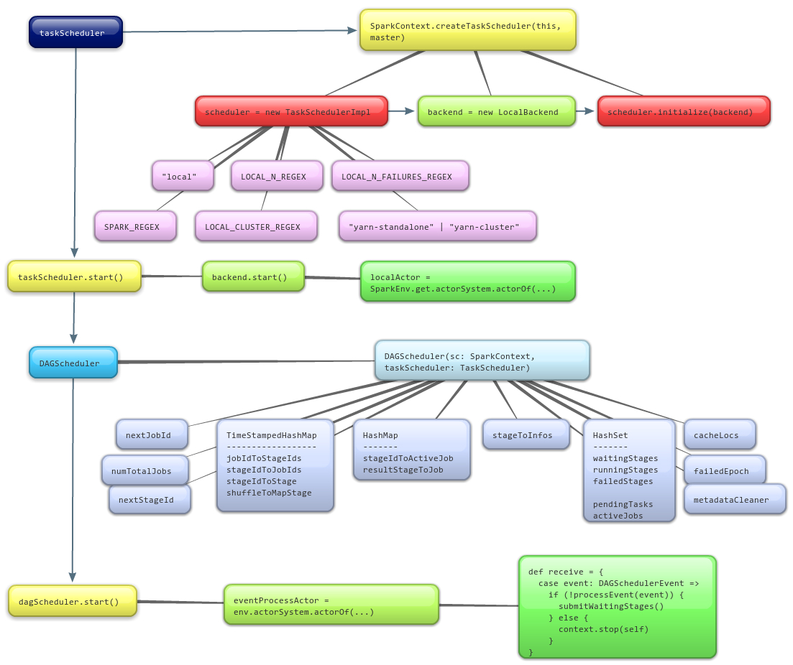

Learn it by debugging
---------------------

# A code example
要了解Spark的运行机制，我想得先跑一遍Spark的例子吧。
我们可以通过看看Spark的输出来看看它的整个运行过程是怎样的。
所以，在建好的Spark环境中开始调试吧。
还是用word count的例子[Word Count](./WordCount.context.md)，代码如下：
``` scala
package cn.hjmao

import org.apache.spark._
import SparkContext._

/**
 * Created by hjmao on 4/3/14.
 */
object WordCount {
  def main (args: Array[String]) {
    println("Going to create spark!")
    val spark = new SparkContext("local", "WordCount",
      System.getenv("SPARK_HOME"), SparkContext.jarOfClass(this.getClass))

    println("==== Going to read file into lines! ====")
    val lines = spark.textFile("/tmp/inFile")
    println("==== Turn lines to words! ====")
    val words = lines.flatMap(x => x.split(" "))
    println("==== Map the words! ====")
    val wordsCount = words.map(x => (x, 1))
    println("==== Cache the words map ====")
    val cacheWordsCount = wordsCount.cache()
    println("==== Reduce the words map with key ====")
    val red = cacheWordsCount.reduceByKey((a, b) => a + b)
    println("==== Save the reduced word count into file! ====")
    red.saveAsTextFile("/tmp/outFile")
    println("==== Going to stop spark! ====")
    spark.stop()
  }
}
```

通过运行一遍这个程序以后，在程序的输出结果中，除了环境初始化以外，咱们通过`println`打印的输出，是连续输出的，而不是我原来期望的，每个`println`之间都会有一些Spark平台运算过程相关的输出。而仅仅是连续的`println`的结果，即
``` java
...
==== Going to read file into lines! ====
14/04/03 08:58:58 INFO storage.MemoryStore: ensureFreeSpace(32856) called with curMem=0, maxMem=1089365606
14/04/03 08:58:58 INFO storage.MemoryStore: Block broadcast_0 stored as values to memory (estimated size 32.1 KB, free 1038.9 MB)
==== Turn lines to words! ====
==== Map the words! ====
==== Cache the words map ====
==== Reduce the words map with key ====
14/04/03 08:58:58 WARN util.NativeCodeLoader: Unable to load native-hadoop library for your platform... using builtin-java classes where applicable
14/04/03 08:58:58 WARN snappy.LoadSnappy: Snappy native library not loaded
14/04/03 08:58:58 INFO mapred.FileInputFormat: Total input paths to process : 1
==== Save the reduced word count into file! ====
...
...DAGScheduler...
...Executor...
...
```
由此可见，`words.map()`, `wordsCount.cache()`, `reduceByKey()` 等都是没有实际分派给各个节点运算的（因为运算中是有log输出的）。我想大家其实都知道原因了的，因为Spark中，所有的[Transformation](http://spark.apache.org/docs/latest/scala-programming-guide.html#transformations)操作都是lazy执行的，所以这里是不会有执行的相应的log输出。而在程序中的`saveAsTextFile()`被调用之后，也就是`log`中`==== Save the reduced word count into file! ====`之后，才开始输出Spark运行时有关的打印信息。关于Transformation和Action等咱们深入Spark运行时的时候再说吧，先引用Spark文档中的一段说明。
> All transformations in Spark are lazy, in that they do not compute their results right away. Instead, they just remember the transformations applied to some base dataset (e.g. a file). The transformations are only computed when an action requires a result to be returned to the driver program. This design enables Spark to run more efficiently – for example, we can realize that a dataset created through map will be used in a reduce and return only the result of the reduce to the driver, rather than the larger mapped dataset.

# From Log to Code Detail
我们先跟踪一下程序的执行过程吧。

## SparkContext
每个Spark程序都是一个Driver，这个Driver通过SparkContext来调用Spark的各个功能。
`val spark = new SparkContext("local", "WordCount ====", System.getenv("SPARK_HOME"), SparkContext.jarOfClass(this.getClass))`，会去创建一个SparkContext，Spark的上下文内容，也就是关于Spark的运行时所需的所有东西。
在我们跟踪程序的执行后，会发现在执行创建SparkContext的时候，程序是按照下图来执行的。

其中TaskScheduler和DAGScheduler的创建过程如下图。


至此，SparkContext的构建过程进行完毕，其主要的工作是创建了`SparkEnv`，`LiveListenerBus`，`TaskScheduler`，`DAGScheduler`等重要组件。至于其中的细节过程，还不清楚啊，臣妾不理解啊，待我看完森林再慢慢回来看吧！

## spark.textFile
`val lines = spark.textFile("/tmp/inFile")`利用spark提供的数据访问接口，从指定的path中读取文件内容。跟踪进去，会发现它其实是调用了
``` scala
  /**
   * Read a text file from HDFS, a local file system (available on all nodes), or any
   * Hadoop-supported file system URI, and return it as an RDD of Strings.
   */
  def textFile(path: String, minSplits: Int = defaultMinSplits): RDD[String] = {
    hadoopFile(path, classOf[TextInputFormat], classOf[LongWritable], classOf[Text],
      minSplits).map(pair => pair._2.toString)
  }
```
而`hadoopFile`又进一步调用HadoopRDD来生成一个[RDD](http://spark.apache.org/docs/latest/scala-programming-guide.html#resilient-distributed-datasets-rdds),
```scala
  /** Get an RDD for a Hadoop file with an arbitrary InputFormat
    *
    * '''Note:''' Because Hadoop's RecordReader class re-uses the same Writable object for each
    * record, directly caching the returned RDD will create many references to the same object.
    * If you plan to directly cache Hadoop writable objects, you should first copy them using
    * a `map` function.
    * */
  def hadoopFile[K, V](
      path: String,
      inputFormatClass: Class[_ <: InputFormat[K, V]],
      keyClass: Class[K],
      valueClass: Class[V],
      minSplits: Int = defaultMinSplits
      ): RDD[(K, V)] = {
    // A Hadoop configuration can be about 10 KB, which is pretty big, so broadcast it.
    val confBroadcast = broadcast(new SerializableWritable(hadoopConfiguration))
    val setInputPathsFunc = (jobConf: JobConf) => FileInputFormat.setInputPaths(jobConf, path)
    new HadoopRDD(
      this,
      confBroadcast,
      Some(setInputPathsFunc),
      inputFormatClass,
      keyClass,
      valueClass,
      minSplits)
  }
```
至于什么是HadoopRDD，它的创建过程是怎样的[^1]，咱们走一步看一步，再说吧。
[^1]: TODO: 再看RDD相关的代码的时候，再分析吧！
所以这里咱们得到了一个HadoopRDD：`val lines`。注意：**和咱们从输出的log中看到的信息所说明的一样，这个时候，Spark是不会直接去文件系统中读取文件内容，并将内容防盗`lines`中的**。

## lines.flatMap
`flatMap`是一种Transform操作，也就是说，这个操作也是*Lazy*的，它仅仅是将`lines`这个`HadoopRDD`转换成了`FlatMappedRDD`，通过跟踪，可以在i`RDD.scala`中找到以下的代码：
```scala
  def flatMap[U: ClassTag](f: T => TraversableOnce[U]): RDD[U] =
      new FlatMappedRDD(this, sc.clean(f))
```
而`FlatMappedRDD`则主要是重载了`compute`函数，也就是再RDD的Transform真正被执行时，会根据`lines`中的partition，并对每个partition进行`compute`计算：
``` scala
  override def compute(split: Partition, context: TaskContext) =
      firstParent[T].iterator(split, context).flatMap(f)
```
同样，关于RDD的细节咱们在下一个分析中再讲。

## words.map
RDD的`map`操作依然是一个Transformation操作，所以还是Lazy的。这里咱们主要看一下调用`map`之后，会发生哪些改变。
跟踪代码，对RDD的`map`操作实际上是基于这个RDD构建了一个新的MappedRDD：
```scala
def map[U: ClassTag](f: T => U): RDD[U] = new MappedRDD(this, sc.clean(f))
```
`MappedRDD`的`compute`函数为：
```scala
  override def compute(split: Partition, context: TaskContext) =
      firstParent[T].iterator(split, context).map(f)
```
所以它实际上是对每个split都进行`f`函数计算。
另外，由于`words.map(x => (x, 1))`是生成了包含pair对的RDD，Spark会根据`SparkContext.scala`中定义的隐式变换方法，将MappedRDD转换为一个PairRDD。
```scala
  implicit def rddToPairRDDFunctions[K: ClassTag, V: ClassTag](rdd: RDD[(K, V)]) =
      new PairRDDFunctions(rdd)
```

## wordsCount.cache()
RDD的`cache`不是一种Transformation而是一种[RDD Persistence](http://spark.apache.org/docs/latest/scala-programming-guide.html#rdd-persistence)方法，它可以显式地将RDD缓存在内存中，以便下次使用的时候可以不用从头重新计算。
从代码上看，RDD的`cache`操作实际上是调用了`persist`方法：
``` scala
  /**
   * Set this RDD's storage level to persist its values across operations after the first time
   * it is computed. This can only be used to assign a new storage level if the RDD does not
   * have a storage level set yet..
   */
  def persist(newLevel: StorageLevel): RDD[T] = {
    // TODO: Handle changes of StorageLevel
    if (storageLevel != StorageLevel.NONE && newLevel != storageLevel) {
      throw new UnsupportedOperationException(
        "Cannot change storage level of an RDD after it was already assigned a level")
    }
    sc.persistRDD(this)
    storageLevel = newLevel
    this
  }

  /** Persist this RDD with the default storage level (`MEMORY_ONLY`). */
  def persist(): RDD[T] = persist(StorageLevel.MEMORY_ONLY)

  /** Persist this RDD with the default storage level (`MEMORY_ONLY`). */
    def cache(): RDD[T] = persist()
```

所以`wordsCount.cache()`实际上是在告诉`sc`，“请persistRDD(wordsCount)“。
SparkContext则是在`persistentRdds`这个`TimeStampedHashMap[Int, RDD[_]]`中进行记录：
``` scala
  /**
   * Register an RDD to be persisted in memory and/or disk storage
   */
  private[spark] def persistRDD(rdd: RDD[_]) {
    persistentRdds(rdd.id) = rdd
  }
```
至于Spark是如何处理`persistentRdds`这个变量中的RDD的，我想应该是后话了[^2]，咱们再看吧。
[^2]: TODO: 看spark的运行时的时候，再分析吧！

## cacheWordsCount.reduceByKey()
`reduceByKey`依旧是RDD的一种Transformation操作，所以也是Lazy的，所以咱们这里还是主要看这个操作会生成哪种新的RDD。
我们在进行map操作后，不论`cacheWordsCount`还是`wordsCount`，这两种RDD其实都是`PairRDD`，所以在代码跟踪时，在combineByKey的时候，IDE会将代码导航到PairRDDFunctions中。
```scala
  /**
   * Generic function to combine the elements for each key using a custom set of aggregation
   * functions. Turns an RDD[(K, V)] into a result of type RDD[(K, C)], for a "combined type" C
   * Note that V and C can be different -- for example, one might group an RDD of type
   * (Int, Int) into an RDD of type (Int, Seq[Int]). Users provide three functions:
   *
   * - `createCombiner`, which turns a V into a C (e.g., creates a one-element list)
   * - `mergeValue`, to merge a V into a C (e.g., adds it to the end of a list)
   * - `mergeCombiners`, to combine two C's into a single one.
   *
   * In addition, users can control the partitioning of the output RDD, and whether to perform
   * map-side aggregation (if a mapper can produce multiple items with the same key).
   */
  def combineByKey[C](createCombiner: V => C,
      mergeValue: (C, V) => C,
      mergeCombiners: (C, C) => C,
      partitioner: Partitioner,
      mapSideCombine: Boolean = true,
      serializer: Serializer = null): RDD[(K, C)] = {
  ...
  }

  /**
   * Merge the values for each key using an associative reduce function. This will also perform
   * the merging locally on each mapper before sending results to a reducer, similarly to a
   * "combiner" in MapReduce. Output will be hash-partitioned with the existing partitioner/
   * parallelism level.
   */
  def reduceByKey(func: (V, V) => V): RDD[(K, V)] = {
    reduceByKey(defaultPartitioner(self), func)
  }

  /**
   * Merge the values for each key using an associative reduce function. This will also perform
   * the merging locally on each mapper before sending results to a reducer, similarly to a
   * "combiner" in MapReduce.
   */
  def reduceByKey(partitioner: Partitioner, func: (V, V) => V): RDD[(K, V)] = {
    combineByKey[V]((v: V) => v, func, func, partitioner)
  }
```
至于combineByKey的细节[^3]，等回过头来再分析吧。
[^3] TODO：分析combineByKey的细节。

## red.saveAsTextFile("/tmp/outFile")
最后，在多次RDD的变换操作后，程序对最后一个RDD执行了saveAsTextFile操作，这是一个[action](http://spark.apache.org/docs/latest/scala-programming-guide.html#actions)操作，因此它会触发spark依次还完它欠下的债。个人认为这里才是spark*真正*的入口。
简单起见，咱们先只看它的代码跳转情况吧。
``` scala
  /**
   * Save this RDD as a text file, using string representations of elements.
   */
  def saveAsTextFile(path: String) {
    this.map(x => (NullWritable.get(), new Text(x.toString)))
      .saveAsHadoopFile[TextOutputFormat[NullWritable, Text]](path)
  }

  /**
   * Output the RDD to any Hadoop-supported file system, using a Hadoop `OutputFormat` class
   * supporting the key and value types K and V in this RDD.
   */
  def saveAsHadoopFile[F <: OutputFormat[K, V]](path: String)(implicit fm: ClassTag[F]) {
    saveAsHadoopFile(path, getKeyClass, getValueClass, fm.runtimeClass.asInstanceOf[Class[F]])
  }

/**
   * Output the RDD to any Hadoop-supported file system, using a Hadoop `OutputFormat` class
   * supporting the key and value types K and V in this RDD.
   */
  def saveAsHadoopFile(
      path: String,
      keyClass: Class[_],
      valueClass: Class[_],
      outputFormatClass: Class[_ <: OutputFormat[_, _]],
      conf: JobConf = new JobConf(self.context.hadoopConfiguration),
      codec: Option[Class[_ <: CompressionCodec]] = None) {
    conf.setOutputKeyClass(keyClass)
    conf.setOutputValueClass(valueClass)
    // Doesn't work in Scala 2.9 due to what may be a generics bug
    // TODO: Should we uncomment this for Scala 2.10?
    // conf.setOutputFormat(outputFormatClass)
    conf.set("mapred.output.format.class", outputFormatClass.getName)
    for (c <- codec) {
      conf.setCompressMapOutput(true)
      conf.set("mapred.output.compress", "true")
      conf.setMapOutputCompressorClass(c)
      conf.set("mapred.output.compression.codec", c.getCanonicalName)
      conf.set("mapred.output.compression.type", CompressionType.BLOCK.toString)
    }
    conf.setOutputCommitter(classOf[FileOutputCommitter])
    FileOutputFormat.setOutputPath(conf, SparkHadoopWriter.createPathFromString(path, conf))
    saveAsHadoopDataset(conf)
  }

  /**
   * Output the RDD to any Hadoop-supported storage system, using a Hadoop JobConf object for
   * that storage system. The JobConf should set an OutputFormat and any output paths required
   * (e.g. a table name to write to) in the same way as it would be configured for a Hadoop
   * MapReduce job.
   */
  def saveAsHadoopDataset(conf: JobConf) {
    val outputFormatInstance = conf.getOutputFormat
    val keyClass = conf.getOutputKeyClass
    val valueClass = conf.getOutputValueClass
    if (outputFormatInstance == null) {
      throw new SparkException("Output format class not set")
    }
    if (keyClass == null) {
      throw new SparkException("Output key class not set")
    }
    if (valueClass == null) {
      throw new SparkException("Output value class not set")
    }
    SparkHadoopUtil.get.addCredentials(conf)

    logDebug("Saving as hadoop file of type (" + keyClass.getSimpleName + ", " +
      valueClass.getSimpleName + ")")

    if (outputFormatInstance.isInstanceOf[FileOutputFormat[_, _]]) {
      // FileOutputFormat ignores the filesystem parameter
      val ignoredFs = FileSystem.get(conf)
      conf.getOutputFormat.checkOutputSpecs(ignoredFs, conf)
    }

    val writer = new SparkHadoopWriter(conf)
    writer.preSetup()

    def writeToFile(context: TaskContext, iter: Iterator[(K, V)]) {
      // Hadoop wants a 32-bit task attempt ID, so if ours is bigger than Int.MaxValue, roll it
      // around by taking a mod. We expect that no task will be attempted 2 billion times.
      val attemptNumber = (context.attemptId % Int.MaxValue).toInt

      writer.setup(context.stageId, context.partitionId, attemptNumber)
      writer.open()

      var count = 0
      while(iter.hasNext) {
        val record = iter.next()
        count += 1
        writer.write(record._1.asInstanceOf[AnyRef], record._2.asInstanceOf[AnyRef])
      }

      writer.close()
      writer.commit()
    }

    self.context.runJob(self, writeToFile _)
    writer.commitJob()
  }
```
这里最关键的是`self.context.runJob(self, writeToFile _)`，咱们下篇再分析吧[^4]。
[^4] TODO: ...

## spark.stop()
``` scala
  /** Shut down the SparkContext. */
  def stop() {
    ui.stop()
    eventLogger.foreach(_.stop())
    // Do this only if not stopped already - best case effort.
    // prevent NPE if stopped more than once.
    val dagSchedulerCopy = dagScheduler
    dagScheduler = null
    if (dagSchedulerCopy != null) {
      metadataCleaner.cancel()
      dagSchedulerCopy.stop()
      listenerBus.stop()
      taskScheduler = null
      // TODO: Cache.stop()?
      env.stop()
      SparkEnv.set(null)
      ShuffleMapTask.clearCache()
      ResultTask.clearCache()
      logInfo("Successfully stopped SparkContext")
    } else {
      logInfo("SparkContext already stopped")
    }
  }
```

仅看皮毛，细节是下一步的分析重点。

