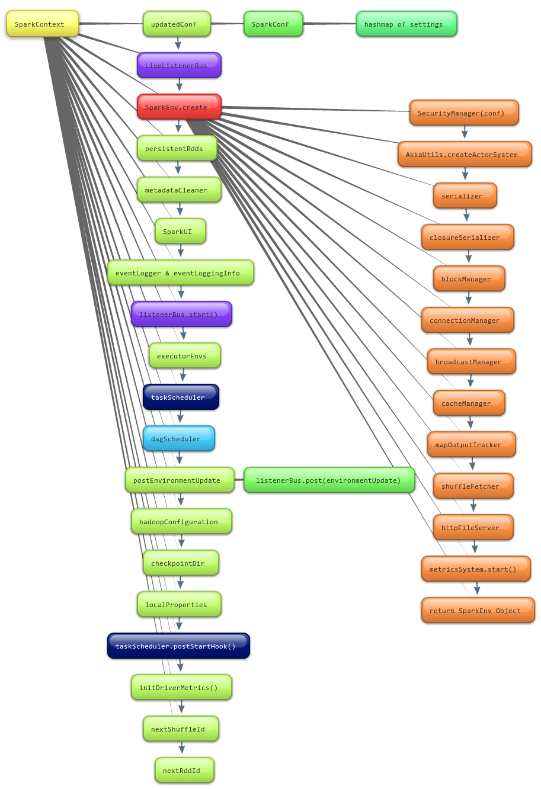

Learn it by debugging
---------------------

# A code example
要了解Spark的运行机制，我想得先跑一遍Spark的例子吧。
我们可以通过看看Spark的输出来看看它的整个运行过程是怎样的。
所以，在建好的Spark环境中开始调试吧。
还是用word count的例子[Word Count](./WordCount.context.md)，代码如下：
``` scala
package cn.hjmao

import org.apache.spark._
import SparkContext._

/**
 * Created by hjmao on 4/3/14.
 */
object WordCount {
  def main (args: Array[String]) {
    println("Going to create spark!")
    val spark = new SparkContext("local", "WordCount",
      System.getenv("SPARK_HOME"), SparkContext.jarOfClass(this.getClass))

    println("==== Going to read file into lines! ====")
    val lines = spark.textFile("/tmp/inFile")
    println("==== Turn lines to words! ====")
    val words = lines.flatMap(x => x.split(" "))
    println("==== Map the words! ====")
    val wordsCount = words.map(x => (x, 1))
    println("==== Cache the words map ====")
    val cacheWordsCount = wordsCount.cache()
    println("==== Reduce the words map with key ====")
    val red = cacheWordsCount.reduceByKey((a, b) => a + b)
    println("==== Save the reduced word count into file! ====")
    red.saveAsTextFile("/tmp/outFile")
    println("==== Going to stop spark! ====")
    spark.stop()
  }
}
```

通过运行一遍这个程序以后，在程序的输出结果中，除了环境初始化以外，咱们通过`println`打印的输出，是连续输出的，而不是我原来期望的，每个`println`之间都会有一些Spark平台运算过程相关的输出。而仅仅是连续的`println`的结果，即
``` java
...
==== Going to read file into lines! ====
14/04/03 08:58:58 INFO storage.MemoryStore: ensureFreeSpace(32856) called with curMem=0, maxMem=1089365606
14/04/03 08:58:58 INFO storage.MemoryStore: Block broadcast_0 stored as values to memory (estimated size 32.1 KB, free 1038.9 MB)
==== Turn lines to words! ====
==== Map the words! ====
==== Cache the words map ====
==== Reduce the words map with key ====
14/04/03 08:58:58 WARN util.NativeCodeLoader: Unable to load native-hadoop library for your platform... using builtin-java classes where applicable
14/04/03 08:58:58 WARN snappy.LoadSnappy: Snappy native library not loaded
14/04/03 08:58:58 INFO mapred.FileInputFormat: Total input paths to process : 1
==== Save the reduced word count into file! ====
...
...DAGScheduler...
...Executor...
...
```
由此可见，`words.map()`, `wordsCount.cache()`, `reduceByKey()` 等都是没有实际分派给各个节点运算的（因为运算中是有log输出的）。我想大家其实都知道原因了的，因为Spark中，所有的[Transformation](http://spark.apache.org/docs/latest/scala-programming-guide.html#transformations)操作都是lazy执行的，所以这里是不会有执行的相应的log输出。而在程序中的`saveAsTextFile()`被调用之后，也就是`log`中`==== Save the reduced word count into file! ====`之后，才开始输出Spark运行时有关的打印信息。关于Transformation和Action等咱们深入Spark运行时的时候再说吧，先引用Spark文档中的一段说明。
> All transformations in Spark are lazy, in that they do not compute their results right away. Instead, they just remember the transformations applied to some base dataset (e.g. a file). The transformations are only computed when an action requires a result to be returned to the driver program. This design enables Spark to run more efficiently – for example, we can realize that a dataset created through map will be used in a reduce and return only the result of the reduce to the driver, rather than the larger mapped dataset.

# From Log to Code Detail
我们先跟踪一下程序的执行过程吧。

## SparkContext
每个Spark程序都是一个Driver，这个Driver通过SparkContext来调用Spark的各个功能。
`val spark = new SparkContext("local", "WordCount ====", System.getenv("SPARK_HOME"), SparkContext.jarOfClass(this.getClass))`，会去创建一个SparkContext，Spark的上下文内容，也就是关于Spark的运行时所需的所有东西。
在我们跟踪程序的执行后，会发现在执行创建SparkContext的时候，程序是按照下图来执行的。

其中TaskScheduler和DAGScheduler的创建过程如下图。


