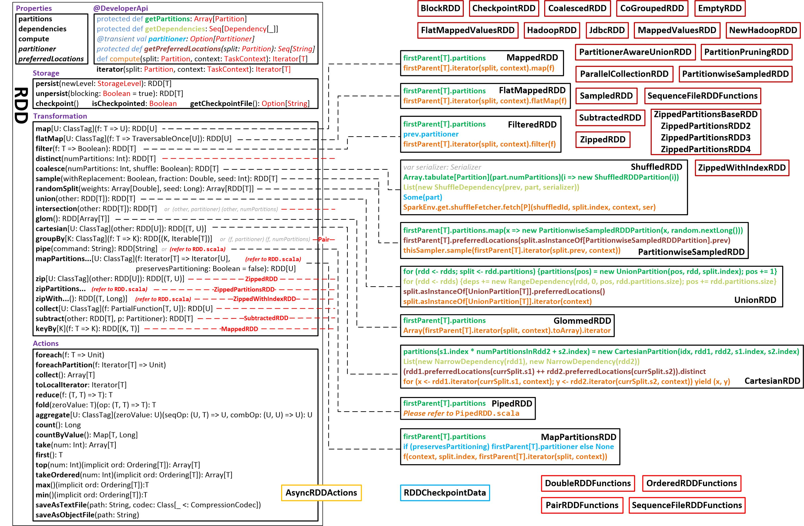

Resilient Distributed Dataset
-----------------------------

## RDD

> A Resilient Distributed Dataset (RDD), the basic abstraction in Spark. Represents an immutable, partitioned collection of elements that can be operated on in parallel.

> Internally, each RDD is characterized by five main properties:

>- A list of partitions
>- A function for computing each split
>- A list of dependencies on other RDDs
>- Optionally, a Partitioner for key-value RDDs (e.g. to say that the RDD is hash-partitioned)
>- Optionally, a list of preferred locations to compute each split on (e.g. block locations for an HDFS file)

> All of the **scheduling** and **execution** in Spark is done based on these methods, allowing each RDD to implement its own way of computing itself.

## RDD的设计初衷

## RDD.scala的代码结构
RDD相关的代码主要分布在`package org.apache.spark.rdd`中，包括RDD基类`RDD.scala`; 一些列的派生RDD类，如`MappedRDD` `FilteredRDD`等等; 某些RDD类特有的方法，如`DoubleRDDFunctions` `OrderedRDDFunctions` `PairRDDFunctions` `SequenceFileRDDFunctions`; 以及一些特殊的RDD Actions (`AsyncRDDActions.scala`)和用于Checkpoint的(`RDDCheckpointData.scala`)类。

`package org.apache.spark.rdd`的组织方式大致就是按照以上所描述的结构来划分的，rdd包的结构简化图如下：

