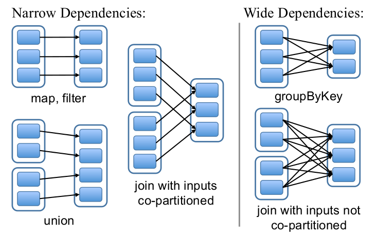

Dependency
----------

在[RDD的分析中](./4.RDD.md)，我们分析了Dependency的作用，为了记住麦兜是麦子仲肥的第十八代传人，RDD需要有Dependency List来记录各个RDD之间的一来关系。

> The most interesting question in designing this interface is how to represent dependencies between RDDs. We found it both sufficient and useful to classify dependencies into two types: narrow dependencies, where each partition of the parent RDD is used by at most one partition of the child RDD, wide dependencies, where multiple child partitions may depend on it. For example, map leads to a narrow dependency, while join leads to to wide dependencies (unless the parents are hash-partitioned).

> This distinction is useful for two reasons. First, narrow dependencies allow for pipelined execution on one cluster node, which can compute all the parent partitions. For example, one can apply a map followed by a filter on an element-by-element basis. In contrast, wide dependencies require data from all parent partitions to be available and to be shuffled across the nodes using a MapReduce-like operation. Second, recovery after a node failure is more efficient with a narrow dependency, as only the lost parent partitions need to be recomputed, and they can be recomputed in parallel on different nodes. In contrast, in a lineage graph with wide dependencies, a single failed node might cause the loss of some partition from all the ancestors of an RDD, requiring a complete re-execution.

从这段描述来看，Dependency主要分为`Narrow Dependency`以及`Wide Dependency`，其中某个子RDD：*cRDD*的Narrow Dependency指的是其父RDDs:*pRDD*的partitions仅有一个子RDD中的partition用到它；而`Wide Dependency`则其父RDD的partition通常会有子RDD中的多个partition的计算依赖于它。所以`Wide Dependency`通常需要进行Shuffle操作，所以`Wide Dependency`在code里对应的类是`ShuffleDependency`。下图给出了Narrow/Wide Dependency的示意图。


其中Narrow Dependency又可以进一步细分为`OneToOneDependency`和`RangeDependency`。如上图中的map,filter,join所对应的是OneToOneDependency，而union所对应的则是RangeDependency。

Dependency一个很重要的要求是，子RDD可以为其每个partition根据dependency找到它所对应的父RDD的partition，或者是找到计算的数据来源。

* 对于NarrowDependency而言，子RDD的partition的数据来源相对比较明确的，它总能找到一个或者多个RDD的partition和它对应，所以对于NarrowDependency而言，它需要一个getParents方法，以便根据其partition号来得到其父RDD的对应partition号。具体来讲，对于OneToOneDependency而言，因为子RDD以及父RDD之间，每个partition是对应（如果子RDD中存在的话）的，所以两个RDD中的对应的partition应该具有相同的partitionId。而对于RangeDependency而言，父RDD中的partition通常是子RDD中，连续的某块partition区间的父partition，所以对应关系应该是`parentPartitionId = childPartitionId - childStart + parentStart`。
* 对于ShuffleDependency而言，通过它来获取父RDD的数据来进行计算的方法和NarrowDependency不同，ShuffleDependency是通过特定的Shuffle过程来完成的。每个Shuffle过程会有一个Id，而ShuffleDependency会可以根据这个ShuffleId去获得所依赖的partition的数据。shuffle的过程等下一步再分析吧。不过这里有一篇非常清晰的关于shuffle过程的Blog [详细探究Spark的shuffle实现](http://jerryshao.me/architecture/2014/01/04/spark-shuffle-detail-investigation) 可以看看。所以ShuffleDependency所需要记录的就是要能够通过ShuffleId去获得需要的数据。

Dependency相关的具体代码如下：
``` scala
abstract class Dependency[T](val rdd: RDD[T]) extends Serializable

/**
 * Base class for dependencies where each partition of the parent RDD is used by at most one
 * partition of the child RDD.  Narrow dependencies allow for pipelined execution.
 */
@DeveloperApi
abstract class NarrowDependency[T](rdd: RDD[T]) extends Dependency(rdd) {
  /**
   * Get the parent partitions for a child partition.
   * @param partitionId a partition of the child RDD
   * @return the partitions of the parent RDD that the child partition depends upon
   */
  def getParents(partitionId: Int): Seq[Int]
}

/**
 * Represents a one-to-one dependency between partitions of the parent and child RDDs.
 */
@DeveloperApi
class OneToOneDependency[T](rdd: RDD[T]) extends NarrowDependency[T](rdd) {
  override def getParents(partitionId: Int) = List(partitionId)
}

/**
 * Represents a one-to-one dependency between ranges of partitions in the parent and child RDDs.
 * @param rdd the parent RDD
 * @param inStart the start of the range in the parent RDD
 * @param outStart the start of the range in the child RDD
 * @param length the length of the range
 */
@DeveloperApi
class RangeDependency[T](rdd: RDD[T], inStart: Int, outStart: Int, length: Int)
  extends NarrowDependency[T](rdd) {

  override def getParents(partitionId: Int) = {
    if (partitionId >= outStart && partitionId < outStart + length) {
      List(partitionId - outStart + inStart)
    } else {
      Nil
    }
  }
}

/**
 * Represents a dependency on the output of a shuffle stage.
 * @param rdd the parent RDD
 * @param partitioner partitioner used to partition the shuffle output
 * @param serializer [[org.apache.spark.serializer.Serializer Serializer]] to use. If set to null,
 *                   the default serializer, as specified by `spark.serializer` config option, will
 *                   be used.
 */
@DeveloperApi
class ShuffleDependency[K, V](
    @transient rdd: RDD[_ <: Product2[K, V]],
    val partitioner: Partitioner,
    val serializer: Serializer = null)
  extends Dependency(rdd.asInstanceOf[RDD[Product2[K, V]]]) {

  val shuffleId: Int = rdd.context.newShuffleId()

  rdd.sparkContext.cleaner.foreach(_.registerShuffleForCleanup(this))
}
```


