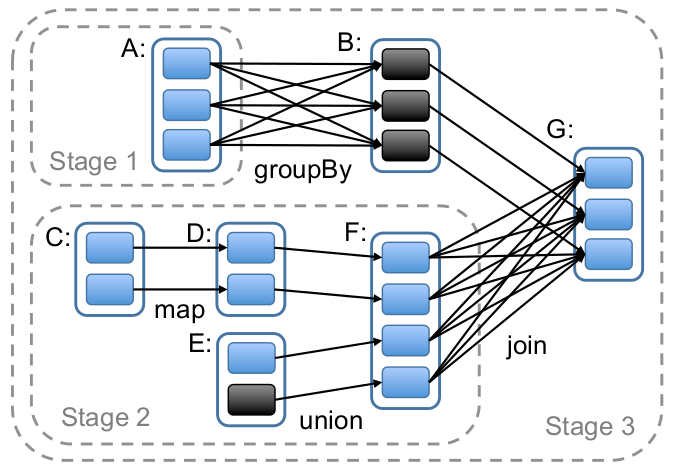

Stage
-----
``` scala
private[spark] class Stage(
    val id: Int,
    val rdd: RDD[_],
    val numTasks: Int,
    val shuffleDep: Option[ShuffleDependency[_,_]],  // Output shuffle if stage is a map stage
    val parents: List[Stage],
    val jobId: Int,
    callSite: Option[String])
  extends Logging {
  ...
}
```

> A stage is a set of independent tasks all computing the same function that need to run as part of a Spark job, where all the tasks have the same shuffle dependencies. Each DAG of tasks run by the scheduler is split up into stages at the boundaries where shuffle occurs, and then the DAGScheduler runs these stages in topological order.

> Each Stage can either be a shuffle map stage, in which case its tasks' results are input for another stage, or a result stage, in which case its tasks directly compute the action that initiated a job (e.g. count(), save(), etc). For shuffle map stages, we also track the nodes that each output partition is on.

> Each Stage also has a jobId, identifying the job that first submitted the stage.  When FIFO scheduling is used, this allows Stages from earlier jobs to be computed first or recovered faster on failure.

从这段话里，大致已经可以知道Stage是什么了。它是一组相互独立的计算任务组。其中，每个人物所执行的操作都是一样的，并且他们依赖于相同的shuffle依赖。从这个要求来看，一个stage的其实位置划分在需要shuffle的地方是再好不过的了。下面的图是Spark论文中Stage划分的一个例子，所有的stage都是以是否需要shuffle来划分的。


另外，在上图的stage中，还设计到stage的类型问题。从途中我们可以发现stage1以及stage2的输出是作为其他操作的shuffle输入的，而stage3的输出则直接是给action用的。这是两类不同的stage，在系统中，stage1和stage2是一种'ShuffleMapStage'，而stage3则是一种'ResultStage'，这两类操作有着巨大的不同。它们所对应的Task类型也是不同的。在`DAGScheduler.scala`的`submitMissingTasks`函数中，它根据stage类型的不同，会采取不同的任务提交方式。如果是一个shuffleMap，则会生成并提交一个ShuffleMapTask，而如果是一个final stage，则会提交ResultTask。另外，对于Stage中的每个partition，DAGScheduler都会为它们创建一个task，也就是说，task和stage中的partition是对应的。为每个partition建立一个task的原因，应该是由于partition可能存储在不同的节点上，那么为了利用数据的locality并且便于调度，所以将task的粒度对应到一个partition的吧。关于task的详细分析，我们在后续的内容中再进行了解。
``` scala

  /** Called when stage's parents are available and we can now do its task. */
  private def submitMissingTasks(stage: Stage, jobId: Int) {
    ...
    var tasks = ArrayBuffer[Task[_]]()
    if (stage.isShuffleMap) {
      for (p <- 0 until stage.numPartitions if stage.outputLocs(p) == Nil) {
        val locs = getPreferredLocs(stage.rdd, p)
        tasks += new ShuffleMapTask(stage.id, stage.rdd, stage.shuffleDep.get, p, locs)
      }
    } else {
      // This is a final stage; figure out its job's missing partitions
      val job = resultStageToJob(stage)
      for (id <- 0 until job.numPartitions if !job.finished(id)) {
        val partition = job.partitions(id)
        val locs = getPreferredLocs(stage.rdd, partition)
        tasks += new ResultTask(stage.id, stage.rdd, job.func, partition, locs, id)
      }
    }

    ...

    if (tasks.size > 0) {
      ...

      taskScheduler.submitTasks(
        new TaskSet(tasks.toArray, stage.id, stage.newAttemptId(), stage.jobId, properties))
    } else {
      ...
    }
  }
```


