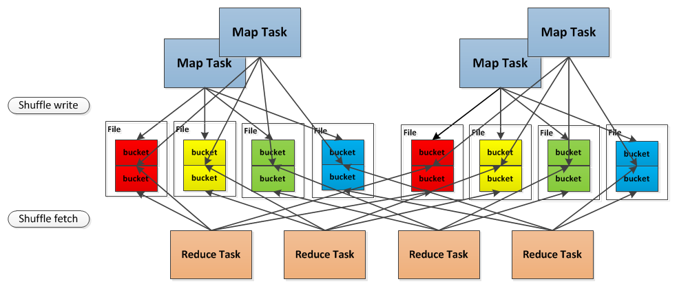

Task
----

> A unit of execution. We have two kinds of Task's in Spark:
- org.apache.spark.scheduler.ShuffleMapTask
- org.apache.spark.scheduler.ResultTask

> A Spark job consists of one or more stages. The very last stage in a job consists of multiple ResultTasks, while earlier stages consist of ShuffleMapTasks. A ResultTask executes the task and sends the task output back to the driver application. A ShuffleMapTask executes the task and divides the task output to multiple buckets (based on the task's partitioner).


## Task
```scala
private[spark] abstract class Task[T](val stageId: Int, var partitionId: Int) extends Serializable {
  final def run(attemptId: Long): T = {
    context = new TaskContext(stageId, partitionId, attemptId, runningLocally = false)
    if (_killed) {
      kill()
    }
    runTask(context)
  }

  def runTask(context: TaskContext): T

  def preferredLocations: Seq[TaskLocation] = Nil
  // Task context, to be initialized in run().
  @transient protected var context: TaskContext = _

  ...
}
```

从源代码出发，一个Task相对比较简单，一个Task里面通常包含了`run(attemptId: Long): T`函数，内容如下：
``` scala
  final def run(attemptId: Long): T = {
    context = new TaskContext(stageId, partitionId, attemptId, runningLocally = false)
    if (_killed) {
      kill()
    }
    runTask(context)
  }

  def runTask(context: TaskContext): T
```
就是为Task创建一个运行上下文，然后调用runTask来执行。而这里的runTask抽象函数，是通过其子类所实现的。因此，ShuffleMapTask和ResultTask的run的实际执行过程是不同的。其中TaskContext则主要是用来记录task执行完成后的回调函数的，在一个task执行完毕后，会通过`executeOnCompleteCallbacks()`按注册顺序的反向顺序进行回调：

``` scala
/**
 * :: DeveloperApi ::
 * Contextual information about a task which can be read or mutated during execution.
 */
@DeveloperApi
class TaskContext(
  val stageId: Int,
  val partitionId: Int,
  val attemptId: Long,
  val runningLocally: Boolean = false,
  @volatile var interrupted: Boolean = false,
  private[spark] val taskMetrics: TaskMetrics = TaskMetrics.empty()
) extends Serializable {

  @deprecated("use partitionId", "0.8.1")
  def splitId = partitionId

  // List of callback functions to execute when the task completes.
  @transient private val onCompleteCallbacks = new ArrayBuffer[() => Unit]

  /**
   * Add a callback function to be executed on task completion. An example use
   * is for HadoopRDD to register a callback to close the input stream.
   * @param f Callback function.
   */
  def addOnCompleteCallback(f: () => Unit) {
    onCompleteCallbacks += f
  }

  def executeOnCompleteCallbacks() {
    // Process complete callbacks in the reverse order of registration
    onCompleteCallbacks.reverse.foreach{_()}
  }
}
```


Task、ShuffleMapTask以及ResultTask三者之间的代码关系如下图：


### ResultTask
对于`ResultTask`而言，它通常被RDD的Action所生成使用的，比如count等。所以ResultTask通常需要指定`func`，以便指明执行何种操作。至于ResultTask的主要工作便是使用`func`函数对相应split进行函数计算，并在计算完成后，通过`TaskContext`对注册过的回调函数进行回调。
``` scala
/**
 * A task that sends back the output to the driver application.
 *
 * See [[org.apache.spark.scheduler.Task]] for more information.
 *
 * @param stageId id of the stage this task belongs to
 * @param rdd input to func
 * @param func a function to apply on a partition of the RDD
 * @param _partitionId index of the number in the RDD
 * @param locs preferred task execution locations for locality scheduling
 * @param outputId index of the task in this job (a job can launch tasks on only a subset of the
 *                 input RDD's partitions).
 */
private[spark] class ResultTask[T, U](
    stageId: Int,
    var rdd: RDD[T],
    var func: (TaskContext, Iterator[T]) => U,
    _partitionId: Int,
    @transient locs: Seq[TaskLocation],
    var outputId: Int)
  extends Task[U](stageId, _partitionId) with Externalizable {
  ...
  override def runTask(context: TaskContext): U = {
    metrics = Some(context.taskMetrics)
    try {
      func(context, rdd.iterator(split, context))
    } finally {
      context.executeOnCompleteCallbacks()
    }
  }
  ...
}
```

### ShuffleMapTask
下面是ShuffleMapTask的代码，其中一些不太主要的代码已经删除。
``` scala
  override def runTask(context: TaskContext): MapStatus = {
    val numOutputSplits = dep.partitioner.numPartitions
    metrics = Some(context.taskMetrics)

    val blockManager = SparkEnv.get.blockManager
    val shuffleBlockManager = blockManager.shuffleBlockManager
    var shuffle: ShuffleWriterGroup = null
    var success = false

    try {
      // Obtain all the block writers for shuffle blocks.
      val ser = Serializer.getSerializer(dep.serializer)
      shuffle = shuffleBlockManager.forMapTask(dep.shuffleId, partitionId, numOutputSplits, ser)

      // Write the map output to its associated buckets.
      for (elem <- rdd.iterator(split, context)) {
        val pair = elem.asInstanceOf[Product2[Any, Any]]
        val bucketId = dep.partitioner.getPartition(pair._1)
        shuffle.writers(bucketId).write(pair)
      }

      // Commit the writes. Get the size of each bucket block (total block size).
      ...

      // Update shuffle metrics.
      ...

      success = true
      new MapStatus(blockManager.blockManagerId, compressedSizes)
    } catch { case e: Exception =>
      // If there is an exception from running the task, revert the partial writes
      // and throw the exception upstream to Spark.
      ...
      throw e
    } finally {
      // Release the writers back to the shuffle block manager.
      ...

      // Execute the callbacks on task completion.
      context.executeOnCompleteCallbacks()
    }
  }
```
在ShuffleMapTask的runTask函数中，首先他会去获取`blockManager`，并进一步去获得`shuffleBlockManager`，从而得到`ShuffleWriterGroup`即`shuffle`，以便在任务执行过程中，将shuffle阶段的数据由`blockManager`进行存储。即`shuffle.writers(bucketId).write(pair)`，在blockManager将数据成功写入并commit后，再返回`new MapStatus(blockManager.blockManagerId, compressedSizes)`，同时，还将执行`TaskContext`中注册的各个回调函数。

以上是ShuffleMapTask的工作，它会将任务的计算结果由`BlockManager`进行存储，然后再以`MapStatus`的返回值来告诉调用者执行结果。
Saisai Shao有一篇很好的Blog[详细探究Spark的shuffle实现](http://jerryshao.me/architecture/2014/01/04/spark-shuffle-detail-investigation/)，把Spark中的Shuffle过程讲解的非常细致，强烈推荐。这里引用一下他的一张Shuffle write和Shuffle fetch的一张图：


## Task的运行时
上面我们简单介绍了`Task`的构成，包括`ResultTask`和`ShuffleMapTask`，他们都通过`run`函数给外部提供接口，主要的区别是`runTask`函数的不同。那么这些`Task`是由谁在什么时候执行的呢？
IntelliJ IdeaIU这个IDE的一个功能是可以让你`Find Usage`，通过这个功能，我们可以定位到，整个Spark Core中，仅有一个地方调用了task的`run`函数，处于`package org.apache.spark.executor`包中`Executor`里面`TaskRunner`的`run`函数。也就是说，Task是在被TaskScheduler调度到具体的Executor以后，由Executor来执行的。

Task在Executor端的执行过程主要是，先将Task反序列化加载，然后运行task，并在task运行结束后，根据结果的占用空间大小来判断是直接返回结果值，还是通过blockManager作为中间介质来进行结果的返回。
``` scala
    override def run() {
      // Setting the environment
      ...
      try {
        ...
        task = ser.deserialize[Task[Any]](taskBytes, Thread.currentThread.getContextClassLoader)
        ...
        attemptedTask = Some(task)
        logDebug("Task " + taskId + "'s epoch is " + task.epoch)
        env.mapOutputTracker.updateEpoch(task.epoch)

        // Run the actual task and measure its runtime.
        taskStart = System.currentTimeMillis()
        val value = task.run(taskId.toInt)
        val taskFinish = System.currentTimeMillis()
        ...
        val directResult = new DirectTaskResult(valueBytes, accumUpdates,
          task.metrics.getOrElse(null))
        val serializedDirectResult = ser.serialize(directResult)
        val serializedResult = {
          if (serializedDirectResult.limit >= akkaFrameSize - 1024) {
            logInfo("Storing result for " + taskId + " in local BlockManager")
            val blockId = TaskResultBlockId(taskId)
            env.blockManager.putBytes(
              blockId, serializedDirectResult, StorageLevel.MEMORY_AND_DISK_SER)
            ser.serialize(new IndirectTaskResult[Any](blockId))
          } else {
            logInfo("Sending result for " + taskId + " directly to driver")
            serializedDirectResult
          }
        }

        execBackend.statusUpdate(taskId, TaskState.FINISHED, serializedResult)
        logInfo("Finished task ID " + taskId)
      } catch {
        ...
      } finally {
        ...
        runningTasks.remove(taskId)
      }
    }
  }
```

到目前分析为止来看，DAGScheduler负责构建生成Task，由Executor来具体执行Task，而至于生成的Task是怎样被分配到具体的Executor中的呢？咱们下篇再分析讨论吧。
