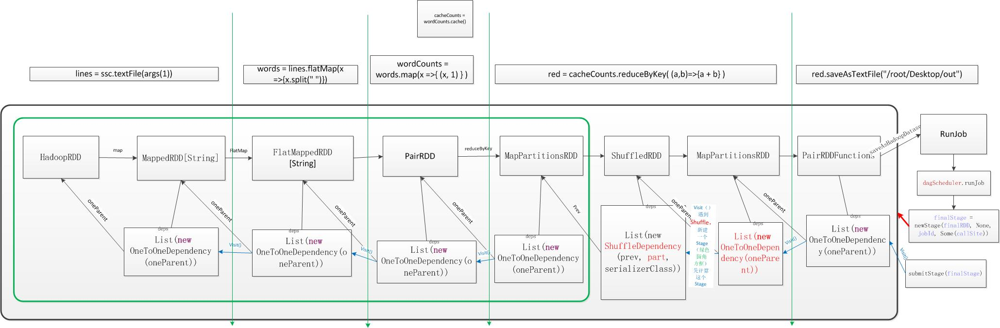

我理解的Spark -- An example
---------------------------

## Source code:
``` scala
package cn.hjmao

import org.apache.spark._
import SparkContext._

/**
 * Created by hjmao on 4/3/14.
 */
object WordCount {
  def main (args: Array[String]) {
    println("Going to create spark!")
    val spark = new SparkContext("local", "WordCount",
      System.getenv("SPARK_HOME"), SparkContext.jarOfClass(this.getClass))

    println("==== Going to read file into lines! ====")
    val lines = spark.textFile("/tmp/inFile")
    println("==== Turn lines to words! ====")
    val words = lines.flatMap(x => x.split(" "))
    println("==== Map the words! ====")
    val wordsCount = words.map(x => (x, 1))
    println("==== Cache the words map ====")
    val cacheWordsCount = wordsCount.cache()
    println("==== Reduce the words map with key ====")
    val red = cacheWordsCount.reduceByKey((a, b) => a + b)
    println("==== Save the reduced word count into file! ====")
    red.saveAsTextFile("/tmp/outFile")
    println("==== Going to stop spark! ====")
    spark.stop()
  }
}
```

## Flow Chart
 created by [baishuo491](http://baishuo491.iteye.com/blog/2019510)

## The log
``` java
==== Going to create spark! ====
14/04/03 08:58:56 WARN util.Utils: Your hostname, BMILinux resolves to a loopback address: 127.0.1.1; using 202.38.152.213 instead (on interface eth0)
14/04/03 08:58:56 WARN util.Utils: Set SPARK_LOCAL_IP if you need to bind to another address
14/04/03 08:58:56 INFO spark.SecurityManager: SecurityManager, is authentication enabled: false are ui acls enabled: false users with view permissions: Set(hjmao)
14/04/03 08:58:57 INFO slf4j.Slf4jLogger: Slf4jLogger started
14/04/03 08:58:57 INFO Remoting: Starting remoting
14/04/03 08:58:57 INFO Remoting: Remoting started; listening on addresses :[akka.tcp://spark@BMILinux.local:54860]
14/04/03 08:58:57 INFO Remoting: Remoting now listens on addresses: [akka.tcp://spark@BMILinux.local:54860]
14/04/03 08:58:57 INFO spark.SparkEnv: Registering BlockManagerMaster
14/04/03 08:58:57 INFO storage.DiskBlockManager: Created local directory at /tmp/spark-local-20140403085857-5661
14/04/03 08:58:57 INFO storage.MemoryStore: MemoryStore started with capacity 1038.9 MB.
14/04/03 08:58:57 INFO network.ConnectionManager: Bound socket to port 60162 with id = ConnectionManagerId(BMILinux.local,60162)
14/04/03 08:58:57 INFO storage.BlockManagerMaster: Trying to register BlockManager
14/04/03 08:58:57 INFO storage.BlockManagerInfo: Registering block manager BMILinux.local:60162 with 1038.9 MB RAM
14/04/03 08:58:57 INFO storage.BlockManagerMaster: Registered BlockManager
14/04/03 08:58:57 INFO spark.HttpServer: Starting HTTP Server
14/04/03 08:58:57 INFO server.Server: jetty-7.6.8.v20121106
14/04/03 08:58:57 INFO server.AbstractConnector: Started SocketConnector@0.0.0.0:32856
14/04/03 08:58:57 INFO broadcast.HttpBroadcast: Broadcast server started at http://202.38.152.213:32856
14/04/03 08:58:57 INFO spark.SparkEnv: Registering MapOutputTracker
14/04/03 08:58:57 INFO spark.HttpFileServer: HTTP File server directory is /tmp/spark-c873fce0-a976-4b9b-89f8-45aade8f4520
14/04/03 08:58:57 INFO spark.HttpServer: Starting HTTP Server
14/04/03 08:58:57 INFO server.Server: jetty-7.6.8.v20121106
14/04/03 08:58:57 INFO server.AbstractConnector: Started SocketConnector@0.0.0.0:45025
14/04/03 08:58:58 INFO server.Server: jetty-7.6.8.v20121106
14/04/03 08:58:58 INFO handler.ContextHandler: started o.e.j.s.ServletContextHandler{/storage/rdd,null}
14/04/03 08:58:58 INFO handler.ContextHandler: started o.e.j.s.ServletContextHandler{/storage,null}
14/04/03 08:58:58 INFO handler.ContextHandler: started o.e.j.s.ServletContextHandler{/stages/stage,null}
14/04/03 08:58:58 INFO handler.ContextHandler: started o.e.j.s.ServletContextHandler{/stages/pool,null}
14/04/03 08:58:58 INFO handler.ContextHandler: started o.e.j.s.ServletContextHandler{/stages,null}
14/04/03 08:58:58 INFO handler.ContextHandler: started o.e.j.s.ServletContextHandler{/environment,null}
14/04/03 08:58:58 INFO handler.ContextHandler: started o.e.j.s.ServletContextHandler{/executors,null}
14/04/03 08:58:58 INFO handler.ContextHandler: started o.e.j.s.ServletContextHandler{/metrics/json,null}
14/04/03 08:58:58 INFO handler.ContextHandler: started o.e.j.s.ServletContextHandler{/static,null}
14/04/03 08:58:58 INFO handler.ContextHandler: started o.e.j.s.ServletContextHandler{/,null}
14/04/03 08:58:58 INFO server.AbstractConnector: Started SelectChannelConnector@BMILinux.local:4040
14/04/03 08:58:58 INFO ui.SparkUI: Started Spark Web UI at http://BMILinux.local:4040
==== Going to read file into lines! ====
14/04/03 08:58:58 INFO storage.MemoryStore: ensureFreeSpace(32856) called with curMem=0, maxMem=1089365606
14/04/03 08:58:58 INFO storage.MemoryStore: Block broadcast_0 stored as values to memory (estimated size 32.1 KB, free 1038.9 MB)
==== Turn lines to words! ====
==== Map the words! ====
==== Cache the words map ====
==== Reduce the words map with key ====
14/04/03 08:58:58 WARN util.NativeCodeLoader: Unable to load native-hadoop library for your platform... using builtin-java classes where applicable
14/04/03 08:58:58 WARN snappy.LoadSnappy: Snappy native library not loaded
14/04/03 08:58:58 INFO mapred.FileInputFormat: Total input paths to process : 1
==== Save the reduced word count into file! ====
14/04/03 08:58:58 INFO spark.SparkContext: Starting job: saveAsTextFile at WordCount.scala:26
14/04/03 08:58:58 INFO scheduler.DAGScheduler: Registering RDD 4 (reduceByKey at WordCount.scala:24)
14/04/03 08:58:59 INFO scheduler.DAGScheduler: Got job 0 (saveAsTextFile at WordCount.scala:26) with 1 output partitions (allowLocal=false)
14/04/03 08:58:59 INFO scheduler.DAGScheduler: Final stage: Stage 0 (saveAsTextFile at WordCount.scala:26)
14/04/03 08:58:59 INFO scheduler.DAGScheduler: Parents of final stage: List(Stage 1)
14/04/03 08:58:59 INFO scheduler.DAGScheduler: Missing parents: List(Stage 1)
14/04/03 08:58:59 INFO scheduler.DAGScheduler: Submitting Stage 1 (MapPartitionsRDD[4] at reduceByKey at WordCount.scala:24), which has no missing parents
14/04/03 08:58:59 INFO scheduler.DAGScheduler: Submitting 1 missing tasks from Stage 1 (MapPartitionsRDD[4] at reduceByKey at WordCount.scala:24)
14/04/03 08:58:59 INFO scheduler.TaskSchedulerImpl: Adding task set 1.0 with 1 tasks
14/04/03 08:58:59 INFO scheduler.TaskSetManager: Starting task 1.0:0 as TID 0 on executor localhost: localhost (PROCESS_LOCAL)
14/04/03 08:58:59 INFO scheduler.TaskSetManager: Serialized task 1.0:0 as 1947 bytes in 6 ms
14/04/03 08:58:59 INFO executor.Executor: Running task ID 0
14/04/03 08:58:59 INFO storage.BlockManager: Found block broadcast_0 locally
14/04/03 08:58:59 INFO spark.CacheManager: Partition rdd_3_0 not found, computing it
14/04/03 08:58:59 INFO rdd.HadoopRDD: Input split: file:/tmp/inFile:0+82
14/04/03 08:58:59 INFO storage.MemoryStore: ensureFreeSpace(1344) called with curMem=32856, maxMem=1089365606
14/04/03 08:58:59 INFO storage.MemoryStore: Block rdd_3_0 stored as values to memory (estimated size 1344.0 B, free 1038.9 MB)
14/04/03 08:58:59 INFO storage.BlockManagerInfo: Added rdd_3_0 in memory on BMILinux.local:60162 (size: 1344.0 B, free: 1038.9 MB)
14/04/03 08:58:59 INFO storage.BlockManagerMaster: Updated info of block rdd_3_0
14/04/03 08:58:59 INFO executor.Executor: Serialized size of result for 0 is 1289
14/04/03 08:58:59 INFO executor.Executor: Sending result for 0 directly to driver
14/04/03 08:58:59 INFO executor.Executor: Finished task ID 0
14/04/03 08:58:59 INFO scheduler.TaskSetManager: Finished TID 0 in 157 ms on localhost (progress: 1/1)
14/04/03 08:58:59 INFO scheduler.DAGScheduler: Completed ShuffleMapTask(1, 0)
14/04/03 08:58:59 INFO scheduler.TaskSchedulerImpl: Removed TaskSet 1.0, whose tasks have all completed, from pool 
14/04/03 08:58:59 INFO scheduler.DAGScheduler: Stage 1 (reduceByKey at WordCount.scala:24) finished in 0.175 s
14/04/03 08:58:59 INFO scheduler.DAGScheduler: looking for newly runnable stages
14/04/03 08:58:59 INFO scheduler.DAGScheduler: running: Set()
14/04/03 08:58:59 INFO scheduler.DAGScheduler: waiting: Set(Stage 0)
14/04/03 08:58:59 INFO scheduler.DAGScheduler: failed: Set()
14/04/03 08:58:59 INFO scheduler.DAGScheduler: Missing parents for Stage 0: List()
14/04/03 08:58:59 INFO scheduler.DAGScheduler: Submitting Stage 0 (MappedRDD[7] at saveAsTextFile at WordCount.scala:26), which is now runnable
14/04/03 08:58:59 INFO scheduler.DAGScheduler: Submitting 1 missing tasks from Stage 0 (MappedRDD[7] at saveAsTextFile at WordCount.scala:26)
14/04/03 08:58:59 INFO scheduler.TaskSchedulerImpl: Adding task set 0.0 with 1 tasks
14/04/03 08:58:59 INFO scheduler.TaskSetManager: Starting task 0.0:0 as TID 1 on executor localhost: localhost (PROCESS_LOCAL)
14/04/03 08:58:59 INFO scheduler.TaskSetManager: Serialized task 0.0:0 as 4721 bytes in 0 ms
14/04/03 08:58:59 INFO executor.Executor: Running task ID 1
14/04/03 08:58:59 INFO storage.BlockManager: Found block broadcast_0 locally
14/04/03 08:58:59 INFO storage.BlockFetcherIterator$BasicBlockFetcherIterator: Getting 1 non-zero-bytes blocks out of 1 blocks
14/04/03 08:58:59 INFO storage.BlockFetcherIterator$BasicBlockFetcherIterator: Started 0 remote gets in  9 ms
14/04/03 08:58:59 INFO mapred.FileOutputCommitter: Saved output of task 'attempt_201404030858_0000_m_000000_1' to file:/tmp/outFile
14/04/03 08:58:59 INFO spark.SparkHadoopWriter: attempt_201404030858_0000_m_000000_1: Committed
14/04/03 08:58:59 INFO executor.Executor: Serialized size of result for 1 is 825
14/04/03 08:58:59 INFO executor.Executor: Sending result for 1 directly to driver
14/04/03 08:58:59 INFO executor.Executor: Finished task ID 1
14/04/03 08:58:59 INFO scheduler.DAGScheduler: Completed ResultTask(0, 0)
14/04/03 08:58:59 INFO scheduler.TaskSetManager: Finished TID 1 in 119 ms on localhost (progress: 1/1)
14/04/03 08:58:59 INFO scheduler.TaskSchedulerImpl: Removed TaskSet 0.0, whose tasks have all completed, from pool 
14/04/03 08:58:59 INFO scheduler.DAGScheduler: Stage 0 (saveAsTextFile at WordCount.scala:26) finished in 0.119 s
14/04/03 08:58:59 INFO spark.SparkContext: Job finished: saveAsTextFile at WordCount.scala:26, took 0.519322711 s
==== Going to stop spark! ====
14/04/03 08:58:59 INFO handler.ContextHandler: stopped o.e.j.s.ServletContextHandler{/,null}
14/04/03 08:58:59 INFO handler.ContextHandler: stopped o.e.j.s.ServletContextHandler{/static,null}
14/04/03 08:58:59 INFO handler.ContextHandler: stopped o.e.j.s.ServletContextHandler{/metrics/json,null}
14/04/03 08:58:59 INFO handler.ContextHandler: stopped o.e.j.s.ServletContextHandler{/executors,null}
14/04/03 08:58:59 INFO handler.ContextHandler: stopped o.e.j.s.ServletContextHandler{/environment,null}
14/04/03 08:58:59 INFO handler.ContextHandler: stopped o.e.j.s.ServletContextHandler{/stages,null}
14/04/03 08:58:59 INFO handler.ContextHandler: stopped o.e.j.s.ServletContextHandler{/stages/pool,null}
14/04/03 08:58:59 INFO handler.ContextHandler: stopped o.e.j.s.ServletContextHandler{/stages/stage,null}
14/04/03 08:58:59 INFO handler.ContextHandler: stopped o.e.j.s.ServletContextHandler{/storage,null}
14/04/03 08:58:59 INFO handler.ContextHandler: stopped o.e.j.s.ServletContextHandler{/storage/rdd,null}
14/04/03 08:58:59 INFO ui.SparkUI: Stopped Spark Web UI at http://BMILinux.local:4040
14/04/03 08:59:00 INFO spark.MapOutputTrackerMasterActor: MapOutputTrackerActor stopped!
14/04/03 08:59:00 INFO network.ConnectionManager: Selector thread was interrupted!
14/04/03 08:59:00 INFO network.ConnectionManager: ConnectionManager stopped
14/04/03 08:59:00 INFO storage.MemoryStore: MemoryStore cleared
14/04/03 08:59:00 INFO storage.BlockManager: BlockManager stopped
14/04/03 08:59:00 INFO storage.BlockManagerMasterActor: Stopping BlockManagerMaster
14/04/03 08:59:00 INFO storage.BlockManagerMaster: BlockManagerMaster stopped
14/04/03 08:59:00 INFO spark.SparkContext: Successfully stopped SparkContext

Process finished with exit code 0
```
